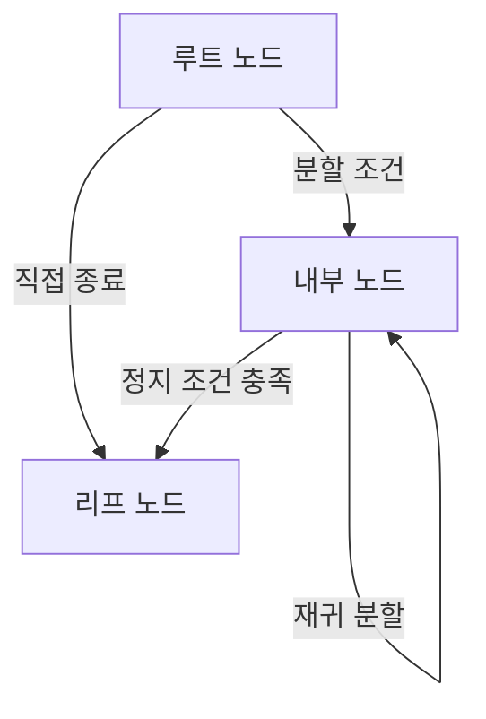
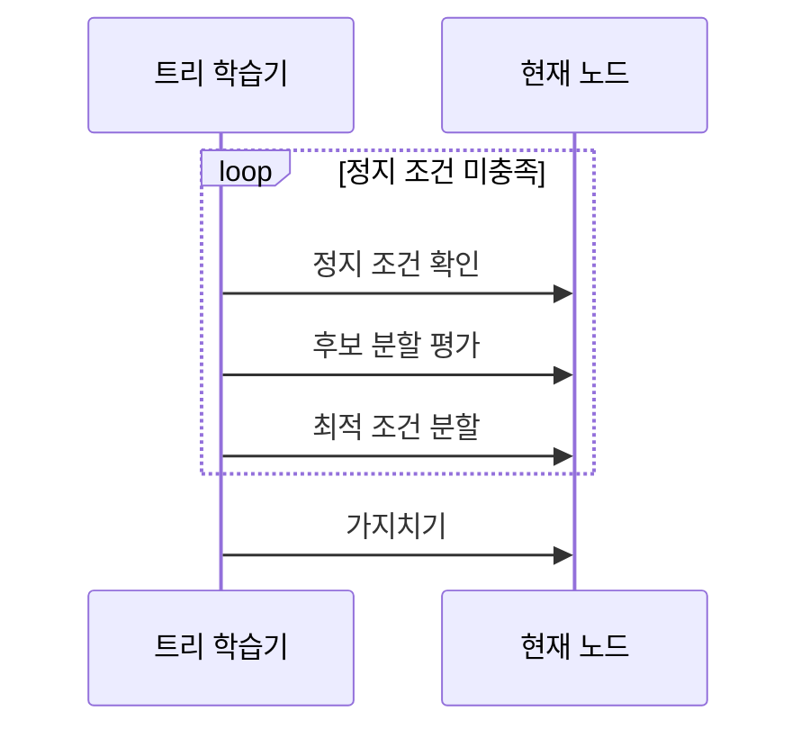

---
sidebar:
  order: 49
  label: "049. 결정 트리 (Decision Tree)"
  badge:
    text: "미출제 · 50%"
    variant: note
title: "결정 트리 (Decision Tree)"
date: "2026-07-26T22:16:20+09:00"
tags:
  - "notes-basic-theory"
weight: 49
extra:
  question_no: "049"
  source_status: "미출제"
  source_history: ""
  priority: 50
  priority_note: "분할 기준·가지치기·설명성"
---

## 미리 알고가기

- **결정 트리(Decision Tree)**: 특징값에 대한 분할 조건을 순차 적용하여 리프 노드에서 예측값을 출력하는 트리 기반 모델로, 분할 경로가 판정 근거가 된다
- **루트·내부·리프 노드(Root·Internal·Leaf Node)**: 루트는 전체 데이터가 시작하는 최상위 노드, 내부 노드는 분할 조건을 적용하는 노드, 리프는 최종 예측값을 저장하는 노드이다
- **불순도(Impurity)**: 한 노드 안에 서로 다른 정답 클래스가 얼마나 섞여 있는지를 나타내는 값으로, 한 클래스만 남으면 0이고 고르게 섞일수록 커진다
- **지니 불순도(Gini Impurity)**: 노드 안 클래스 비율만으로 계산하는 불순도 척도로, 그 노드에서 표본 하나를 임의로 골라 라벨을 무작위로 붙였을 때 틀릴 확률을 뜻한다
- **엔트로피(Entropy)**: 클래스 분포가 고르게 섞일수록 커지는 불확실성 척도로, 지니 불순도와 함께 분류 트리의 분할 기준으로 쓰인다
- **정보 이득(Information Gain)**: 분할 전 엔트로피에서 자식 노드의 가중 평균 엔트로피를 뺀 값으로, 값이 큰 조건을 분할 기준으로 선택한다
- **가지치기(Pruning)**: 학습된 트리에서 예측 기여가 작은 하위 트리를 제거하여 과적합을 줄이는 방법이다
- **정지 조건(Stopping Criterion)**: 더 이상 분할하지 않고 그 노드를 리프로 확정하는 기준으로, 최대 깊이·노드 최소 표본 수·최소 정보 이득 등을 쓴다
- **과적합·고분산(Overfitting·High Variance)**: 학습 데이터의 세부 변동까지 반영하여 데이터가 달라지면 예측값이 크게 변하고 일반화 성능이 저하되는 현상이다
- **평균제곱오차(Mean Squared Error, MSE)**: 실제값과 예측값의 차이를 제곱하여 평균한 회귀 오차로, 회귀 트리의 분할 품질을 평가한다
- **불균형 클래스(Imbalanced Class)**: 클래스별 표본 수가 크게 달라 다수 클래스만 맞혀도 점수가 높게 나오는 데이터 상태
- **이상치(Outlier)**: 다른 관측값에서 크게 벗어난 값으로, 회귀 트리에서는 제곱 오차를 크게 부풀려 분할 위치를 끌어당긴다
- **스케일 변환 불변성(Scale Invariance)**: 특징값의 단위나 크기를 바꿔도 값의 순서가 유지되면 같은 분할 경계를 선택하는 성질이다

## Ⅰ. 개요

- 정의/개념: **특징값 조건**으로 데이터를 분할해 **리프**에서 예측하는 모델
- 기존 한계: 선형 모델은 복잡한 변수 상호작용과 **비선형 경계** 표현 제약

### 쉽게 이해하기 (학습용)
- 스무고개에서 질문마다 후보를 나누듯 내부 노드가 특징값 조건으로 데이터를 분할하고, 마지막 리프가 예측값을 출력하므로 분기 경로를 판정 근거로 확인할 수 있다

## Ⅱ. 특징

- **불순도** 감소를 기준으로 한 재귀적 데이터 분할
- 루트부터 리프까지의 **규칙 경로**에 기반한 높은 설명력
- 특징값의 순서만 사용하는 **스케일 변환 불변성**

### 쉽게 이해하기 (학습용)
- 각 노드는 불순도를 가장 많이 줄이는 조건을 선택하고, 예측은 루트부터 리프까지의 조건 경로로 설명되며, 특징값의 단위를 바꿔도 값의 순서가 같으면 분할 결과가 유지된다

## Ⅲ. 아키텍처 및 구성요소

| 설계 요소 | 설명 |
|:---|:---|
| 루트 노드 | 전체 입력을 포함하는 **최초 분할** 대상 |
| 내부 노드 | 변수·**임계값** 조건으로 재귀 분할 |
| 리프 노드 | 최종 클래스·**회귀값** 저장 |

> 요약: 노드별 **분할 조건**을 거쳐 **리프**의 예측값에 도달

### 쉽게 이해하기 (학습용)
- 조직도처럼 맨 위 한 칸에서 시작해 아래로 갈래가 갈리는 그림인데, 맨 위 칸이 전체 데이터를 쥔 루트이고 중간 칸마다 "이 값이 기준보다 큰가"라는 조건이 걸려 있으며 더는 갈리지 않는 맨 끝 칸이 예측값을 들고 있는 리프다

## Ⅳ. 원리 및 절차 흐름도

| 절차 | 설명 |
|:---|:---|
| 정지 조건 확인 | 최대 깊이·최소 표본·**최소 이득** 도달 여부 |
| 후보 분할 평가 | 변수·임계값별 **불순도** 감소량 산출 |
| 최적 조건 분할 | **정보 이득** 최대 조건으로 자식 노드 생성 |
| 가지치기 | 기여 작은 하위 트리 제거로 **분산** 완화 |

> 요약: 정보 이득 최대 분할 후 **가지치기**로 분산 통제

### 쉽게 이해하기 (학습용)
- 정지 조건에 도달할 때까지 후보 분할의 불순도 감소량을 비교해 최적 조건으로 자식 노드를 만들고, 학습 후 예측 기여가 작은 하위 트리를 제거한다

## Ⅴ. 종류 및 비교

| 결정 트리 | 분류 트리 | 회귀 트리 |
|:---|:---|:---|
| 적용 기준 | 목표가 합격·불합격 같은 **범주형 라벨** | 목표가 가격·수량 같은 **연속 수치** |
| 핵심 특징 | **지니 불순도**·엔트로피로 범주 분할 | **MSE** 감소량으로 수치 분할 |
| 한계 | **불균형 클래스**의 다수 쏠림 편향 | **이상치**에 따른 분할 위치 왜곡 |

> 요약: 목표 변수의 형태에 따라 **분할 기준** 결정

### 쉽게 이해하기 (학습용)
- 답이 합격이냐 불합격이냐처럼 칸으로 나뉘면 각 칸에 얼마나 섞였는지를 재는 지니 불순도로 가르고, 답이 가격처럼 눈금 위 수치면 그 눈금에서 얼마나 벗어났는지를 재는 제곱 오차로 가르는 것이 두 트리를 나누는 지점이다

## Ⅵ. 실무 사례

1. 서버 장애 분류에서 최대 깊이·최소 표본으로 **과적합 억제**

### 쉽게 이해하기 (학습용)
- 장애 사례가 적은데 트리를 계속 분할하면 개별 서버의 우연한 패턴까지 학습하므로, 최대 깊이와 노드별 최소 표본 수로 불필요한 분할을 제한한다

## Ⅶ. 결론

- 판정 경로의 설명력을 유지하도록 **가지치기**로 **과적합** 통제

### 쉽게 이해하기 (학습용)
- 분기 경로를 근거로 내밀 수 있다는 것이 이 모델을 쓰는 이유이므로, 경로가 사람이 읽을 수 있는 길이를 넘지 않는 선까지만 트리를 키우고 그 너머는 잘라 내 학습 데이터 암기를 막는다
