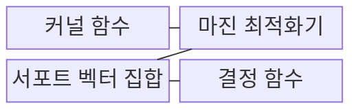
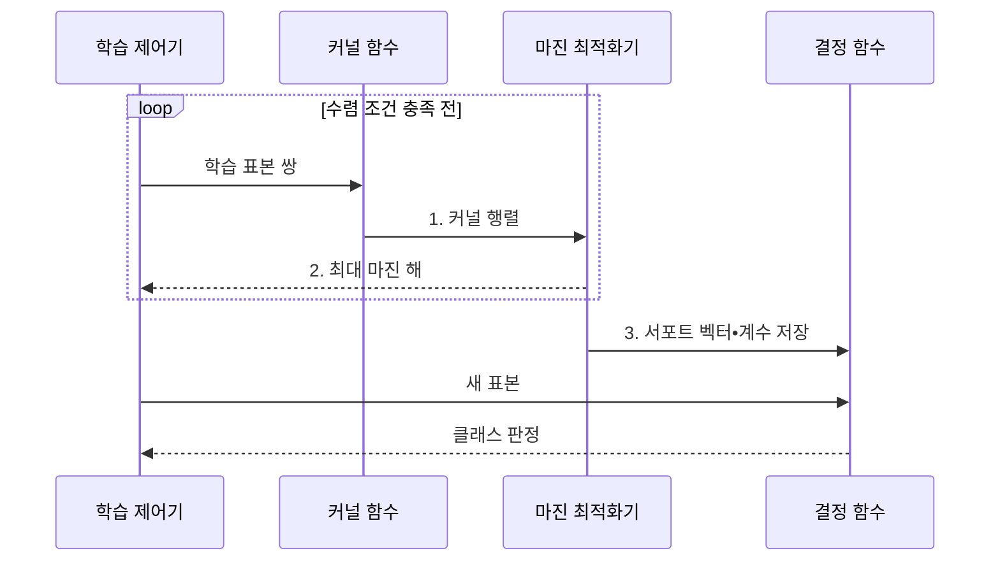

---
sidebar:
  order: 50
  label: "050. 서포트 벡터 머신 (SVM, Support Vector Machine)"
  badge:
    text: "기출 • 50%"
    variant: note
title: "서포트 벡터 머신 (SVM, Support Vector Machine)"
date: "2026-08-02T10:18:00+09:00"
tags:
  - "notes-basic-theory"
weight: 50
extra:
  question_no: "050"
  source_status: "기출"
  source_history: "132회"
  priority: 50
  priority_note: "마진•커널 선택과 데이터 조건 중심"
---

## Ⅰ. 개요

핵심 용어

- **서포트 벡터 머신(SVM)**: 클래스 사이의 마진을 최대화하는 결정 경계를 학습하는 모델
- **초평면**: 고차원 특징 공간에서 두 클래스를 나누는 결정 경계
- **마진**: 결정 경계와 가장 가까운 표본 사이의 거리
- **일반화 성능**: 학습에 사용하지 않은 새 데이터에서의 분류 성능

- 정의/개념: 클래스 간 **마진을 최대화**하는 초평면 분류 모델
- 배경/필요성: 학습 오차만 줄인 경계는 새 데이터의 **일반화 성능이 낮을 수 있음**

#### 한줄 요약
- 두 팀 사이에 가장 넓은 통로를 확보하고 중앙선을 긋듯, SVM은 두 클래스와 가장 가까운 표본 사이의 마진을 최대화해 결정 경계를 선택한다.

## Ⅱ. 특징

핵심 용어

- **서포트 벡터**: 초평면 위치와 마진 폭을 결정하는 경계 인접 표본
- **커널 트릭**: 원본을 직접 고차원으로 옮기지 않고 커널값으로 고차원 내적을 계산하는 방법
- **볼록 최적화**: 모든 국소 최솟값이 전역 최솟값인 최적화 문제
- **최대 마진**: 결정 경계와 가장 가까운 양쪽 클래스 표본 사이의 최소 거리를 가장 크게 만든 경계
- **비선형 경계**: 하나의 직선이나 초평면으로 표현할 수 없는 결정 경계
- **전역 최적해**: 가능한 전체 해 중 목적 함수 값이 가장 좋은 해

> 주황색 원의 **서포트 벡터** 가 양쪽 마진 점선을 고정하며, 그 중간의 검은 실선이 두 클래스 사이 간격을 최대로 하는 **결정 경계** 다.

- 경계 인접 **서포트 벡터** 로 결정되는 **최대 마진** 초평면
- **커널 트릭**으로 고차원 내적을 계산해 **비선형 경계** 형성
- **볼록 최적화** 에 따른 **전역 최적해** 보장

#### 한줄 요약
- 두 팀의 가장 가까운 선수들이 통로 폭을 고정하고, 휘어진 경기장은 커널 거울로 펼쳐 보는 장면이다.

## Ⅲ. 구조 및 구성요소

핵심 용어

- **커널 함수**: 두 표본의 특징 공간 내적이나 유사도를 계산하는 함수
- **규제 계수 $C$**: 마진 침범 오류에 부과할 페널티의 크기
- **결정 함수**: 초평면을 기준으로 클래스와 경계까지의 거리를 계산하는 함수
- **내적(Inner Product)**: 두 특징 벡터의 대응 원소를 곱해 합한 값
- **마진 위반 비용**: 표본이 마진 안이나 잘못된 클래스 쪽에 놓인 정도에 부과하는 페널티

| 구성요소 | 책임 |
|:---|:---|
| 커널 함수 | 두 표본의 고차원 **내적** 산출 |
| 마진 최적화기 | 마진 확대와 **규제 계수** 위반 비용의 균형 |
| 서포트 벡터 집합 | 결정 경계를 정의하는 **인접 표본** 보관 |
| 결정 함수 | 서포트 벡터•계수로 **클래스 판정** |

#### 한줄 요약
- 커널 계산대가 거리표를 만들고 최적화기가 중앙선을 그리면, 경계 선수 명단으로 판정판을 조립하는 장면이다.

## Ⅳ. 흐름도

핵심 용어

- **커널 행렬**: 모든 학습 표본 쌍의 커널값을 모은 행렬
- **계수·절편**: 초평면의 방향과 원점에서 떨어진 위치를 정하는 값
- **수렴 조건**: 최적화 목적의 개선이나 제약 위반이 기준 이내가 되어 반복을 멈추는 조건
- **최대 마진 해**: 마진 폭과 위반 비용의 균형을 최적화한 파라미터

**동작 원리**

- **1. 커널 행렬**: 표본 쌍의 특징 공간 유사도 산출
- **2. 최대 마진 해**: 마진•위반 비용을 균형화한 해
- **3. 서포트 벡터•계수 저장**: 경계 인접 표본과 계수•절편으로 결정 함수 구성

#### 한줄 요약
- 표본 거리표가 최적화기로 들어가 중앙선이 정해지고, 경계 선수 명단이 판정판에 꽂히는 장면이다.

## Ⅴ. 종류 및 비교

핵심 용어

- **하드 마진**: 모든 표본의 마진 침범을 허용하지 않는 방식
- **소프트 마진**: 여유 변수에 비용을 부과하며 일부 마진 침범을 허용하는 방식
- **클래스 중첩**: 서로 다른 클래스 표본이 같은 특징 영역에 섞인 상태
- **선형 분리**: 하나의 초평면으로 모든 클래스 표본을 오류 없이 나눌 수 있는 상태
- **여유 변수(Slack Variable)**: 각 표본의 마진 침범 정도를 나타내는 변수
- **이상치(Outlier)**: 다른 표본에서 크게 벗어나 경계 위치를 왜곡할 수 있는 값

| SVM 유형 | 하드 마진 SVM | 소프트 마진 SVM |
|:---|:---|:---|
| 적용 기준 | **선형 분리** 가 가능하고 잡음이 없는 경우 | 잡음이나 **클래스 중첩** 이 있는 경우 |
| 핵심 특징 | 모든 표본의 **마진 침범** 불허 | **여유 변수** 로 일부 침범 허용 |
| 한계 | **이상치** 한 건의 경계 왜곡 | **규제 계수** 설정에 성능 의존 |

> 요약: 하드 마진의 이상치 민감을 완화한 **소프트 마진**

#### 한줄 요약
- 하드 마진 통로는 한 명도 선을 넘지 못하지만, 소프트 마진 통로는 벌점표를 받고 일부 침범을 허용하는 장면이다.

## Ⅵ. 실무 고려사항 및 대책

핵심 용어

- **RBF 커널의 $\gamma$**: 각 표본의 영향 범위를 조절하며 값이 클수록 경계를 복잡하게 만드는 감도
- **표준화**: 특징마다 평균 0, 표준편차 1로 맞춰 단위가 거리를 지배하지 않게 하는 전처리
- **근사 커널**: 고차원 내적을 유한한 특징 벡터로 근사해 계산량을 줄이는 기법
- **교차검증(Cross-validation)**: 여러 데이터 분할에서 모델을 반복 평가해 $C$와 $\gamma$를 고르는 방법
- **과적합•마진 위반**: 학습 표본에 지나치게 맞는 상태와 표본이 경계의 안전 간격을 침범한 상태
- **강건성(Robustness)**: 이상치나 작은 데이터 변화에도 결정 경계가 크게 흔들리지 않는 성질

| 문제 | 대책 | 효과 |
|:---|:---|:---|
| RBF 경계가 **지나치게 복잡함** | 교차검증으로 **$C$•$\gamma$ 공동 조정** | **과적합•마진 위반** 균형 |
| 특징 단위 차이로 **거리 왜곡** | 학습•추론에 동일한 **표준화** 적용 | **커널 거리•마진** 척도 일치 |
| 대규모 표본에서 **학습 시간•메모리 급증** | **선형 SVM**•표본 축소•근사 커널 검토 | **학습 시간•메모리** 감소 |
| 이상치가 **경계를 끌어당김** | **소프트 마진** 과 이상치 검토 적용 | 경계의 **강건성** 향상 |

#### 한줄 요약
- 악성코드 표본을 좌표판에 놓았을 때 직선으로 갈리면 선형 SVM을 쓰고, 곡선 경계가 필요하면 교차검증으로 커널과 규제 계수를 함께 조정한다.

## Ⅶ. 결론

핵심 용어

- **선형 분리**: 하나의 초평면으로 두 클래스를 나눌 수 있는 상태
- **선형 SVM**: 원래 특징 공간에서 직선이나 초평면 경계를 학습하는 SVM
- **클래스 중첩**: 서로 다른 클래스 표본이 같은 특징 영역에 섞인 상태
- **소프트 마진•커널 SVM**: 일부 마진 침범을 허용하는 방식과 커널로 비선형 경계를 학습하는 방식

- 선형 분리는 **선형 SVM**, 클래스 중첩은 **소프트 마진** 선택

#### 한줄 요약
- 곧은 통로면 선형 자를, 겹친 팀이면 소프트 완충선을, 휜 경계면 커널 곡선자를 꺼내는 장면이다.
