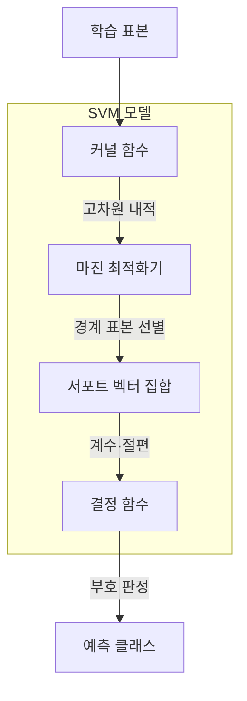
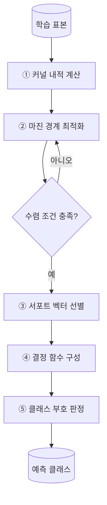
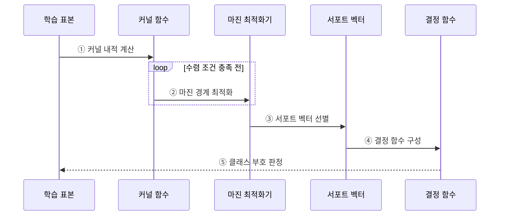

---
sidebar:
  order: 50
  label: "050. 서포트 벡터 머신 (SVM, Support Vector Machine)"
  badge:
    text: "기출 · 50%"
    variant: note
title: "서포트 벡터 머신 (SVM, Support Vector Machine)"
date: "2026-07-28T17:45:00+09:00"
tags:
  - "notes-basic-theory"
weight: 50
extra:
  question_no: "050"
  source_status: "기출"
  source_history: "132회"
  priority: 50
  priority_note: "마진·커널 선택과 데이터 조건 중심"
---

## 미리 알고가기

- **서포트 벡터 머신(Support Vector Machine, SVM)**: 클래스 사이의 마진을 최대화하는 결정 경계를 찾는 지도 학습 모델이다
- **초평면(Hyperplane)**: 두 클래스를 나누는 결정 경계로, 특징이 2개면 직선, 3개면 평면, 그보다 많으면 눈에 보이지 않는 같은 역할의 경계면이 된다
- **마진(Margin)**: 초평면과 가장 가까운 표본 사이의 거리로, 이 폭이 넓을수록 표본이 조금 움직여도 경계를 다시 그을 필요가 없다
- **서포트 벡터(Support Vector)**: 마진 가장자리에 놓여 초평면의 위치와 마진 폭을 실제로 결정하는 표본으로, 마진 밖의 다른 표본이 조금 움직여도 경계는 그대로다
- **커널 함수(Kernel Function)**: 두 표본을 고차원 공간에 명시적으로 옮기지 않고 그 공간의 내적을 계산하는 함수이다
- **커널 트릭(Kernel Trick)**: 고차원 특징을 실제로 만들어 저장하지 않고 커널값만 계산해 그 공간의 내적을 얻는 방법으로, 고차원 특징 벡터의 명시적 생성 비용을 피한다
- **여유 변수(Slack Variable)**: 각 표본이 마진을 얼마나 침범했는지를 담는 값으로, 소프트 마진은 이 값에 비용을 매겨 일부 침범을 허용한다
- **규제 계수(Regularization Parameter, $C$)**: 마진 위반에 부과할 페널티로, 값이 클수록 오분류를 억제하고 값이 작을수록 넓은 마진을 우선한다
- **방사 기저 함수(Radial Basis Function, RBF) 커널과 감도 $\gamma$**: RBF 커널은 표본 간 거리를 비선형 유사도로 변환하고, $\gamma$(감마)는 각 표본의 영향 범위를 조절하여 값이 클수록 결정 경계가 복잡해진다
- **볼록 최적화(Convex Optimization)**: 모든 국소 최솟값이 전역 최솟값인 최적화 문제로, 초기값에 따라 더 나쁜 지역 최솟값에 빠지지 않는다
- **결정 함수(Decision Function)**: 새 입력이 초평면의 어느 쪽에 있는지를 부호로, 얼마나 떨어져 있는지를 크기로 돌려주는 함수
- **하드·소프트 마진(Hard·Soft Margin)**: 하드 마진은 마진 침범을 한 건도 허용하지 않는 방식이고, 소프트 마진은 여유 변수에 비용을 물려 일부 침범을 허용하는 방식이다
- **선형 SVM·커널 SVM(Linear·Kernel SVM)**: 선형 SVM은 원래 특징 공간에서 곧바로 직선 경계를 긋고, 커널 SVM은 커널 함수로 공간을 바꾼 뒤 경계를 긋는다
- **선형 분리(Linearly Separable)**: 하나의 초평면만으로 두 클래스를 완전히 나눌 수 있는 상태
- **클래스 중첩(Class Overlap)**: 서로 다른 클래스의 표본이 같은 특징 영역에 섞여 있어 어떤 경계를 그어도 일부는 틀리는 상태
- **과적합(Overfitting)**: 학습 데이터의 세부까지 맞추려다 새로운 데이터의 성능이 오히려 낮아지는 현상
- **이상치(Outlier)**: 다른 표본에서 크게 벗어난 값으로, 하드 마진에서는 이 표본 하나가 최대 마진 경계를 통째로 끌어당긴다

## Ⅰ. 개요

- 정의/개념: **최대 마진** 초평면으로 클래스를 분리하는 지도 학습 모델
- 기존 한계: 분리 경계 후보가 많으면 **일반화**에 유리한 경계 선택 곤란

### 쉽게 이해하기 (학습용)
- 두 팀 사이에 가장 넓은 통로를 확보하고 중앙선을 긋듯, SVM은 두 클래스와 가장 가까운 표본 사이의 마진을 최대화해 결정 경계를 선택한다

## Ⅱ. 특징

- 경계 인접 **서포트 벡터**로 결정되는 **최대 마진** 초평면
- **커널 트릭**을 통한 비선형 분리의 고차원 선형화
- **볼록 최적화**에 따른 **전역 최적해** 보장

### 쉽게 이해하기 (학습용)
- 경계에 가까운 서포트 벡터가 최대 마진을 결정하고, 커널 트릭이 비선형 데이터를 고차원에서 분리하며, 볼록 최적화가 전역 최적 경계를 찾는다

## Ⅲ. 아키텍처

| 구성요소 | 책임 |
|:---|:---|
| 커널 함수 | 두 표본의 고차원 **내적** 산출 |
| 마진 최적화기 | 마진 확대와 **규제 계수** 위반 비용의 균형 |
| 서포트 벡터 집합 | 결정 경계를 정의하는 **인접 표본** 보관 |
| 결정 함수 | 서포트 벡터·계수로 **클래스 판정** |

**동작 원리**

- ① **커널 함수**가 학습 표본 쌍의 고차원 **내적**을 계산한다.
- ② **마진 최적화기**가 마진 확대와 위반 비용을 조절해 **초평면**을 찾는다.
- ③ 최적화기가 경계를 결정하는 **서포트 벡터**와 계수를 선별한다.
- ④ **결정 함수**가 서포트 벡터·계수·절편으로 **판정식**을 구성한다.
- ⑤ 새 표본의 결정 함수 **부호**로 최종 **클래스**를 판정한다.

### 쉽게 이해하기 (학습용)
- 커널 함수가 표본 간 고차원 내적을 제공하면 최적화기가 최대 마진 경계를 찾고, 서포트 벡터와 계수로 결정 함수를 구성한다.

## Ⅳ. 종류 및 비교

| SVM 유형 | 하드 마진 SVM | 소프트 마진 SVM |
|:---|:---|:---|
| 적용 기준 | **선형 분리**가 가능하고 잡음이 없는 경우 | 잡음이나 **클래스 중첩**이 있는 경우 |
| 핵심 특징 | 모든 표본의 **마진 침범** 불허 | **여유 변수**로 일부 침범 허용 |
| 한계 | **이상치** 한 건의 경계 왜곡 | **규제 계수** 설정에 성능 의존 |

> 요약: 하드 마진의 이상치 민감을 완화한 **소프트 마진**

### 쉽게 이해하기 (학습용)
- 하드 마진은 침범을 허용하지 않아 이상치에 민감하고, 소프트 마진은 여유 변수와 규제 계수로 일부 침범을 허용한다.

## Ⅴ. 실무 고려사항 및 대책

| 고려사항 | 대책 | 효과 |
|:---|:---|:---|
| RBF 경계가 **지나치게 복잡함** | 교차검증으로 **$C$·$\gamma$ 공동 조정** | **과적합·마진 위반** 균형 |
| 특징 단위 차이로 **거리 왜곡** | 학습·추론에 동일한 **표준화** 적용 | **커널 거리·마진** 안정화 |
| 대규모 표본에서 **학습 시간·메모리 급증** | **선형 SVM**·표본 축소·근사 커널 검토 | **확장성** 개선 |
| 이상치가 **경계를 끌어당김** | **소프트 마진**과 이상치 검토 적용 | 경계의 **강건성** 향상 |

### 쉽게 이해하기 (학습용)
- 서포트 벡터 비율과 학습 자원을 함께 확인한다. 악성코드처럼 특징 차원이 높고 표본 수가 상대적으로 작으면 선형 SVM으로 복잡한 커널 계산을 피할 수 있다.

## Ⅵ. 결론

- **표본 규모·비선형성·이상치**로 SVM 구성 선택

### 쉽게 이해하기 (학습용)
- 표본 규모, 선형 분리 가능성, 이상치와 자원 제약을 기준으로 선형·커널·소프트 마진 구성을 선택한다.
