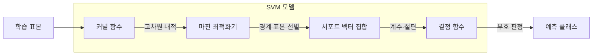
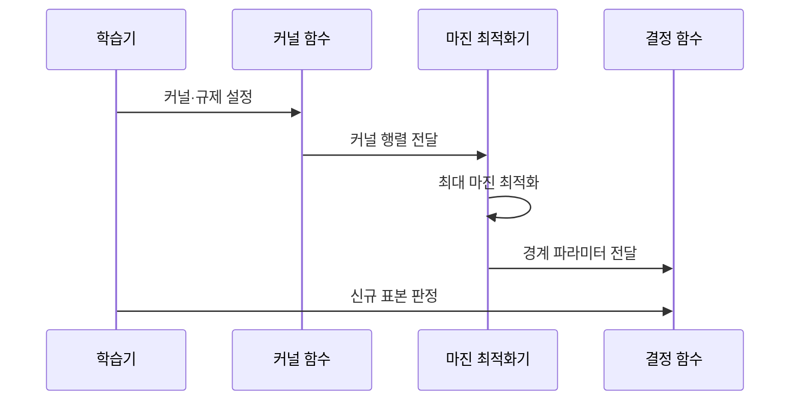

---
sidebar:
  order: 50
  label: "050. 서포트 벡터 머신 (SVM, Support Vector Machine)"
  badge:
    text: "기출 · 50%"
    variant: note
title: "서포트 벡터 머신 (SVM, Support Vector Machine)"
date: "2026-07-27T23:35:00+09:00"
tags:
  - "notes-basic-theory"
weight: 50
extra:
  question_no: "050"
  source_status: "기출"
  source_history: "132회"
  priority: 50
  priority_note: "마진·커널 선택과 데이터 조건 중심"
---

## 미리 알고가기

- **서포트 벡터 머신(Support Vector Machine, SVM)**: 클래스 사이의 마진을 최대화하는 결정 경계를 찾는 지도학습 모델이다
- **초평면(Hyperplane)**: 두 클래스를 나누는 결정 경계로, 특징이 2개면 직선, 3개면 평면, 그보다 많으면 눈에 보이지 않는 같은 역할의 경계면이 된다
- **마진(Margin)**: 초평면과 가장 가까운 표본 사이의 거리로, 이 폭이 넓을수록 표본이 조금 움직여도 경계를 다시 그을 필요가 없다
- **서포트 벡터(Support Vector)**: 마진 가장자리에 놓여 초평면의 위치와 마진 폭을 실제로 결정하는 표본으로, 마진 밖의 다른 표본이 조금 움직여도 경계는 그대로다
- **커널 함수(Kernel Function)**: 두 표본이 고차원 공간으로 옮겨졌다고 가정했을 때의 내적을 계산해 주는 함수로, 직선으로 안 갈리는 데이터를 갈릴 수 있게 만드는 장치다
- **커널 트릭(Kernel Trick)**: 고차원 특징을 실제로 만들어 저장하지 않고 커널값만 계산해 그 공간의 내적을 얻는 방법으로, 고차원 특징 벡터의 명시적 생성 비용을 피한다
- **여유 변수(Slack Variable)**: 각 표본이 마진을 얼마나 침범했는지를 담는 값으로, 소프트 마진은 이 값에 비용을 매겨 일부 침범을 허용한다
- **규제 계수(Regularization Parameter, $C$)**: 마진 위반에 부과할 페널티로, 값이 클수록 오분류를 억제하고 값이 작을수록 넓은 마진을 우선한다
- **방사 기저 함수(Radial Basis Function, RBF) 커널과 감도 $\gamma$**: RBF 커널은 표본 간 거리를 비선형 유사도로 변환하고, $\gamma$(감마)는 각 표본의 영향 범위를 조절하여 값이 클수록 결정 경계가 복잡해진다
- **볼록 최적화(Convex Optimization)**: 모든 국소 최솟값이 전역 최솟값인 최적화 문제로, 초기값에 따라 더 나쁜 지역 최솟값에 빠지지 않는다
- **결정 함수(Decision Function)**: 새 입력이 초평면의 어느 쪽에 있는지를 부호로, 얼마나 떨어져 있는지를 크기로 돌려주는 함수
- **하드·소프트 마진(Hard·Soft Margin)**: 하드 마진은 마진 침범을 한 건도 허용하지 않는 방식이고, 소프트 마진은 여유 변수에 비용을 물려 일부 침범을 허용하는 방식이다
- **선형 SVM·커널 SVM(Linear·Kernel SVM)**: 선형 SVM은 원래 특징 공간에서 곧바로 직선 경계를 긋고, 커널 SVM은 커널 함수로 공간을 바꾼 뒤 경계를 긋는다
- **선형 분리(Linearly Separable)**: 하나의 초평면만으로 두 클래스를 완전히 나눌 수 있는 상태
- **클래스 중첩(Class Overlap)**: 서로 다른 클래스의 표본이 같은 특징 영역에 섞여 있어 어떤 경계를 그어도 일부는 틀리는 상태
- **과적합(Overfitting)**: 학습 데이터의 세부까지 맞추려다 새로운 데이터의 성능이 오히려 낮아지는 현상
- **이상치(Outlier)**: 다른 표본에서 크게 벗어난 값으로, 하드 마진에서는 이 표본 하나가 최대 마진 경계를 통째로 끌어당긴다

## Ⅰ. 개요

- 정의/개념: **최대 마진** 초평면으로 분류하는 지도학습 모델
- 기존 한계: 학습 오차만 줄인 경계는 새 표본 **일반화 성능** 한계

### 쉽게 이해하기 (학습용)
- 운동장에 빨간 조끼 팀과 파란 조끼 팀이 흩어져 있을 때 두 팀 사이로 가능한 한 넓은 복도를 내고 그 한가운데에 선을 긋는 장면인데, 복도가 넓을수록 선수 몇 명이 조금 움직여도 선을 다시 그을 필요가 없어 표본이 적어도 처음 보는 사람을 같은 기준으로 가를 수 있다

## Ⅱ. 특징

- 경계 인접 **서포트 벡터**로 결정되는 **최대 마진** 초평면
- **커널 트릭**을 통한 비선형 분리의 고차원 선형화
- **볼록 최적화**에 따른 **전역 최적해** 보장

### 쉽게 이해하기 (학습용)
- 복도 폭을 정하는 것은 양쪽 맨 앞줄에 선 몇 사람뿐이라 뒤쪽 사람이 아무리 움직여도 선이 흔들리지 않는데, 그 맨 앞줄 사람들이 서포트 벡터이고 이것이 표본 수가 적어도 경계가 안정적인 이유다

## Ⅲ. 아키텍처 및 구성요소

| 설계 요소 | 설명 |
|:---|:---|
| 커널 함수 | 두 표본의 고차원 **내적** 산출 |
| 마진 최적화기 | 마진 확대와 **규제 계수** 위반 비용의 균형 |
| 서포트 벡터 집합 | 결정 경계를 정의하는 **인접 표본** 보관 |
| 결정 함수 | 서포트 벡터·계수로 **클래스 판정** |

> 요약: **커널** 사상 후 **최대 마진** 경계와 판정 함수 산출

### 쉽게 이해하기 (학습용)
- 두 팀이 직선으로 안 갈릴 때 운동장 자체를 언덕처럼 접어 올려 주는 장치가 커널 함수이고 그 위에서 가장 넓은 복도를 찾아 주는 계산기가 마진 최적화기이며, 복도 가장자리에 선 사람 명단만 따로 적어 두었다가 새 사람이 오면 어느 편인지 답하는 것이 결정 함수다

## Ⅳ. 원리 및 절차 흐름도

| 절차 | 설명 |
|:---|:---|
| 커널·규제 설정 | 데이터 비선형성과 오분류 허용도에 맞게 지정 |
| 커널 행렬 전달 | 표본 쌍의 **고차원 내적** 계산 |
| 최대 마진 최적화 | 마진 확대와 **위반 비용**의 균형점 산출 |
| 경계 파라미터 전달 | **서포트 벡터**·계수·절편으로 경계 구성 |
| 신규 표본 판정 | **결정 함수** 부호로 소속 클래스 결정 |

> 요약: 볼록 목적함수의 **전역 최적해**로 최대 마진 경계 확정

### 쉽게 이해하기 (학습용)
- 운동장을 어떻게 접을지부터 정해 놓아야 그 위에서 복도 폭을 재는 계산이 성립하고, 계산이 끝나면 복도 가장자리에 선 사람들의 위치로 선이 한 번에 확정되며, 그 뒤로는 새 사람이 선의 어느 쪽에 서 있는지만 보면 편이 정해진다

## Ⅴ. 종류 및 비교

| SVM 유형 | 하드 마진 SVM | 소프트 마진 SVM |
|:---|:---|:---|
| 적용 기준 | **선형 분리** 가능·잡음 없음 | 잡음·**클래스 중첩** 존재 |
| 핵심 특징 | 모든 표본의 **마진 침범** 불허 | **여유 변수**로 일부 침범 허용 |
| 한계 | **이상치** 한 건의 경계 왜곡 | **규제 계수** 설정에 성능 의존 |

> 요약: 하드 마진의 이상치 민감을 완화한 **소프트 마진**

### 쉽게 이해하기 (학습용)
- 하드 마진은 단 한 명도 복도 안에 들어오면 안 된다고 못 박는 방식이라 엉뚱한 자리에 선 한 사람 때문에 복도가 기형적으로 좁아지고, 소프트 마진은 벌점을 매긴 뒤 몇 명은 복도 안에 서 있어도 봐주는 방식이라 그 벌점을 얼마로 잡느냐가 곧 성능을 가른다

## Ⅵ. 실무 사례

1. 악성코드 분류는 고차원 특징에 **선형 SVM** 적용

### 쉽게 이해하기 (학습용)
- 악성코드 하나에서 뽑는 특징은 수만 개인데 표본은 수천 개뿐이라 이미 직선 하나로 갈리는 경우가 많으므로, 굳이 공간을 접지 않고 선형 SVM으로 바로 선을 긋는 편이 계산도 가볍고 결과도 낫다

## Ⅶ. 결론

- 최대 마진 분류를 위해 표본·비선형성을 검토하여 **SVM** 활용

### 쉽게 이해하기 (학습용)
- 표본이 몇천 건이고 직선으로는 안 갈리면 공간을 접어 올리는 값어치가 있지만, 표본이 수십만 건으로 늘면 표본끼리의 유사도를 전부 계산하는 비용을 감당할 수 없으므로 그때는 선형 SVM으로 돌아선다
