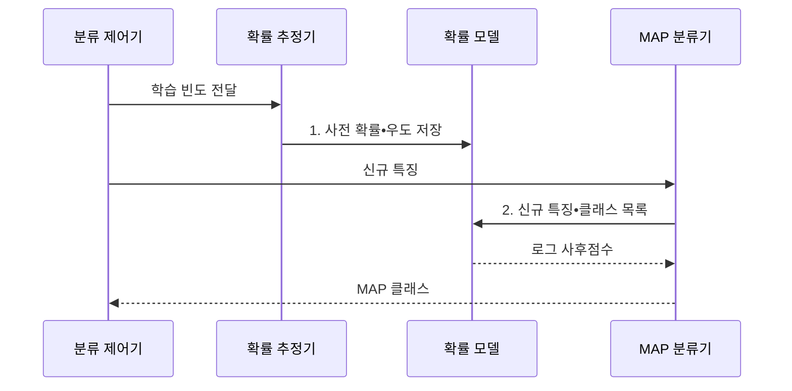

---
sidebar:
  order: 51
  label: "051. 나이브 베이즈 분류(Naive Bayes Classifier)"
  badge:
    text: "미출 • 30%"
    variant: note
title: "나이브 베이즈 분류(Naive Bayes Classifier)"
date: "2026-07-30T19:09:06+09:00"
tags:
  - "notes-basic-theory"
weight: 51
extra:
  question_no: "051"
  source_status: "미출"
  source_history: ""
  priority: 30
  priority_note: "독립 가정•소량 데이터 분류 비교 우선"
---

## 미리 알고 가기

- **나이브 베이즈 분류(Naive Bayes Classifier)**: 특징의 조건부 독립을 가정한 확률 분류기
- **클래스•특징(Class•Feature)**: 예측할 범주와 분류에 쓰는 입력 속성
- **조건부 독립(Conditional Independence)**: 클래스가 주어지면 특징끼리 독립이라는 가정
- **결합분포(Joint Distribution)**: 여러 특징이 동시에 특정 값을 가질 확률분포
- **베이즈 정리(Bayes' Theorem)**: 관측된 증거의 우도를 이용해 사전 확률을 관측 후의 사후 확률로 갱신하는 관계식
- **사전 확률(Prior)**: 특징 관측 전 클래스의 기본 발생 비율
- **우도(Likelihood)**: 특정 클래스를 가정했을 때 관측된 특징 데이터에 대한 가설의 적합도를 나타내는 수치
- **사후 확률(Posterior)**: 특징 관측 후 해당 클래스일 확률
- **라플라스 스무딩(Laplace Smoothing)**: 빈도에 상수를 더해 0확률을 막는 보정
- **최대 사후 확률(Maximum A Posteriori, MAP)**: 사후 확률이 가장 큰 클래스를 예측 결과로 선택하는 판정 기준이다
- **로그 확률(Log Probability)**: 작은 확률의 연속 곱셈을 로그값의 덧셈으로 바꾸어 수치 언더플로를 방지하는 표현이다
- **수치 언더플로(Numerical Underflow)**: 매우 작은 수의 연산 결과가 컴퓨터의 표현 범위보다 작아 0으로 처리되는 현상이다
- **확률 교정(Probability Calibration)**: 모델이 내놓은 확률이 실제 발생 비율과 어긋날 때 검증 데이터로 출력값을 보정하는 절차로, 독립 가정이 깨진 나이브 베이즈가 확률을 과신할 때 쓴다
- **교정 오차(Calibration Error)**: 모델이 0.9라고 말한 사례들이 실제로는 0.6만 맞았을 때처럼 예측 확률과 실제 정답 비율이 벌어진 정도
- **가우시안•다항•베르누이 분포(Gaussian•Multinomial•Bernoulli Distribution)**: 가우시안은 키•온도 같은 연속값, 다항은 단어가 몇 번 나왔는지 같은 횟수, 베르누이는 나왔는지 안 나왔는지 두 결과만을 다루는 확률분포다

## Ⅰ. 개요

- 정의/개념: 특징의 **조건부 독립**을 가정하는 확률 분류기
- 배경/필요성: 고차원 결합분포는 적은 표본으로 **추정 불가**

### 쉽게 이해하기 (학습용)

- 단어 카드마다 스팸함과 정상함의 출현 도장을 따로 세어 적은 편지로도 분류표를 만드는 장면이다.

## Ⅱ. 특징

- 클래스 **조건부 독립** 가정에 따른 결합우도의 곱 분해
- 적은 매개변수와 **선형 계산량** 기반의 빠른 학습•추론
- **베이즈 정리**로 사후 확률 계산 후 **MAP** 분류

### 쉽게 이해하기 (학습용)

- 여러 단어 카드의 점수를 각자 계산해 곱하고, 가장 높은 사후 확률 이름표를 붙이는 장면이다.

## Ⅲ. 구조 및 구성요소

| 구성요소 | 책임 |
|:---|:---|
| 확률 추정기 | 클래스•특징 빈도에서 **사전 확률**•**우도** 추정 |
| 확률 모델 | 클래스별 특징 우도와 **스무딩**된 확률 파라미터 보관 |
| MAP 분류기 | 신규 특징의 **로그 사후점수**를 비교해 클래스 확정 |

### 쉽게 이해하기 (학습용)
- 집계원이 단어별 확률표를 만들어 서랍에 넣고, 분류원이 가장 큰 로그 점수표를 꺼내는 장면이다.

## Ⅳ. 흐름도

**동작 원리**

- **1. 사전 확률•우도 저장**: 스무딩 확률 저장
- **2. 신규 특징•클래스 목록**: 클래스별 로그 우도 합산

### 쉽게 이해하기 (학습용)
- 빈도표가 확률 서랍에 저장되고 새 단어 카드가 들어오면 가장 높은 점수의 클래스 도장이 찍히는 장면이다.

## Ⅴ. 종류 및 비교

| 나이브 베이즈 | 가우시안 나이브 베이즈 | 다항 나이브 베이즈 | 베르누이 나이브 베이즈 |
|:---|:---|:---|:---|
| 적용 기준 | 키•온도 같은 **연속값**을 분류하는 경우 | 단어 빈도 같은 **발생 횟수**를 쓰는 경우 | 특징의 **존재 여부**만 사용하는 경우 |
| 핵심 특징 | 연속값을 **정규 분포**로 모델링 | 출현 횟수를 **다항 분포**로 모델링 | 출현 여부를 **베르누이 분포**로 모델링 |
| 한계 | **정규성** 위반 시 우도 왜곡 | **음수 특징값** 입력 처리 불가 | 출현 횟수의 **빈도 정보** 손실 |

> 요약: **연속값•횟수•이진값**으로 모델 선택

### 쉽게 이해하기 (학습용)

- 온도계는 가우시안, 단어 계수기는 다항, 출석 스위치는 베르누이 상자에 넣는 장면이다.

## Ⅵ. 실무 고려사항 및 대책

| 고려사항 | 대책 | 효과 |
|:---|:---|:---|
| 미관측 특징으로 **클래스 점수가 0** | **라플라스 스무딩** 적용 | 0확률에 따른 **전체 곱 붕괴 방지** |
| 다수 특징의 확률 곱이 **0으로 표현됨** | **로그 확률 합산** | **수치 언더플로** 방지 |
| 상관 특징 중복으로 **교정 오차 증가** | 중복 특징 제거•**확률 교정** | **사후 확률 신뢰도** 개선 |
| 운영 **클래스 비율 변화** | 사전 확률 재추정과 **분포 모니터링** | 변화한 **클래스 빈도 반영** |

### 쉽게 이해하기 (학습용)

- 스팸 분류에서 교정 오차와 사전 확률 변화를 함께 관찰하고 라플라스 스무딩으로 처음 본 단어 하나가 전체 확률 곱을 0으로 만드는 문제를 막는다.

## Ⅶ. 결론

- 과신은 **확률 교정**, 비율 변화는 **사전 확률 재추정**

### 쉽게 이해하기 (학습용)

- 확률계가 실제 적중률보다 높게 가리키면 교정하고, 클래스 비율이 바뀌면 사전 확률 눈금을 다시 맞추는 장면이다.
