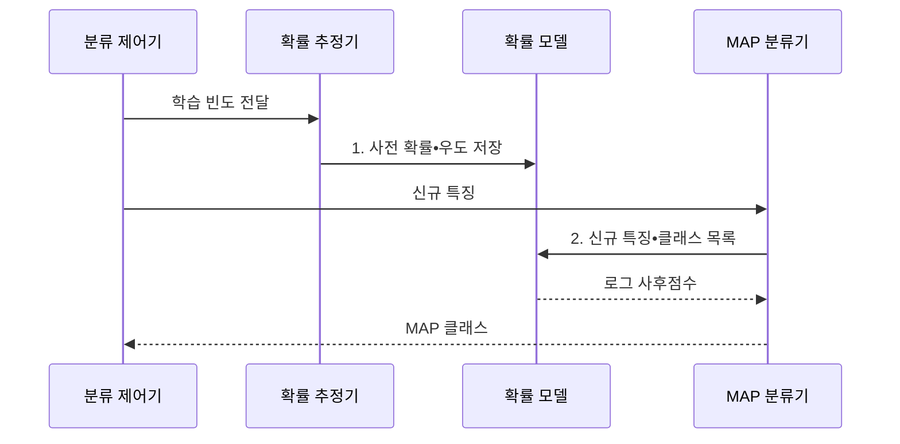

---
sidebar:
  order: 51
  label: "051. 나이브 베이즈 분류(Naive Bayes Classifier)"
  badge:
    text: "미출 • 30%"
    variant: note
title: "나이브 베이즈 분류(Naive Bayes Classifier)"
date: "2026-08-02T10:19:00+09:00"
tags:
  - "notes-basic-theory"
weight: 51
extra:
  question_no: "051"
  source_status: "미출"
  source_history: ""
  priority: 30
  priority_note: "독립 가정•소량 데이터 분류 비교 우선"
---

## Ⅰ. 개요

핵심 용어

- **나이브 베이즈 분류**: 클래스가 주어졌을 때 특징들이 서로 독립이라고 가정하는 확률 분류기
- **결합분포**: 여러 특징이 동시에 특정 값을 가질 확률분포
- **사후 확률(Posterior Probability)**: 관측 특징을 반영한 뒤 각 클래스가 맞을 확률
- **조건부 독립**: 클래스를 알면 각 특징의 발생이 서로 영향을 주지 않는다는 가정

- 정의/개념: **나이브 베이즈 분류**는 클래스가 주어졌을 때 특징 간 조건부 독립을 가정해 사후 확률이 가장 큰 클래스를 선택하는 **확률 분류 기법**
- 배경/필요성: 특징 차원이 커지면 전체 결합분포를 직접 추정하는 데 필요한 **표본 수와 계산량이 급증**

#### 한줄 요약

- 단어 카드마다 스팸함과 정상함의 출현 도장을 따로 세어 적은 편지로도 분류표를 만드는 장면이다.

## Ⅱ. 특징

핵심 용어

- **조건부 독립**: 클래스를 알면 각 특징의 발생이 서로 영향을 주지 않는다는 가정
- **베이즈 정리**: 관측 증거의 우도로 사전 확률을 사후 확률로 갱신하는 관계식
- **MAP 분류**: 사후 확률이 가장 큰 클래스를 예측 결과로 선택하는 방식
- **결합우도**: 특정 클래스에서 여러 관측 특징이 함께 나타날 가능성
- **선형 계산량**: 특징 수가 증가하는 만큼 학습이나 추론 연산량이 비례해 늘어나는 성질

- 클래스 **조건부 독립** 가정에 따른 결합우도의 곱 분해
- 적은 매개변수와 **선형 계산량** 기반의 빠른 학습•추론
- **베이즈 정리**로 사후 확률 계산 후 **MAP** 분류

#### 한줄 요약

- 여러 단어 카드의 점수를 각자 계산해 곱하고, 가장 높은 사후 확률 이름표를 붙이는 장면이다.

## Ⅲ. 구조 및 구성요소

핵심 용어

- **사전 확률**: 특징을 관측하기 전 클래스의 기본 발생 비율
- **우도**: 특정 클래스를 가정했을 때 관측 특징이 나타날 가능성
- **로그 사후점수**: 작은 확률의 곱을 로그값의 합으로 바꿔 계산한 클래스별 점수
- **스무딩(Smoothing)**: 미관측 특징의 확률이 0이 되지 않도록 빈도를 보정하는 처리

| 구성요소 | 책임 |
|:---|:---|
| 확률 추정기 | 클래스•특징 빈도에서 **사전 확률**•**우도** 추정 |
| 확률 모델 | 클래스별 특징 우도와 **스무딩**된 확률 파라미터 보관 |
| MAP 분류기 | 신규 특징의 **로그 사후점수**를 비교해 클래스 확정 |

#### 한줄 요약
- 집계원이 단어별 확률표를 만들어 서랍에 넣고, 분류원이 가장 큰 로그 점수표를 꺼내는 장면이다.

## Ⅳ. 흐름도

핵심 용어

- **스무딩 확률**: 관측되지 않은 특징도 0이 되지 않도록 빈도를 보정해 얻은 확률
- **로그 우도 합산**: 특징별 우도의 곱셈을 로그값 덧셈으로 바꾸어 계산하는 방식
- **MAP 클래스**: 클래스별 사후점수 중 가장 큰 값을 가져 최종 예측으로 선택한 클래스
- **로그 사후점수**: 사전 확률과 특징별 로그 우도를 더해 계산한 클래스별 점수

**동작 원리**

- **1. 사전 확률•우도 저장**: 스무딩 확률 저장
- **2. 신규 특징•클래스 목록**: 클래스별 로그 우도 합산

#### 한줄 요약
- 빈도표가 확률 서랍에 저장되고 새 단어 카드가 들어오면 가장 높은 점수의 클래스 도장이 찍히는 장면이다.

## Ⅴ. 종류 및 비교

핵심 용어

- **가우시안 분포**: 온도처럼 연속적인 값을 정규 분포로 표현하는 확률모형
- **다항 분포**: 단어 출현처럼 여러 범주의 발생 횟수를 표현하는 확률모형
- **베르누이 분포**: 특징의 존재·부재처럼 두 결과를 표현하는 확률모형
- **정규성**: 연속 특징이 클래스별 정규 분포를 따른다는 가정
- **음수 특징값**: 다항 분포의 발생 횟수로 해석할 수 없는 0보다 작은 입력값
- **빈도 정보**: 특징이 존재하는지뿐 아니라 몇 번 발생했는지를 나타내는 값

| 나이브 베이즈 | 가우시안 나이브 베이즈 | 다항 나이브 베이즈 | 베르누이 나이브 베이즈 |
|:---|:---|:---|:---|
| 적용 기준 | 키•온도 같은 **연속값**을 분류하는 경우 | 단어 빈도 같은 **발생 횟수**를 쓰는 경우 | 특징의 **존재 여부**만 사용하는 경우 |
| 핵심 특징 | 연속값을 **정규 분포**로 모델링 | 출현 횟수를 **다항 분포**로 모델링 | 출현 여부를 **베르누이 분포**로 모델링 |
| 한계 | **정규성** 위반 시 우도 왜곡 | **음수 특징값** 입력 처리 불가 | 출현 횟수의 **빈도 정보** 손실 |

> 요약: **연속값•횟수•이진값**으로 모델 선택

#### 한줄 요약

- 온도계는 가우시안, 단어 계수기는 다항, 출석 스위치는 베르누이 상자에 넣는 장면이다.

## Ⅵ. 실무 고려사항 및 대책

핵심 용어

- **라플라스 스무딩**: 빈도에 상수를 더해 미관측 특징의 확률이 0이 되는 것을 막는 보정
- **수치 언더플로**: 매우 작은 수의 연산 결과가 표현 범위보다 작아 0으로 처리되는 현상
- **확률 교정**: 예측 확률과 실제 발생 비율이 맞도록 검증 데이터로 출력값을 보정하는 절차
- **로그 확률 합산**: 작은 확률의 곱을 로그값의 덧셈으로 바꾸어 언더플로를 막는 계산
- **분포 모니터링**: 운영 환경의 특징과 클래스 비율이 학습 때와 달라지는지 감시하는 작업

| 문제 | 대책 | 효과 |
|:---|:---|:---|
| 미관측 특징으로 **클래스 점수가 0** | **라플라스 스무딩** 적용 | 0확률에 따른 **전체 곱 붕괴 방지** |
| 다수 특징의 확률 곱이 **0으로 표현됨** | **로그 확률 합산** | **수치 언더플로** 방지 |
| 상관 특징 중복으로 **교정 오차 증가** | 중복 특징 제거•**확률 교정** | **사후 확률 신뢰도** 개선 |
| 운영 **클래스 비율 변화** | 사전 확률 재추정과 **분포 모니터링** | 변화한 **클래스 빈도 반영** |

#### 한줄 요약

- 스팸 분류에서 교정 오차와 사전 확률 변화를 함께 관찰하고 라플라스 스무딩으로 처음 본 단어 하나가 전체 확률 곱을 0으로 만드는 문제를 막는다.

## Ⅶ. 결론

핵심 용어

- **교정 오차**: 모델의 예측 확률과 실제 정답 비율 사이의 차이
- **사전 확률 재추정**: 운영 환경의 클래스 비율 변화에 맞춰 기본 발생 확률을 다시 계산하는 작업

- 과신은 **확률 교정**, 비율 변화는 **사전 확률 재추정**

#### 한줄 요약

- 확률계가 실제 적중률보다 높게 가리키면 교정하고, 클래스 비율이 바뀌면 사전 확률 눈금을 다시 맞추는 장면이다.
