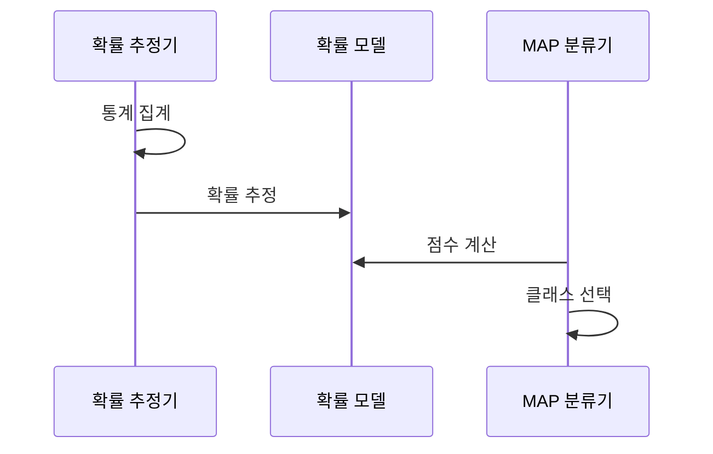

---
sidebar:
  order: 51
  label: "051. 나이브 베이즈 분류(Naive Bayes Classifier)"
  badge:
    text: "미출제 · 30%"
    variant: note
title: "나이브 베이즈 분류(Naive Bayes Classifier)"
date: "2026-07-26T22:16:20+09:00"
tags:
  - "notes-basic-theory"
weight: 51
extra:
  question_no: "051"
  source_status: "미출제"
  source_history: ""
  priority: 30
  priority_note: "독립 가정·소량 데이터 분류 비교 우선"
---

## 미리 알고가기

- **나이브 베이즈 분류(Naive Bayes Classifier)**: 메일에 든 단어를 하나씩 따로 세어 스팸 점수를 매기듯, 특징들이 서로 아무 상관 없다고 일부러 단순하게 가정하고 각 특징의 증거를 곱해 가장 그럴듯한 클래스를 고르는 확률 분류기다
- **조건부 독립(Conditional Independence)**: 클래스를 알고 나면 특징끼리는 서로 영향을 주지 않는다는 가정으로, 실제로는 대개 틀리지만 이 가정 덕분에 추정할 확률의 개수가 급격히 줄어든다
- **결합분포(Joint Distribution)**: 여러 특징이 동시에 특정 값을 가질 확률 전체를 뜻하며, 특징이 늘수록 경우의 수가 폭증해 표본으로 직접 추정하기 어려워진다
- **베이즈 정리(Bayes' Theorem)**: 관측된 증거의 우도를 이용해 사전 확률을 관측 후의 사후 확률로 갱신하는 관계식
- **사전 확률(Prior)**: 아무 특징도 보기 전에 그 클래스가 나올 기본 비율로, 스팸이 전체의 삼 할이면 스팸의 사전 확률이 0.3이다
- **우도(Likelihood)**: ‘라이클리후드’로 읽으며, 클래스를 가정했을 때 현재 특징이 관측될 확률·밀도로 “스팸이라면 이 단어가 나올 법한가”를 나타내는 값
- **사후 확률(Posterior)**: 특징을 관측한 뒤 해당 클래스에 속할 확률로, 사전 확률과 우도를 곱해 산출
- **라플라스 스무딩(Laplace Smoothing)**: 학습 데이터에 한 번도 안 나온 특징의 확률이 0이 되어 곱 전체를 0으로 만들어 버리는 것을 막기 위해 모든 빈도에 1을 더해 두는 보정
- **최대 사후 확률(Maximum A Posteriori, MAP)**: ‘맵’으로 읽고 영문 머리글자를 딴 약어이며, 계산된 사후 확률이 가장 큰 클래스를 답으로 확정하는 판정 기준이다
- **로그 확률(Log Probability)**: 0에 가까운 작은 확률을 수백 개 곱하면 컴퓨터가 0으로 뭉개 버리므로, 곱셈을 로그값의 덧셈으로 바꿔 이 뭉개짐을 피한 값이다
- **확률 교정(Probability Calibration)**: 모델이 내놓은 확률이 실제 발생 비율과 어긋날 때 검증 데이터로 출력값을 보정하는 절차로, 독립 가정이 깨진 나이브 베이즈가 확률을 과신할 때 쓴다
- **교정 오차(Calibration Error)**: 모델이 0.9라고 말한 사례들이 실제로는 0.6만 맞았을 때처럼 예측 확률과 실제 정답 비율이 벌어진 정도
- **가우시안·다항·베르누이 분포(Gaussian·Multinomial·Bernoulli Distribution)**: 가우시안은 키·온도 같은 연속값, 다항은 단어가 몇 번 나왔는지 같은 횟수, 베르누이는 나왔는지 안 나왔는지 두 결과만을 다루는 확률분포다

## Ⅰ. 개요

- 정의/개념: **베이즈 정리**에 **조건부 독립**을 더해 MAP 클래스를 정하는 분류기
- 기존 한계: 소량·고차원 데이터로는 **결합분포**를 그대로 추정 불가

### 쉽게 이해하기 (학습용)

- 메일 한 통을 놓고 "무료", "당첨", "계좌" 같은 단어를 서로 무관한 별개 증거로 보고 각각의 스팸 점수를 곱해 나가는 장면인데, 단어끼리 얽힌 관계를 일부러 무시한 덕분에 몇천 개 단어의 확률을 각각 세기만 하면 되어 표본이 적어도 학습이 끝난다

## Ⅱ. 특징

- 클래스 **조건부 독립** 가정에 따른 결합우도의 곱 분해
- 적은 매개변수와 **선형 계산량** 기반의 빠른 학습·추론
- 상관 특징의 **증거 중복** 반영에 따른 확률 왜곡

### 쉽게 이해하기 (학습용)

- "무료"와 "공짜"처럼 사실상 같은 뜻인 두 단어를 각각 독립된 증거로 세면 같은 근거를 두 번 센 셈이라 스팸 점수가 실제보다 훨씬 과하게 치솟는데, 그래도 어느 쪽이 더 큰지 순위는 대체로 지켜지므로 분류는 되고 확률값만 못 믿게 된다

## Ⅲ. 아키텍처 및 구성요소

| 설계 요소 | 설명 |
|:---|:---|
| 확률 추정기 | 클래스별 빈도로 **사전 확률**·우도 추정 |
| 확률 모델 | 클래스별 **특징 우도** 파라미터 보관 |
| MAP 분류기 | **로그 점수** 합산 후 최대 클래스 확정 |

> 요약: 추정한 사전 확률과 우도를 로그 점수로 합산해 **MAP** 판정

### 쉽게 이해하기 (학습용)

- 과거 메일 더미를 훑어 단어마다 스팸다움 점수표를 만들어 두는 것이 확률 추정기이고 그 점수표 자체가 확률 모델이며, 새 메일이 오면 들어 있는 단어의 점수를 모두 더해 가장 높은 쪽을 답으로 내는 것이 MAP 분류기다

## Ⅳ. 원리 및 절차 흐름도

| 절차 | 설명 |
|:---|:---|
| 통계 집계 | 클래스별 표본 수·특징 출현 빈도 집계 |
| 확률 추정 | **사전 확률**·클래스별 특징 우도 추정 |
| 점수 계산 | **로그 확률** 합산으로 곱셈 뭉개짐 회피 |
| 클래스 선택 | **최대 사후 점수** 클래스 확정 |

> 요약: 로그 확률 합의 최대값으로 **MAP** 클래스 확정

### 쉽게 이해하기 (학습용)

- 확률은 대개 0.001처럼 작은 값이라 수백 개를 곱하면 컴퓨터가 0으로 뭉개 버리므로, 곱하는 대신 각 값에 로그를 씌워 더하기로 바꾸면 크기 순서는 그대로 유지된 채 계산만 안전해진다

## Ⅴ. 종류 및 비교

| 나이브 베이즈 | 가우시안 나이브 베이즈 | 다항 나이브 베이즈 | 베르누이 나이브 베이즈 |
|:---|:---|:---|:---|
| 적용 기준 | 키·온도 같은 **연속값** 특징 | 단어 빈도 같은 **발생 횟수** | 특징의 **존재 여부**만 신호 |
| 핵심 특징 | 연속값을 **정규 분포**로 모델링 | 출현 횟수를 **다항 분포**로 모델링 | 출현 여부를 **베르누이 분포**로 모델링 |
| 한계 | **정규성** 위반 시 우도 왜곡 | **음수 특징값** 입력 처리 불가 | 출현 횟수의 **빈도 정보** 손실 |

> 요약: 입력이 연속값·횟수·**이진 출현** 중 무엇인지에 따라 모델 선택

### 쉽게 이해하기 (학습용)

- 같은 메일이라도 단어가 몇 번 나왔는지까지 세면 다항, 나왔는지 안 나왔는지만 보면 베르누이, 메일 길이나 발송 간격 같은 눈금 위 수치를 쓰면 가우시안이라 입력을 어떤 형태로 뽑았는지가 곧 모델을 정한다

## Ⅵ. 실무 사례

1. 스팸 분류기는 **라플라스 스무딩**으로 미관측 단어 보정
2. 장애 로그 분류기는 검증 데이터로 출력 **확률 교정**

### 쉽게 이해하기 (학습용)

- 학습 때 못 본 단어가 새 메일에 하나라도 있으면 그 단어의 확률이 0이라 곱한 결과 전체가 0이 되어 버리므로, 모든 단어 빈도에 1을 얹어 두어 그런 붕괴가 생기지 않게 한다
- 독립 가정 탓에 "장애 확률 99%"라고 자신 있게 말하지만 실제로 그중 예순 건만 장애인 상황이 흔하므로, 검증 데이터에서 말한 확률과 실제 비율을 맞대어 출력값을 낮춰 붙인다

## Ⅶ. 결론

- **조건부 독립** 위배 시 확률값은 **교정** 후 사용

### 쉽게 이해하기 (학습용)

- 특징끼리 겹치는 데이터에서도 어느 클래스가 가장 높은지 순위는 대체로 맞으므로 분류 용도로는 그대로 쓰되, 그 확률을 임계값 삼아 경보를 울리거나 비용을 계산할 때는 반드시 실제 비율에 맞춰 보정한 값을 쓴다
