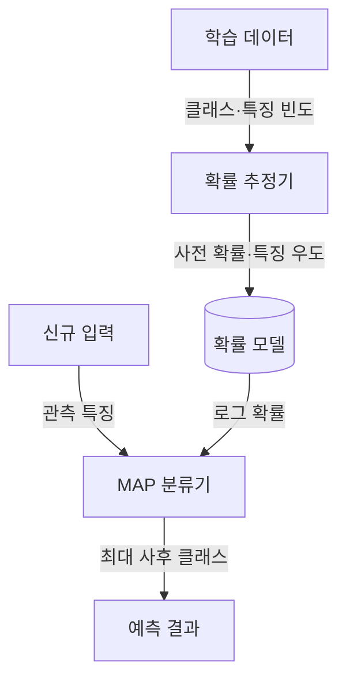
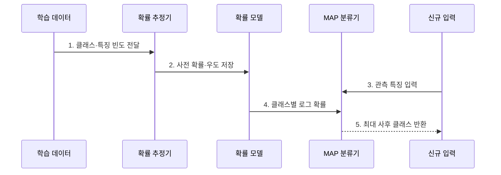

---
sidebar:
  order: 51
  label: "051. 나이브 베이즈 분류(Naive Bayes Classifier)"
  badge:
    text: "미출 · 30%"
    variant: note
title: "나이브 베이즈 분류(Naive Bayes Classifier)"
date: "2026-07-28T17:50:00+09:00"
tags:
  - "notes-basic-theory"
weight: 51
extra:
  question_no: "051"
  source_status: "미출"
  source_history: ""
  priority: 30
  priority_note: "독립 가정·소량 데이터 분류 비교 우선"
---

## 미리 알고가기

- **나이브 베이즈 분류(Naive Bayes Classifier)**: 클래스가 주어지면 특징들이 서로 독립이라고 가정하여 사후 확률이 가장 큰 클래스를 선택하는 확률 분류기이다
- **조건부 독립(Conditional Independence)**: 클래스를 알고 나면 특징끼리는 서로 영향을 주지 않는다는 가정으로, 실제로는 대개 틀리지만 이 가정 덕분에 추정할 확률의 개수가 급격히 줄어든다
- **결합분포(Joint Distribution)**: 여러 특징이 동시에 특정 값을 가질 확률 전체를 뜻하며, 특징이 늘수록 경우의 수가 폭증해 표본으로 직접 추정하기 어려워진다
- **베이즈 정리(Bayes' Theorem)**: 관측된 증거의 우도를 이용해 사전 확률을 관측 후의 사후 확률로 갱신하는 관계식
- **사전 확률(Prior)**: 아무 특징도 보기 전에 그 클래스가 나올 기본 비율로, 스팸이 전체의 삼 할이면 스팸의 사전 확률이 0.3이다
- **우도(Likelihood)**: 특정 클래스를 가정했을 때 관측된 특징 데이터에 대한 가설의 적합도를 나타내는 수치
- **사후 확률(Posterior)**: 특징을 관측한 뒤 해당 클래스에 속할 확률로, 사전 확률과 우도를 곱해 산출
- **라플라스 스무딩(Laplace Smoothing)**: 학습 데이터에 한 번도 안 나온 특징의 확률이 0이 되어 곱 전체를 0으로 만들어 버리는 것을 막기 위해 모든 빈도에 1을 더해 두는 보정
- **최대 사후 확률(Maximum A Posteriori, MAP)**: 사후 확률이 가장 큰 클래스를 예측 결과로 선택하는 판정 기준이다
- **로그 확률(Log Probability)**: 작은 확률의 연속 곱셈을 로그값의 덧셈으로 바꾸어 수치 언더플로를 방지하는 표현이다
- **수치 언더플로(Numerical Underflow)**: 매우 작은 수의 연산 결과가 컴퓨터의 표현 범위보다 작아 0으로 처리되는 현상이다
- **확률 교정(Probability Calibration)**: 모델이 내놓은 확률이 실제 발생 비율과 어긋날 때 검증 데이터로 출력값을 보정하는 절차로, 독립 가정이 깨진 나이브 베이즈가 확률을 과신할 때 쓴다
- **교정 오차(Calibration Error)**: 모델이 0.9라고 말한 사례들이 실제로는 0.6만 맞았을 때처럼 예측 확률과 실제 정답 비율이 벌어진 정도
- **가우시안·다항·베르누이 분포(Gaussian·Multinomial·Bernoulli Distribution)**: 가우시안은 키·온도 같은 연속값, 다항은 단어가 몇 번 나왔는지 같은 횟수, 베르누이는 나왔는지 안 나왔는지 두 결과만을 다루는 확률분포다

## Ⅰ. 개요

- 정의/개념: **조건부 독립**으로 우도를 분해해 **MAP** 클래스를 선택하는 분류기
- 기존 한계: 소량·고차원 데이터는 **결합분포** 추정에 필요한 표본 부족

### 쉽게 이해하기 (학습용)

- 특징 간 관계를 조건부 독립으로 단순화해 클래스별 특징 확률만 추정하므로 고차원 데이터도 비교적 적은 표본으로 학습할 수 있다.

## Ⅱ. 특징

- 클래스 **조건부 독립** 가정에 따른 결합우도의 곱 분해
- 적은 매개변수와 **선형 계산량** 기반의 빠른 학습·추론

### 쉽게 이해하기 (학습용)

- 클래스가 정해지면 각 특징을 독립적으로 계산하므로 결합확률을 특징별 우도의 곱으로 나눌 수 있고, 추정할 매개변수가 줄어 적은 데이터에서도 빠르게 학습한다

## Ⅲ. 아키텍처 및 구성요소

| 설계 요소 | 입력·상태 | 역할 |
|:---|:---|:---|
| 확률 추정기 | 클래스·특징 빈도 | **사전 확률**·우도 추정 |
| 확률 모델 | 클래스별 특징 우도 | 학습된 확률 파라미터 보관 |
| MAP 분류기 | 신규 특징·로그 확률 | 최대 사후 클래스 확정 |

> 요약: 추정한 사전 확률과 우도를 로그 점수로 합산해 **MAP** 판정

### 쉽게 이해하기 (학습용)

- 학습 데이터에서 사전 확률과 특징 우도를 추정해 저장하고, 신규 입력의 로그 확률 합이 가장 큰 클래스를 선택한다.

## Ⅳ. 종류 및 비교

| 나이브 베이즈 | 가우시안 나이브 베이즈 | 다항 나이브 베이즈 | 베르누이 나이브 베이즈 |
|:---|:---|:---|:---|
| 적용 기준 | 키·온도 같은 **연속값**을 분류하는 경우 | 단어 빈도 같은 **발생 횟수**를 쓰는 경우 | 특징의 **존재 여부**만 사용하는 경우 |
| 핵심 특징 | 연속값을 **정규 분포**로 모델링 | 출현 횟수를 **다항 분포**로 모델링 | 출현 여부를 **베르누이 분포**로 모델링 |
| 한계 | **정규성** 위반 시 우도 왜곡 | **음수 특징값** 입력 처리 불가 | 출현 횟수의 **빈도 정보** 손실 |

> 요약: 입력이 연속값·횟수·**이진 출현** 중 무엇인지에 따라 모델 선택

### 쉽게 이해하기 (학습용)

- 입력이 연속값이면 가우시안, 발생 횟수이면 다항, 존재 여부이면 베르누이 나이브 베이즈를 선택한다.

## Ⅴ. 실무 고려사항 및 대책

| 실패 징후 | 완화 방안 | 기대 효과 |
|:---|:---|:---|
| 미관측 특징으로 클래스 점수가 0 | 라플라스 스무딩 적용 | 0확률에 따른 전체 곱 붕괴 방지 |
| 다수 특징의 확률 곱이 0으로 표현됨 | 로그 확률 합산 | 수치 언더플로 방지 |
| 상관 특징 중복으로 확률 과신 | 중복 특징 제거·확률 교정 | 사후 확률의 신뢰도 개선 |
| 운영 클래스 비율 변화 | 사전 확률 재추정과 분포 모니터링 | 변화한 클래스 빈도 반영 |

### 쉽게 이해하기 (학습용)

- 교정 오차와 사전 확률 변화를 함께 관찰한다. 스팸 분류는 라플라스 스무딩으로 학습 때 보지 못한 단어 하나가 전체 확률 곱을 0으로 만드는 문제를 막는다.

## Ⅵ. 결론

- 독립 가정 위반을 검토하여 분류 확률에 **확률 교정** 적용

### 쉽게 이해하기 (학습용)

- 독립 가정과 운영 분포를 검증하고, 확률을 임계값이나 비용 계산에 쓰면 검증 데이터로 교정한다.
