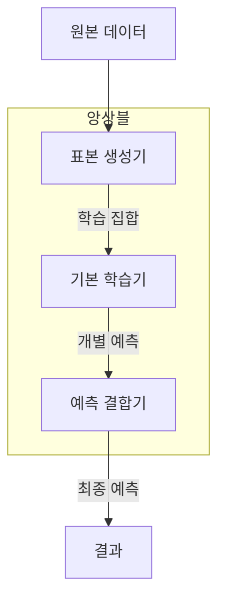
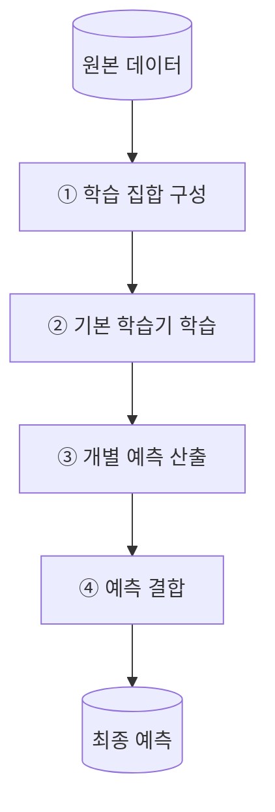
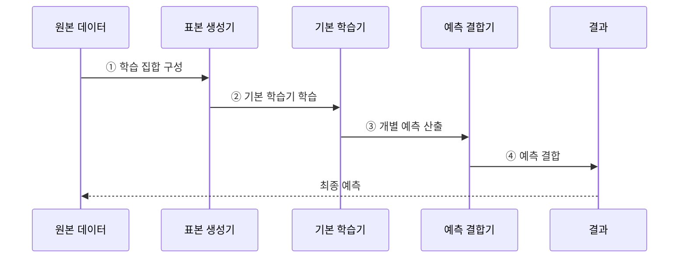

---
sidebar:
  order: 52
  label: "052. 앙상블 학습 — 배깅·부스팅·스태킹 (Ensemble Learning)"
  badge:
    text: "미출 · 50%"
    variant: note
title: "앙상블 학습 — 배깅·부스팅·스태킹 (Ensemble Learning)"
date: "2026-07-28T17:50:00+09:00"
tags:
  - "notes-basic-theory"
weight: 52
extra:
  question_no: "052"
  source_status: "미출"
  source_history: ""
  priority: 50
  priority_note: "배깅·부스팅·스태킹의 상위 비교"
---

## 미리 알고가기

- **앙상블 학습(Ensemble Learning)**: 여러 기본 학습기의 예측을 투표·평균·메타 모델로 결합하여 일반화 오차를 줄이는 학습 방식이다
- **기본 학습기(Base Learner)**: 앙상블을 이루는 개별 모델 하나로, 혼자서는 성능이 대단하지 않아도 여럿이 서로 다른 실수를 하면 결합 후 정확해진다
- **배깅(Bagging)**: 원본 데이터에서 조금씩 다르게 뽑은 표본 집합으로 여러 모델을 동시에 학습시키고 그 예측을 평균이나 투표로 합치는 방식
- **부스팅(Boosting)**: 앞선 모델이 틀린 표본에 다음 모델을 집중시키는 식으로 모델을 한 줄로 이어 붙여 학습하는 방식
- **스태킹(Stacking)**: 여러 기본 모델이 내놓은 예측값 자체를 입력으로 삼아, 누구 말을 언제 믿을지를 별도의 메타 모델이 학습하는 방식
- **다양성(Diversity)**: 기본 모델들이 서로 다른 표본에서 틀리는 성질로, 결합했을 때 오류가 상쇄되려면 반드시 필요한 조건이다
- **부트스트랩 표본(Bootstrap Sample)**: 원본 데이터에서 같은 표본을 여러 번 뽑는 것을 허용해 만든 학습 표본 집합으로, 매번 조금씩 다른 데이터가 되어 모델에 다양성을 준다
- **편향·분산(Bias·Variance)**: 편향은 모델이 애초에 잡지 못하는 체계적 오차이고, 분산은 학습 데이터가 조금 바뀔 때 예측이 크게 흔들리는 정도다
- **일반화 오차(Generalization Error)**: 학습에 쓰지 않은 새 데이터에서 실제로 발생하는 예측 오차로, 앙상블이 줄이려는 최종 대상이다
- **메타 모델(Meta-model)**: 기본 모델들의 예측을 입력받아 최종 답을 내도록 학습하는 상위 모델
- **폴드(Fold)**: 교차 검증을 위해 데이터를 겹치지 않게 나눈 부분 집합
- **잔차(Residual)**: 실제값에서 현재 모델의 예측값을 뺀 나머지 오차로, 부스팅에서 다음 모델이 맞혀야 할 목표가 된다
- **폴드 외(Out-of-Fold, OOF)·배깅 제외(Out-of-Bag, OOB) 예측**: 개별 모델의 학습에 사용하지 않은 표본으로 예측하여 일반화 성능을 검증하는 방식이다
- **데이터 누수(Data Leakage)**: 검증에만 써야 할 정보가 학습 쪽으로 새어 들어가 성능이 실제보다 높게 나오는 현상
- **랜덤 포레스트(Random Forest)**: 표본과 사용할 변수를 함께 무작위로 뽑아 여러 결정 트리를 배깅한 대표 앙상블 모델

## Ⅰ. 개요

- 정의/개념: 여러 모델의 예측을 결합해 **일반화 오차**를 줄이는 학습 방식
- 기존 한계: 단일 모델은 데이터 변화에 따른 **일반화 오차** 상쇄 수단 부재

### 쉽게 이해하기 (학습용)
- 기본 학습기들이 서로 다른 표본에서 오류를 내면 투표나 평균 과정에서 일부 오류가 상쇄되어 단일 모델보다 일반화 성능이 좋아질 수 있다.

## Ⅱ. 특징

- 서로 다른 학습기 예측의 **투표·평균** 결합
- 낮은 **오류 상관** 기반 분산 감소로 **일반화 오차** 축소
- 데이터·특징·알고리즘 **다양성**이 결합 **성능 이득** 좌우

### 쉽게 이해하기 (학습용)
- 여러 모델의 예측을 투표하거나 평균하더라도 서로 같은 사례에서 틀리면 오류가 남으므로, 서로 다른 오류를 내는 학습기를 결합해야 일반화 오차가 줄어든다

## Ⅲ. 아키텍처

**도표안 A — 구조도**

**도표안 B — 동작 흐름도**

**도표안 C — sequenceDiagram**

| 구성요소 | 책임 |
|:---|:---|
| 표본 생성기 | **부트스트랩**·가중치·폴드로 서로 다른 **학습 집합** 구성 |
| 기본 학습기 | 개별 학습 집합에서 서로 다른 **개별 예측** 산출 |
| 예측 결합기 | 투표·평균·**메타 모델**로 최종 예측 산출 |

**동작 원리**

- ① **표본 생성기**가 부트스트랩·가중치·폴드로 다양한 **학습 집합**을 구성한다.
- ② 각 **기본 학습기**가 담당 학습 집합 또는 이전 **잔차**를 학습한다.
- ③ 기본 학습기들이 신규 입력에 대한 서로 다른 **개별 예측**을 산출한다.
- ④ **예측 결합기**가 투표·평균·메타 모델로 예측을 결합해 오류를 **상쇄**한다.

### 쉽게 이해하기 (학습용)
- 표본 생성기가 학습 데이터에 차이를 만들고 기본 학습기들이 개별 예측을 산출하면 결합기가 투표·평균·메타 모델로 최종 결과를 만든다.

## Ⅳ. 종류 및 비교

| 앙상블 기법 | 배깅 | 부스팅 | 스태킹 |
|:---|:---|:---|:---|
| 적용 기준 | 같은 모델의 **예측 분산**이 큰 경우 | **편향**이 크고 잡음이 적은 경우 | 성격이 다른 **이종 모델**이 있는 경우 |
| 핵심 특징 | 병렬 학습 예측의 **평균·투표** | 앞선 **잔차**의 순차 보완 | **폴드 외 예측**을 메타 모델로 결합 |
| 한계 | 모델 간 높은 **오류 상관** | 잡음·**이상치** 과집중 | 학습 예측값의 **데이터 누수** |

> 요약: 분산 과다는 배깅, 편향 과다는 부스팅, 이종은 **스태킹**

### 쉽게 이해하기 (학습용)
- 배깅은 병렬 예측을 평균해 분산을 줄이고, 부스팅은 이전 오차를 순차 보완하며, 스태킹은 이종 모델의 OOF 예측을 메타 모델로 결합한다.

## Ⅴ. 실무 고려사항 및 대책

| 고려사항 | 대책 | 효과 |
|:---|:---|:---|
| 모델들이 같은 표본에서 **함께 오분류** | 데이터·특징·알고리즘 **다양성 확대** | **오류 상관 감소·결합 이득** 확보 |
| 부스팅이 **잡음·이상치에 집중** | 학습률·트리 깊이 제한과 **이상치 검토** | **순차 과적합** 완화 |
| 스태킹 검증 성능이 **비정상적으로 높음** | **OOF 예측**만 메타 모델 학습에 사용 | **데이터 누수** 방지 |
| 성능 향상보다 **추론 비용 증가**가 큼 | 모델 수 축소·**지연·비용 기준** 설정 | **운영 효율** 유지 |

### 쉽게 이해하기 (학습용)
- 모델 간 오류 상관과 추론 지연을 함께 측정한다. 랜덤 포레스트는 각 트리의 OOB 표본 성능이 더 개선되지 않는 지점에서 트리 수를 결정할 수 있다.

## Ⅵ. 결론

- 결합 이득이 **추론 비용**을 넘을 때만 앙상블 채택

### 쉽게 이해하기 (학습용)
- 단일 모델 대비 일반화 개선이 추론 지연·비용·설명성 저하를 상쇄할 때 앙상블을 채택한다.
