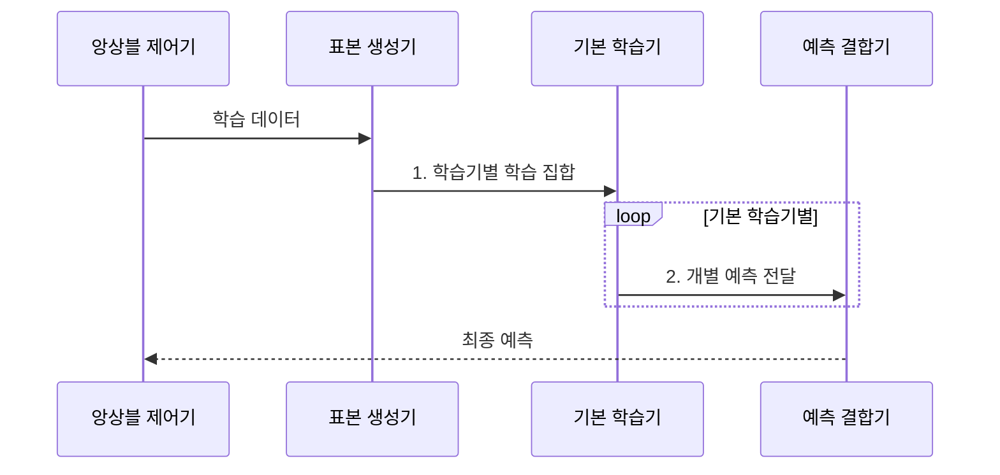

---
sidebar:
  order: 52
  label: "052. 앙상블 학습: 배깅•부스팅•스태킹 (Ensemble Learning)"
  badge:
    text: "미출 • 50%"
    variant: note
title: "앙상블 학습: 배깅•부스팅•스태킹 (Ensemble Learning)"
date: "2026-07-30T19:09:25+09:00"
tags:
  - "notes-basic-theory"
weight: 52
extra:
  question_no: "052"
  source_status: "미출"
  source_history: ""
  priority: 50
  priority_note: "배깅•부스팅•스태킹의 상위 비교"
---

## 미리 알고 가기

- **앙상블 학습(Ensemble Learning)**: 여러 모델의 예측 결합으로 일반화 오차를 줄이는 방식
- **기본 학습기(Base Learner)**: 앙상블을 구성하는 개별 모델
- **배깅(Bagging)**: 병렬 학습한 모델의 예측을 평균•투표하는 방식
- **부스팅(Boosting)**: 앞선 모델의 오류를 다음 모델이 순차 보완하는 방식
- **스태킹(Stacking)**: 기본 모델의 예측을 메타 모델이 결합하는 방식
- **다양성(Diversity)**: 기본 모델들이 서로 다른 표본에서 틀리는 성질
- **오류 상관(Error Correlation)**: 여러 모델이 같은 표본에서 함께 틀리는 정도
- **부트스트랩 표본(Bootstrap Sample)**: 원본 데이터에서 같은 표본을 여러 번 뽑는 것을 허용해 만든 학습 표본 집합으로, 매번 조금씩 다른 데이터가 되어 모델에 다양성을 준다
- **편향•분산(Bias•Variance)**: 체계적 오차와 학습 표본 변화에 대한 민감도
- **일반화 오차(Generalization Error)**: 학습하지 않은 새 데이터의 예측 오차
- **메타 모델(Meta-model)**: 기본 모델들의 예측을 입력받아 최종 답을 내도록 학습하는 상위 모델
- **폴드(Fold)**: 교차 검증을 위해 데이터를 겹치지 않게 나눈 부분 집합
- **잔차(Residual)**: 실제값에서 현재 모델의 예측값을 뺀 나머지 오차로, 부스팅에서 다음 모델이 맞혀야 할 목표가 된다
- **폴드 외(Out-of-Fold, OOF) 예측**: 개별 모델의 학습에 사용하지 않은 폴드로 예측하여 일반화 성능을 검증하는 방식이다
- **데이터 누수(Data Leakage)**: 검증에만 써야 할 정보가 학습 쪽으로 새어 들어가 성능이 실제보다 높게 나오는 현상
- **랜덤 포레스트(Random Forest)**: 표본과 사용할 변수를 함께 무작위로 뽑아 여러 결정 트리를 배깅한 대표 앙상블 모델
- **이종 모델(Heterogeneous Models)**: 서로 다른 알고리즘이나 구조를 사용해 오류 특성이 다른 모델들의 집합

## Ⅰ. 개요

- 정의/개념: 여러 모델의 예측을 결합하는 **앙상블 학습** 기법
- 배경/필요성: 단일 모델은 **편향•분산** 동시 완화에 제약

### 쉽게 이해하기 (학습용)
- 여러 심사위원이 서로 다른 실수를 하고 투표함에서 오답이 상쇄돼 단독 심사보다 정확해지는 장면이다.

## Ⅱ. 특징

- 서로 다른 학습기 예측의 **투표•평균** 결합
- 낮은 **오류 상관** 기반 분산 감소로 **일반화 오차** 축소
- 데이터•특징•알고리즘 **다양성**이 결합 **성능 이득** 좌우

### 쉽게 이해하기 (학습용)
- 심사위원 모두 같은 지원자를 틀리면 투표도 실패하므로, 서로 다른 관점의 심사표를 섞는 장면이다.

## Ⅲ. 구조 및 구성요소

| 구성요소 | 책임 |
|:---|:---|
| 표본 생성기 | **부트스트랩**•가중치•폴드로 서로 다른 **학습 집합** 구성 |
| 기본 학습기 | 개별 학습 집합에서 서로 다른 **개별 예측** 산출 |
| 예측 결합기 | 투표•평균•**메타 모델**로 최종 예측 산출 |

### 쉽게 이해하기 (학습용)
- 카드 배분기가 서로 다른 문제 묶음을 나누고 여러 풀이표가 중앙 투표함으로 모이는 장면이다.

## Ⅳ. 흐름도

**동작 원리**

- **1. 학습기별 학습 집합**: 부트스트랩•가중치•폴드로 구성
- **2. 개별 예측 전달**: 기본 학습기별 예측 산출

### 쉽게 이해하기 (학습용)
- 서로 다른 문제 묶음을 푼 답안들이 투표판•평균계•메타 심사대로 들어가 하나의 답이 되는 장면이다.

## Ⅴ. 종류 및 비교

| 앙상블 기법 | 배깅 | 부스팅 | 스태킹 |
|:---|:---|:---|:---|
| 적용 기준 | 같은 모델의 **예측 분산**이 큰 경우 | **편향**이 크고 잡음이 적은 경우 | 성격이 다른 **이종 모델**이 있는 경우 |
| 핵심 특징 | **랜덤 포레스트**의 병렬 **평균•투표** | 앞선 **잔차**의 순차 보완 | **폴드 외 예측**을 메타 모델로 결합 |
| 한계 | 모델 간 높은 **오류 상관** | 잡음•**이상치** 과집중 | 학습 예측값의 **데이터 누수** |

> 요약: 분산 과다는 배깅, 편향 과다는 부스팅, 이종은 **스태킹**

### 쉽게 이해하기 (학습용)
- 배깅은 동시 투표, 부스팅은 앞사람 오답 수정, 스태킹은 전문가 답을 상위 심사자가 합치는 장면이다.

## Ⅵ. 실무 고려사항 및 대책

| 고려사항 | 대책 | 효과 |
|:---|:---|:---|
| 모델들이 같은 표본에서 **함께 오분류** | 데이터•특징•알고리즘 **다양성 확대** | **오류 상관 감소•결합 이득** 확보 |
| 부스팅이 **잡음•이상치에 집중** | 학습률•트리 깊이 제한과 **이상치 검토** | **순차 과적합** 완화 |
| 스태킹 검증 성능이 **비정상적으로 높음** | **OOF 예측**만 메타 모델 학습에 사용 | **데이터 누수** 방지 |
| 성능 향상보다 **추론 비용 증가**가 큼 | 모델 수 축소•**지연•비용 기준** 설정 | **운영 효율** 유지 |

### 쉽게 이해하기 (학습용)
- 트리를 한 그루씩 늘리며 정확도계와 지연 시계를 함께 보고 이득이 멈춘 지점에서 추가를 중단하는 장면이다.

## Ⅶ. 결론

- 검증 이득이 **지연•비용**을 상쇄할 때 **앙상블 채택**

### 쉽게 이해하기 (학습용)
- 정확도 상승 추와 지연•비용 추를 저울에 올려 정확도 쪽이 무거울 때 여러 모델을 묶는 장면이다.
