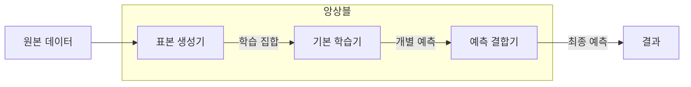

---
sidebar:
  order: 52
  label: "052. 앙상블 학습 — 배깅·부스팅·스태킹 (Ensemble Learning)"
  badge:
    text: "미출제 · 50%"
    variant: note
title: "앙상블 학습 — 배깅·부스팅·스태킹 (Ensemble Learning)"
date: "2026-07-26T22:16:20+09:00"
tags:
  - "notes-basic-theory"
weight: 52
extra:
  question_no: "052"
  source_status: "미출제"
  source_history: ""
  priority: 50
  priority_note: "배깅·부스팅·스태킹의 상위 비교"
---

## 미리 알고가기

- **앙상블 학습(Ensemble Learning)**: 여러 기본 학습기의 예측을 투표·평균·메타 모델로 결합하여 일반화 오차를 줄이는 학습 방식이다
- **기본 학습기(Base Learner)**: 앙상블을 이루는 개별 모델 하나로, 혼자서는 성능이 대단하지 않아도 여럿이 서로 다른 실수를 하면 결합 후 정확해진다
- **배깅(Bagging)**: 원본 데이터에서 조금씩 다르게 뽑은 표본 집합으로 여러 모델을 동시에 학습시키고 그 예측을 평균이나 투표로 합치는 방식
- **부스팅(Boosting)**: 앞선 모델이 틀린 표본에 다음 모델을 집중시키는 식으로 모델을 한 줄로 이어 붙여 학습하는 방식
- **스태킹(Stacking)**: 여러 기본 모델이 내놓은 예측값 자체를 입력으로 삼아, 누구 말을 언제 믿을지를 별도의 메타 모델이 학습하는 방식
- **다양성(Diversity)**: 기본 모델들이 서로 다른 표본에서 틀리는 성질로, 결합했을 때 오류가 상쇄되려면 반드시 필요한 조건이다
- **부트스트랩 표본(Bootstrap Sample)**: 원본 데이터에서 같은 표본을 여러 번 뽑는 것을 허용해 만든 학습 표본 집합으로, 매번 조금씩 다른 데이터가 되어 모델에 다양성을 준다
- **편향·분산(Bias·Variance)**: 편향은 모델이 애초에 잡지 못하는 체계적 오차이고, 분산은 학습 데이터가 조금 바뀔 때 예측이 크게 흔들리는 정도다
- **일반화 오차(Generalization Error)**: 학습에 쓰지 않은 새 데이터에서 실제로 발생하는 예측 오차로, 앙상블이 줄이려는 최종 대상이다
- **메타 모델(Meta-model)**: 기본 모델들의 예측을 입력받아 최종 답을 내도록 학습하는 상위 모델
- **폴드(Fold)**: 교차 검증을 위해 데이터를 겹치지 않게 나눈 부분 집합
- **잔차(Residual)**: 실제값에서 현재 모델의 예측값을 뺀 나머지 오차로, 부스팅에서 다음 모델이 맞혀야 할 목표가 된다
- **폴드 외(Out-of-Fold, OOF)·배깅 제외(Out-of-Bag, OOB) 예측**: 개별 모델의 학습에 사용하지 않은 표본으로 예측하여 일반화 성능을 검증하는 방식이다
- **데이터 누수(Data Leakage)**: 검증에만 써야 할 정보가 학습 쪽으로 새어 들어가 성능이 실제보다 높게 나오는 현상
- **랜덤 포레스트(Random Forest)**: 표본과 사용할 변수를 함께 무작위로 뽑아 여러 결정 트리를 배깅한 대표 앙상블 모델

## Ⅰ. 개요

- 정의/개념: 여러 모델의 예측을 결합해 **일반화 오차**를 줄이는 학습 방식
- 기존 한계: 단일 모델은 데이터 변화에 따른 **일반화 오차** 상쇄 수단 부재

### 쉽게 이해하기 (학습용)
- 어려운 진단을 앞두고 의사 한 명의 소견만 믿지 않고 다섯 명에게 따로 물은 뒤 다수 의견을 택하는 장면인데, 각자 틀리는 자리가 달라서 실수들이 서로 지워지기 때문에 누구 한 명에게 물었을 때보다 최종 판단이 덜 빗나간다

## Ⅱ. 특징

- 서로 다른 학습기 예측의 **투표·평균** 결합
- 낮은 **오류 상관** 기반 분산 감소로 **일반화 오차** 축소

### 쉽게 이해하기 (학습용)
- 여러 모델의 예측을 투표하거나 평균하더라도 서로 같은 사례에서 틀리면 오류가 남으므로, 서로 다른 오류를 내는 학습기를 결합해야 일반화 오차가 줄어든다

## Ⅲ. 아키텍처 및 구성요소

| 설계 요소 | 설명 |
|:---|:---|
| 표본 생성기 | **부트스트랩**·가중치·폴드로 학습 집합 구성 |
| 기본 학습기 | 각 학습 집합에서 **개별 예측** 산출 |
| 예측 결합기 | 투표·평균·**메타 모델**로 최종 예측 산출 |

> 요약: 데이터·모델 **다양성**과 예측 결합으로 오류 상쇄

### 쉽게 이해하기 (학습용)
- 같은 환자 기록을 조금씩 다르게 발췌해 다섯 벌로 만들어 나눠 주는 사람이 표본 생성기이고 각자 소견서를 쓰는 다섯 의사가 기본 학습기이며, 그 소견서를 모아 다수결을 내거나 최종 판단을 다시 배우는 심사자가 예측 결합기다

## Ⅳ. 원리 및 절차 흐름도

| 작동 원리 | 결과 |
|:---|:---|
| 독립 예측 평균 | **비상관 오차** 상쇄로 분산 감소 |
| 잔차 순차 보완 | 이전 오차 집중 학습으로 **편향** 감소 |
| OOF 예측 결합 | **메타 모델**이 기본 모델 신뢰도 학습 |

> 요약: 오차의 비상관성 여부가 **결합 이득**을 좌우

### 쉽게 이해하기 (학습용)
- 서로 독립적으로 나온 답을 평균 내면 제각각 위아래로 튀던 값이 가운데로 모여 예측이 덜 흔들리는데, 애초에 모델들이 같은 자리에서 나란히 틀리면 평균을 내도 그 틀린 값이 그대로 살아남아 결합 이득 자체가 사라진다

## Ⅴ. 종류 및 비교

| 앙상블 기법 | 배깅 | 부스팅 | 스태킹 |
|:---|:---|:---|:---|
| 적용 기준 | 같은 모델의 **예측 분산**이 큰 경우 | **편향**이 크고 잡음이 적은 경우 | 성격이 다른 **이종 모델**이 있는 경우 |
| 핵심 특징 | 병렬 학습 예측의 **평균·투표** | 앞선 **잔차**의 순차 보완 | **폴드 외 예측**을 메타 모델로 결합 |
| 한계 | 모델 간 높은 **오류 상관** | 잡음·**이상치** 과집중 | 학습 예측값의 **데이터 누수** |

> 요약: 분산 과다는 배깅, 편향 과다는 부스팅, 이종은 **스태킹**

### 쉽게 이해하기 (학습용)
- 같은 문제를 다섯 명이 따로 풀어 평균 내는 것이 배깅이고 앞사람이 틀린 문제만 다음 사람에게 몰아 주는 것이 부스팅이며, 국어 선생과 수학 선생이 각각 낸 답을 담임이 받아 누구 말을 언제 믿을지 다시 배우는 것이 스태킹이다

## Ⅵ. 실무 사례

1. 서버 장애 예측에서 **랜덤 포레스트**의 **OOB**로 트리 수 결정

### 쉽게 이해하기 (학습용)
- 트리마다 학습에 안 쓰인 표본이 남으므로 별도 검증 데이터를 떼지 않고도 그 남은 표본으로 성능을 재어, 트리를 더 늘려도 점수가 안 오르는 지점에서 개수를 멈춘다

## Ⅶ. 결론

- 결합 이득이 **추론 비용**을 넘을 때만 앙상블 채택

### 쉽게 이해하기 (학습용)
- 모델을 열 개 돌리면 응답 시간과 서버 비용도 열 배로 늘어나므로, 단일 모델보다 얼마나 덜 틀리는지를 먼저 재어 그 개선이 늘어난 비용과 설명하기 어려워진 부담을 넘어설 때만 여러 모델을 묶는다
