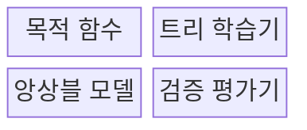
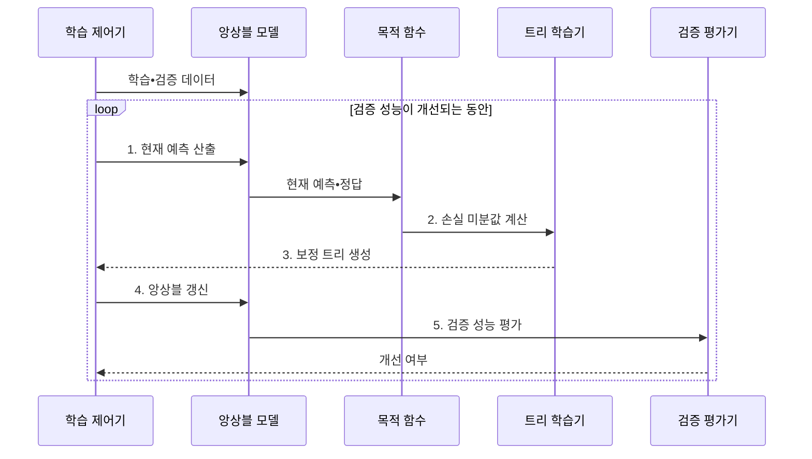

---
sidebar:
  order: 53
  label: "053. XGBoost•LightGBM (XGBoost and LightGBM)"
  badge:
    text: "미출 • 50%"
    variant: note
title: "XGBoost•LightGBM (XGBoost and LightGBM)"
date: "2026-07-29T00:00:00+09:00"
tags:
  - "notes-basic-theory"
weight: 53
extra:
  question_no: "053"
  source_status: "미출"
  source_history: ""
  priority: 50
  priority_note: "표형 데이터 부스팅 구현 비교 중심"
---

## 미리 알고가기

- **익스트림 그래디언트 부스팅(eXtreme Gradient Boosting, XGBoost)•경량 그래디언트 부스팅 머신(Light Gradient Boosting Machine, LightGBM)**: 이전 트리의 예측 오차를 다음 트리가 순차적으로 보완하는 그래디언트 부스팅의 대표 구현이다
- **그래디언트 부스팅(Gradient Boosting)**: 현재 예측의 손실 기울기를 줄이는 보정 트리를 순차적으로 누적하는 앙상블 학습 방식이다
- **정형 데이터(Structured Data)**: 행과 열의 고정된 스키마로 구성된 표 형태의 데이터이다
- **목적 함수(Objective Function)**: 모델이 최소화할 예측 손실에 트리 복잡도 벌점을 더한 함수로, 이 벌점 덕분에 트리가 무한정 복잡해지지 않는다
- **정규화(Regularization)**: 모델이 복잡해질수록 벌점을 매겨 학습 데이터 과적합을 줄이는 방법
- **분할 이득(Split Gain)**: 한 노드를 둘로 나눴을 때 목적 함수가 줄어드는 정도로, 이 값이 가장 큰 자리가 다음 분할 지점이 된다
- **학습률(Learning Rate)**: 새로 만든 트리의 예측을 기존 모델에 얼마나 반영할지 정하는 비율로, 작게 잡으면 트리를 더 많이 써야 하지만 과적합이 줄어든다
- **리프 최소 표본 수(Minimum Samples per Leaf)**: 리프 하나가 최소한 가져야 할 표본 수로, 이 값을 올리면 표본 몇 개만 담은 깊은 가지가 생기지 않는다
- **레벨 단위(Level-wise) 성장**: 같은 깊이의 노드를 고르게 펼쳐 트리를 층층이 키우는 방식
- **리프 단위(Leaf-wise) 성장**: 손실 감소가 가장 큰 리프 한쪽만 골라 계속 깊게 파고드는 방식
- **기울기 기반 단측 표본 추출(Gradient-based One-Side Sampling, GOSS)**: 기울기가 큰 표본은 유지하고 기울기가 작은 표본은 일부만 추출하여 정확도 손실을 줄이면서 학습량을 감소시키는 방식이다
- **상호 배타적 특성 묶기(Exclusive Feature Bundling, EFB)**: 동시에 0이 아닌 값을 갖지 않는 희소 특성을 하나로 결합하여 처리할 특성 수를 줄이는 방식이다
- **조기 종료(Early Stopping)**: 검증 데이터 점수가 더 이상 좋아지지 않으면 트리 추가를 그 자리에서 멈추는 학습 종료 방식
- **검증 데이터(Validation Data)**: 학습에는 직접 쓰지 않고 새 트리를 추가했을 때 일반화 성능이 개선되는지 평가하는 데이터
- **일반화 성능(Generalization Performance)**: 학습에 사용하지 않은 새 데이터에서의 예측 성능
- **그래디언트•헤시안(Gradient•Hessian)**: 그래디언트는 손실이 어느 방향으로 변하는지를 나타내는 1차 미분값이고, 헤시안은 그 변화가 얼마나 급한지를 나타내는 2차 미분값으로 분할 이득 계산에 함께 쓰인다
- **스키마(Schema)**: 정형 데이터의 열 이름•자료형•범주•결측 허용 여부를 정의한 구조

## Ⅰ. 개요

- 정의/개념: 미분값 기반 **보정 트리 누적** 구현체
- 배경/필요성: 대규모 정형 데이터의 **학습 비용 절감**

### 쉽게 이해하기 (학습용)
- 현재 모델의 오차 방향과 크기를 손실 미분값으로 계산하고, 그 오차를 줄이는 보정 트리를 순차적으로 더해 최종 예측을 개선한다

## Ⅱ. 특징

- 손실의 **1•2차 미분값**에 기반한 순차적 오차 보정
- **정규화** 항 내장으로 트리 복잡도 직접 통제
- **조기 종료**와 학습률로 트리 수•**일반화 성능** 균형

### 쉽게 이해하기 (학습용)
- 그래디언트와 헤시안으로 다음 보정 방향을 계산하고, 트리 복잡도에 정규화 벌점을 부과해 오차 감소와 과적합 위험을 함께 통제한다

## Ⅲ. 구조 및 구성요소

| 구성요소 | 책임 |
|:---|:---|
| 목적 함수 | 현재 예측•정답•정규화 항에서 **그래디언트•헤시안** 산출 |
| 트리 학습기 | 손실 미분값으로 **분할 이득** 최대 보정 트리 생성 |
| 앙상블 모델 | 누적 트리와 **학습률**로 현재 예측 산출 |
| 검증 평가기 | 새 트리 전후의 **검증 성능**을 비교해 조기 종료 판단 |

### 쉽게 이해하기 (학습용)
- 목적 함수가 오차 미분값을 만들고 트리 학습기가 보정 트리를 생성하며 검증 평가기가 누적 중단 시점을 정한다.

## Ⅳ. 흐름도

**동작 원리**

- **1. 현재 예측 산출**: 누적 트리의 예측 합산
- **2. 손실 미분값 계산**: 그래디언트•헤시안 산출
- **3. 보정 트리 생성**: 최대 분할 이득 트리 구성
- **4. 앙상블 갱신**: 학습률만큼 보정 트리 누적
- **5. 검증 성능 평가**: 개선 정체 시 조기 종료

### 쉽게 이해하기 (학습용)
- 목적 함수가 현재 오차의 미분값을 계산하면 트리 학습기가 이를 줄이는 보정 트리를 만들고 앙상블 모델이 학습률만큼 누적한다.

## Ⅴ. 종류 및 비교

| 그래디언트 부스팅 구현 | XGBoost | LightGBM |
|:---|:---|:---|
| 적용 기준 | 중소 규모 데이터에서 **안정적 성장**이 필요한 경우 | 대규모•**고차원 희소 특징**을 빠르게 처리하는 경우 |
| 핵심 특징 | **레벨 단위** 균형 성장 | **리프 단위** 성장•GOSS•EFB |
| 한계 | 대용량에서 **학습 시간**•메모리 급증 | 소량 데이터의 **깊은 리프** 과적합 |

> 요약: **GOSS•EFB**로 학습량을 줄인 **LightGBM**

### 쉽게 이해하기 (학습용)
- XGBoost는 레벨 단위로 안정적으로 성장하고, LightGBM은 리프 단위 성장과 GOSS•EFB로 대규모 희소 데이터를 빠르게 처리한다.

## Ⅵ. 실무 고려사항 및 대책

| 고려사항 | 대책 | 효과 |
|:---|:---|:---|
| **학습 성능만 계속 개선** | 검증 집합 기반 **조기 종료**•학습률 축소 | 과적합과 **불필요한 트리 누적 방지** |
| LightGBM의 **깊은 리프 과적합** | 최대 깊이•**리프 최소 표본**•리프 수 제한 | **소량 데이터 일반화** 향상 |
| 대규모 학습의 **메모리•시간 증가** | LightGBM **GOSS•EFB** 또는 분산 학습 검토 | **정형 데이터 처리량** 확대 |
| 범주형•결측값 **처리 불일치** | 학습•추론 전처리 규칙 고정과 **스키마 검증** | **운영 예측 재현성** 확보 |

### 쉽게 이해하기 (학습용)
- 검증 점수의 개선이 멈추면 보정 트리 누적을 조기 종료한다.

## Ⅶ. 결론

- **표본•희소도•학습 시간•과적합** 기반 선택

### 쉽게 이해하기 (학습용)
- 데이터 규모와 희소도, 사용 가능한 메모리, 학습 시간, 리프 과적합 위험을 비교해 XGBoost와 LightGBM을 선택한다.
