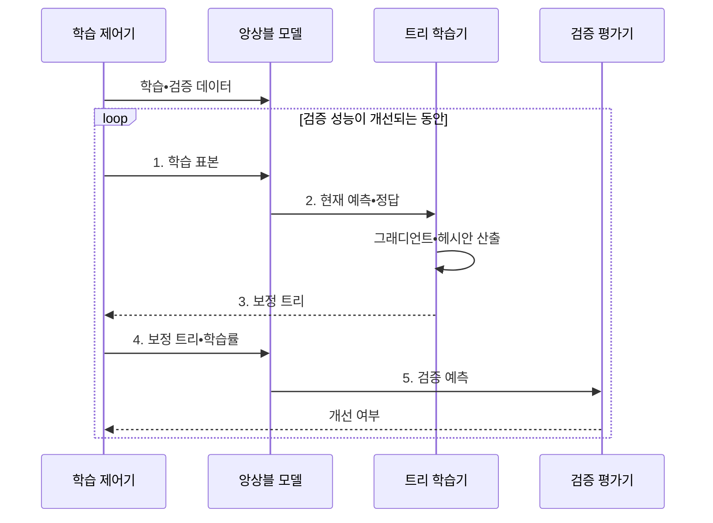

---
sidebar:
  order: 53
  label: "053. XGBoost•LightGBM (XGBoost and LightGBM)"
  badge:
    text: "미출 • 50%"
    variant: note
title: "XGBoost•LightGBM (XGBoost and LightGBM)"
date: "2026-08-03T09:07:03+09:00"
tags:
  - "notes-basic-theory"
weight: 53
extra:
  question_no: "053"
  source_status: "미출"
  source_history: ""
  priority: 50
  priority_note: "표형 데이터 부스팅 구현 비교 중심"
---

## Ⅰ. 개요

핵심 용어

- **그래디언트 부스팅**: 현재 손실의 기울기를 줄이는 보정 트리를 순차적으로 누적하는 앙상블 방식
- **정형 데이터**: 행과 열의 고정된 스키마로 구성된 표 형태의 데이터
- **XGBoost•LightGBM**: 손실 미분값으로 보정 트리를 누적하되 레벨 성장과 리프 성장으로 각각 최적화한 구현

- 정의/개념: **XGBoost와 LightGBM** 은 손실의 미분값으로 보정 트리를 순차 누적하고 대규모 학습을 효율화한 **그래디언트 부스팅 구현**
- 배경/필요성: 정확한 분할 탐색과 순차 학습은 대규모•고차원 정형 데이터에서 **시간•메모리 비용이 증가**

#### 한줄 요약
- 앞 트리의 오답표에 기울기 화살표를 그리고 이를 고치는 작은 트리를 한 그루씩 덧붙이는 장면이다.

## Ⅱ. 특징

핵심 용어

- **그래디언트•헤시안**: 손실 변화 방향을 나타내는 1차 미분값과 변화의 급함을 나타내는 2차 미분값
- **정규화**: 모델 복잡도에 벌점을 부과해 학습 데이터 과적합을 줄이는 방법
- **학습률**: 새 보정 트리의 예측을 기존 모델에 반영하는 비율
- **1•2차 미분값**: 손실의 변화 방향과 곡률을 나타내는 그래디언트와 헤시안
- **정규화 항**: 트리 수•리프 가중치•복잡도에 벌점을 부과하는 목적 함수 항

- 손실의 **1•2차 미분값** 에 기반한 순차적 오차 보정
- **정규화** 항 내장으로 트리 복잡도 직접 통제
- **학습률 감소** 에 따른 필요 트리 수 증가•**과적합 완화**

#### 한줄 요약
- 오답 경사계와 굽힘계로 다음 가지를 고르고, 복잡한 가지에는 벌점 추를 다는 장면이다.

## Ⅲ. 구조 및 구성요소

핵심 용어

- **목적 함수**: 예측 손실과 트리 복잡도 벌점을 합쳐 최소화하는 함수
- **분할 이득**: 노드를 둘로 나눴을 때 목적 함수가 감소하는 정도
- **조기 종료**: 검증 성능이 더 좋아지지 않으면 트리 추가를 멈추는 방식
- **검증 성능**: 학습에 사용하지 않은 데이터에서 측정한 예측 성능

| 구성요소 | 책임 |
|:---|:---|
| 목적 함수 | 현재 예측•정답•정규화 항에서 **그래디언트•헤시안** 산출 |
| 트리 학습기 | 손실 미분값으로 **분할 이득** 최대 보정 트리 생성 |
| 앙상블 모델 | 누적 트리와 **학습률** 로 현재 예측 산출 |
| 검증 평가기 | 새 트리 전후의 **검증 성능** 을 비교해 조기 종료 판단 |

#### 한줄 요약
- 목적 함수 계기판이 미분값을 보내면 트리 공장이 보정 가지를 만들고 검증 신호등이 중단을 알리는 장면이다.

## Ⅳ. 흐름도

핵심 용어

- **보정 트리**: 현재 모델의 오차 방향을 예측해 기존 결과를 개선하는 다음 트리
- **검증 데이터**: 학습에 직접 쓰지 않고 일반화 성능 개선 여부를 평가하는 데이터
- **그래디언트•헤시안**: 현재 예측에서 계산한 손실의 1차•2차 미분값
- **분할 이득**: 노드를 나누었을 때 목적 함수가 감소하는 정도
- **조기 종료**: 검증 성능 개선이 멈추면 트리 추가를 중단하는 방법

**동작 원리**

- **1. 학습 표본**: 누적 트리의 현재 예측 산출
- **2. 현재 예측•정답**: 손실의 그래디언트•헤시안 산출
- **3. 보정 트리**: 최대 분할 이득으로 구성
- **4. 보정 트리•학습률**: 보정 예측을 앙상블에 누적
- **5. 검증 예측**: 개선 정체 여부로 조기 종료

#### 한줄 요약
- 예측표가 미분 계기판과 트리 공장을 거쳐 보정 가지가 되고, 검증 신호가 켜질 때까지 숲에 더해지는 장면이다.

## Ⅴ. 종류 및 비교

핵심 용어

- **레벨 단위 성장**: 같은 깊이의 노드를 고르게 분할하며 트리를 키우는 방식
- **리프 단위 성장**: 손실 감소가 가장 큰 리프를 우선 분할해 깊게 키우는 방식
- **GOSS•EFB**: 중요한 표본은 유지하고 희소 특성은 묶어 LightGBM의 계산량을 줄이는 기법
- **고차원 희소 특징**: 특징 수는 많지만 각 표본에서 값이 있는 특징은 일부뿐인 입력
- **깊은 리프 과적합**: 이득이 큰 리프를 반복 분할해 소수 표본과 잡음까지 학습한 상태

| 그래디언트 부스팅 구현 | XGBoost | LightGBM |
|:---|:---|:---|
| 적용 기준 | 중소 규모 데이터에서 **안정적 성장** 이 필요한 경우 | 대규모•**고차원 희소 특징** 을 빠르게 처리하는 경우 |
| 핵심 특징 | **레벨 단위** 균형 성장 | **리프 단위** 성장•GOSS•EFB |
| 한계 | 대용량에서 **학습 시간**•메모리 급증 | 소량 데이터의 **깊은 리프** 과적합 |

> 요약: **GOSS•EFB** 로 학습량을 줄인 **LightGBM**

#### 한줄 요약
- XGBoost는 층마다 가지를 넓히고, LightGBM은 이득이 큰 잎 하나를 깊게 파는 장면이다.

## Ⅵ. 실무 고려사항 및 대책

핵심 용어

- **리프 최소 표본 수**: 리프 하나가 가져야 하는 최소 표본 수로 깊은 가지의 과적합을 제한하는 값
- **희소 특징**: 대부분의 표본에서 값이 0이거나 비어 있는 입력 특성
- **스키마 검증**: 열 이름•자료형•범주•결측 허용 규칙이 학습 때와 같은지 확인하는 절차
- **분산 학습**: 데이터나 트리 계산을 여러 장치에 나누어 병렬로 학습하는 방식
- **전처리 규칙**: 범주형 값과 결측값을 모델 입력으로 변환하는 고정된 처리 기준

| 문제 | 대책 | 효과 |
|:---|:---|:---|
| **학습 성능만 계속 개선** | 검증 집합 기반 **조기 종료**•학습률 축소 | 과적합과 **불필요한 트리 누적 방지** |
| LightGBM의 **깊은 리프 과적합** | 최대 깊이•**리프 최소 표본**•리프 수 제한 | **소량 데이터 일반화** 향상 |
| 대규모 학습의 **메모리•시간 증가** | LightGBM **GOSS•EFB** 또는 분산 학습 검토 | **정형 데이터 처리량** 확대 |
| 범주형•결측값 **처리 불일치** | 학습•추론 전처리 규칙 고정과 **스키마 검증** | **운영 예측 재현성** 확보 |

#### 한줄 요약
- 검증 점수 신호등이 더 밝아지지 않으면 작업자가 새 보정 트리 투입을 멈추는 장면이다.

## Ⅶ. 결론

핵심 용어

- **XGBoost**: 레벨 단위 성장과 정규화를 제공하는 그래디언트 부스팅 구현
- **LightGBM**: 리프 단위 성장과 GOSS•EFB로 대규모 희소 데이터를 빠르게 처리하는 구현

- 중소 규모는 **XGBoost**, 대규모 희소는 **LightGBM** 선택

#### 한줄 요약
- 중소 표는 층층이 자라는 XGBoost 숲으로, 거대한 희소 표는 빠른 LightGBM 굴착기로 보내는 장면이다.
