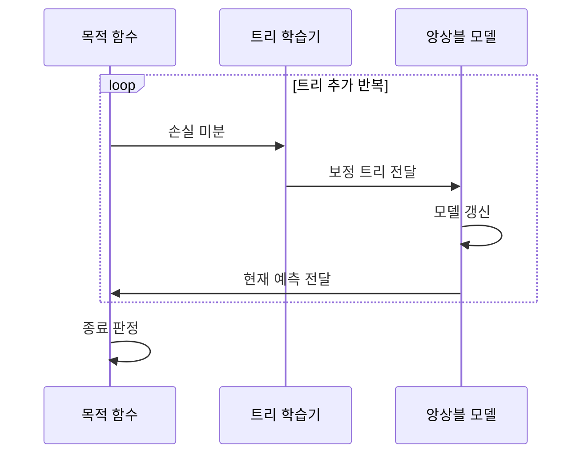

---
sidebar:
  order: 53
  label: "053. XGBoost·LightGBM (XGBoost and LightGBM)"
  badge:
    text: "미출제 · 50%"
    variant: note
title: "XGBoost·LightGBM (XGBoost and LightGBM)"
date: "2026-07-26T22:16:20+09:00"
tags:
  - "notes-basic-theory"
weight: 53
extra:
  question_no: "053"
  source_status: "미출제"
  source_history: ""
  priority: 50
  priority_note: "표형 데이터 부스팅 구현 비교 중심"
---

## 미리 알고가기

- **익스트림 그래디언트 부스팅(eXtreme Gradient Boosting, XGBoost)·경량 그래디언트 부스팅 머신(Light Gradient Boosting Machine, LightGBM)**: 이전 트리의 예측 오차를 다음 트리가 순차적으로 보완하는 그래디언트 부스팅의 대표 구현이다
- **그래디언트 부스팅(Gradient Boosting)**: 지금까지의 예측이 정답에서 어느 방향으로 얼마나 벗어났는지를 손실의 기울기로 재고, 그 벗어난 만큼을 메우도록 새 트리를 학습해 계속 더해 가는 방식
- **정형 데이터(Structured Data)**: 행과 열의 고정된 스키마로 저장된 표 형태 데이터로, 이 영역에서는 부스팅 계열이 신경망보다 잘 맞는 경우가 많다
- **목적 함수(Objective Function)**: 모델이 최소화할 예측 손실에 트리 복잡도 벌점을 더한 함수로, 이 벌점 덕분에 트리가 무한정 복잡해지지 않는다
- **정규화(Regularization)**: 모델이 복잡해질수록 벌점을 매겨 학습 데이터 과적합을 줄이는 방법
- **분할 이득(Split Gain)**: 한 노드를 둘로 나눴을 때 목적 함수가 줄어드는 정도로, 이 값이 가장 큰 자리가 다음 분할 지점이 된다
- **학습률(Learning Rate)**: 새로 만든 트리의 예측을 기존 모델에 얼마나 반영할지 정하는 비율로, 작게 잡으면 트리를 더 많이 써야 하지만 과적합이 줄어든다
- **리프 최소 표본 수(Minimum Samples per Leaf)**: 리프 하나가 최소한 가져야 할 표본 수로, 이 값을 올리면 표본 몇 개만 담은 깊은 가지가 생기지 않는다
- **레벨 단위(Level-wise) 성장**: 같은 깊이의 노드를 고르게 펼쳐 트리를 층층이 키우는 방식
- **리프 단위(Leaf-wise) 성장**: 손실 감소가 가장 큰 리프 한쪽만 골라 계속 깊게 파고드는 방식
- **기울기 기반 단측 표본 추출(Gradient-based One-Side Sampling, GOSS)**: 기울기가 큰 표본은 유지하고 기울기가 작은 표본은 일부만 추출하여 정확도 손실을 줄이면서 학습량을 감소시키는 방식이다
- **상호 배타적 특성 묶기(Exclusive Feature Bundling, EFB)**: 동시에 0이 아닌 값을 갖지 않는 희소 특성을 하나로 결합하여 처리할 특성 수를 줄이는 방식이다
- **조기 종료(Early Stopping)**: 검증 데이터 점수가 더 이상 좋아지지 않으면 트리 추가를 그 자리에서 멈추는 학습 종료 방식
- **그래디언트·헤시안(Gradient·Hessian)**: 그래디언트는 손실이 어느 방향으로 변하는지를 나타내는 1차 미분값이고, 헤시안은 그 변화가 얼마나 급한지를 나타내는 2차 미분값으로 분할 이득 계산에 함께 쓰인다

## Ⅰ. 개요

- 정의/개념: 손실 미분값 기반 보정 트리를 더하는 **부스팅 구현체**
- 기존 한계: 기본 부스팅은 대규모 **정형 데이터**에서 학습 지연·**과적합**

### 쉽게 이해하기 (학습용)
- 앞사람이 채점하고 남긴 빨간 표시만 골라 다음 사람이 다시 푸는 릴레이 장면인데, 새 트리는 지금까지의 예측이 어느 쪽으로 얼마나 빗나갔는지만 보고 그 차이를 메우도록 학습되므로 트리를 더할수록 남은 오차가 깎여 나간다

## Ⅱ. 특징

- 손실의 **1·2차 미분값**에 기반한 순차적 오차 보정
- **정규화** 항 내장으로 트리 복잡도 직접 통제
- **조기 종료**·표본 추출을 통한 **과적합** 억제

### 쉽게 이해하기 (학습용)
- 트리를 계속 더하다 보면 언젠가는 학습 데이터를 통째로 외우게 되므로, 트리가 복잡해질수록 목적 함수에 벌점을 얹어 두고 검증 점수가 더 안 오르면 그 자리에서 추가를 멈추는 두 장치로 외우기를 막는다

## Ⅲ. 아키텍처 및 구성요소

| 설계 요소 | 설명 |
|:---|:---|
| 목적 함수 | 손실 함수와 **정규화** 항의 합 산출 |
| 트리 학습기 | **분할 이득** 최대 조건으로 보정 트리 생성 |
| 앙상블 모델 | 누적 보정 트리와 **학습률** 반영 예측 보관 |

> 요약: **목적 함수** 미분값이 다음 **보정 트리** 결정

### 쉽게 이해하기 (학습용)
- 지금 예측이 정답에서 어느 방향으로 얼마나 벗어났는지 계산해 주는 채점표가 목적 함수이고 그 채점 결과를 보고 이번에 메울 부분만 골라 새 트리를 깎아 내는 것이 트리 학습기이며, 깎인 트리들이 차곡차곡 쌓여 최종 예측을 내놓는 것이 앙상블 모델이다

## Ⅳ. 원리 및 절차 흐름도

| 절차 | 설명 |
|:---|:---|
| 손실 미분 | 현재 예측의 **그래디언트·헤시안** 산출 |
| 보정 트리 전달 | **분할 이득** 최대 조건으로 학습한 트리 전달 |
| 모델 갱신 | **학습률** 비율로 기존 모델에 트리 누적 |
| 현재 예측 전달 | 갱신 모델의 예측값을 **목적 함수**에 전달 |
| 종료 판정 | 검증 성능 정체 시 **조기 종료** |

> 요약: **보정 트리** 누적 중 검증 성능 정체 시 학습 종료

### 쉽게 이해하기 (학습용)
- 남은 오차를 계산하고 그 오차를 가장 크게 줄이는 트리를 하나 붙이는 일을 되풀이하다가 검증 데이터 점수가 더는 오르지 않는 순간 추가를 멈추는데, 이 멈춤이 없으면 트리는 학습 데이터만 계속 더 잘 맞히는 쪽으로 자란다

## Ⅴ. 종류 및 비교

| 그래디언트 부스팅 구현 | XGBoost | LightGBM |
|:---|:---|:---|
| 적용 기준 | 수만 행 이하 **소규모 정형 데이터** | 수백만 행 이상·**고차원 희소 특징** |
| 핵심 특징 | **레벨 단위** 균형 성장 | **리프 단위** 성장·GOSS·EFB |
| 한계 | 대용량에서 **학습 시간**·메모리 급증 | 소량 데이터의 **깊은 리프** 과적합 |

> 요약: **GOSS·EFB**로 그래디언트 부스팅 학습을 경량화한 **LightGBM**

### 쉽게 이해하기 (학습용)
- XGBoost는 같은 층의 노드를 고르게 펼쳐 트리 모양이 균형 잡히는 대신 데이터가 커지면 느려지고, LightGBM은 이득이 가장 큰 리프 한쪽만 깊게 파고들며 이미 잘 맞히는 표본을 솎아 내 훨씬 빠른 대신 데이터가 적으면 그 깊은 가지가 곧 과적합이 된다

## Ⅵ. 실무 사례

1. 장애 로그 분류는 **XGBoost** 보정 트리로 오차 순차 축소

### 쉽게 이해하기 (학습용)
- 장애 유형이 잘 안 갈리는 애매한 로그만 남을 때마다 그 로그를 겨냥한 트리를 하나씩 덧붙여 나가므로, 처음에는 크게 틀리던 분류가 트리가 쌓일수록 조금씩 정확해진다

## Ⅶ. 결론

- 소량은 **XGBoost**, 대용량은 **LightGBM** 선택

### 쉽게 이해하기 (학습용)
- 데이터가 수만 건 수준이면 균형 있게 자라는 XGBoost가 안전하고, 수천만 건이라 학습 시간이 문제가 되면 표본과 특성을 솎아 내는 LightGBM으로 옮기되 그때는 리프 제약을 함께 걸어 깊은 가지를 막는다
