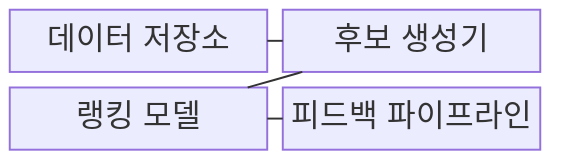
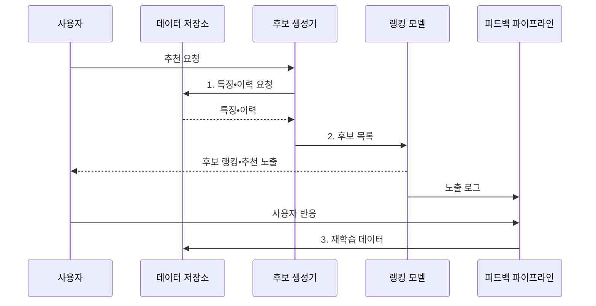

---
sidebar:
  order: 54
  label: "054. 추천 시스템: 협업 필터링•콘텐츠 기반(Recommendation System)"
  badge:
    text: "기출 • 50%"
    variant: note
title: "추천 시스템: 협업 필터링•콘텐츠 기반(Recommendation System)"
date: "2026-08-03T09:07:03+09:00"
tags:
  - "notes-basic-theory"
weight: 54
extra:
  question_no: "054"
  source_status: "기출"
  source_history: "131회"
  priority: 50
  priority_note: "콜드 스타트•추천 방식 선택 우선"
---

## Ⅰ. 개요

핵심 용어

- **추천 시스템**: 사용자 선호도를 예측해 아이템의 노출 순서를 개인화하는 시스템
- **개인화**: 사용자별 행동과 속성에 따라 서로 다른 결과를 제공하는 방식
- **선호도**: 사용자가 특정 아이템을 클릭•구매•평가할 가능성이나 기호의 정도
- **노출 순위**: 사용자 화면에 아이템을 보여 주는 순서

- 정의/개념: **추천 시스템** 은 사용자 행동과 사용자•아이템 속성으로 선호도를 예측해 **아이템 노출 순위를 개인화하는 시스템**
- 배경/필요성: 아이템 수가 많고 선호 관측이 희소해 사용자가 직접 **관련 항목을 탐색하기 어려움**

#### 한줄 요약

- 추천 시스템은 손님의 과거 행동과 상품 속성을 보고 진열대 앞에 놓을 상품 순서를 정하는 점원과 같다.

## Ⅱ. 특징

핵심 용어

- **상호작용 행렬**: 사용자별 아이템 클릭•구매 같은 반응을 기록한 희소 행렬
- **암묵 피드백**: 클릭•구매•체류 시간에서 간접적으로 추정한 선호 신호
- **노출 편향**: 실제로 노출된 아이템에만 반응 로그가 생겨 관측 데이터가 전체 선호를 대표하지 못하는 현상
- **미관측 피드백**: 사용자에게 노출되지 않았거나 반응이 기록되지 않아 선호 여부를 알 수 없는 항목
- **다목적 최적화**: 정확도•다양성•신선도처럼 여러 목표를 동시에 균형 있게 개선하는 과정

- 희소한 **상호작용 행렬** 의 클릭•구매 **암묵 피드백** 활용
- **미관측 피드백** 과 노출 편향에 따른 학습 데이터 왜곡
- 정확도•다양성•신선도 간 **다목적 최적화**

#### 한줄 요약

- 사용자•상품 격자의 빈칸은 비선호가 아니라 미노출일 수 있으므로, 모두 부정 반응으로 처리하면 인기 상품 쏠림이 커진다.

## Ⅲ. 구조 및 구성요소

핵심 용어

- **후보 생성**: 전체 아이템 중 정밀 평가할 소수 후보군을 빠르게 추리는 단계
- **랭킹**: 후보별 선호 점수를 계산해 최종 노출 순서를 정하는 단계
- **피드백 파이프라인**: 노출과 사용자 반응을 수집해 다음 학습 데이터로 되돌리는 처리 경로
- **상호작용 이력**: 사용자와 아이템 사이의 클릭•구매•평가 기록
- **선호 점수**: 랭킹 모델이 사용자별 아이템 적합도를 수치화한 값
- **재학습 데이터**: 노출과 반응 로그를 정제해 다음 모델 학습에 사용하는 데이터

| 구성요소 | 책임 |
|:---|:---|
| 데이터 저장소 | 사용자•아이템 특징과 **상호작용 이력** 보관 |
| 후보 생성기 | 전체 아이템에서 **추천 후보** 를 빠르게 축소 |
| 랭킹 모델 | 후보별 **선호 점수** 와 노출 순위 산출 |
| 피드백 파이프라인 | 노출•반응 로그를 **재학습 데이터** 로 전환 |

#### 한줄 요약
- 창고에서 후보 상품을 꺼내 순위 진열대에 놓고, 손님 반응표를 다시 창고로 보내는 장면이다.

## Ⅳ. 흐름도

핵심 용어

- **특징•이력**: 사용자와 아이템의 속성 및 과거 상호작용 기록
- **재학습 데이터**: 노출 여부와 반응 로그를 정제해 다음 모델 학습에 사용하는 입력
- **프로필•속성**: 사용자의 특성과 아이템의 내용•범주를 나타내는 특징
- **노출 로그**: 어떤 아이템이 어떤 사용자에게 언제 표시됐는지 기록한 데이터

**동작 원리**

- **1. 특징•이력 요청**: 프로필•속성•상호작용 조회
- **2. 후보 목록**: 정밀 평가 후보군 축소
- **3. 재학습 데이터**: 노출•반응 로그를 정제한 학습 입력

#### 한줄 요약

- 거대한 창고에서 후보 바구니만 꺼내 진열 순서를 정하고, 클릭 영수증을 다음 진열표에 되돌리는 장면이다.

## Ⅴ. 종류 및 비교

핵심 용어

- **협업 필터링**: 사용자와 아이템의 상호작용 패턴을 활용하는 추천 방식
- **콘텐츠 기반 추천**: 사용자 선호와 아이템 속성의 유사성을 활용하는 추천 방식
- **하이브리드 추천**: 상호작용 정보와 아이템 속성을 결합하는 방식
- **콜드 스타트(Cold Start)**: 신규 사용자나 아이템에 이력이 없어 추천 근거가 부족한 상태
- **운영 비용**: 여러 추천 모델과 데이터를 실행•관리하는 데 드는 자원과 복잡도

| 추천 방식 | 협업 필터링 | 콘텐츠 기반 | 하이브리드 |
|:---|:---|:---|:---|
| 적용 기준 | **상호작용 로그** 가 충분히 축적된 경우 | 신규 아이템처럼 **이력이 부족** 한 경우 | 이력이 부족한 구간과 충분한 구간이 **혼재** 한 경우 |
| 핵심 특징 | 사용자•아이템 **행동 패턴** 활용 | 프로필•아이템 **속성 유사도** 활용 | 행동 이력•속성 예측 **결합** |
| 한계 | 신규 사용자•아이템 **콜드 스타트** | 유사 속성 **추천 편중** | 구조 복잡도•**운영 비용** 증가 |

> 요약: 이력 부족은 콘텐츠, 축적 후 **협업**

#### 한줄 요약

- 단골 구매표는 협업 계산대, 새 상품 설명표는 콘텐츠 계산대, 혼합 매장은 두 계산대를 함께 쓰는 장면이다.

## Ⅵ. 실무 고려사항 및 대책

핵심 용어

- **콜드 스타트**: 신규 사용자나 아이템에 상호작용 이력이 없어 추천 근거가 부족한 상태
- **탐색 노출**: 이력이 부족한 아이템을 일부 노출해 초기 선호 신호를 모으는 방법
- **인기 편향**: 인기 아이템이 반복 노출되어 상호작용이 다시 인기 항목에 쏠리는 현상
- **근사 최근접 탐색(ANN)**: 모든 아이템을 정확히 비교하지 않고 가까운 후보를 빠르게 찾는 기법
- **노출 확률 보정**: 아이템이 보여질 기회가 달랐음을 반영해 학습 가중치를 조정하는 처리
- **롱테일(Long Tail)**: 인기는 낮지만 종류가 매우 많은 아이템 집합
- **부정 표본**: 사용자가 선호하지 않는다고 간주해 학습에 사용하는 아이템 사례

| 문제 | 대책 | 효과 |
|:---|:---|:---|
| 신규 사용자•아이템의 **추천 공백** | 속성 기반 하이브리드•**초기 탐색 노출** | **콜드 스타트** 완화 |
| 인기 아이템으로 **노출 집중** | 다양성 제약•**노출 확률 보정** | **롱테일 노출 기회** 확대 |
| 미관측 항목을 **비선호로 오인** | 노출 로그 분리•**부정 표본 재정의** | **선호 학습 왜곡** 감소 |
| 후보 생성 **응답 지연** | 사전 색인•**근사 최근접 탐색(ANN)** 적용 | 목표 지연 내 **후보 규모 유지** |

#### 한줄 요약

- 새 상품을 속성 진열대에 잠시 놓아 첫 클릭 영수증을 모으고 협업 진열대로 넘기는 장면이다.

## Ⅶ. 결론

핵심 용어

- **이력 밀도**: 가능한 사용자•아이템 조합 중 실제 상호작용이 기록된 비율
- **혼재 구간**: 이력이 충분한 사용자•아이템과 신규 대상이 함께 존재하는 상태
- **협업•콘텐츠•하이브리드 추천**: 행동 패턴, 아이템 속성, 두 정보를 결합해 추천하는 방식

- **이력 밀도** 가 높으면 협업, **신규** 는 콘텐츠, 혼재는 하이브리드

#### 한줄 요약

- 구매 영수증이 쌓이면 협업, 새 상품이면 콘텐츠, 둘이 섞이면 하이브리드 진열대를 고르는 장면이다.
