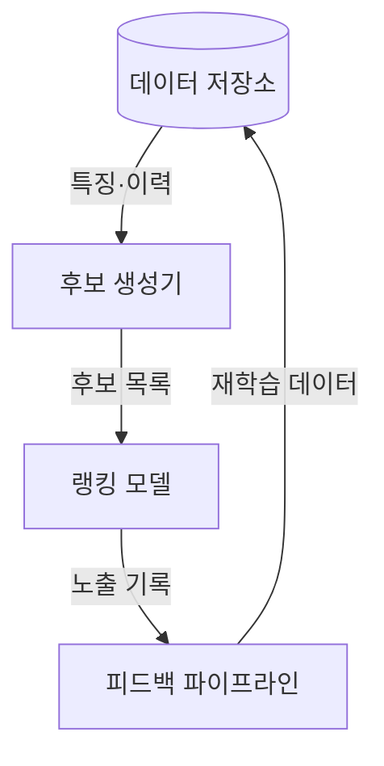
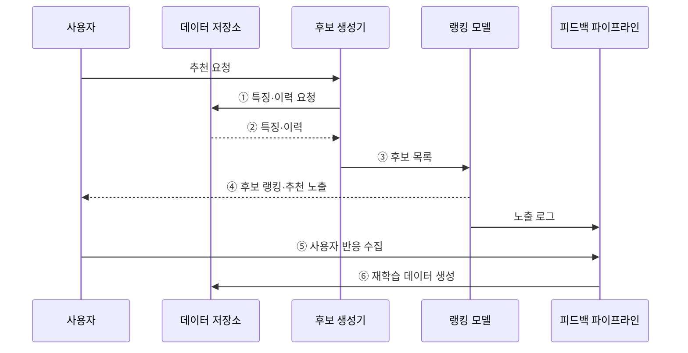

---
sidebar:
  order: 54
  label: "054. 추천 시스템 — 협업 필터링·콘텐츠 기반(Recommendation System)"
  badge:
    text: "기출 · 50%"
    variant: note
title: "추천 시스템 — 협업 필터링·콘텐츠 기반(Recommendation System)"
date: "2026-07-28T21:27:55+09:00"
tags:
  - "notes-basic-theory"
weight: 54
extra:
  question_no: "054"
  source_status: "기출"
  source_history: "131회"
  priority: 50
  priority_note: "콜드 스타트·추천 방식 선택 우선"
---

## 미리 알고가기

- **추천 시스템(Recommendation System)**: 사용자 행동과 아이템 속성을 분석하여 선호도를 예측하고 아이템의 노출 순위를 결정하는 정보 필터링 시스템이다
- **협업 필터링(Collaborative Filtering)**: 사용자·아이템의 상호작용 패턴에서 유사한 사용자나 아이템을 찾아 추천하는 방식이다
- **콘텐츠 기반 추천(Content-Based Recommendation)**: 아이템의 설명·범주·태그와 사용자의 기존 선호 특성 간 유사도를 기준으로 추천하는 방식
- **하이브리드 추천(Hybrid Recommendation)**: 상호작용 패턴과 아이템 속성을 함께 써서 한쪽 정보가 없을 때 다른 쪽이 메우게 하는 방식
- **콜드 스타트(Cold Start)**: 갓 가입한 사용자나 갓 등록된 아이템처럼 상호작용 이력이 하나도 없어 협업 필터링이 아무 근거도 잡지 못하는 상태
- **암묵 피드백(Implicit Feedback)**: 클릭·구매·체류 시간과 같은 사용자 행동에서 간접적으로 추정한 선호 신호
- **후보 생성(Candidate Generation)·랭킹(Ranking)**: 후보 생성은 전체 아이템에서 관련 후보를 빠르게 추리는 1차 단계이고, 랭킹은 후보별 정밀 점수로 노출 순서를 정하는 2차 단계다
- **상호작용 행렬(Interaction Matrix)**: 사용자를 행, 아이템을 열로 놓고 실제 상호작용이 있었던 칸만 채운 표로, 대부분의 칸이 비어 있는 것이 추천 문제의 기본 조건이다
- **미관측 피드백(Unobserved Feedback)**: 노출되지 않았거나 반응이 없어 좋아하는지 싫어하는지 알 수 없는 사용자·아이템 관계로, 이를 싫어함으로 단정하면 학습이 왜곡된다
- **인기 편향(Popularity Bias)**: 이미 많이 노출된 인기 아이템이 더 많이 추천되어 상호작용이 다시 그쪽으로 쏠리는 되먹임 현상
- **노출 편향(Exposure Bias)**: 사용자가 실제로 볼 기회가 있었던 아이템에만 반응 로그가 생겨 관측 데이터가 전체 선호를 대표하지 못하는 현상
- **다양성·신선도(Diversity·Novelty)**: 다양성은 추천 목록에 서로 다른 유형이 섞인 정도이고, 신선도는 사용자가 아직 접한 적 없는 아이템이 포함된 정도다
- **다목적 최적화(Multi-objective Optimization)**: 정확도를 올리면 다양성이 떨어지는 것처럼 서로 충돌하는 목표 간 균형점을 찾는 방법
- **피드백 파이프라인(Feedback Pipeline)**: 무엇을 보여 줬고 사용자가 무엇을 눌렀는지를 모아 다음 학습 데이터로 되돌리는 처리 경로
- **이력 밀도(Interaction Density)**: 가능한 사용자·아이템 조합 가운데 실제 상호작용이 기록된 칸의 비율로, 이 값이 낮으면 협업 필터링의 근거가 얇아진다
- **다양성 제약(Diversity Constraint)**: 같은 범주나 같은 판매자의 아이템이 추천 목록에 몰리지 않도록 비율이나 개수를 걸어 두는 규칙
- **탐색 노출(Exploration Exposure)**: 상호작용 이력이 부족한 아이템을 일부러 노출해 초기 선호 신호를 수집하는 방법이다
- **롱테일(Long Tail)**: 소수 인기 아이템 뒤에 수요가 작지만 종류가 매우 많은 아이템이 길게 이어지는 분포다
- **부정 표본(Negative Sample)**: 사용자가 선호하지 않았다고 간주해 학습에 쓰는 사용자·아이템 조합이다
- **근사 최근접 이웃(Approximate Nearest Neighbor, ANN)**: 모든 아이템을 정확히 비교하지 않고 가까운 후보를 빠르게 찾는 탐색 기법이다

## Ⅰ. 개요

- 정의/개념: 행동·속성으로 개인화하는 **정보 필터링** 시스템
- 기존 한계: 대규모 아이템의 사용자별 **탐색 비용** 증가

### 쉽게 이해하기 (학습용)

- 수십만 개 상품이 쌓인 매장에서 손님마다 무엇을 원하는지 일일이 물을 수는 없으니, 그 손님이 예전에 집었던 물건과 지금 보고 있는 물건의 종류만 보고 진열대 맨 앞에 무엇을 놓을지 정해 주는 점원이 하는 일이다

## Ⅱ. 특징

- 사용자·아이템 **상호작용 행렬**의 높은 희소성
- **미관측 피드백**과 노출 편향에 따른 학습 데이터 왜곡
- 정확도·다양성·신선도 간 **다목적 최적화**

### 쉽게 이해하기 (학습용)

- 손님 만 명과 상품 십만 개로 격자를 그리면 실제로 채워진 칸은 백 칸에 한 칸도 안 되고 그 빈칸은 싫어한다는 뜻이 아니라 아직 못 봤다는 뜻일 뿐인데, 빈칸을 싫어함으로 읽는 순간 이미 잘 팔리는 상품만 계속 앞줄에 서게 된다

## Ⅲ. 아키텍처

**도표안 A — 구조도**

**도표안 B — sequenceDiagram**

| 구성요소 | 책임 |
|:---|:---|
| 데이터 저장소 | 사용자·아이템 특징과 **상호작용 이력** 보관 |
| 후보 생성기 | 전체 아이템에서 **추천 후보**를 빠르게 축소 |
| 랭킹 모델 | 후보별 **선호 점수**와 노출 순위 산출 |
| 피드백 파이프라인 | 노출·반응 로그를 **재학습 데이터**로 전환 |

**동작 원리**

- **① 특징·이력 요청**: 사용자·상황에 맞는 프로필·아이템 속성·상호작용 조회 조건 전달
- **② 특징·이력**: 저장소에서 후보 생성에 필요한 사용자·아이템 정보 반환
- **③ 후보 목록**: 전체 아이템을 빠르게 검색해 정밀 점수를 계산할 후보군으로 축소
- **④ 후보 랭킹·추천 노출**: 후보별 선호 점수와 다양성 제약을 적용해 노출 순서를 결정
- **⑤ 사용자 반응 수집**: 실제 노출 목록과 클릭·구매·체류 같은 반응을 함께 기록
- **⑥ 재학습 데이터 생성**: 노출·반응 로그를 정제해 다음 모델 학습의 입력으로 저장

### 쉽게 이해하기 (학습용)

- 손님 이력과 상품 정보가 쌓인 창고가 데이터 저장소이고 십만 개 중 몇백 개만 골라 오는 선별대가 후보 생성기이며, 그 몇백 개의 진열 순서를 매기는 것이 랭킹 모델이고 손님이 무엇을 집었는지 적어 창고로 돌려보내는 것이 피드백 파이프라인이다

## Ⅳ. 종류 및 비교

| 추천 방식 | 협업 필터링 | 콘텐츠 기반 | 하이브리드 |
|:---|:---|:---|:---|
| 적용 기준 | **상호작용 로그**가 충분히 축적된 경우 | 신규 아이템처럼 **이력이 부족**한 경우 | 이력이 부족한 구간과 충분한 구간이 **혼재**한 경우 |
| 핵심 특징 | 사용자·아이템 **행동 패턴** 활용 | 프로필·아이템 **속성 유사도** 활용 | 행동 이력·속성 예측 **결합** |
| 한계 | 신규 사용자·아이템 **콜드 스타트** | 유사 속성 **추천 편중** | 구조 복잡도·**운영 비용** 증가 |

> 요약: 이력이 부족할 때는 콘텐츠 기반, 이력이 쌓인 뒤에는 **협업 필터링**

### 쉽게 이해하기 (학습용)

- 협업 필터링은 유사 사용자의 상호작용을 활용하지만 신규 아이템에 취약하고, 콘텐츠 기반은 아이템 속성의 유사도로 이를 보완하며, 하이브리드는 두 방식의 예측을 결합한다

## Ⅴ. 실무 고려사항 및 대책

| 고려사항 | 대책 | 효과 |
|:---|:---|:---|
| 신규 사용자·아이템의 **추천 공백** | 속성 기반 하이브리드·**초기 탐색 노출** | **콜드 스타트** 완화 |
| 인기 아이템으로 **노출 집중** | 다양성 제약·**노출 확률 보정** | **롱테일 노출 기회** 확대 |
| 미관측 항목을 **비선호로 오인** | 노출 로그 분리·**부정 표본 재정의** | **선호 학습 왜곡** 감소 |
| 후보 생성 **응답 지연** | 사전 색인·**근사 최근접 탐색** 적용 | 목표 지연 내 **후보 규모 유지** |

### 쉽게 이해하기 (학습용)

- 새 상품을 닮은 기존 상품 옆에 잠시 진열하듯, 신규 아이템을 속성 기반으로 탐색 노출해 첫 상호작용을 확보하고 콜드 스타트를 줄인다.

## Ⅵ. 결론

- **이력 밀도**가 높으면 협업, 신규 구간은 **콘텐츠 기반**

### 쉽게 이해하기 (학습용)

- 이력이 충분하면 협업 필터링, 신규 구간은 콘텐츠 기반, 두 조건이 섞이면 하이브리드를 적용하고 노출 편향을 지속 점검한다.
