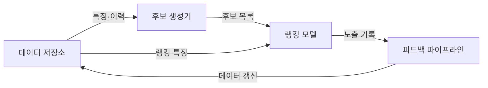
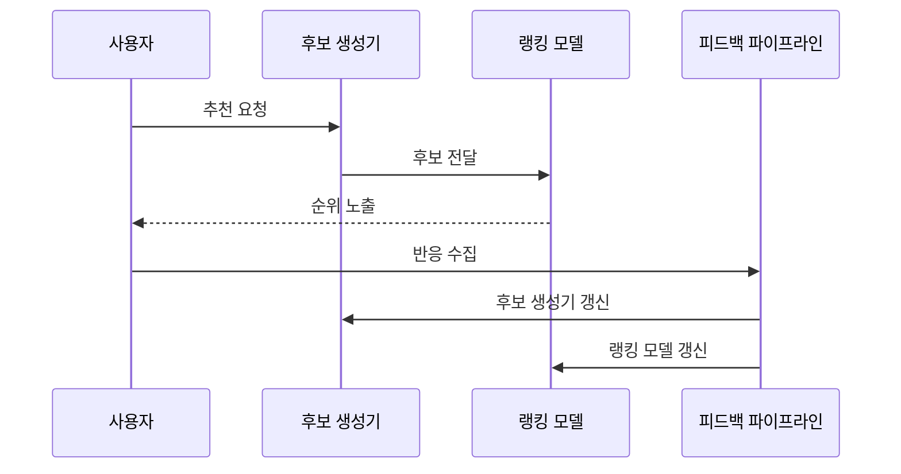

---
sidebar:
  order: 54
  label: "054. 추천 시스템 — 협업 필터링·콘텐츠 기반(Recommendation System)"
  badge:
    text: "기출 · 50%"
    variant: note
title: "추천 시스템 — 협업 필터링·콘텐츠 기반(Recommendation System)"
date: "2026-07-27T23:46:00+09:00"
tags:
  - "notes-basic-theory"
weight: 54
extra:
  question_no: "054"
  source_status: "기출"
  source_history: "131회"
  priority: 50
  priority_note: "콜드 스타트·추천 방식 선택 우선"
---

## 미리 알고가기

- **추천 시스템(Recommendation System)**: 수십만 개 상품이 쌓인 창고 앞에서 이 손님이 예전에 무엇을 집었고 지금 보는 물건이 어떤 종류인지만으로 진열 순서를 정해 주는 점원처럼, 사용자 행동과 아이템 속성으로 선호 가능성을 예측해 노출 순위를 정하는 정보 필터링 시스템이다
- **협업 필터링(Collaborative Filtering)**: 나와 비슷한 것을 산 사람들이 무엇을 더 샀는지를 근거로 추천하는 방식으로, 아이템의 내용은 전혀 보지 않고 상호작용 패턴만 본다
- **콘텐츠 기반 추천(Content-Based Recommendation)**: 아이템의 설명·범주·태그 같은 속성이 사용자가 좋아했던 것과 얼마나 닮았는지로 선호를 예측하는 방식
- **하이브리드 추천(Hybrid Recommendation)**: 상호작용 패턴과 아이템 속성을 함께 써서 한쪽 정보가 없을 때 다른 쪽이 메우게 하는 방식
- **콜드 스타트(Cold Start)**: 갓 가입한 사용자나 갓 등록된 아이템처럼 상호작용 이력이 하나도 없어 협업 필터링이 아무 근거도 잡지 못하는 상태
- **암묵 피드백(Implicit Feedback)**: 별점처럼 대놓고 말한 평가가 아니라 클릭·구매·체류 시간처럼 행동에서 간접적으로 읽어 낸 선호 신호
- **후보 생성(Candidate Generation)·랭킹(Ranking)**: 후보 생성은 전체 아이템에서 눈대중으로 수백 개만 빠르게 추리는 1차 단계이고, 랭킹은 그 수백 개에만 정밀한 점수를 매겨 순서를 정하는 2차 단계다
- **상호작용 행렬(Interaction Matrix)**: 사용자를 행, 아이템을 열로 놓고 실제 상호작용이 있었던 칸만 채운 표로, 대부분의 칸이 비어 있는 것이 추천 문제의 기본 조건이다
- **미관측 피드백(Unobserved Feedback)**: 노출되지 않았거나 반응이 없어 좋아하는지 싫어하는지 알 수 없는 사용자·아이템 관계로, 이를 싫어함으로 단정하면 학습이 왜곡된다
- **인기 편향(Popularity Bias)**: 이미 많이 노출된 인기 아이템이 더 많이 추천되어 상호작용이 다시 그쪽으로 쏠리는 되먹임 현상
- **다양성·신선도(Diversity·Novelty)**: 다양성은 추천 목록에 서로 다른 유형이 섞인 정도이고, 신선도는 사용자가 아직 접한 적 없는 아이템이 포함된 정도다
- **다목적 최적화(Multi-objective Optimization)**: 정확도를 올리면 다양성이 떨어지는 것처럼 서로 충돌하는 목표 간 균형점을 찾는 방법
- **피드백 파이프라인(Feedback Pipeline)**: 무엇을 보여 줬고 사용자가 무엇을 눌렀는지를 모아 다음 학습 데이터로 되돌리는 처리 경로
- **이력 밀도(Interaction Density)**: 가능한 사용자·아이템 조합 가운데 실제 상호작용이 기록된 칸의 비율로, 이 값이 낮으면 협업 필터링의 근거가 얇아진다
- **다양성 제약(Diversity Constraint)**: 같은 범주나 같은 판매자의 아이템이 추천 목록에 몰리지 않도록 비율이나 개수를 걸어 두는 규칙

## Ⅰ. 개요

- 정의/개념: 행동·속성으로 개인화 순위를 정하는 **정보 필터링** 시스템
- 기존 한계: 대규모 아이템에서 사용자별 관심 항목 **탐색 비용** 증가

### 쉽게 이해하기 (학습용)

- 수십만 개 상품이 쌓인 매장에서 손님마다 무엇을 원하는지 일일이 물을 수는 없으니, 그 손님이 예전에 집었던 물건과 지금 보고 있는 물건의 종류만 보고 진열대 맨 앞에 무엇을 놓을지 정해 주는 점원이 하는 일이다

## Ⅱ. 특징

- 사용자·아이템 **상호작용 행렬**의 높은 희소성
- **미관측 피드백**과 노출 편향에 따른 학습 데이터 왜곡
- 정확도·다양성·신선도 간 **다목적 최적화**

### 쉽게 이해하기 (학습용)

- 손님 만 명과 상품 십만 개로 격자를 그리면 실제로 채워진 칸은 백 칸에 한 칸도 안 되고 그 빈칸은 싫어한다는 뜻이 아니라 아직 못 봤다는 뜻일 뿐인데, 빈칸을 싫어함으로 읽는 순간 이미 잘 팔리는 상품만 계속 앞줄에 서게 된다

## Ⅲ. 아키텍처 및 구성요소

| 설계 요소 | 설명 |
|:---|:---|
| 데이터 저장소 | 사용자·아이템 특징과 **상호작용 이력** 보관 |
| 후보 생성기 | 전체 아이템에서 **추천 후보** 축소 |
| 랭킹 모델 | 후보별 **선호 점수**와 노출 순위 산출 |
| 피드백 파이프라인 | **노출 반응**을 재학습 데이터로 전환 |

> 요약: **후보 생성**과 **랭킹**의 2단계를 거친 뒤 사용자 반응으로 재학습

### 쉽게 이해하기 (학습용)

- 손님 이력과 상품 정보가 쌓인 창고가 데이터 저장소이고 십만 개 중 몇백 개만 골라 오는 선별대가 후보 생성기이며, 그 몇백 개의 진열 순서를 매기는 것이 랭킹 모델이고 손님이 무엇을 집었는지 적어 창고로 돌려보내는 것이 피드백 파이프라인이다

## Ⅳ. 원리 및 절차 흐름도

| 절차 | 설명 |
|:---|:---|
| 추천 요청 | 사용자 식별자·**상황 맥락** 수집 |
| 후보 전달 | 전체 아이템에서 **1차 후보** 축소 |
| 순위 노출 | **선호 점수** 정렬 상위 목록 제시 |
| 반응 수집 | 클릭·구매 등 **암묵 피드백** 기록 |
| 후보 생성기 갱신 | 노출 반응으로 **후보 추출 모델** 재학습 |
| 랭킹 모델 갱신 | 노출 반응으로 **선호 점수 모델** 재학습 |

> 요약: **후보 축소** 후 순위화, 암묵 피드백으로 갱신

### 쉽게 이해하기 (학습용)

- 십만 개 전부에 정밀 점수를 매기면 손님이 화면을 보기도 전에 시간이 다 가므로 먼저 눈대중으로 몇백 개만 추려 놓고 그 안에서만 순서를 꼼꼼히 매기며, 손님이 무엇을 눌렀는지가 다음번 추림과 순서를 고치는 재료가 된다

## Ⅴ. 종류 및 비교

| 추천 방식 | 협업 필터링 | 콘텐츠 기반 | 하이브리드 |
|:---|:---|:---|:---|
| 적용 기준 | **상호작용 로그** 축적·높은 이력 밀도 | 신규 아이템의 **이력 부재** | 이력 희박·밀집 구간 **혼재** |
| 핵심 특징 | 사용자·아이템 **행동 패턴** 활용 | 프로필·아이템 **속성 유사도** 활용 | 행동 이력·속성 예측 **결합** |
| 한계 | 신규 사용자·아이템 **콜드 스타트** | 유사 속성 **추천 편중** | 구조 복잡도·**운영 비용** 증가 |

> 요약: 이력이 부족할 때는 콘텐츠 기반, 이력이 쌓인 뒤에는 **협업 필터링**

### 쉽게 이해하기 (학습용)

- 나와 비슷한 것을 산 사람들이 무엇을 더 샀는지 보는 것이 협업 필터링이라 아무도 안 산 신상품은 영영 뜨지 않고, 그래서 그런 물건은 설명과 범주가 닮았는지로 권하는 콘텐츠 기반이 맡으며 두 방식을 함께 돌려 서로의 빈틈을 메우는 것이 하이브리드다

## Ⅵ. 실무 사례

1. 신규 아이템은 속성 유사도로 **콜드 스타트** 완화
2. 추천 목록은 **다양성 제약**으로 **인기 편향** 억제

### 쉽게 이해하기 (학습용)

- 방금 등록된 상품은 클릭 기록이 한 건도 없어 비슷한 손님을 찾을 수가 없으므로, 설명과 범주가 닮은 기존 상품 옆자리에 끼워 넣어 첫 노출 기회를 만들어 준다
- 잘 팔리는 상품만 계속 앞줄에 놓으면 그 상품의 클릭이 또 쌓여 더 앞으로 가는 되먹임이 생기므로, 한 범주에서 몇 개까지만 뽑는다는 한도를 목록에 걸어 다른 상품이 설 자리를 남긴다

## Ⅶ. 결론

- **이력 밀도**·**콜드 스타트** 여부로 추천 방식 선택

### 쉽게 이해하기 (학습용)

- 손님과 상품의 상호작용 격자가 어느 정도 채워져 있으면 협업 필터링이 가장 정확하지만, 그 격자가 비어 있는 신규 구간에서는 속성으로 권하는 콘텐츠 기반으로 갈아타고 두 구간이 섞여 있으면 하이브리드로 묶는다

## 2~4교시 확장

**예상 문항**

> 대규모 전자상거래 서비스의 추천 시스템 아키텍처를 설명하고,
> 콜드 스타트와 인기 편향 등 운영 단계에서 발생하는
> 문제점과 대책을 논하시오. (25점)

**목차 조립**: `Ⅰ 정의·기존 한계 → Ⅲ 구성요소 → Ⅳ 절차 → Ⅴ 비교 → 아래 표 → Ⅶ 결론`

| 문제점 | 대책 | 효과 |
|:---|:---|:---|
| 신규 사용자·아이템의 **콜드 스타트** | 속성 기반 **하이브리드** 전환·초기 탐색 노출 | 이력 없는 구간의 **추천 공백** 해소 |
| 노출 되먹임에 따른 **인기 편향** | 범주별 **다양성 제약**·노출 확률 보정 | 롱테일 아이템 **노출 기회** 확보 |
| **미관측 피드백**을 비선호로 오인 | 노출 로그 분리 기록·**부정 표본** 재정의 | 학습 데이터의 **선호 왜곡** 감소 |
| 후보 생성 단계의 **응답 지연** | 사전 색인·**근사 최근접 탐색** 도입 | 목표 지연 안에서 **후보 규모** 유지 |
