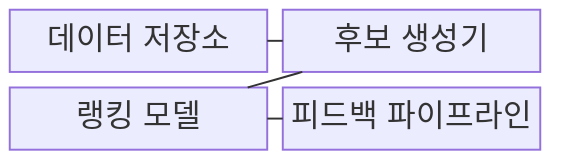
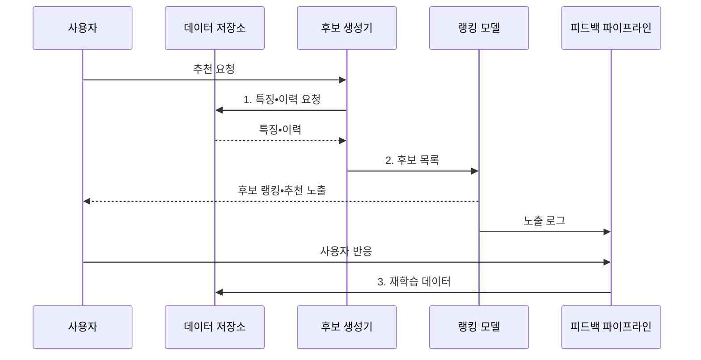

---
sidebar:
  order: 54
  label: "054. 추천 시스템: 협업 필터링•콘텐츠 기반(Recommendation System)"
  badge:
    text: "기출 • 50%"
    variant: note
title: "추천 시스템: 협업 필터링•콘텐츠 기반(Recommendation System)"
date: "2026-07-30T19:10:19+09:00"
tags:
  - "notes-basic-theory"
weight: 54
extra:
  question_no: "054"
  source_status: "기출"
  source_history: "131회"
  priority: 50
  priority_note: "콜드 스타트•추천 방식 선택 우선"
---

## 미리 알고 가기

- **추천 시스템(Recommendation System)**: 선호도를 예측해 아이템 노출 순위를 정하는 시스템
- **협업 필터링(Collaborative Filtering)**: 사용자•아이템의 상호작용 유사성 기반 추천
- **콘텐츠 기반 추천(Content-Based Recommendation)**: 사용자 선호와 아이템 속성의 유사성 기반 추천
- **하이브리드 추천(Hybrid Recommendation)**: 상호작용과 아이템 속성을 결합한 추천
- **콜드 스타트(Cold Start)**: 상호작용 이력이 없어 추천 근거가 부족한 상태
- **암묵 피드백(Implicit Feedback)**: 클릭•구매•체류 시간과 같은 사용자 행동에서 간접적으로 추정한 선호 신호
- **후보 생성(Candidate Generation)•랭킹(Ranking)**: 후보 축소와 후보별 노출 순위 결정
- **상호작용 행렬(Interaction Matrix)**: 사용자별 아이템 반응을 기록한 희소 행렬
- **미관측 피드백(Unobserved Feedback)**: 선호 여부를 알 수 없는 사용자•아이템 관계
- **인기 편향(Popularity Bias)**: 이미 많이 노출된 인기 아이템이 더 많이 추천되어 상호작용이 다시 그쪽으로 쏠리는 되먹임 현상
- **노출 편향(Exposure Bias)**: 사용자가 실제로 볼 기회가 있었던 아이템에만 반응 로그가 생겨 관측 데이터가 전체 선호를 대표하지 못하는 현상
- **다양성•신선도(Diversity•Novelty)**: 다양성은 추천 목록에 서로 다른 유형이 섞인 정도이고, 신선도는 사용자가 아직 접한 적 없는 아이템이 포함된 정도다
- **다목적 최적화(Multi-objective Optimization)**: 충돌하는 여러 목표의 균형점을 찾는 방법
- **피드백 파이프라인(Feedback Pipeline)**: 무엇을 보여 줬고 사용자가 무엇을 눌렀는지를 모아 다음 학습 데이터로 되돌리는 처리 경로
- **이력 밀도(Interaction Density)**: 가능한 사용자•아이템 조합 가운데 실제 상호작용이 기록된 칸의 비율로, 이 값이 낮으면 협업 필터링의 근거가 얇아진다
- **다양성 제약(Diversity Constraint)**: 같은 범주나 같은 판매자의 아이템이 추천 목록에 몰리지 않도록 비율이나 개수를 걸어 두는 규칙
- **탐색 노출(Exploration Exposure)**: 상호작용 이력이 부족한 아이템을 일부러 노출해 초기 선호 신호를 수집하는 방법이다
- **롱테일(Long Tail)**: 소수 인기 아이템 뒤에 수요가 작지만 종류가 매우 많은 아이템이 길게 이어지는 분포다
- **부정 표본(Negative Sample)**: 사용자가 선호하지 않았다고 간주해 학습에 쓰는 사용자•아이템 조합이다
- **근사 최근접 이웃(Approximate Nearest Neighbor, ANN)**: 모든 아이템을 정확히 비교하지 않고 가까운 후보를 빠르게 찾는 탐색 기법이다

## Ⅰ. 개요

- 정의/개념: 행동•속성으로 항목 순위를 개인화하는 **추천 시스템**
- 배경/필요성: 많은 항목에서 사용자별 **탐색 범위와 순위** 결정

### 쉽게 이해하기 (학습용)

- 추천 시스템은 손님의 과거 행동과 상품 속성을 보고 진열대 앞에 놓을 상품 순서를 정하는 점원과 같다.

## Ⅱ. 특징

- 희소한 **상호작용 행렬**의 클릭•구매 **암묵 피드백** 활용
- **미관측 피드백**과 노출 편향에 따른 학습 데이터 왜곡
- 정확도•다양성•신선도 간 **다목적 최적화**

### 쉽게 이해하기 (학습용)

- 사용자•상품 격자의 빈칸은 비선호가 아니라 미노출일 수 있으므로, 모두 부정 반응으로 처리하면 인기 상품 쏠림이 커진다.

## Ⅲ. 구조 및 구성요소

| 구성요소 | 책임 |
|:---|:---|
| 데이터 저장소 | 사용자•아이템 특징과 **상호작용 이력** 보관 |
| 후보 생성기 | 전체 아이템에서 **추천 후보**를 빠르게 축소 |
| 랭킹 모델 | 후보별 **선호 점수**와 노출 순위 산출 |
| 피드백 파이프라인 | 노출•반응 로그를 **재학습 데이터**로 전환 |

### 쉽게 이해하기 (학습용)
- 창고에서 후보 상품을 꺼내 순위 진열대에 놓고, 손님 반응표를 다시 창고로 보내는 장면이다.

## Ⅳ. 흐름도

**동작 원리**

- **1. 특징•이력 요청**: 프로필•속성•상호작용 조회
- **2. 후보 목록**: 정밀 평가 후보군 축소
- **3. 재학습 데이터**: 노출•반응 로그를 정제한 학습 입력

### 쉽게 이해하기 (학습용)

- 거대한 창고에서 후보 바구니만 꺼내 진열 순서를 정하고, 클릭 영수증을 다음 진열표에 되돌리는 장면이다.

## Ⅴ. 종류 및 비교

| 추천 방식 | 협업 필터링 | 콘텐츠 기반 | 하이브리드 |
|:---|:---|:---|:---|
| 적용 기준 | **상호작용 로그**가 충분히 축적된 경우 | 신규 아이템처럼 **이력이 부족**한 경우 | 이력이 부족한 구간과 충분한 구간이 **혼재**한 경우 |
| 핵심 특징 | 사용자•아이템 **행동 패턴** 활용 | 프로필•아이템 **속성 유사도** 활용 | 행동 이력•속성 예측 **결합** |
| 한계 | 신규 사용자•아이템 **콜드 스타트** | 유사 속성 **추천 편중** | 구조 복잡도•**운영 비용** 증가 |

> 요약: 이력 부족은 콘텐츠, 축적 후 **협업**

### 쉽게 이해하기 (학습용)

- 단골 구매표는 협업 계산대, 새 상품 설명표는 콘텐츠 계산대, 혼합 매장은 두 계산대를 함께 쓰는 장면이다.

## Ⅵ. 실무 고려사항 및 대책

| 고려사항 | 대책 | 효과 |
|:---|:---|:---|
| 신규 사용자•아이템의 **추천 공백** | 속성 기반 하이브리드•**초기 탐색 노출** | **콜드 스타트** 완화 |
| 인기 아이템으로 **노출 집중** | 다양성 제약•**노출 확률 보정** | **롱테일 노출 기회** 확대 |
| 미관측 항목을 **비선호로 오인** | 노출 로그 분리•**부정 표본 재정의** | **선호 학습 왜곡** 감소 |
| 후보 생성 **응답 지연** | 사전 색인•**근사 최근접 탐색(ANN)** 적용 | 목표 지연 내 **후보 규모 유지** |

### 쉽게 이해하기 (학습용)

- 새 상품을 속성 진열대에 잠시 놓아 첫 클릭 영수증을 모으고 협업 진열대로 넘기는 장면이다.

## Ⅶ. 결론

- **이력 밀도**가 높으면 협업, **신규**는 콘텐츠, 혼재는 하이브리드

### 쉽게 이해하기 (학습용)

- 구매 영수증이 쌓이면 협업, 새 상품이면 콘텐츠, 둘이 섞이면 하이브리드 진열대를 고르는 장면이다.
