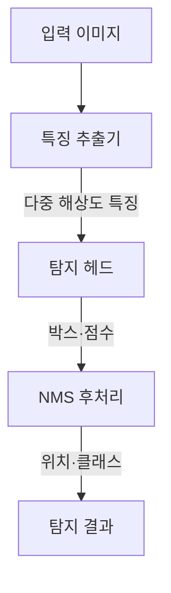
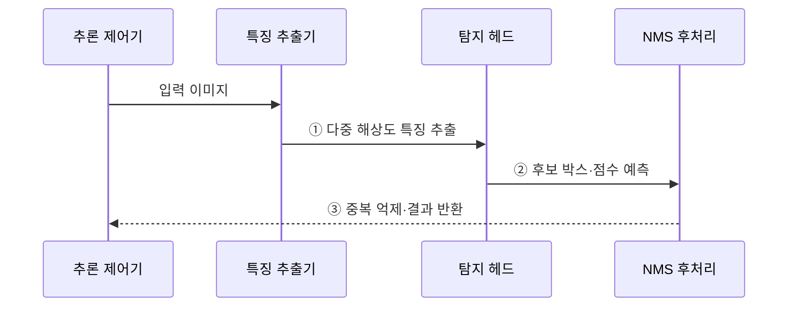

---
sidebar:
  order: 55
  label: "055. 객체 탐지 — YOLO·R-CNN (Object Detection)"
  badge:
    text: "기출 · 50%"
    variant: note
title: "객체 탐지 — YOLO·R-CNN (Object Detection)"
date: "2026-07-28T21:27:55+09:00"
tags:
  - "notes-basic-theory"
weight: 55
extra:
  question_no: "055"
  source_status: "기출"
  source_history: "126회"
  priority: 50
  priority_note: "탐지 구조 비교와 현장 적용"
---

## 미리 알고가기

- **객체 탐지(Object Detection)**: 객체별 위치와 클래스를 함께 예측하는 비전 기법
- **바운딩 박스(Bounding Box)**: 객체를 감싸는 사각형 좌표
- **바운딩 박스 회귀(Bounding-box Regression)**: 예측 상자를 정답 상자에 맞추는 좌표 회귀
- **교집합 대 합집합(Intersection over Union, IoU)**: 두 상자의 교집합 면적을 합집합 면적으로 나눈 위치 일치도
- **정밀도·재현율(Precision·Recall)**: 탐지 결과의 정확성·실제 객체의 검출 비율
- **평균 정밀도(Average Precision, AP)**: 한 클래스의 정밀도-재현율 곡선 아래 면적을 종합하여 객체 탐지 성능을 나타내는 지표다
- **평균 정밀도 평균(mean Average Precision, mAP)**: 클래스별 AP를 평균한 객체 탐지의 대표 정확도 지표다.
- **비최댓값 억제(Non-Maximum Suppression, NMS)**: 중복 상자 중 최고 점수만 남기는 후처리
- **영역 기반 합성곱 신경망(Region-based Convolutional Neural Network, R-CNN)**: 객체 후보 영역을 먼저 생성한 뒤 각 영역의 클래스와 위치를 정밀화하는 2단계 객체 탐지 모델이다
- **한 번만 보기(You Only Look Once, YOLO)**: 위치와 클래스를 한 번에 예측하는 1단계 탐지 모델
- **백본·넥·탐지 헤드(Backbone·Neck·Detection Head)**: 백본은 이미지 특징을 추출하고, 넥은 여러 해상도의 특징을 결합하며, 탐지 헤드는 객체의 위치와 클래스를 출력한다
- **객체성(Objectness)**: 그 자리에 종류를 가리지 않고 어떤 객체라도 있을 가능성을 나타내는 점수로, 배경을 먼저 걸러 내는 데 쓰인다
- **특징 피라미드(Feature Pyramid)**: 크게 축소한 특징 맵과 덜 축소한 특징 맵을 층층이 쌓아 결합한 구조로, 화면에서 점만 한 객체와 화면을 가득 채운 객체를 각각 다른 층에서 찾게 해 준다
- **클래스 불균형(Class Imbalance)**: 격자 대부분이 배경이라 배경 표본이 객체 표본보다 압도적으로 많은 상태로, 모델이 배경만 잘 맞히는 쪽으로 치우치게 만든다
- **양자화(Quantization)**: 가중치와 연산을 낮은 수치 정밀도로 바꿔 모델 크기와 연산량을 줄이는 경량화 기법
- **엣지 기기(Edge Device)**: 카메라 옆 소형 연산 장치처럼 데이터가 생기는 현장에서 제한된 전력·메모리로 추론을 수행하는 장치
- **추론(Inference)**: 학습을 마친 모델이 새 이미지의 객체 위치와 클래스를 실제로 예측하는 과정
- **영역 제안(Region Proposal)**: 객체가 있을 가능성이 높은 영상 구역을 2단계 탐지기의 정밀 분류 대상으로 추리는 절차다
- **포컬 손실(Focal Loss)**: 쉬운 배경 표본의 손실 가중치를 낮춰 어려운 객체 표본 학습에 집중하는 손실 함수다

## Ⅰ. 개요

- 정의/개념: 객체의 **위치·클래스**를 함께 찾는 비전 기법
- 기존 한계: 이미지 분류는 다중 객체의 **공간 좌표** 산출 불가

### 쉽게 이해하기 (학습용)
- 객체 탐지는 사진 속 사람·차마다 사각 테두리와 이름표를 붙여 위치와 종류를 함께 답한다.

## Ⅱ. 특징

- **바운딩 박스** 회귀와 클래스 분류의 동시 수행
- 다수 후보 박스의 점수·**IoU** 기반 **NMS 후처리**
- **특징 피라미드**를 통한 크기 상이 객체 동시 탐지

### 쉽게 이해하기 (학습용)
- 탐지 헤드는 객체 위치와 클래스를 함께 예측하고, NMS는 겹친 후보 박스를 제거하며, 특징 피라미드는 크기가 다른 객체를 여러 해상도에서 탐지한다

## Ⅲ. 아키텍처

**도표안 A — 구조도**

**도표안 B — sequenceDiagram**

| 구성요소 | 책임 |
|:---|:---|
| 특징 추출기 | **백본·넥**으로 다중 해상도 **특징 피라미드** 생성 |
| 탐지 헤드 | 박스 위치·클래스·**객체성** 예측 |
| NMS 후처리 | 점수 미달·높은 IoU의 **중복 박스** 제거 |

**동작 원리**

- **① 다중 해상도 특징 추출**: 백본·넥의 특징 피라미드로 크기별 객체 표현 생성
- **② 후보 박스·점수 예측**: 탐지 헤드가 위치·클래스·객체성 점수를 가진 후보 상자 생성
- **③ 중복 억제·결과 반환**: 낮은 점수 후보를 제거하고 높은 IoU로 겹치는 상자 중 최고 점수만 남겨 반환

### 쉽게 이해하기 (학습용)
- 특징 추출기가 다중 해상도 표현을 만들고 탐지 헤드가 위치·클래스·객체성을 예측하면 NMS가 중복 상자를 제거한다.

## Ⅳ. 종류 및 비교

| 객체 탐지 구조 | 1단계(YOLO 계열) | 2단계(R-CNN 계열) |
|:---|:---|:---|
| 적용 기준 | **실시간 추론**이나 엣지 자원 제약이 있는 경우 | 소형·밀집 객체의 **정밀 검출**이 필요한 경우 |
| 핵심 특징 | 이미지 전체에서 위치·클래스 **동시 예측** | **영역 제안** 후 분류·위치 정밀화 |
| 한계 | 소형·밀집 객체의 **위치 정밀도** 저하 | 2단계 순차 처리의 **추론 지연** |

> 요약: **단일 통과** 1단계와 정제형 2단계의 속도·정확도 상충

### 쉽게 이해하기 (학습용)
- 1단계 탐지기는 한 번의 추론으로 경계 상자와 클래스를 예측해 빠르지만 클래스 불균형에 취약하고, 2단계 탐지기는 후보 영역을 생성한 뒤 분류·보정하여 정확도가 높은 대신 처리 시간이 길다

## Ⅴ. 실무 고려사항 및 대책

| 고려사항 | 대책 | 효과 |
|:---|:---|:---|
| 소형·밀집 객체 **미탐 증가** | 고해상도 입력·특징 피라미드·**2단계 모델** 검토 | 작은 객체 **재현율 향상** |
| 동일 객체의 **중복 박스 잔존** | 점수·**IoU 임계값**을 검증 데이터로 조정 | **중복 탐지** 감소 |
| 배경 비중이 커 **객체 학습 약화** | **포컬 손실**·표본 균형화 적용 | **클래스 불균형** 완화 |
| 엣지 기기의 **지연·메모리 초과** | 경량 백본·**양자화**·입력 크기 조정 | **실시간 처리·자원 한도** 충족 |

### 쉽게 이해하기 (학습용)
- 보안 영상의 작은 사람을 확대경으로 찾듯, 해상도가 높은 특징 피라미드 층을 함께 사용하고 객체 크기별 재현율을 측정해 소형 객체 미탐을 줄인다.

## Ⅵ. 결론

- **지연 예산** 우선이면 YOLO, **소형 객체 정밀도**면 R-CNN

### 쉽게 이해하기 (학습용)
- 실시간·엣지 환경은 YOLO 계열, 소형·밀집 객체의 정밀 검출은 R-CNN 계열을 우선 검토한다.
