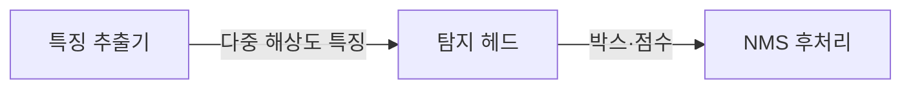
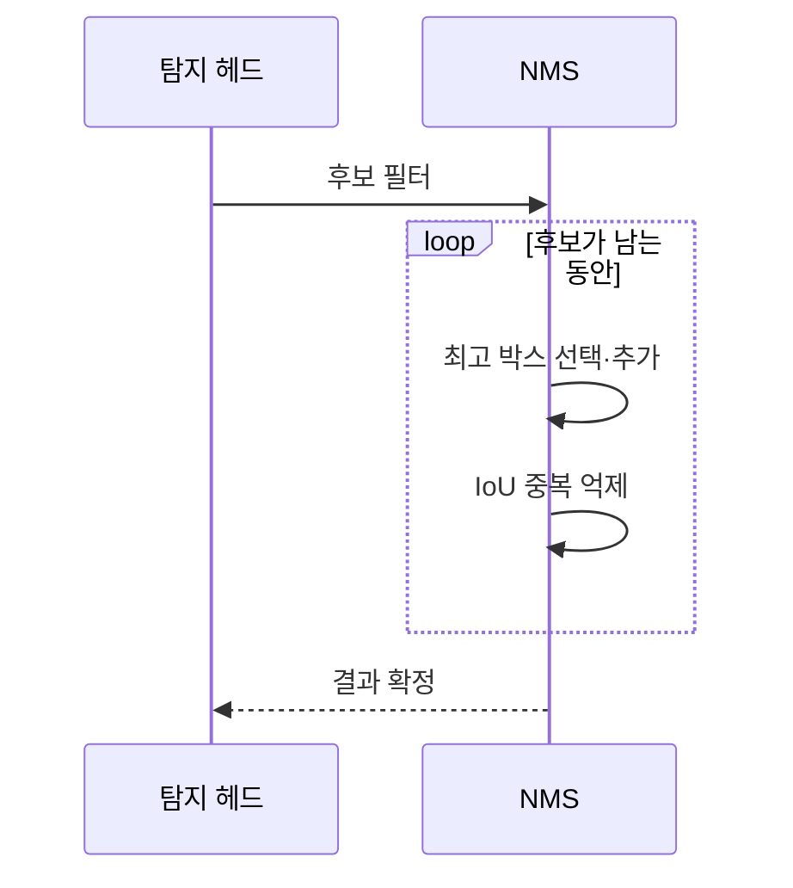

---
sidebar:
  order: 55
  label: "055. 객체 탐지 — YOLO·R-CNN (Object Detection)"
  badge:
    text: "기출 · 50%"
    variant: note
title: "객체 탐지 — YOLO·R-CNN (Object Detection)"
date: "2026-07-25T23:25:00+09:00"
tags:
  - "notes-basic-theory"
weight: 55
extra:
  question_no: "055"
  source_status: "기출"
  source_history: "126회"
  priority: 50
  priority_note: "탐지 구조 비교와 현장 적용"
---

## 미리 알고가기

- **객체 탐지(Object Detection)**: 사진 한 장에서 사람 하나하나, 차 한 대 한 대에 사각 테두리를 두르고 그 옆에 이름표를 붙이듯, 각 객체의 위치를 바운딩 박스로 표시하고 클래스까지 함께 예측하는 컴퓨터 비전 기법이다
- **바운딩 박스(Bounding Box)**: 객체를 감싸는 사각형의 좌표로, 탐지 모델이 위치를 표현하는 단위다
- **교집합 대 합집합(Intersection over Union, IoU)**: ‘아이오유’로 읽고 영문 머리글자를 딴 약어이며, 예측 상자와 정답 상자가 겹친 넓이를 두 상자를 합친 넓이로 나눈 비율로 1에 가까울수록 정확히 맞춘 것이다
- **정밀도·재현율(Precision·Recall)**: 정밀도는 탐지했다고 말한 것 중 실제로 맞은 비율이고, 재현율은 실제 객체 중 놓치지 않고 찾아낸 비율로 둘은 대개 반대로 움직인다
- **평균 정밀도(Average Precision, AP)**: ‘에이피’로 읽고 영문 머리글자를 딴 약어이며, 재현율을 올려 갈 때 정밀도가 어떻게 떨어지는지를 한 클래스에 대해 하나의 값으로 종합한 탐지 정확도다
- **평균 정밀도 평균(mean Average Precision, mAP)**: ‘엠에이피’로 읽고 클래스별 AP를 다시 평균했다는 뜻의 표기이며, 여러 클래스를 아우른 탐지 모델의 대표 정확도 지표다
- **비최댓값 억제(Non-Maximum Suppression, NMS)**: ‘엔엠에스’로 읽고 영문 머리글자를 딴 약어이며, 한 객체에 겹쳐 나온 상자 중 점수가 가장 높은 것만 남기고 많이 겹치는 나머지를 지우는 일을 되풀이하는 후처리다
- **영역 기반 합성곱 신경망(Region-based Convolutional Neural Network, R-CNN)**: ‘알씨엔엔’으로 읽고 영역과 합성곱 신경망의 영문 약어를 결합한 이름이며, 먼저 객체가 있을 법한 영역을 추려 낸 뒤 그 영역만 다시 분류·정밀화하는 2단계 탐지 모델이다
- **한 번만 보기(You Only Look Once, YOLO)**: ‘욜로’로 읽고 영문 문장의 머리글자를 딴 이름이며, 영역을 따로 추리지 않고 전체 특징 맵의 격자마다 위치와 클래스를 한 번에 예측하는 1단계 탐지 모델이다
- **백본·넥·탐지 헤드(Backbone·Neck·Detection Head)**: 백본은 이미지에서 윤곽·질감 같은 특징을 뽑는 앞쪽 신경망, 넥은 여러 해상도의 특징을 섞어 주는 중간부, 탐지 헤드는 그 특징에서 상자와 클래스를 실제로 뱉는 마지막 모듈이다
- **객체성(Objectness)**: 그 자리에 종류를 가리지 않고 어떤 객체라도 있을 가능성을 나타내는 점수로, 배경을 먼저 걸러 내는 데 쓰인다
- **특징 피라미드(Feature Pyramid)**: 크게 축소한 특징 맵과 덜 축소한 특징 맵을 층층이 쌓아 결합한 구조로, 화면에서 점만 한 객체와 화면을 가득 채운 객체를 각각 다른 층에서 찾게 해 준다
- **클래스 불균형(Class Imbalance)**: 격자 대부분이 배경이라 배경 표본이 객체 표본보다 압도적으로 많은 상태로, 모델이 배경만 잘 맞히는 쪽으로 치우치게 만든다
- **양자화(Quantization)**: 가중치와 연산을 낮은 수치 정밀도로 바꿔 모델 크기와 연산량을 줄이는 경량화 기법
- **엣지 기기(Edge Device)**: 카메라 옆 소형 연산 장치처럼 데이터가 생기는 현장에서 제한된 전력·메모리로 추론을 수행하는 장치
- **추론(Inference)**: 학습을 마친 모델이 새 이미지의 객체 위치와 클래스를 실제로 예측하는 과정

## Ⅰ. 개요

- **정의/개념**: 이미지 속 객체의 **위치·클래스**를 함께 찾는 비전 기법
- **기존 한계**: 이미지 분류는 다중 객체의 **공간 좌표** 산출 불가

### 쉽게 이해하기 (학습용)
- 사진 한 장을 앞에 놓고 사람 하나하나, 차 한 대 한 대에 사각 테두리를 두르고 그 옆에 이름표를 붙여 나가는 작업인데, 어디에 있는지와 무엇인지를 따로가 아니라 한 번에 답해야 한다는 점이 사진 전체에 이름표 하나만 붙이는 이미지 분류와 갈리는 지점이다

## Ⅱ. 특징

- **바운딩 박스** 회귀와 클래스 분류의 동시 수행
- **IoU**·**NMS** 기반 위치 평가와 중복 박스 제거
- **특징 피라미드**를 통한 크기 상이 객체 동시 탐지

### 쉽게 이해하기 (학습용)
- 멀리 있는 사람은 화면에서 점만 하고 앞에 선 사람은 화면을 가득 채우는데 같은 해상도의 특징만 보면 둘 중 하나는 놓치므로, 크게 축소한 특징 맵과 덜 축소한 특징 맵을 층층이 쌓아 두고 크기별로 다른 층에서 찾는다

## Ⅲ. 아키텍처 및 구성요소

| 설계 요소 | 설명 |
|:---|:---|
| 특징 추출기 | **백본·넥**으로 다중 해상도 특징 생성 |
| 탐지 헤드 | 박스 위치·클래스·**객체성** 예측 |
| NMS 후처리 | 점수 미달·**중복 박스** 제거 |

> 요약: 특징 추출·탐지 예측·**NMS**로 **객체 위치** 확정

### 쉽게 이해하기 (학습용)
- 사진에서 윤곽과 질감을 뽑아내는 앞쪽 신경망이 특징 추출기이고 그 위에 격자를 얹어 칸마다 "여기 무언가 있나, 있다면 무엇이고 상자는 어디까지인가"를 답하는 것이 탐지 헤드이며, 한 사람에게 겹쳐 붙은 상자 여러 개를 하나로 줄이는 정리 담당이 NMS다

## Ⅳ. 원리 및 절차 흐름도

| 절차 | 설명 |
|:---|:---|
| 후보 필터 | 예측 중 **점수 임계값** 미만 제거 |
| 최고 박스 선택·추가 | 최고 점수 박스를 **최종 목록**에 추가 |
| IoU 중복 억제 | 선택 박스와 **IoU** 임계 초과 후보 제거 |
| 결과 확정 | 잔여 후보 소진 시 **탐지 목록** 반환 |

> 요약: 점수와 IoU 기준의 반복 **중복 박스** 제거

### 쉽게 이해하기 (학습용)
- 한 사람 주위에 상자가 열 개쯤 겹쳐 나오므로 그중 확신 점수가 가장 높은 하나를 먼저 확정한 뒤 그 상자와 많이 겹치는 나머지를 지우고, 남은 후보에서 다시 최고점을 뽑는 일을 후보가 떨어질 때까지 되풀이한다

## Ⅴ. 종류 및 비교

| 객체 탐지 구조 | 1단계(YOLO 계열) | 2단계(R-CNN 계열) |
|:---|:---|:---|
| 적용 기준 | **실시간 추론**·엣지 자원 제약 | 소형·밀집 객체의 **정밀 검출** |
| 핵심 특징 | 격자별 위치·클래스 **동시 예측** | **영역 제안** 후 분류·위치 정밀화 |
| 한계 | 배경 과다에 따른 **클래스 불균형** | 2단계 순차 처리의 **추론 지연** |

> 요약: **단일 통과** 1단계와 정제형 2단계의 속도·정확도 상충

### 쉽게 이해하기 (학습용)
- 1단계는 사진 위에 격자를 한 번 얹고 칸마다 곧바로 상자와 이름을 뱉어 내 빠른 대신 대부분의 칸이 배경이라 배경만 잘 맞히는 쪽으로 치우치기 쉽고, 2단계는 먼저 뭔가 있다 싶은 영역을 추려 낸 뒤 그 영역만 다시 들여다보므로 정확한 대신 두 번 도는 만큼 느리다

## Ⅵ. 실무 사례

1. 보안 영상 소형 객체는 **특징 피라미드**로 탐지
2. 엣지 기기는 경량 모델·**양자화**로 연산량 절감

### 쉽게 이해하기 (학습용)
- 주차장 구석의 사람은 화면에서 몇십 픽셀밖에 안 되어 축소된 특징 맵에서는 흔적조차 남지 않으므로, 덜 축소해 해상도가 살아 있는 층까지 함께 보게 해야 그 작은 흔적이 상자로 잡힌다
- 카메라 옆 소형 장치는 전력과 메모리가 정해져 있어 큰 모델을 올릴 수 없으므로, 가중치를 낮은 정밀도로 바꿔 모델을 줄이고 그만큼 곱셈 연산도 가볍게 만들어 현장에서 바로 추론하게 한다

## Ⅶ. 결론

- **실시간**·엣지 제약은 YOLO, **mAP** 우선은 R-CNN

### 쉽게 이해하기 (학습용)
- 초당 몇십 장을 넘겨야 하거나 카메라 옆 작은 장치에서 돌려야 하면 한 번에 답을 내는 YOLO로 가고, 처리 시간에 여유가 있으면서 작고 겹친 객체까지 놓치면 안 되는 검사 공정에서는 두 번 들여다보는 R-CNN을 쓴다
