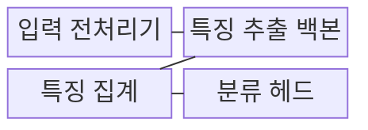
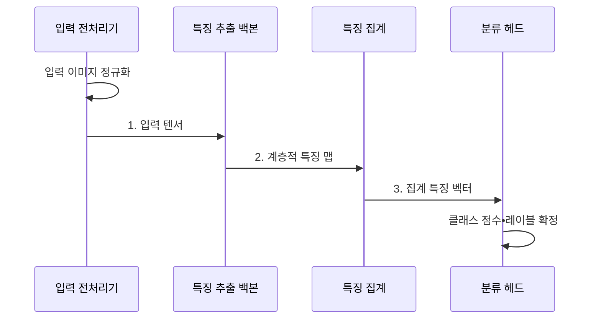

---
sidebar:
  order: 56
  label: "056. 이미지 분류: ResNet•VGG•EfficientNet(Image Classification)"
  badge:
    text: "기출 • 30%"
    variant: note
title: "이미지 분류: ResNet•VGG•EfficientNet(Image Classification)"
date: "2026-08-04T09:53:42+09:00"
tags:
  - "notes-basic-theory"
weight: 56
extra:
  question_no: "056"
  source_status: "기출"
  source_history: "120회"
  priority: 30
  priority_note: "합성곱 신경망 백본 비교 우선"
---

## Ⅰ. 개요

핵심 용어

- **이미지 분류**: 이미지 전체가 어느 클래스에 속하는지 점수와 범주를 예측하는 기법
- **합성곱 신경망(Convolutional Neural Network, CNN)**: 공유 필터로 이미지의 국소 특징을 추출하는 신경망
- **클래스별 점수**: 이미지가 각 범주에 속할 가능성을 모델이 수치화한 출력
- **컴퓨터 비전(Computer Vision)**: 이미지와 영상에서 객체•장면 정보를 분석하는 기술 분야

- 정의/개념: **이미지 분류** 는 합성곱 신경망 등으로 이미지 전체의 클래스별 점수를 산출해 범주를 판정하는 **컴퓨터 비전 기법**
- 배경/필요성: 수작업 판정은 대량 이미지의 **일관성•처리량 제약**

#### 한줄 요약

- 검사대가 사진의 선•질감•형태를 차례로 읽고 점수가 가장 높은 이름표를 붙이는 장면이다.

## Ⅱ. 특징

핵심 용어

- **계층적 특징**: 얕은 층의 선•질감부터 깊은 층의 사물 형태까지 단계적으로 학습한 표현
- **단일 레이블(Single-label)**: 이미지마다 하나의 클래스를 판정하는 방식
- **다중 레이블(Multi-label)**: 이미지마다 여러 클래스를 판정하는 방식
- **촬영 분포**: 조명•각도•배경 등 입력 이미지가 생성되는 조건의 분포
- **해상도(Resolution)**: 이미지를 구성하는 가로•세로 픽셀 수
- **정확도 의존성**: 입력 해상도나 촬영 조건 변화에 따라 분류 성능이 달라지는 성질

- 저수준 질감부터 고수준 의미까지의 **계층적 특징** 학습
- 클래스별 **점수** 에 기반한 **단일•다중 레이블** 판정
- 입력 **해상도•촬영 분포** 변화에 따른 **정확도 의존성**

#### 한줄 요약

- 앞 렌즈가 선과 질감을 찾고 뒤 렌즈가 사물 모양으로 조립하며 큰 렌즈일수록 시계가 늦어지는 장면이다.

## Ⅲ. 구조 및 구성요소

핵심 용어

- **백본**: 입력 이미지에서 특징 맵을 추출하는 신경망 본체
- **전역 평균 풀링(Global Average Pooling, GAP)**: 채널별 특징 맵의 평균으로 공간 축을 줄이는 집계 방식
- **분류 헤드**: 집계된 특징을 클래스별 점수로 변환하는 출력 모듈
- **입력 텐서**: 높이•너비•채널•배치 축으로 표현한 이미지 수치 배열
- **합성곱(Convolution)**: 공유 필터를 이미지 위치마다 적용해 국소 특징 맵을 만드는 연산

| 구성요소 | 책임 |
|:---|:---|
| 입력 전처리기 | 해상도•정규화•색상 순서를 맞춘 **입력 텐서** 생성 |
| 특징 추출 백본 | **합성곱**으로 계층적 특징 맵 생성 |
| 특징 집계 | **전역 평균 풀링(GAP)** 기반 고정 길이 벡터 변환 |
| 분류 헤드 | **클래스별 점수** 와 최종 레이블 판정 산출 |

#### 한줄 요약
- 사진 세척대가 크기와 색을 맞추고 특징 렌즈와 집계 깔때기를 지나 이름표 점수판에 도착하는 장면이다.

## Ⅳ. 흐름도

핵심 용어

- **특징 벡터**: 공간 특징 맵을 분류에 사용할 고정 길이 값으로 요약한 표현
- **정규화(Normalization)**: 픽셀값의 중심과 척도를 학습 때 기준에 맞추는 전처리
- **계층적 특징 맵**: 얕은 질감부터 깊은 의미까지 단계별로 추출한 공간 표현

**동작 원리**

- **1. 입력 텐서**: 해상도•분포•색상 순서를 맞춘 배열
- **2. 계층적 특징 맵**: 질감부터 의미까지 추출한 표현
- **3. 집계 특징 벡터**: 공간 축을 줄인 고정 길이 표현

#### 한줄 요약

- 사진이 특징 지도와 압축 막대를 거쳐 클래스 점수판의 가장 높은 이름표로 나오는 장면이다.

## Ⅴ. 종류 및 비교

핵심 용어

- **시각 기하 그룹망(Visual Geometry Group Network, VGG)**: 작은 합성곱 필터를 반복 적층한 백본
- **잔차 신경망(Residual Network, ResNet)**: 잔차 연결로 깊은 신경망의 학습 신호를 보존하는 백본
- **EfficientNet**: 깊이•폭•해상도를 함께 확장해 정확도와 연산량의 균형을 맞춘 백본
- **전이 학습(Transfer Learning)**: 사전 학습한 백본의 특징을 새 분류 과제에 재사용하는 방식
- **컴파운드 스케일링**: 네트워크 깊이•폭•입력 해상도를 정해진 비율로 함께 확장하는 방법
- **깊이별 분리 합성곱(Depthwise Separable Convolution)**: 채널별 공간 합성곱과 채널 결합을 나누어 연산량을 줄이는 방식

| CNN 백본 | VGG | ResNet | EfficientNet |
|:---|:---|:---|:---|
| 적용 기준 | 단순한 구조의 **특징 추출기** 가 필요한 경우 | 깊은 백본의 **전이 학습** 이 필요한 경우 | 제한된 **연산 횟수** 에서 정확도를 높이는 경우 |
| 핵심 특징 | 합성곱의 단순 **반복 적층** | **잔차 연결** 로 학습 신호 보존 | **컴파운드 스케일링** 으로 깊이•폭•해상도 확장 |
| 한계 | 반복 합성곱의 **연산량•메모리** 증가 | 깊은 층 **활성값 메모리** 점유 | 장치별 **깊이별 분리 합성곱** 효율 편차 |

> 요약: 안정성은 **ResNet**, 효율은 **EfficientNet**

#### 한줄 요약

- VGG는 벽돌을 계속 쌓고, ResNet은 입력을 뒤 계층의 출력에 더하는 다리를 놓으며, EfficientNet은 높이•폭•화면을 함께 키우는 장면이다.

## Ⅵ. 실무 고려사항 및 대책

핵심 용어

- **입력 전처리**: 학습 때와 같은 해상도•픽셀 분포•색상 순서로 이미지를 변환하는 절차
- **클래스 가중치**: 클래스별 오류 비용을 손실에 다르게 반영하는 값
- **재현율**: 실제 양성 표본 중 모델이 양성으로 찾아낸 비율
- **양자화**: 수치 정밀도를 낮춰 모델 크기와 연산 비용을 줄이는 기법
- **적녹청(Red Green Blue, RGB)**: 이미지 채널을 적색•녹색•청색 순으로 배열하는 규칙
- **청녹적(Blue Green Red, BGR)**: 이미지 채널을 청색•녹색•적색 순으로 배열하는 규칙
- **분포 모니터링**: 운영 이미지의 조명•각도•배경 분포 변화를 감시하는 작업
- **재학습(Retraining)**: 새 촬영 환경의 데이터로 모델을 다시 학습하는 작업

| 문제 | 대책 | 효과 |
|:---|:---|:---|
| 학습•추론 이미지 **전처리 불일치** | 해상도•정규화•**색상 순서 규칙 고정** | 동일 입력의 **예측 편차 제거** |
| 위험 클래스 **미탐 증가** | 클래스 가중치•임계값 조정과 **재현율 기준** 적용 | **고비용 미탐** 감소 |
| 촬영 환경 변화로 **정확도 저하** | 조건별 데이터 증강•**분포 모니터링**•재학습 | 촬영 조건별 **정확도 편차 감소** |
| 엣지 장치의 **지연•메모리 초과** | 경량 백본•**양자화**•입력 해상도 조정 | 목표 **추론 시간•메모리 용량** 충족 |

#### 한줄 요약

- 불량 사진을 놓칠 때 불량 추의 무게를 올리고 지연 시계와 메모리 눈금을 넘지 않는지 보는 장면이다.

## Ⅶ. 결론

핵심 용어

- **심층 안정성**: 계층이 깊어져도 학습 신호가 소실되지 않고 수렴하는 성질
- **연산 효율**: 제한된 계산량과 메모리로 필요한 정확도와 속도를 달성하는 정도

- 심층 안정은 **ResNet**, 효율은 **EfficientNet** 선택

#### 한줄 요약

- 깊은 안정성이 필요하면 ResNet 다리, 작은 장치면 EfficientNet 경량 상자를 고르는 장면이다.
