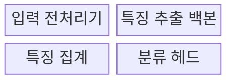
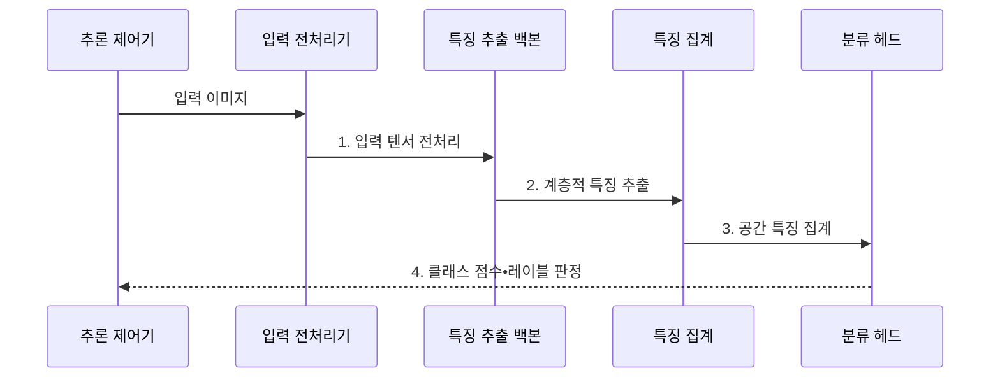

---
sidebar:
  order: 56
  label: "056. 이미지 분류: ResNet•VGG•EfficientNet(Image Classification)"
  badge:
    text: "기출 • 30%"
    variant: note
title: "이미지 분류: ResNet•VGG•EfficientNet(Image Classification)"
date: "2026-07-29T00:00:00+09:00"
tags:
  - "notes-basic-theory"
weight: 56
extra:
  question_no: "056"
  source_status: "기출"
  source_history: "120회"
  priority: 30
  priority_note: "합성곱 신경망 백본 비교 우선"
---

## 미리 알고가기

- **이미지 분류(Image Classification)**: 이미지 전체의 클래스 점수•범주를 예측하는 비전 기법
- **합성곱 신경망(Convolutional Neural Network, CNN)**: 공유 필터로 국소 특징을 추출하는 신경망
- **비주얼 지오메트리 그룹(Visual Geometry Group, VGG) 신경망**: 작은 $3 \times 3$ 합성곱 필터를 깊게 적층하여 계층적 이미지 특징을 추출하는 합성곱 신경망
- **잔차 신경망(Residual Network, ResNet)**: 앞 계층의 입력을 뒤 계층 출력에 더하는 잔차 연결로 깊은 신경망의 학습 신호를 보존하는 백본이다
- **EfficientNet**: 깊이•폭•해상도를 정해진 비율로 함께 확장하여 정확도와 연산량의 균형을 맞춘 합성곱 신경망 백본이다
- **백본(Backbone)**: 이미지 특징을 추출하는 신경망 본체
- **특징 맵(Feature Map)**: 필터가 감지한 위치별 패턴 응답값
- **단일•다중 레이블(Single•Multi Label)**: 이미지당 하나 또는 여러 클래스를 판정하는 방식
- **잔차 연결(Residual Connection)**: 계층 입력을 뒤 계층 출력에 더해 깊은 신경망의 학습 신호를 보존하는 연결
- **깊이•폭•해상도(Depth•Width•Resolution)**: 깊이는 계층 수, 폭은 채널 수, 해상도는 입력 이미지의 공간 크기
- **특징 집계(Feature Aggregation)**: 공간 특징 맵을 분류에 쓰는 고정 길이 벡터로 요약하는 연산
- **전역 평균 풀링(Global Average Pooling, GAP)**: 채널별 특징 맵 평균으로 공간 축을 줄이는 집계 방식
- **분류 헤드(Classification Head)**: 집계된 특징을 클래스별 점수로 변환하는 출력 모듈
- **클래스 점수(Class Score)**: 입력이 각 클래스에 속할 가능성을 비교하도록 분류 헤드가 산출하는 값
- **컴파운드 스케일링(Compound Scaling)**: 깊이•폭•해상도를 함께 조정하는 확장 방식
- **깊이별 분리 합성곱(Depthwise Separable Convolution)**: 공간 연산과 채널 결합을 분리해 연산량을 줄인 합성곱
- **양자화(Quantization)**: 수치 정밀도를 낮춰 모델 크기•연산 비용 절감
- **클래스 가중치(Class Weight)**: 놓치거나 잘못 분류한 클래스별 비용을 손실에 다르게 반영하는 값
- **미탐(False Negative)**: 실제로는 불량인 이미지를 정상으로 판정해 걸러 내지 못한 오류이며, 이 오류의 비용이 크면 해당 클래스의 가중치를 올림
- **재현율(Recall)**: 실제 양성 표본 중 모델이 양성으로 찾아낸 비율
- **엣지 기기(Edge Device)**: 데이터가 발생하는 현장 가까이에서 제한된 자원으로 추론하는 장치
- **입력 전처리(Input Preprocessing)**: 학습 때와 같은 해상도•픽셀 분포•색상 채널 순서로 이미지를 변환하는 절차다
- **입력 텐서(Input Tensor)**: 전처리된 이미지의 높이•너비•채널•배치 축을 수치 배열로 표현한 모델 입력이다
- **전이 학습(Transfer Learning)**: 대규모 데이터에서 학습한 백본 특징을 새 분류 과제에 재사용하는 학습 방식이다
- **활성값 메모리(Activation Memory)**: 순전파 중 각 계층이 만든 중간 특징 맵을 저장하는 데 필요한 메모리

## Ⅰ. 개요

- 정의/개념: **합성곱 신경망**으로 **클래스 점수**를 산출하는 기법
- 배경/필요성: 대량 이미지의 **일관된 클래스 판정** 자동화

### 쉽게 이해하기 (학습용)

- 합성곱 신경망은 사진을 특징으로 요약하고 클래스별 점수를 매겨 가장 알맞은 이름표를 붙인다.

## Ⅱ. 특징

- 저수준 질감부터 고수준 의미까지의 **계층적 특징** 학습
- 클래스별 **점수**에 기반한 **단일•다중 레이블** 판정
- 입력 **해상도**•모델 규모에 따른 **정확도**와 지연의 상충

### 쉽게 이해하기 (학습용)

- 얕은 계층의 선•질감을 깊은 계층이 사물 형태로 결합하며, 규모가 커질수록 처리 비용도 증가한다.

## Ⅲ. 구조 및 구성요소

| 구성요소 | 책임 |
|:---|:---|
| 입력 전처리기 | 해상도•정규화•색상 순서를 맞춘 **입력 텐서** 생성 |
| 특징 추출 백본 | **합성곱**으로 계층적 특징 맵 생성 |
| 특징 집계 | 공간 특징 맵을 **고정 길이 벡터**로 변환 |
| 분류 헤드 | **클래스별 점수**와 최종 레이블 판정 산출 |

### 쉽게 이해하기 (학습용)
- 전처리기와 백본이 입력을 특징으로 바꾸고 집계 계층과 분류 헤드가 클래스 점수를 만든다.

## Ⅳ. 흐름도

**동작 원리**

- **1. 입력 텐서 전처리**: 해상도•분포•색상 순서 정렬
- **2. 계층적 특징 추출**: 질감부터 의미까지 특징 생성
- **3. 공간 특징 집계**: 고정 길이 벡터 축약
- **4. 클래스 점수•레이블 판정**: 클래스별 점수•레이블 산출

### 쉽게 이해하기 (학습용)

- 백본이 공간 특징을 추출하고 집계 계층이 고정 길이 벡터로 줄이면 분류 헤드가 클래스별 점수를 산출한다.

## Ⅴ. 종류 및 비교

| CNN 백본 | VGG | ResNet | EfficientNet |
|:---|:---|:---|:---|
| 적용 기준 | 단순한 구조의 **특징 추출기**가 필요한 경우 | 깊은 백본의 **전이 학습**이 필요한 경우 | 제한된 **연산 횟수**에서 정확도를 높이는 경우 |
| 핵심 특징 | 합성곱의 단순 **반복 적층** | **잔차 연결**로 학습 신호 우회 | **컴파운드 스케일링**으로 깊이•폭•해상도 확장 |
| 한계 | 반복 합성곱의 **연산량•메모리** 증가 | 깊은 층 **활성값 메모리** 점유 | 장치별 **깊이별 분리 합성곱** 효율 편차 |

> 요약: 안정성은 **ResNet**, 효율은 **EfficientNet**

### 쉽게 이해하기 (학습용)

- VGG는 단순하지만 무겁고, ResNet은 잔차 연결로 깊은 망을 안정적으로 학습하며, EfficientNet은 깊이•폭•해상도를 함께 확장한다.

## Ⅵ. 실무 고려사항 및 대책

| 고려사항 | 대책 | 효과 |
|:---|:---|:---|
| 학습•추론 이미지 **전처리 불일치** | 해상도•정규화•**색상 순서 규칙 고정** | 동일 입력의 **예측 편차 제거** |
| 위험 클래스 **미탐 증가** | 클래스 가중치•임계값 조정과 **재현율 기준** 적용 | **고비용 미탐** 감소 |
| 촬영 환경 변화로 **정확도 저하** | 조건별 데이터 증강•**분포 모니터링**•재학습 | 촬영 조건별 **정확도 편차 감소** |
| 엣지 장치의 **지연•메모리 초과** | 경량 백본•**양자화**•입력 해상도 조정 | 목표 **추론 시간•메모리 용량** 충족 |

### 쉽게 이해하기 (학습용)

- 불량 클래스 가중치와 판정 임계값을 조정해 허용 추론 시간과 메모리 용량 안에서 미탐을 줄인다.

## Ⅶ. 결론

- **연산 횟수•메모리•재현율** 기반 백본 선택

### 쉽게 이해하기 (학습용)

- 허용 추론 시간과 메모리 용량, 위험 클래스 재현율을 기준으로 백본•입력 해상도•판정 임계값을 함께 선택한다.
