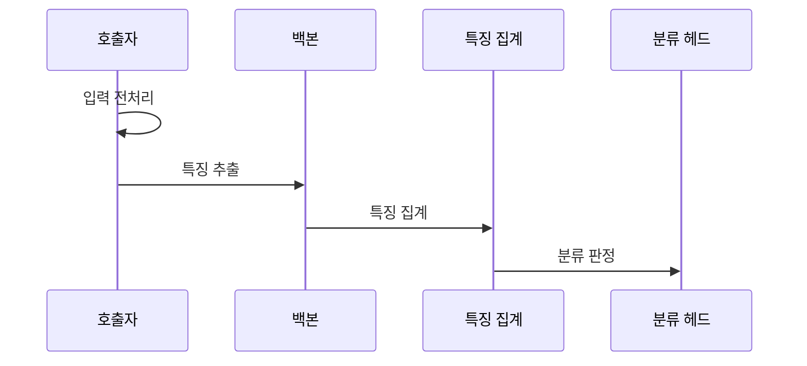

---
sidebar:
  order: 56
  label: "056. 이미지 분류 — ResNet·VGG·EfficientNet(Image Classification)"
  badge:
    text: "기출 · 30%"
    variant: note
title: "이미지 분류 — ResNet·VGG·EfficientNet(Image Classification)"
date: "2026-07-26T22:16:20+09:00"
tags:
  - "notes-basic-theory"
weight: 56
extra:
  question_no: "056"
  source_status: "기출"
  source_history: "120회"
  priority: 30
  priority_note: "합성곱 신경망 백본 비교 우선"
---

## 미리 알고가기

- **이미지 분류(Image Classification)**: 컨베이어에 사진을 한 장 올리면 반대편에서 ‘불량’ 같은 이름표 한 장이 붙어 나오는 장면처럼, 이미지 전체의 특징을 요약해 클래스별 점수와 최종 이름표를 예측하는 컴퓨터 비전 기법
- **합성곱 신경망(Convolutional Neural Network, CNN)**: CNN은 ‘씨엔엔’으로 읽고 영문 머리글자를 딴 약어이며, 공유 필터로 위치별 이미지 특징을 추출하는 신경망
- **비주얼 지오메트리 그룹(Visual Geometry Group, VGG) 신경망**: VGG는 ‘브이지지’로 읽고 제안 연구 그룹의 영문 머리글자를 딴 이름이며, $3 \times 3$은 ‘삼 곱하기 삼’으로 읽고 필터의 세로·가로 크기를 곱셈 기호로 구분한 표기로 작은 합성곱을 순차 적층해 특징을 추출
- **잔차 신경망(Residual Network, ResNet)**: ResNet은 ‘레스넷’으로 읽고 잔차를 뜻하는 Residual의 앞 글자를 딴 이름이며, 앞 계층의 입력을 뒤 계층 출력에 그대로 더해 층이 깊어져도 학습 신호가 옅어지지 않게 만든 백본
- **EfficientNet**: 깊이·폭·해상도를 따로 늘리지 않고 정해진 비율로 함께 늘려 같은 연산량에서 더 높은 정확도를 얻도록 설계한 백본
- **백본(Backbone)**: 이미지 특징을 추출하는 신경망 본체
- **특징 맵(Feature Map)**: 필터가 감지한 위치별 패턴 응답값
- **단일·다중 레이블(Single·Multi Label)**: 단일 레이블은 한 이미지에 이름표 하나만 붙여 최고 점수 클래스를 고르고, 다중 레이블은 클래스마다 임계값을 넘는지 따로 판정해 여러 이름표를 동시에 붙임
- **잔차 연결(Residual Connection)**: 계층 입력을 뒤 계층 출력에 더해 깊은 신경망의 학습 신호를 보존하는 연결
- **깊이·폭·해상도(Depth·Width·Resolution)**: 깊이는 계층 수, 폭은 채널 수, 해상도는 입력 이미지의 공간 크기
- **특징 집계(Feature Aggregation)**: 공간 특징 맵을 분류에 쓰는 고정 길이 벡터로 요약하는 연산
- **전역 평균 풀링(Global Average Pooling, GAP)**: GAP은 ‘지에이피’로 읽고 영문 머리글자를 딴 약어이며, 채널마다 특징 맵 전체의 평균 하나만 남겨 세로·가로 공간 축을 없애는 대표적인 특징 집계 방식
- **분류 헤드(Classification Head)**: 집계된 특징을 클래스별 점수로 변환하는 출력 모듈
- **컴파운드 스케일링(Compound Scaling)**: 깊이·폭·해상도를 함께 조정하는 확장 방식
- **깊이별 분리 합성곱(Depthwise Separable Convolution)**: 하나의 합성곱을 채널별 공간 연산과 채널 결합 연산 둘로 쪼개 곱셈 횟수를 크게 줄인 구조이며, 이론 연산량은 줄어도 연산기가 한 번에 처리할 덩어리가 잘게 나뉘어 실제 장비에서는 기대만큼 빨라지지 않는다
- **양자화(Quantization)**: 수치 정밀도를 낮춰 모델 크기·연산 비용 절감
- **클래스 가중치(Class Weight)**: 놓치거나 잘못 분류한 클래스별 비용을 손실에 다르게 반영하는 값
- **미탐(False Negative)**: 실제로는 불량인 이미지를 정상으로 판정해 걸러 내지 못한 오류이며, 이 오류의 비용이 크면 해당 클래스의 가중치를 올림
- **재현율(Recall)**: 실제 양성 표본 중 모델이 양성으로 찾아낸 비율
- **엣지 기기(Edge Device)**: 데이터가 발생하는 현장 가까이에서 제한된 자원으로 추론하는 장치

## Ⅰ. 개요

- **정의/개념**: **합성곱 신경망**으로 특징을 요약해 **클래스별 점수**를 산출하는 기법
- **기존 한계**: 사람 검수는 대규모 영상의 **판정 일관성**·**처리량** 미달

### 쉽게 이해하기 (학습용)

- 검수원이 사진을 한 장씩 눈으로 훑는 대신, 합성곱 신경망이 사진을 숫자 특징으로 요약하고 이름표별 점수를 매겨 가장 높은 점수의 이름표를 붙인다

## Ⅱ. 특징

- 저수준 질감부터 고수준 의미까지의 **계층적 특징** 학습
- 클래스별 **확률 분포**에 기반한 **단일·다중 레이블** 판정
- 입력 **해상도**·모델 규모에 따른 **정확도**와 지연의 상충

### 쉽게 이해하기 (학습용)

- 답안이 특징에 `계층적`이라는 말을 넣은 이유는, 첫 층이 찾는 것은 선이나 얼룩 같은 조각뿐이고 그 조각들이 다음 층에서 눈·바퀴로 묶이며 다시 얼굴·자동차로 묶이는 순서가 있어서, 층을 늘린다는 말이 곧 더 큰 의미 단위를 본다는 뜻이 되기 때문이며, 이 성질 때문에 해상도와 모델 규모를 키우면 정확도와 처리 비용이 함께 올라간다

## Ⅲ. 아키텍처 및 구성요소

| 설계 요소 | 설명 |
|:---|:---|
| 특징 추출 백본 | **합성곱**으로 계층적 **특징 맵** 생성 |
| 특징 집계 | 특징 맵을 **고정 길이 벡터**로 변환 |
| 분류 헤드 | **클래스별 점수**와 최종 판정 산출 |

> 요약: **백본** 특징을 집계해 클래스별 판정 산출

### 쉽게 이해하기 (학습용)

- 백본이 사진 곳곳에서 무늬 단서를 잔뜩 적어 두면 특징 집계가 그 메모를 한 장짜리 요약표로 줄이고, 분류 헤드는 그 요약표만 보고 이름표별 점수를 매긴다

## Ⅳ. 원리 및 절차 흐름도

| 절차 | 설명 |
|:---|:---|
| 입력 전처리 | 학습 조건에 맞춘 **해상도**·픽셀 범위 **정규화** |
| 특징 추출 | 얕은 층부터 깊은 층까지 **특징 맵** 생성 |
| 특징 집계 | **전역 평균 풀링** 등으로 공간 차원 제거 |
| 분류 판정 | **클래스별 점수**의 최댓값·임계 판정 |

> 요약: 입력을 맞추고 **특징 점수**로 **클래스 판정**

### 쉽게 이해하기 (학습용)

- 학습할 때 쓰던 사진 규격에 크기와 밝기를 먼저 맞춰야 백본이 배운 대로 무늬를 읽고, 그렇게 뽑은 점수표에서 가장 높은 칸의 이름표를 답으로 고른다

## Ⅴ. 종류 및 비교

| CNN 백본 | VGG | ResNet | EfficientNet |
|:---|:---|:---|:---|
| 적용 기준 | 16층 규모의 단순 **특징 추출기** | 50층 이상 심층 **전이학습** 기반 | **연산량 예산**이 고정된 배포 환경 |
| 핵심 특징 | 합성곱의 단순 **반복 적층** | **잔차 연결**로 학습 신호 우회 | **컴파운드 스케일링**으로 깊이·폭·해상도 확장 |
| 한계 | **기울기 소실**로 19층 부근 깊이 한계 | 깊은 층 **활성값 메모리** 점유 | **깊이별 분리 합성곱**의 낮은 연산 효율 |

> 요약: 깊은 망의 학습 안정성은 **ResNet**, 연산 효율은 **EfficientNet**

### 쉽게 이해하기 (학습용)

- 같은 블록만 계속 쌓는 VGG는 층을 늘릴수록 가중치 덩치가 불어나고, ResNet은 앞 층 입력을 뒤로 그대로 넘기는 지름길을 둬 깊어져도 학습 신호가 끊기지 않으며, EfficientNet은 층수·채널·사진 크기를 정해진 비율로 같이 늘려 주어진 연산량 안에서 정확도를 끌어올린다

## Ⅵ. 실무 사례

1. 제조 외관 검사는 **미탐 비용** 기준 **클래스 가중치** 상향
2. 엣지 기기는 EfficientNet **양자화**로 연산 비용 절감

### 쉽게 이해하기 (학습용)

- 제조 라인에서 불량품 하나를 놓치는 손실이 정상품을 불량으로 오판하는 손실보다 크므로, 불량 클래스의 오답에만 더 큰 벌점을 줘 모델이 불량 쪽으로 민감해지게 만든다
- 엣지 장비는 저장 공간과 연산기가 작으므로, 가중치를 소수점 대신 정수처럼 거친 값으로 바꿔 모델 크기와 곱셈 비용을 함께 줄인다

## Ⅶ. 결론

- 정확도·자원 제약으로 **백본** 선택, 위험 클래스는 **재현율** 우선

### 쉽게 이해하기 (학습용)

- 서버 연산 자원이 넉넉하면 무거운 백본을, 현장 장비면 가벼운 백본을 고르되 불량처럼 놓쳤을 때 손해가 큰 클래스는 조금 의심스러운 사진도 걸러 내도록 판정 문턱을 낮춘다
