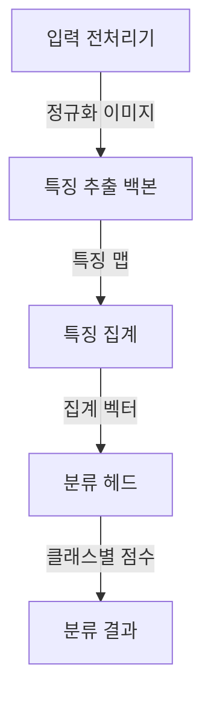
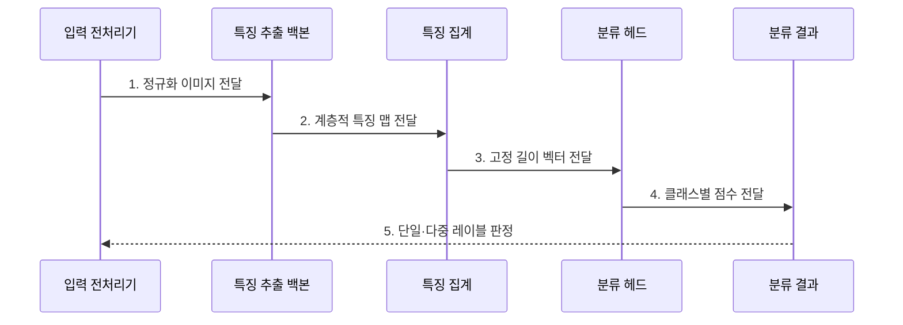

---
sidebar:
  order: 56
  label: "056. 이미지 분류 — ResNet·VGG·EfficientNet(Image Classification)"
  badge:
    text: "기출 · 30%"
    variant: note
title: "이미지 분류 — ResNet·VGG·EfficientNet(Image Classification)"
date: "2026-07-28T17:55:00+09:00"
tags:
  - "notes-basic-theory"
weight: 56
extra:
  question_no: "056"
  source_status: "기출"
  source_history: "120회"
  priority: 30
  priority_note: "합성곱 신경망 백본 비교 우선"
---

## 미리 알고가기

- **이미지 분류(Image Classification)**: 이미지 전체의 특징을 추출·집계하여 클래스별 확률과 최종 범주를 예측하는 컴퓨터 비전 기법
- **합성곱 신경망(Convolutional Neural Network, CNN)**: 동일한 필터를 입력의 각 위치에 적용하여 이미지의 국소 특징을 추출하는 신경망
- **비주얼 지오메트리 그룹(Visual Geometry Group, VGG) 신경망**: 작은 $3 \times 3$ 합성곱 필터를 깊게 적층하여 계층적 이미지 특징을 추출하는 합성곱 신경망
- **잔차 신경망(Residual Network, ResNet)**: 앞 계층의 입력을 뒤 계층 출력에 더하는 잔차 연결로 깊은 신경망의 학습 신호를 보존하는 백본이다
- **EfficientNet**: 깊이·폭·해상도를 정해진 비율로 함께 확장하여 정확도와 연산량의 균형을 맞춘 합성곱 신경망 백본이다
- **백본(Backbone)**: 이미지 특징을 추출하는 신경망 본체
- **특징 맵(Feature Map)**: 필터가 감지한 위치별 패턴 응답값
- **단일·다중 레이블(Single·Multi Label)**: 단일 레이블은 한 이미지에 이름표 하나만 붙여 최고 점수 클래스를 고르고, 다중 레이블은 클래스마다 임계값을 넘는지 따로 판정해 여러 이름표를 동시에 붙임
- **잔차 연결(Residual Connection)**: 계층 입력을 뒤 계층 출력에 더해 깊은 신경망의 학습 신호를 보존하는 연결
- **깊이·폭·해상도(Depth·Width·Resolution)**: 깊이는 계층 수, 폭은 채널 수, 해상도는 입력 이미지의 공간 크기
- **특징 집계(Feature Aggregation)**: 공간 특징 맵을 분류에 쓰는 고정 길이 벡터로 요약하는 연산
- **전역 평균 풀링(Global Average Pooling, GAP)**: 각 채널의 특징 맵 전체를 평균하여 공간 축을 하나의 값으로 축약하는 특징 집계 방식
- **분류 헤드(Classification Head)**: 집계된 특징을 클래스별 점수로 변환하는 출력 모듈
- **컴파운드 스케일링(Compound Scaling)**: 깊이·폭·해상도를 함께 조정하는 확장 방식
- **깊이별 분리 합성곱(Depthwise Separable Convolution)**: 하나의 합성곱을 채널별 공간 연산과 채널 결합 연산 둘로 쪼개 곱셈 횟수를 크게 줄인 구조이며, 이론 연산량은 줄어도 연산기가 한 번에 처리할 덩어리가 잘게 나뉘어 실제 장비에서는 기대만큼 빨라지지 않는다
- **양자화(Quantization)**: 수치 정밀도를 낮춰 모델 크기·연산 비용 절감
- **클래스 가중치(Class Weight)**: 놓치거나 잘못 분류한 클래스별 비용을 손실에 다르게 반영하는 값
- **미탐(False Negative)**: 실제로는 불량인 이미지를 정상으로 판정해 걸러 내지 못한 오류이며, 이 오류의 비용이 크면 해당 클래스의 가중치를 올림
- **재현율(Recall)**: 실제 양성 표본 중 모델이 양성으로 찾아낸 비율
- **엣지 기기(Edge Device)**: 데이터가 발생하는 현장 가까이에서 제한된 자원으로 추론하는 장치

## Ⅰ. 개요

- 정의/개념: **합성곱 신경망**으로 **클래스 점수**를 산출하는 기법
- 기존 한계: 사람 검수는 대규모 영상의 **판정 일관성**·**처리량** 미달

### 쉽게 이해하기 (학습용)

- 검수원이 사진을 한 장씩 눈으로 훑는 대신, 합성곱 신경망이 사진을 숫자 특징으로 요약하고 이름표별 점수를 매겨 가장 높은 점수의 이름표를 붙인다

## Ⅱ. 특징

- 저수준 질감부터 고수준 의미까지의 **계층적 특징** 학습
- 클래스별 **점수**에 기반한 **단일·다중 레이블** 판정
- 입력 **해상도**·모델 규모에 따른 **정확도**와 지연의 상충

### 쉽게 이해하기 (학습용)

- 얕은 계층은 선·질감 같은 국소 패턴을 찾고 깊은 계층은 이를 사물의 형태로 조합하며, 입력 해상도와 모델 규모가 커질수록 정확도와 처리 비용이 함께 증가한다

## Ⅲ. 아키텍처 및 구성요소

| 설계 요소 | 입력·상태 | 역할 |
|:---|:---|:---|
| 특징 추출 백본 | 정규화 이미지 | **합성곱**으로 계층적 특징 맵 생성 |
| 특징 집계 | 공간 특징 맵 | **고정 길이 벡터**로 변환 |
| 분류 헤드 | 집계 벡터 | **클래스별 점수**와 최종 판정 산출 |

> 요약: **백본** 특징을 집계해 클래스별 판정 산출

### 쉽게 이해하기 (학습용)

- 백본이 공간 특징을 추출하고 집계 계층이 고정 길이 벡터로 줄이면 분류 헤드가 클래스별 점수를 산출한다.

## Ⅳ. 종류 및 비교

| CNN 백본 | VGG | ResNet | EfficientNet |
|:---|:---|:---|:---|
| 적용 기준 | 단순한 구조의 **특징 추출기**가 필요한 경우 | 깊은 백본의 **전이 학습**이 필요한 경우 | 제한된 **연산량 예산**에서 정확도를 높이는 경우 |
| 핵심 특징 | 합성곱의 단순 **반복 적층** | **잔차 연결**로 학습 신호 우회 | **컴파운드 스케일링**으로 깊이·폭·해상도 확장 |
| 한계 | 완전연결층 중심의 **파라미터·연산량** 증가 | 깊은 층 **활성값 메모리** 점유 | **깊이별 분리 합성곱**의 낮은 연산 효율 |

> 요약: 깊은 망의 학습 안정성은 **ResNet**, 연산 효율은 **EfficientNet**

### 쉽게 이해하기 (학습용)

- VGG는 단순하지만 무겁고, ResNet은 잔차 연결로 깊은 망을 안정적으로 학습하며, EfficientNet은 깊이·폭·해상도를 함께 확장한다.

## Ⅴ. 실무 고려사항 및 대책

| 실패 징후 | 완화 방안 | 기대 효과 |
|:---|:---|:---|
| 학습·추론 이미지 전처리 불일치 | 해상도·정규화·색상 순서 규칙 고정 | 운영 예측 재현성 확보 |
| 위험 클래스 미탐 증가 | 클래스 가중치·임계값 조정과 재현율 기준 적용 | 고비용 미탐 감소 |
| 촬영 환경 변화로 정확도 저하 | 조건별 데이터 증강·분포 모니터링·재학습 | 현장 변화 강건성 향상 |
| 엣지 장치의 지연·메모리 초과 | 경량 백본·양자화·입력 해상도 조정 | 자원 한도 내 추론 |

### 쉽게 이해하기 (학습용)

- 클래스별 재현율·지연·메모리와 입력 분포를 함께 관리한다. 제조 외관 검사는 불량 미탐 비용이 크므로 불량 클래스 가중치와 판정 임계값을 높인다.

## Ⅵ. 결론

- 자원·위험 클래스 재현율에 맞춰 **분류 모델** 선택

### 쉽게 이해하기 (학습용)

- 자원 예산과 위험 클래스 재현율을 기준으로 백본·입력 해상도·판정 임계값을 함께 선택한다.
