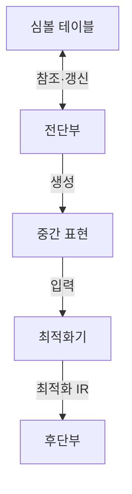

---
sidebar:
  order: 57
  label: "057. 컴파일러 구조 — 어휘·구문·의미 분석 (Compiler Structure)"
  badge:
    text: "미출제 · 50%"
    variant: note
title: "컴파일러 구조 — 어휘·구문·의미 분석 (Compiler Structure)"
date: "2026-07-26T00:38:00+09:00"
tags:
  - "notes-basic-theory"
weight: 57
extra:
  question_no: "057"
  source_status: "미출제"
  source_history: ""
  priority: 50
  priority_note: "전단·후단·실행 방식 통합"
---

## 미리 알고가기

- **컴파일러(Compiler)**: 소스 프로그램의 의미를 보존하며 목적 코드로 변환하는 번역기
- **인터프리터(Interpreter)**: 목적 코드를 미리 만들지 않고 소스를 구문 단위로 읽어 그 자리에서 실행하는 번역·실행기
- **적시 컴파일(Just-In-Time compilation, JIT)**: JIT은 ‘지트’ 또는 ‘제이아이티’로 읽고 ‘필요한 때에 맞춰’라는 뜻의 영문 머리글자를 딴 약어이며, 실행 중 자주 도는 코드만 골라 기계어로 번역해 두고 재사용하는 방식
- **핫 코드(Hot Code)**: 실행 중 호출·반복 횟수가 임계값을 넘어 번역 비용을 들일 가치가 있다고 판정된 코드 영역
- **웜업 구간(Warm-up)**: JIT이 아직 핫 코드를 모아 번역하기 전이라 해석 실행으로 동작해 속도가 느린 실행 초기 구간
- **목적 코드(Object Code)**: 프로세서가 실행하거나 링커가 결합할 수 있도록 컴파일러가 만든 기계 명령 코드
- **토큰(Token)**: 어휘 분석기가 만드는 최소 어휘 단위
- **정규표현식(Regular Expression)**: 토큰 문자 패턴을 정의하는 규칙
- **결정적 유한 오토마타(Deterministic Finite Automaton, DFA)**: DFA는 ‘디에프에이’로 읽고 영문 머리글자를 딴 약어이며, 정규표현식으로 정의한 토큰 패턴을 하나로 정해지는 상태 전이로 인식하는 기계
- **추상 구문 트리(Abstract Syntax Tree, AST)**: AST는 ‘에이에스티’로 읽고 영문 머리글자를 딴 약어이며, 괄호·구분자 같은 부수 문법을 빼고 연산·문장 구조만 남긴 트리
- **심볼 테이블(Symbol Table)**: 식별자 타입·범위·주소 정보 저장
- **중간 표현(Intermediate Representation, IR)**: IR은 ‘아이알’로 읽고 영문 머리글자를 딴 약어이며, 소스 언어와 타깃 기계를 분리해 최적화·코드 생성에 사용하는 내부 코드 형식
- **어휘·구문·의미 분석(Lexical·Syntax·Semantic Analysis)**: 어휘 분석은 문자를 토큰으로, 구문 분석은 토큰을 AST로 만들고 의미 분석은 타입·선언 규칙을 검사하는 단계
- **식별자·타입·범위(Identifier·Type·Scope)**: 식별자는 변수·함수 이름, 타입은 값의 종류와 연산 규칙, 범위는 이름을 참조할 수 있는 코드 영역
- **전단부·후단부(Front-end·Back-end)**: 언어 분석과 타깃 코드 생성 단계의 경계
- **최적화기(Optimizer)**: 실행 의미를 유지하며 중간 표현의 연산 수나 자원 사용을 줄이는 컴파일러 모듈
- **레지스터 할당(Register Allocation)**: 중간값을 제한된 프로세서 레지스터에 배치하는 후단부 작업
- **동기화 토큰(Synchronizing Token)**: 구문 오류 뒤 파서가 분석을 다시 시작하는 기준 구분자
- **통합 개발 환경(Integrated Development Environment, IDE)**: IDE는 ‘아이디이’로 읽고 영문 머리글자를 딴 약어이며, 편집·빌드·디버깅 기능을 한 도구에 통합한 개발 환경
- **좌측 입력·최좌단 유도(Left-to-right, Leftmost Derivation, LL) 파서**: LL은 ‘엘엘’로 읽으며 첫 L은 입력을 왼쪽부터 읽고 둘째 L은 최좌단 유도를 만든다는 표기로, 시작 기호부터 규칙을 전개하는 하향식 파서
- **좌측 입력·최우단 유도 역순(Left-to-right, Rightmost Derivation in Reverse, LR) 파서**: LR은 ‘엘알’로 읽으며 L은 입력을 왼쪽부터 읽고 R은 최우단 유도의 역순을 만든다는 표기로, 토큰을 문법 규칙으로 환원하는 상향식 파서

## Ⅰ. 개요

- **정의/개념**: 고급 언어를 분석·최적화해 **목적 코드**로 변환하는 **번역기**
- **기존 한계**: 소스를 기계어에 직접 대응시키면 **이식성**·최적화 여지 소멸

### 쉽게 이해하기 (학습용)
- 번역가가 원고를 여러 나라 말로 옮길 때 뜻만 담은 중립 원고를 한 번 만들어 두면 언어마다 처음부터 다시 옮기지 않아도 되듯, 컴파일러도 소스를 공통 중간 표현으로 한 번 바꾼 뒤 타깃 기계마다 그 중간 표현만 명령으로 옮긴다

## Ⅱ. 특징

- **전단부**·중간 표현·**후단부**로 분리된 단계적 번역 구조
- 변환 전후 프로그램 **의미 동등성** 보존
- 공통 **IR** 기반의 소스 언어·타깃 기계 **독립성**

### 쉽게 이해하기 (학습용)
- 토큰·AST·IR처럼 단계마다 눈에 보이는 중간 산출물이 남기 때문에, 실행 결과가 틀렸을 때 어느 단계에서 의미가 어긋났는지 그 산출물을 열어 짚어 낼 수 있다

## Ⅲ. 아키텍처 및 구성요소



| 설계 요소 | 설명 |
|:---|:---|
| 전단부 | **소스 분석**·검증과 IR 생성 |
| 심볼 테이블 | **식별자** 선언·타입·**범위** 저장 |
| 중간 표현 | 전단부·최적화기·후단부를 잇는 **내부 코드** |
| 최적화기 | 의미를 보존하며 **IR 연산** 최적화 |
| 후단부 | **타깃 명령** 선택·**레지스터 할당** |

> 요약: 공통 **IR**로 언어 검증과 기계 코드 생성 분리

### 쉽게 이해하기 (학습용)
- 전단부가 소스를 뜯어 이름표 정보는 심볼 테이블에 적어 두고 뼈대만 남긴 IR을 내놓으면, 최적화기가 그 IR에서 군더더기 연산을 덜어 내고, 후단부가 타깃 프로세서만 아는 명령과 레지스터로 옮겨 적는다

## Ⅳ. 원리 및 절차 흐름도

```mermaid
sequenceDiagram
    participant FE as 전단부
    participant ST as 심볼 테이블
    participant OPT as 최적화기
    participant BE as 후단부
    FE->>FE: 어휘 분석
    FE->>FE: 구문 분석
    FE->>ST: 의미 분석
    FE->>OPT: 중간 코드 생성
    OPT->>OPT: IR 최적화
    OPT->>BE: 코드 생성
```

| 절차 | 설명 |
|:---|:---|
| 어휘 분석 | **DFA**로 패턴을 인식해 **토큰** 생성 |
| 구문 분석 | **LL·LR**로 토큰열을 분석해 **AST** 구성 |
| 의미 분석 | **심볼 테이블**로 AST 타입·범위 검사 |
| 중간 코드 생성 | 검증된 AST를 공통 **IR**로 변환 |
| IR 최적화 | 의미를 보존하며 **IR 연산** 축소 |
| 코드 생성 | 최적화 IR을 타깃 명령·**레지스터**로 변환 |

> 요약: 분석·**IR 최적화**를 거쳐 **목적 코드** 생성

### 쉽게 이해하기 (학습용)
- 앞 단계의 산출물이 다음 단계의 입력이 되도록 문자열을 토큰, 토큰을 AST, AST를 IR로 한 칸씩 좁혀 가며, 마지막에 타깃 기계가 아는 명령과 레지스터 이름으로 바꿔 놓는다

## Ⅴ. 종류 및 비교

| 실행 방식 | 컴파일러 | 인터프리터 | JIT 컴파일러 |
|:---|:---|:---|:---|
| 적용 기준 | 반복 배포되는 **고정 바이너리** | 대화형 스크립트·**즉시 수정** 반영 | 장시간 구동 **서버 런타임** |
| 핵심 특징 | 실행 전 **전체 번역**으로 목적 코드 산출 | 구문 단위 **즉시 해석** 실행 | 실행 중 **핫 코드**만 기계어 번역 |
| 한계 | 타깃별 **재빌드** 비용 | 반복 해석에 따른 **실행 속도** 저하 | **웜업 구간** 지연·메모리 증가 |

> 요약: 번역 비용을 **빌드 시점**에 둘지 **실행 시점**에 둘지 선택

### 쉽게 이해하기 (학습용)
- 컴파일러는 여행 전에 책 한 권을 통째로 번역해 두는 쪽, 인터프리터는 현장에서 한 문장씩 통역하는 쪽, JIT은 통역하다가 자주 나오는 문장만 따로 적어 두고 재사용하는 쪽이어서 번역 수고를 언제 치르느냐가 갈린다

## Ⅵ. 실무 사례

1. 빌드 서버는 **IR 최적화** 전후 결과 불일치 시 변환 비활성화
2. **IDE** 구문 검사는 **동기화 토큰**부터 분석 재개

### 쉽게 이해하기 (학습용)
- 최적화는 코드를 빠르게 만들 뿐 뜻을 바꾸면 안 되므로, 같은 입력을 넣어 최적화를 켠 빌드와 끈 빌드의 출력이 한 글자라도 다르면 그 변환에 결함이 있다고 보고 꺼 버린다
- 오타 하나에 편집기가 파일 전체를 빨간 줄로 덮지 않으려면 어디서 정신을 차릴지 미리 정해야 하므로, 세미콜론이나 닫는 중괄호처럼 문장 끝이 분명한 기호를 만나면 그 자리부터 다시 분석을 시작한다

## Ⅶ. 결론

- 타깃별 후단부 교체는 **IR** 분리, 최적화 한도는 **의미 동등성**

### 쉽게 이해하기 (학습용)
- 새 프로세서를 지원할 때 앞쪽 언어 분석은 그대로 두고 IR 뒤의 후단부만 갈아 끼우면 되지만, 아무리 빨라지는 변환이라도 실행 결과가 달라지면 그 최적화는 쓰지 않는다
