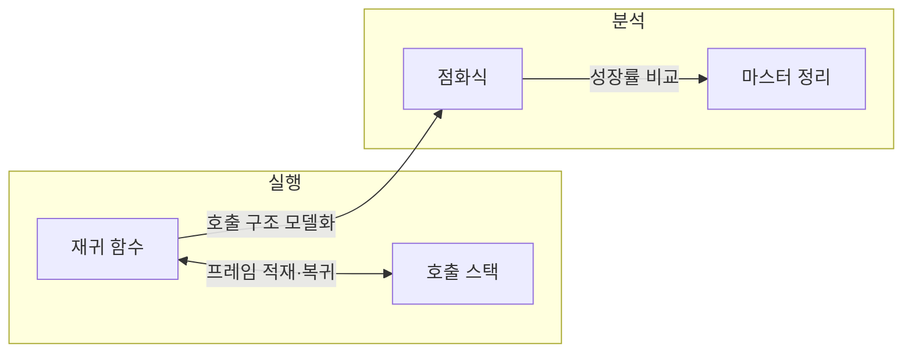
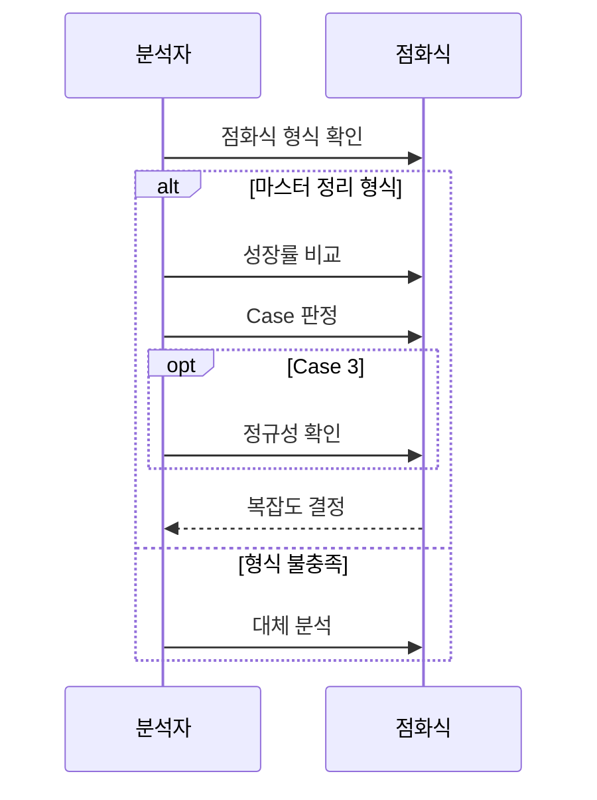

---
sidebar:
  order: 58
  label: "058. 재귀 알고리즘·마스터 정리 (Recursive Algorithm Master Theorem)"
  badge:
    text: "미출제 · 50%"
    variant: note
title: "재귀 알고리즘·마스터 정리 (Recursive Algorithm Master Theorem)"
date: "2026-07-26T22:16:20+09:00"
tags:
  - "notes-basic-theory"
weight: 58
extra:
  question_no: "058"
  source_status: "미출제"
  source_history: ""
  priority: 50
  priority_note: "재귀식 풀이·마스터 정리 계산형 기초"
---

## 미리 알고가기

- **재귀 알고리즘(Recursive Algorithm)**: 러시아 인형을 열면 똑같이 생긴 작은 인형이 나오듯, 입력 크기를 줄여 같은 함수를 다시 호출하고 더 열 것이 없는 종료 조건에서 결과를 반환하는 알고리즘
- **마스터 정리(Master Theorem)**: 균등 분할 점화식에서 부분 문제 비용과 분할·결합 비용의 성장률을 비교해 복잡도를 구하는 정리
- **종료 조건(Base Case)**: 재귀 호출을 멈추고 직접 결과를 반환하는 조건
- **점화식(Recurrence)**: 입력 크기별 비용을 이전 비용으로 표현한 식
- **입력 크기($n$)**: $n$은 ‘엔’으로 읽고 입력 크기를 나타내는 분야 관례에 따라 붙인 표기로, 점화식의 문제 규모를 나타냄
- **재귀 비용($T(n)$)**: $T(n)$은 ‘티 오브 엔’으로 읽고 Time의 첫 글자와 입력 크기를 함수 형태로 묶은 표기로, 크기 $n$인 문제의 전체 실행 비용을 나타냄
- **부분 문제 수·분할 비율($a$·$b$)**: $a$와 $b$는 ‘에이’와 ‘비’로 읽고 마스터 정리의 매개변수를 나타내는 분야 관례에 따라 붙인 표기로, $a$는 한 번 호출할 때 생기는 부분 문제 수이고 $b$는 부분 문제 크기를 $n/b$로 줄이는 비율
- **분할·결합 비용·성장률 차이($f(n)$·$\epsilon$)**: $f(n)$은 ‘에프 오브 엔’, $\epsilon$은 그리스 문자 ‘엡실론’으로 읽는다. $f(n)$은 재귀 호출 밖에서 문제를 나누고 부분 해를 합치는 데 드는 비용이며, $\epsilon$은 두 비용 차수 간 다항식 차이를 나타냄
- **$p=\log_b a$**: $p$는 ‘피’, $\log_b a$는 ‘밑이 비인 에이의 로그’로 읽고 되풀이해 쓰기 긴 지수를 한 글자로 줄여 놓은 표기로, 부분 문제 비용과 $f(n)$ 중 어느 쪽이 더 빨리 커지는지 견줄 때 기준이 되는 지수
- **세 판정 경우(Case 1·2·3)**: 부분 문제 비용과 분할·결합 비용 중 어느 쪽이 더 빨리 커지는지에 따라 갈리는 마스터 정리의 세 갈래로, Case 1은 부분 문제 비용이, Case 3은 분할·결합 비용이 지배하고 Case 2는 두 비용이 같은 차수인 경우
- **정규성 조건**: 마스터 정리의 세 번째 경우에서 분할·결합 비용이 재귀 단계마다 일정 비율로 줄어드는지 확인하는 조건
- **정규성 상수($c$)**: $c$는 ‘씨’로 읽고 상수를 나타내는 분야 관례에 따라 붙인 표기로, $af(n/b)\le cf(n)$에서 $c<1$인 수축 비율을 나타냄
- **점근 표기($O$·$\Theta$·$\Omega$)**: $O$는 ‘빅 오’, $\Theta$는 그리스 문자 ‘세타’, $\Omega$는 그리스 문자 ‘오메가’로 읽고 복잡도 성장 경계를 나타내는 표준 표기로, 각각 상한·동일 차수·하한을 판정
- **시간·공간 복잡도(Time·Space Complexity)**: 입력 크기가 커질 때 실행 시간과 추가 메모리 사용량이 증가하는 정도
- **호출 스택·스택 프레임(Call Stack·Stack Frame)**: 호출 스택은 함수 호출 기록을 쌓는 공간이고 스택 프레임은 호출별 지역 변수와 복귀 지점을 담는 기록
- **스택 오버플로(Stack Overflow)**: 재귀 호출이 너무 깊어져 호출 스택의 저장 한도를 넘는 오류
- **지배 비용(Dominant Cost)**: 입력이 커질수록 증가율이 가장 커서 전체 복잡도의 성장률을 결정하게 되는 비용
- **추상 구문 트리(Abstract Syntax Tree, AST)**: AST는 ‘에이에스티’로 읽고 영문 머리글자를 딴 약어이며, 프로그램의 연산·문장 구조를 나타내는 트리
- **재귀 트리·대입법(Recursion Tree·Substitution Method)**: 재귀 트리는 호출 단계별 비용을 펼쳐 합산하고 대입법은 예상 복잡도를 점화식에 넣어 귀납적으로 증명하는 분석법
- **외부 병합 정렬(External Merge Sort)**: 메모리에 한 번에 올릴 수 없는 대용량 데이터를 메모리 크기만큼 잘라 정렬한 뒤 그 조각들을 여러 차례 병합해 완성하는 정렬 방식

## Ⅰ. 개요

- **정의/개념**: **재귀 호출** 비용을 **점화식**으로 옮겨 복잡도를 판정하는 분석법
- **기존 한계**: 재귀식만 보고는 **재귀 비용**의 점근 차수 판정 불가

### 쉽게 이해하기 (학습용)
- 러시아 인형을 열면 똑같이 생긴 작은 인형이 나오듯 재귀는 같은 함수를 더 작은 입력으로 계속 부르다 더는 열리지 않는 마지막 인형인 종료 조건에서 멈추는데, 그렇게 갈라진 부분 문제 비용과 나누고 합치는 비용 중 어느 쪽이 전체 시간을 끌고 가는지 한 줄 식으로 가려 주는 것이 마스터 정리다

## Ⅱ. 특징

- **종료 조건**과 자기 호출로 문제 크기를 줄이는 자기 참조 구조
- **점화식**으로 부분 문제 수·크기와 **분할·결합 비용** 표현
- **마스터 정리**로 균등 분할 점화식의 **점근 복잡도** 판정

### 쉽게 이해하기 (학습용)
- 인형을 열어 가는 층이 깊어질수록 열어 둔 인형을 놓아둘 자리가 더 필요하고, 층마다 몇 개로 갈라져 얼마나 작아지며 다시 합치는 데 얼마가 드는지를 점화식 한 줄에 적어 두면, 갈라지는 크기가 고른 경우에 한해 마스터 정리가 그 한 줄만 보고 전체 시간을 판정한다

## Ⅲ. 아키텍처 및 구성요소

| 설계 요소 | 설명 |
|:---|:---|
| 재귀 함수 | **종료 조건** 판정 후 축소 입력으로 자기 호출 |
| 호출 스택 | 호출별 **스택 프레임** 보관, 깊이가 공간 비용 |
| 점화식 | 부분 문제 수 $a$·분할 비율 $b$·**분할·결합 비용** $f(n)$ 보유 |
| 마스터 정리 | $n^{\log_b a}$와 분할·결합 비용의 **성장률 비교**로 복잡도 산출 |

> 요약: **점화식** 비용 모델과 **호출 스택** 깊이로 시간·공간 판정

### 쉽게 이해하기 (학습용)
- 재귀 함수가 자기를 부를 때마다 호출 스택에 메모지가 한 장씩 쌓여 공간 비용이 되고, 그 호출이 몇 갈래로 갈라져 얼마씩 작아지는지를 점화식 한 줄로 옮겨 적어 두면 마스터 정리가 그 식만 보고 시간 비용을 판정한다

## Ⅳ. 원리 및 절차 흐름도

| 절차 | 설명 |
|:---|:---|
| 점화식 형식 확인 | $a$·$b$·$f(n)$ 식별과 **균등 분할** 확인 |
| 성장률 비교 | $n^{\log_b a}$와 **분할·결합 비용** 대조 |
| Case 판정 | **다항식 차이**로 Case 1·2·3 구분 |
| 정규성 확인 | $af(n/b)\le cf(n)$의 **수축 비율** $c<1$ |
| 복잡도 결정 | 해당 Case의 **점근 복잡도** 확정 |
| 대체 분석 | 형식 밖 점화식은 **재귀 트리**·**대입법** |

> 요약: 점화식의 형식·성장률·**정규성**을 확인해 복잡도를 구하거나 대체 분석법 선택

### 쉽게 이해하기 (학습용)
- 먼저 점화식이 균등 분할 꼴인지 봐서 마스터 정리라는 자를 댈 수 있는지 확인하고, 댈 수 있으면 부분 문제 비용과 나누고 합치는 비용 중 어느 쪽이 더 빨리 커지는지 견줘 세 경우 중 하나로 답을 읽으며, 자가 맞지 않는 식은 호출 층을 직접 펼쳐 더하는 재귀 트리로 돌아간다

## Ⅴ. 종류 및 비교

$$T(n)=aT(n/b)+f(n),\quad p=\log_b a,\quad a\ge1,\ b>1$$

| 마스터 정리 케이스 | Case 1 | Case 2 | Case 3 |
|:---|:---|:---|:---|
| 성장률 조건 | $f(n)=O(n^{p-\epsilon})$ | $f(n)=\Theta(n^p)$ | $f(n)=\Omega(n^{p+\epsilon})$ |
| 비용 관계 | **부분 문제 비용** 지배 | 두 비용 **동일 차수** | **분할·결합 비용** 지배 |
| 결과 복잡도 | $\Theta(n^p)$ | $\Theta(n^p\log n)$ | $\Theta(f(n))$ |
| 한계 | **로그 차이**만 나면 적용 불가 | 로그 인자 붙으면 **확장형** 필요 | **정규성 조건** 미충족 시 적용 불가 |

> 요약: **다항식 차이**로 세 Case 구분, Case 3은 조건 추가

### 쉽게 이해하기 (학습용)
- 갈라진 잎사귀 쪽 부분 문제가 무거우면 Case 1처럼 잎이 시간을 다 먹고, 뿌리 쪽에서 나누고 합치는 일이 무거우면 Case 3처럼 뿌리가 다 먹으며, 둘이 비기면 Case 2처럼 층수만큼 로그가 곱해지는데, 두 비용 차이가 로그 정도로만 벌어지면 세 경우 어디에도 들어가지 않아 이 자를 댈 수 없다

## Ⅵ. 실무 사례

1. 깊은 **AST** 순회는 재귀를 **명시적 스택** 순회로 전환
2. 외부 병합 정렬 배치는 **마스터 정리**로 병합 차수 선택

### 쉽게 이해하기 (학습용)
- 소스가 길고 중첩이 깊은 파일은 트리를 재귀로 훑다가 호출 스택이 먼저 바닥나므로, 다음에 볼 노드를 직접 관리하는 스택 자료구조에 담아 반복문으로 돌리면 깊이 한도가 메모리 크기까지 늘어난다
- 조각을 한 번에 몇 갈래씩 합칠지 정할 때, 갈래를 늘리면 합치는 횟수는 줄지만 한 번에 읽고 쓰는 양이 늘어나므로 어느 비용이 전체를 지배하는지를 마스터 정리로 견줘 병합 차수를 정한다

## Ⅶ. 결론

- **스택 오버플로** 위험은 명시적 스택, 형식 밖은 **재귀 트리** 분석

### 쉽게 이해하기 (학습용)
- 호출이 깊어질 것 같으면 재귀 대신 직접 만든 스택으로 바꿔 스택 오버플로를 피하고, 갈라지는 크기가 고르지 않아 마스터 정리라는 자가 안 맞는 식은 호출 층을 손으로 펼쳐 더하는 재귀 트리로 분석한다
