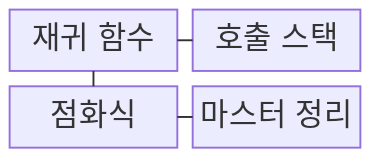
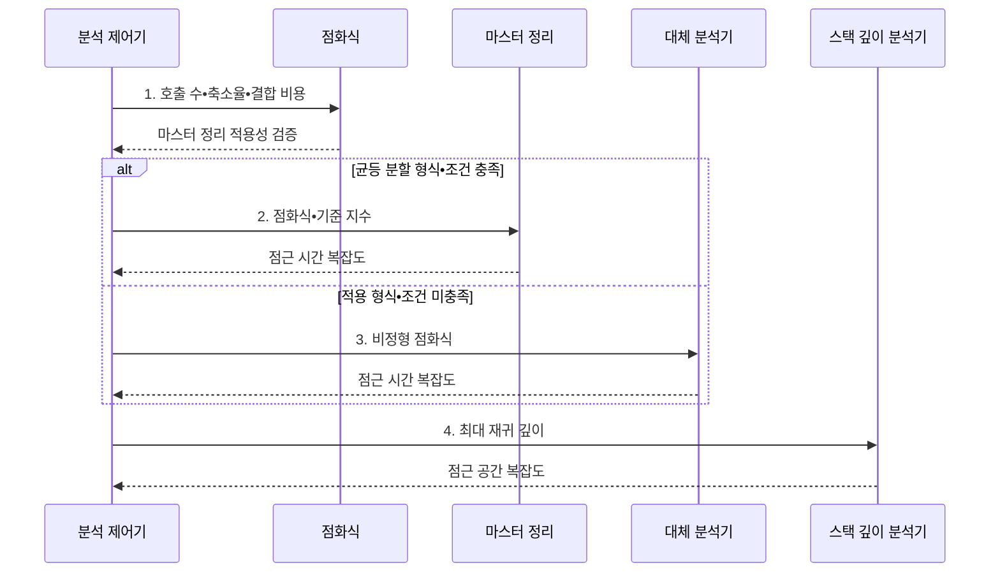

---
sidebar:
  order: 58
  label: "058. 재귀 알고리즘•마스터 정리 (Recursive Algorithm Master Theorem)"
  badge:
    text: "미출 • 50%"
    variant: note
title: "재귀 알고리즘•마스터 정리 (Recursive Algorithm Master Theorem)"
date: "2026-08-02T10:26:00+09:00"
tags:
  - "notes-basic-theory"
weight: 58
extra:
  question_no: "058"
  source_status: "미출"
  source_history: ""
  priority: 50
  priority_note: "재귀식 풀이•마스터 정리 계산형 기초"
---

## Ⅰ. 개요

핵심 용어

- **재귀 알고리즘**: 입력을 줄여 자신을 다시 호출하고 종료 조건에서 결과를 반환하는 알고리즘
- **점화식**: 입력 크기별 비용을 더 작은 입력의 비용으로 표현한 식

- 정의/개념: **재귀 호출** 비용을 **점화식**으로 분석하는 기법
- 배경/필요성: 코드 구조만으로는 재귀의 **시간•스택 증가율 판단 불가**

### 쉽게 이해하기 (학습용)
- 재귀가 작은 러시아 인형을 계속 열어 마지막 인형에서 멈춘다면, 마스터 정리는 각 층의 호출 비용과 결합 비용 중 무엇이 전체 시간을 지배하는지 판정한다.

## Ⅱ. 특징

핵심 용어

- **종료 조건**: 재귀 호출을 멈추고 직접 결과를 반환하는 조건
- **마스터 정리**: 균등 분할 점화식에서 부분 문제와 결합 비용의 성장률을 비교해 복잡도를 구하는 정리
- **점근 복잡도**: 입력이 커질 때 시간이나 공간 사용량이 증가하는 차수

- **종료 조건**과 자기 호출로 문제 크기를 줄이는 자기 참조 구조
- **점화식**으로 부분 문제 수•크기와 **분할•결합 비용** 표현
- **마스터 정리**로 균등 분할 점화식의 **점근 복잡도** 판정

### 쉽게 이해하기 (학습용)
- 러시아 인형마다 작은 인형 수와 포장 비용을 적고 어느 층의 비용 더미가 가장 큰지 고르는 장면이다.

## Ⅲ. 구조 및 구성요소

핵심 용어

- **호출 스택**: 함수 호출 기록과 복귀 지점을 순서대로 쌓는 메모리 공간
- **스택 프레임**: 각 호출의 지역 변수와 복귀 주소를 담는 기록
- **비용 모델**: 부분 문제 수 $a$, 축소 비율 $b$, 결합 비용 $f(n)$으로 실행 비용을 표현한 구조

| 구성요소 | 책임 |
|:---|:---|
| 재귀 함수 | **종료 조건**을 검사하고 축소 입력으로 자기 호출 |
| 호출 스택 | 호출별 **스택 프레임**으로 재귀 깊이•공간 비용 반영 |
| 점화식 | $a$•$b$•$f(n)$으로 호출 구조를 **비용 모델**화 |
| 마스터 정리 | 점화식의 **성장률**을 비교해 점근 시간 복잡도 판정 |

### 쉽게 이해하기 (학습용)
- 재귀 인형을 열 때마다 호출 카드가 쌓이고, 점화식 장부가 그 카드 더미의 증가율을 계산하는 장면이다.

## Ⅳ. 흐름도

핵심 용어

- **기준 지수 $p=\log_b a$**: 부분 문제들이 만드는 비용의 기준 성장률
- **재귀 트리**: 호출 단계별 비용을 나무처럼 펼쳐 각 층의 비용을 합산하는 분석법
- **대입법**: 예상 복잡도를 점화식에 넣어 귀납적으로 증명하는 분석법

**동작 원리**

- **1. 호출 수•축소율•결합 비용**: $a$•$b$•$f(n)$ 점화식 구성
- **2. 점화식•기준 지수**: 성장률 비교로 Case 판정
- **3. 비정형 점화식**: 재귀 트리•대입법 적용 대상
- **4. 최대 재귀 깊이**: 호출 스택의 점근 공간 산정

### 쉽게 이해하기 (학습용)
- 호출 카드가 스택에 한 장씩 쌓이고, 분기 수•축소율•결합 비용표가 시간 눈금을 정하는 장면이다.

## Ⅴ. 종류 및 비교

핵심 용어

- **지배 비용**: 입력이 커질수록 증가율이 가장 커서 전체 복잡도를 결정하는 비용
- **다항식 차이**: 두 성장률의 지수가 양의 상수 $\epsilon$만큼 벌어진 관계
- **정규성 조건**: Case 3에서 결합 비용이 재귀 단계마다 일정 비율로 감소하는지 확인하는 조건

$$T(n)=aT(n/b)+f(n),\quad p=\log_b a,\quad a\ge1,\ b>1$$

| 마스터 정리 케이스 | Case 1 | Case 2 | Case 3 |
|:---|:---|:---|:---|
| 성장률 조건 | $f(n)=O(n^{p-\epsilon})$ | $f(n)=\Theta(n^p)$ | $f(n)=\Omega(n^{p+\epsilon})$ |
| 비용 관계 | **부분 문제 비용** 지배 | 두 비용 **동일 차수** | **분할•결합 비용** 지배 |
| 결과 복잡도 | $\Theta(n^p)$ | $\Theta(n^p\log n)$ | $\Theta(f(n))$ |
| 한계 | **로그 차이**만 나면 적용 불가 | 로그 인자 붙으면 **확장형** 필요 | **정규성 조건** 미충족 시 적용 불가 |

> 요약: **다항식 차이**와 정규성으로 Case 판정

### 쉽게 이해하기 (학습용)
- 재귀 나무의 잎 더미가 크면 Case 1, 모든 층이 같으면 Case 2, 뿌리 비용이 크면 Case 3인 장면이다.

## Ⅵ. 실무 고려사항 및 대책

핵심 용어

- **감소 불변식**: 재귀 호출마다 입력 크기나 남은 작업량이 반드시 줄어드는 성질
- **스택 오버플로**: 재귀 깊이가 호출 스택의 저장 한도를 넘는 오류
- **명시적 스택**: 런타임 호출 스택 대신 프로그램이 직접 관리하는 자료구조 스택

| 문제 | 대책 | 효과 |
|:---|:---|:---|
| 입력이 줄지 않아 **재귀가 종료되지 않음** | 종료 조건과 **감소 불변식** 검증 | **무한 재귀** 방지 |
| 깊은 입력에서 **스택 오버플로** | **명시적 스택**•반복 구조로 전환 | **호출 깊이 한계** 완화 |
| 불균등 분할식에 **마스터 정리 오적용** | 적용 형식•정규성 확인 후 **재귀 트리•대입법** 사용 | **복잡도 판정 오류** 방지 |
| 이론 차수와 **실행 시간이 크게 다름** | 입력 규모별 측정과 **상수•메모리 비용** 분석 | **실제 병목** 보완 |

### 쉽게 이해하기 (학습용)
- 호출 카드가 천장에 닿기 전에 런타임 스택 대신 직접 관리하는 카드 상자로 옮기는 장면이다.

## Ⅶ. 결론

핵심 용어

- **깊은 호출**: 입력 축소가 느려 호출 스택에 많은 프레임이 쌓이는 재귀 구조
- **불균등 분할**: 부분 문제들이 서로 다른 크기로 나뉘어 기본 마스터 정리를 적용하기 어려운 형태

- 깊은 호출은 **명시적 스택**, 불균등 분할은 **대입법** 적용

### 쉽게 이해하기 (학습용)
- 호출 카드가 높으면 명시적 스택 상자, 가지 크기가 다르면 재귀 트리 계산판을 고르는 장면이다.
