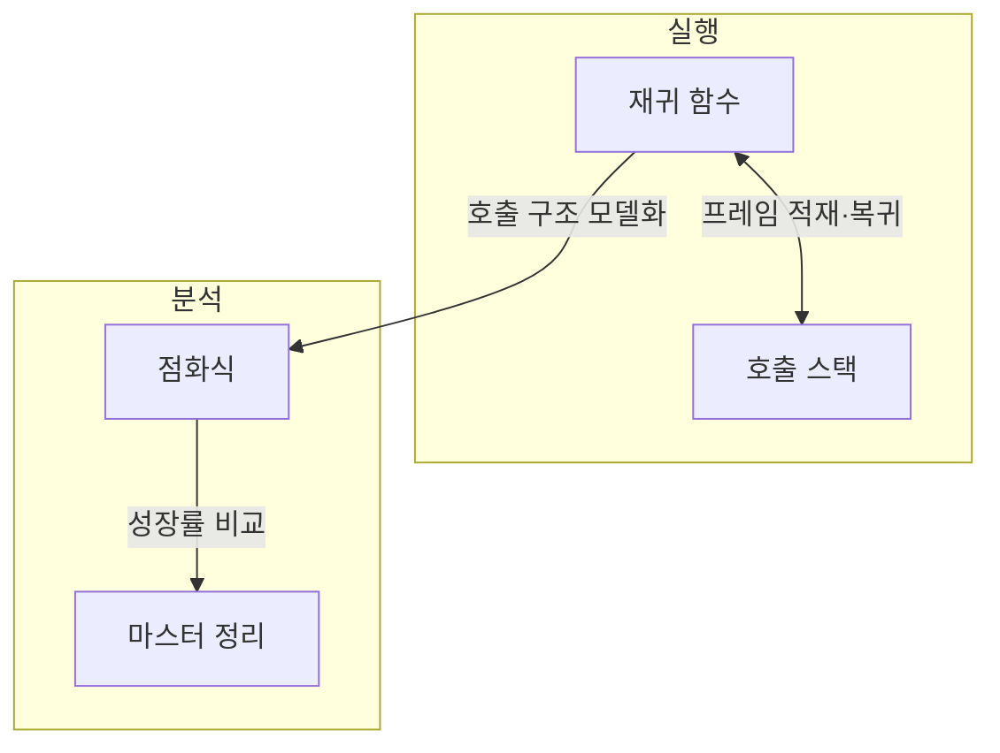
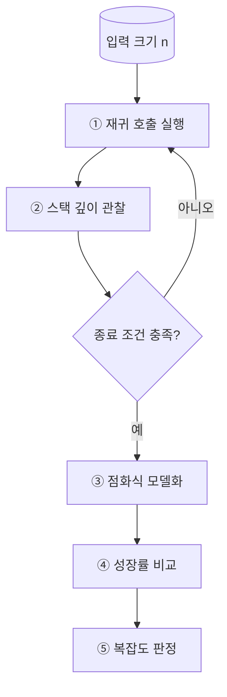
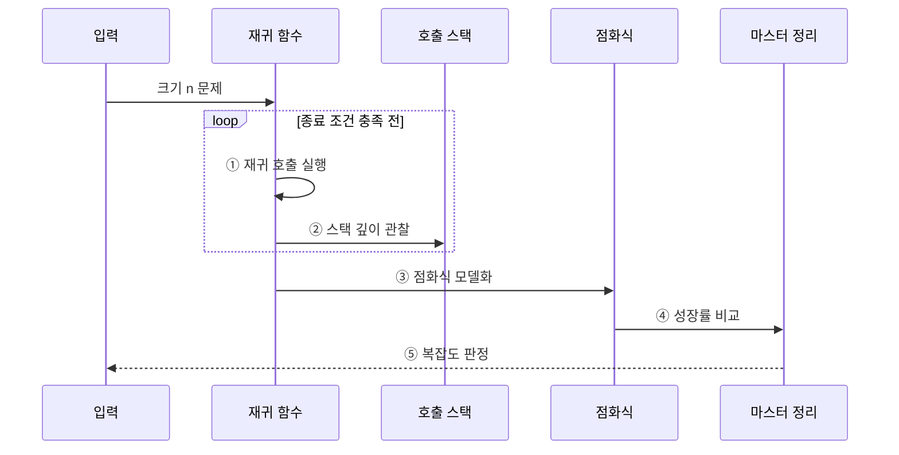

---
sidebar:
  order: 58
  label: "058. 재귀 알고리즘·마스터 정리 (Recursive Algorithm Master Theorem)"
  badge:
    text: "미출 · 50%"
    variant: note
title: "재귀 알고리즘·마스터 정리 (Recursive Algorithm Master Theorem)"
date: "2026-07-28T17:55:00+09:00"
tags:
  - "notes-basic-theory"
weight: 58
extra:
  question_no: "058"
  source_status: "미출"
  source_history: ""
  priority: 50
  priority_note: "재귀식 풀이·마스터 정리 계산형 기초"
---

## 미리 알고가기

- **재귀 알고리즘(Recursive Algorithm)**: 러시아 인형을 열면 똑같이 생긴 작은 인형이 나오듯, 입력 크기를 줄여 같은 함수를 다시 호출하고 더 열 것이 없는 종료 조건에서 결과를 반환하는 알고리즘
- **마스터 정리(Master Theorem)**: 균등 분할 점화식에서 부분 문제 비용과 분할·결합 비용의 성장률을 비교해 복잡도를 구하는 정리
- **종료 조건(Base Case)**: 재귀 호출을 멈추고 직접 결과를 반환하는 조건
- **점화식(Recurrence)**: 입력 크기별 비용을 이전 비용으로 표현한 식
- **입력 크기($n$)**: 점화식의 문제 규모를 나타낸다.
- **재귀 비용($T(n)$)**: 크기 $n$인 문제의 전체 실행 비용을 나타낸다.
- **부분 문제 수·분할 비율($a$·$b$)**: $a$는 부분 문제 수, $b$는 부분 문제 크기를 $n/b$로 줄이는 비율이다.
- **분할·결합 비용·성장률 차이($f(n)$·$\epsilon$)**: $f(n)$은 ‘에프 오브 엔’, $\epsilon$은 그리스 문자 ‘엡실론’으로 읽는다. $f(n)$은 재귀 호출 밖에서 문제를 나누고 부분 해를 합치는 데 드는 비용이며, $\epsilon$은 두 비용 차수 간 다항식 차이를 나타냄
- **$p=\log_b a$**: $p$는 ‘피’, $\log_b a$는 ‘밑이 비인 에이의 로그’로 읽고 되풀이해 쓰기 긴 지수를 한 글자로 줄여 놓은 표기로, 부분 문제 비용과 $f(n)$ 중 어느 쪽이 더 빨리 커지는지 견줄 때 기준이 되는 지수
- **세 판정 경우(Case 1·2·3)**: 부분 문제 비용과 분할·결합 비용 중 어느 쪽이 더 빨리 커지는지에 따라 갈리는 마스터 정리의 세 갈래로, Case 1은 부분 문제 비용이, Case 3은 분할·결합 비용이 지배하고 Case 2는 두 비용이 같은 차수인 경우
- **정규성 조건**: 마스터 정리의 세 번째 경우에서 분할·결합 비용이 재귀 단계마다 일정 비율로 줄어드는지 확인하는 조건
- **정규성 상수($c$)**: $c$는 ‘씨’로 읽고 상수를 나타내는 분야 관례에 따라 붙인 표기로, $af(n/b)\le cf(n)$에서 $c<1$인 수축 비율을 나타냄
- **점근 표기($O$·$\Theta$·$\Omega$)**: $O$는 ‘빅 오’, $\Theta$는 그리스 문자 ‘세타’, $\Omega$는 그리스 문자 ‘오메가’로 읽고 복잡도 성장 경계를 나타내는 표준 표기로, 각각 상한·동일 차수·하한을 판정
- **시간·공간 복잡도(Time·Space Complexity)**: 입력 크기가 커질 때 실행 시간과 추가 메모리 사용량이 증가하는 정도
- **호출 스택·스택 프레임(Call Stack·Stack Frame)**: 호출 스택은 함수 호출 기록을 쌓는 공간이고 스택 프레임은 호출별 지역 변수와 복귀 지점을 담는 기록
- **스택 오버플로(Stack Overflow)**: 재귀 호출이 너무 깊어져 호출 스택의 저장 한도를 넘는 오류
- **지배 비용(Dominant Cost)**: 입력이 커질수록 증가율이 가장 커서 전체 복잡도의 성장률을 결정하게 되는 비용
- **추상 구문 트리(Abstract Syntax Tree, AST)**: 프로그램의 연산과 문장 구조를 계층적으로 표현한 트리
- **재귀 트리·대입법(Recursion Tree·Substitution Method)**: 재귀 트리는 호출 단계별 비용을 펼쳐 합산하고 대입법은 예상 복잡도를 점화식에 넣어 귀납적으로 증명하는 분석법
- **외부 병합 정렬(External Merge Sort)**: 메모리에 한 번에 올릴 수 없는 대용량 데이터를 메모리 크기만큼 잘라 정렬한 뒤 그 조각들을 여러 차례 병합해 완성하는 정렬 방식

## Ⅰ. 개요

- 정의/개념: **재귀 호출** 비용을 **점화식**으로 분석하는 기법
- 기존 한계: 재귀식만 보고는 **재귀 비용**의 점근 차수 판정 불가

### 쉽게 이해하기 (학습용)
- 러시아 인형을 열면 똑같이 생긴 작은 인형이 나오듯 재귀는 같은 함수를 더 작은 입력으로 계속 부르다 더는 열리지 않는 마지막 인형인 종료 조건에서 멈추는데, 그렇게 갈라진 부분 문제 비용과 나누고 합치는 비용 중 어느 쪽이 전체 시간을 끌고 가는지 한 줄 식으로 가려 주는 것이 마스터 정리다

## Ⅱ. 특징

- **종료 조건**과 자기 호출로 문제 크기를 줄이는 자기 참조 구조
- **점화식**으로 부분 문제 수·크기와 **분할·결합 비용** 표현
- **마스터 정리**로 균등 분할 점화식의 **점근 복잡도** 판정

### 쉽게 이해하기 (학습용)
- 인형을 열어 가는 층이 깊어질수록 열어 둔 인형을 놓아둘 자리가 더 필요하고, 층마다 몇 개로 갈라져 얼마나 작아지며 다시 합치는 데 얼마가 드는지를 점화식 한 줄에 적어 두면, 갈라지는 크기가 고른 경우에 한해 마스터 정리가 그 한 줄만 보고 전체 시간을 판정한다

## Ⅲ. 아키텍처

**도표안 A — 구조도**

**도표안 B — 동작 흐름도**

**도표안 C — sequenceDiagram**

| 구성요소 | 책임 |
|:---|:---|
| 재귀 함수 | **종료 조건**을 검사하고 축소 입력으로 자기 호출 |
| 호출 스택 | 호출별 **스택 프레임**으로 재귀 깊이·공간 비용 반영 |
| 점화식 | $a$·$b$·$f(n)$으로 호출 구조를 **비용 모델**화 |
| 마스터 정리 | 점화식의 **성장률**을 비교해 점근 시간 복잡도 판정 |

**동작 원리**

- ① **재귀 함수**가 종료 조건 전까지 입력 크기를 줄여 **자기 호출**한다.
- ② 호출마다 **스택 프레임**이 쌓이는 깊이로 **공간 비용**을 관찰한다.
- ③ 부분 문제 수 $a$, 축소 비율 $b$, 결합 비용 $f(n)$으로 **점화식**을 만든다.
- ④ **마스터 정리**가 $n^{\log_b a}$와 $f(n)$의 **성장률**을 비교한다.
- ⑤ 적용 조건에 맞는 Case로 **점근 시간 복잡도**를 판정한다.

### 쉽게 이해하기 (학습용)
- 재귀 함수가 자기를 부를 때마다 호출 스택에 메모지가 한 장씩 쌓여 공간 비용이 되고, 그 호출이 몇 갈래로 갈라져 얼마씩 작아지는지를 점화식 한 줄로 옮겨 적어 두면 마스터 정리가 그 식만 보고 시간 비용을 판정한다

## Ⅳ. 종류 및 비교

$$T(n)=aT(n/b)+f(n),\quad p=\log_b a,\quad a\ge1,\ b>1$$

| 마스터 정리 케이스 | Case 1 | Case 2 | Case 3 |
|:---|:---|:---|:---|
| 성장률 조건 | $f(n)=O(n^{p-\epsilon})$ | $f(n)=\Theta(n^p)$ | $f(n)=\Omega(n^{p+\epsilon})$ |
| 비용 관계 | **부분 문제 비용** 지배 | 두 비용 **동일 차수** | **분할·결합 비용** 지배 |
| 결과 복잡도 | $\Theta(n^p)$ | $\Theta(n^p\log n)$ | $\Theta(f(n))$ |
| 한계 | **로그 차이**만 나면 적용 불가 | 로그 인자 붙으면 **확장형** 필요 | **정규성 조건** 미충족 시 적용 불가 |

> 요약: **다항식 차이**로 세 Case 구분, Case 3은 조건 추가

### 쉽게 이해하기 (학습용)
- 갈라진 잎사귀 쪽 부분 문제가 무거우면 Case 1처럼 잎이 시간을 다 먹고, 뿌리 쪽에서 나누고 합치는 일이 무거우면 Case 3처럼 뿌리가 다 먹으며, 둘이 비기면 Case 2처럼 층수만큼 로그가 곱해지는데, 두 비용 차이가 로그 정도로만 벌어지면 세 경우 어디에도 들어가지 않아 이 자를 댈 수 없다

## Ⅴ. 실무 고려사항 및 대책

| 고려사항 | 대책 | 효과 |
|:---|:---|:---|
| 입력이 줄지 않아 **재귀가 종료되지 않음** | 종료 조건과 **감소 불변식** 검증 | **무한 재귀** 방지 |
| 깊은 입력에서 **스택 오버플로** | **명시적 스택**·반복 구조로 전환 | **호출 깊이 한계** 완화 |
| 불균등 분할식에 **마스터 정리 오적용** | 적용 형식·정규성 확인 후 **재귀 트리·대입법** 사용 | **복잡도 판정 오류** 방지 |
| 이론 차수와 **실행 시간이 크게 다름** | 입력 규모별 측정과 **상수·메모리 비용** 분석 | **실제 병목** 보완 |

### 쉽게 이해하기 (학습용)
- 적용 형식과 정규성을 먼저 확인한다. 깊은 AST 순회는 다음 노드를 명시적 스택에 넣고 반복 처리해 호출 스택 오버플로를 피한다.

## Ⅵ. 결론

- **스택 오버플로**는 명시적 스택, 형식 밖은 **재귀 트리**로 대응

### 쉽게 이해하기 (학습용)
- 호출이 깊어질 것 같으면 재귀 대신 직접 만든 스택으로 바꿔 스택 오버플로를 피하고, 갈라지는 크기가 고르지 않아 마스터 정리라는 자가 안 맞는 식은 호출 층을 손으로 펼쳐 더하는 재귀 트리로 분석한다
