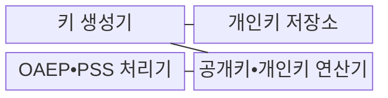
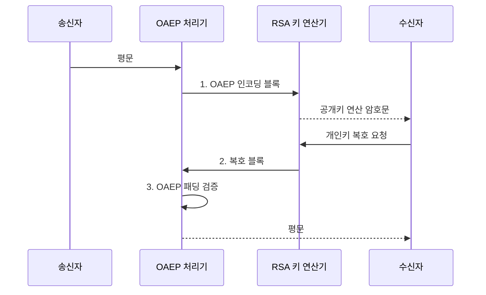

---
sidebar:
  order: 59
  label: "059. 암호 수학: 이산 대수•RSA 원리(Cryptography Mathematics)"
  badge:
    text: "기출 • 50%"
    variant: note
title: "암호 수학: 이산 대수•RSA 원리(Cryptography Mathematics)"
date: "2026-08-02T10:27:00+09:00"
tags:
  - "notes-basic-theory"
weight: 59
extra:
  question_no: "059"
  source_status: "기출"
  source_history: "128회"
  priority: 50
  priority_note: "공개키 원리•양자 위협 전환 우선"
---

## Ⅰ. 개요

핵심 용어

- **공개키 암호**: 공개키와 개인키로 암호화·서명 역할을 분리하는 방식
- **부인방지**: 개인키 소유자만 만들 수 있는 서명으로 작성 사실을 사후에 부정하기 어렵게 하는 성질

- 정의/개념: **공개키 암호**는 공개키와 개인키의 역할을 분리하고 역연산이 어려운 수학 문제에 안전성을 두는 **비대칭 암호 체계**
- 배경/필요성: 대칭키만으로는 공개 채널에서 새 세션키를 공유하거나 제3자가 검증하는 **전자서명을 제공하기 어려움**

#### 한줄 요약

- 공개키는 누구나 편지를 넣는 우편함 투입구이고, 개인키는 소유자만 우편함을 여는 열쇠다.

## Ⅱ. 특징

핵심 용어

- **소인수분해 난제**: 큰 합성수를 원래 소수들의 곱으로 되돌리기 어렵다는 RSA의 안전성 기반
- **모듈러 역원**: 특정 수와 곱했을 때 기준 수로 나눈 나머지가 1이 되는 수
- **하이브리드 암호화**: 대용량 데이터는 대칭키로 처리하고 그 대칭키만 공개키 방식으로 보호하는 구조

- **소인수분해** 난제와 **모듈러 거듭제곱**의 일방향성
- **$n=pq$**, **$ed\equiv1\pmod{\phi(n)}$** 관계에 따라 공개•개인 지수 구성
- **공개키•개인키** 역할 분리와 고비용 보완 **하이브리드 암호화**

#### 한줄 요약

- 큰 화물은 빠른 대칭키 상자에 넣고, 그 상자 열쇠만 공개키 자물쇠로 잠그는 장면이다.

## Ⅲ. 구조 및 구성요소

핵심 용어

- **오일러 피 함수 $\phi(n)$**: $n$ 이하에서 $n$과 서로소인 양의 정수의 수
- **OAEP**: 난수를 결합해 같은 평문도 서로 다른 RSA 암호문이 되게 하는 확률적 패딩
- **PSS**: 난수 솔트를 결합해 RSA 전자서명의 보안성을 높이는 인코딩 방식

| 구성요소 | 책임 |
|:---|:---|
| 키 생성기 | **오일러 피 함수•모듈러 역원**으로 키 지수 생성 |
| 개인키 저장소 | 개인 지수•원본 소수 등 **비밀 키 재료** 격리 보관 |
| OAEP•PSS 처리기 | **OAEP 암호화•PSS 서명** 인코딩•검증 |
| 공개키•개인키 연산기 | 공개 지수로 암호화하고 개인 지수로 **복호화** 수행 |

#### 한줄 요약
- 열쇠 공장이 키 쌍을 만들고 개인키는 금고에 넣으며, OAEP 포장대와 연산기가 암호 상자를 처리하는 장면이다.

## Ⅳ. 흐름도

핵심 용어

- **평문·암호문**: 암호화 전 원래 메시지와 공개키 연산 후 알아볼 수 없게 바뀐 결과
- **패딩 검증**: 복호한 블록이 OAEP의 구조와 해시 조건에 맞는지 확인하는 처리

**동작 원리**

- **1. OAEP 인코딩 블록**: 난수•해시를 결합한 공개키 입력
- **2. 복호 블록**: 격리된 개인키 모듈러 연산 결과
- **3. OAEP 패딩 검증**: 복호 블록의 구조•해시 일치 확인

#### 한줄 요약

- 평문이 OAEP 포장지와 공개키 자물쇠를 거쳐 암호 상자가 되고, 개인키 금고에서 다시 열리는 장면이다.

## Ⅴ. 종류 및 비교

핵심 용어

- **RSA**: 소인수분해 난제를 바탕으로 암호화와 전자서명을 구현하는 공개키 알고리즘
- **DH**: 유한체 이산 로그 난제를 바탕으로 공개 채널에서 공유 비밀을 만드는 키 합의 방식
- **ECC**: 타원곡선 이산 로그 난제로 짧은 키의 서명과 키 합의를 구현하는 방식
- **쇼어 알고리즘**: 양자컴퓨터에서 소인수분해와 이산 로그를 빠르게 푸는 알고리즘

| 공개키 알고리즘 | RSA | DH | ECC |
|:---|:---|:---|:---|
| 적용 기준 | 인증서로 **키 운반**•**전자서명**이 필요한 경우 | 사전 공유 없이 **세션키 합의**가 필요한 경우 | 대역•전력 제약으로 **짧은 키**가 필요한 경우 |
| 핵심 특징 | **소인수분해** 난제 기반 | **유한체 이산 로그** 난제 기반 | **타원곡선 이산 로그** 난제 기반 |
| 한계 | **패딩 오라클** 공격 노출 | 인증 부재 시 **중간자 공격** | **점 유효성 검증** 누락 |

> 요약: 소인수분해•이산 로그 기반, 모두 **쇼어 알고리즘**에 취약

#### 한줄 요약

- RSA 벽은 소인수분해, DH•ECC 벽은 이산 로그로 서 있지만 쇼어 굴착기가 두 벽을 모두 뚫는 장면이다.

## Ⅵ. 실무 고려사항 및 대책

핵심 용어

- **패딩 오라클·측면 채널**: 오류·처리 시간 같은 외부 차이로 평문이나 비밀키를 추론하는 공격
- **HSM**: 개인키를 장치 밖으로 내보내지 않고 내부에서 암호 연산을 수행하는 보안 장비
- **PQC**: 양자 및 고전 컴퓨터의 알려진 공격에 대응하도록 설계한 공개키 암호 체계
- **수확 후 복호화**: 현재 암호문을 수집해 미래의 양자컴퓨터로 복호화하려는 위협

| 문제 | 대책 | 효과 |
|:---|:---|:---|
| 복호화 **오류•시간 차이가 외부에 노출** | OAEP와 **상수 시간•단일 오류 응답** 적용 | **패딩 오라클•측면 채널** 완화 |
| **개인키 유출•무단 사용** | HSM 등 격리 저장•접근 통제•**키 순환** | **키 재료 보호•사용 추적** |
| 대용량 데이터를 **RSA로 직접 처리** | **하이브리드 암호화** 적용 | **성능•데이터 크기 제약** 해소 |
| 장기 보호 자산의 **양자 위협** | 암호 자산 목록화•**PQC 전환 계획** | **수확 후 복호화 위험** 축소 |

#### 한줄 요약

- 성공 상자와 실패 상자가 같은 시간 뒤 같은 모양으로 나와 공격자가 차이를 못 보는 장면이다.

## Ⅶ. 결론

핵심 용어

- **대칭키 암호**: 송수신자가 같은 비밀키로 대용량 데이터를 빠르게 암호화·복호화하는 방식
- **암호 자산 목록**: 알고리즘·키 길이·인증서·보호 데이터와 사용 기간을 기록한 전환 관리 목록

- 대용량 데이터는 **하이브리드**, 장기 보호 자산은 **PQC** 적용

#### 한줄 요약

- 큰 화물은 대칭키 상자, 상자 열쇠는 공개키 봉투, 오래 보관할 금고는 PQC 자물쇠로 바꾸는 장면이다.
