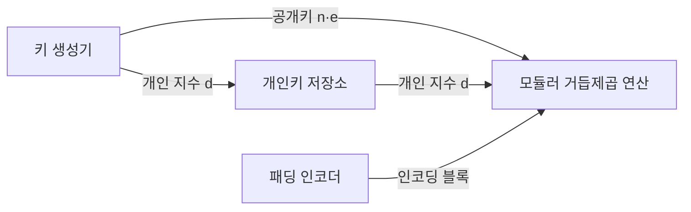
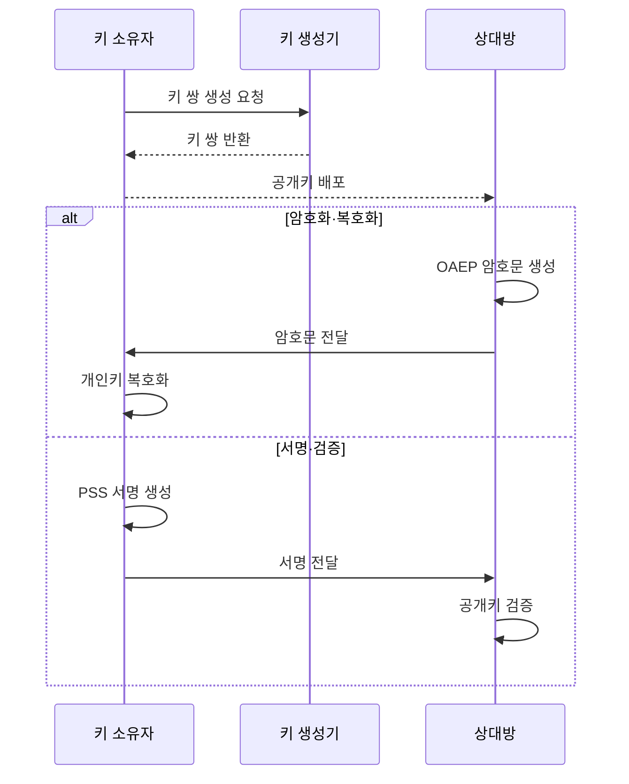

---
sidebar:
  order: 59
  label: "059. 암호 수학 — 이산 대수·RSA 원리(Cryptography Mathematics)"
  badge:
    text: "기출 · 50%"
    variant: note
title: "암호 수학 — 이산 대수·RSA 원리(Cryptography Mathematics)"
date: "2026-07-27T23:58:00+09:00"
tags:
  - "notes-basic-theory"
weight: 59
extra:
  question_no: "059"
  source_status: "기출"
  source_history: "128회"
  priority: 50
  priority_note: "공개키 원리·양자 위협 전환 우선"
---

## 미리 알고가기

- **공개키 암호(Public-Key Cryptography)**: 누구나 편지를 넣을 수 있는 우편함 투입구와 집주인만 가진 열쇠처럼, 널리 배포하는 공개키와 소유자만 보관하는 개인키에 암호화·복호화 또는 서명·검증 역할을 나눈 암호 방식
- **리베스트-샤미르-애들먼(Rivest-Shamir-Adleman, RSA)**: RSA는 ‘알에스에이’로 읽고 세 고안자의 성 머리글자를 딴 이름이며, 소인수분해 난제로 암호화·서명을 구현하는 공개키 암호
- **디피-헬먼(Diffie-Hellman, DH)**: DH는 ‘디에이치’로 읽고 두 고안자의 성 머리글자를 딴 약어이며, 이산 로그 난제로 공통 비밀을 만드는 키 합의 방식
- **타원곡선 암호(Elliptic Curve Cryptography, ECC)**: ECC는 ‘이씨씨’로 읽고 영문 머리글자를 딴 약어이며, 타원곡선 이산 로그 난제로 짧은 키의 서명·키 합의를 구현하는 방식
- **모듈러 연산(Modular Arithmetic)**: 나머지 범위의 정수 연산
- **모듈러스·모듈러 역원(Modulus·Modular Inverse)**: 모듈러스는 나머지 연산의 기준 수이고 모듈러 역원은 곱한 나머지가 1이 되는 수
- **서로소(Coprime)**: 두 정수의 최대공약수가 1인 관계
- **소인수분해(Integer Factorization)**: 합성수를 소수들의 곱으로 분해하는 연산으로 RSA 안전성의 계산 난제를 이룸
- **오일러 피 함수(Euler's Totient Function, $\phi(n)$)**: $\phi(n)$은 그리스 문자 ‘파이 오브 엔’으로 읽고 오일러 피 함수를 나타내는 분야 관례에 따라 붙인 표기로, $n$ 이하에서 $n$과 서로소인 양의 정수 개수를 세어 RSA 지수 역원의 모듈러 기준을 만듦
- **RSA 소수·모듈러스 기호($p$·$q$·$n$)**: $p$·$q$·$n$은 ‘피’·‘큐’·‘엔’으로 읽고 $p$는 Prime의 첫 글자, $q$와 $n$은 RSA 분야 관례에 따라 붙인 표기로, 두 소수 $p$·$q$를 곱한 $n=pq$가 공개키와 개인키의 공통 모듈러스가 됨
- **RSA 지수 기호($e$·$d$)**: $e$·$d$는 ‘이’·‘디’로 읽고 공개·개인 지수를 나타내는 RSA 분야 관례에 따라 붙인 표기로, $e$는 공개 연산에 쓰고 $d$는 $\phi(n)$에 대한 $e$의 모듈러 역원으로 비밀 연산에 사용
- **평문·암호문(Plaintext·Ciphertext)**: 평문은 암호화하기 전 원래 메시지이고 암호문은 공개 지수 연산을 거쳐 알아볼 수 없게 바뀐 결과
- **일방향 함수·트랩도어(One-way Function·Trapdoor)**: 한쪽 방향 계산은 쉬운데 되돌리기는 사실상 불가능하고, 개인 지수 같은 비밀 정보를 쥔 사람만 역산할 수 있게 뚫어 둔 뒷문이 트랩도어
- **상수 시간 처리(Constant Time)**: 입력값이나 성공·실패에 따라 처리 시간이 달라지지 않게 맞춰, 응답이 걸린 시간만 재도 비밀을 알아낼 수 없게 하는 구현 방식
- **이산 로그 문제(Discrete Logarithm Problem)**: 거듭제곱 결과에서 비밀 지수 찾기 난제
- **최적 비대칭 암호화 패딩(Optimal Asymmetric Encryption Padding, OAEP)**: OAEP는 ‘오에이이피’로 읽고 영문 머리글자를 딴 약어이며, 난수를 섞어 같은 평문도 다른 RSA 암호문이 되게 하는 인코딩 방식
- **확률적 서명 방식(Probabilistic Signature Scheme, PSS)**: PSS는 ‘피에스에스’로 읽고 영문 머리글자를 딴 약어이며, 난수 솔트를 섞어 RSA 서명을 확률화하는 인코딩 방식
- **하이브리드 암호화(Hybrid Encryption)**: 공개키 방식으로 데이터 대칭키 보호
- **대칭키 암호(Symmetric-key Cryptography)**: 송신자와 수신자가 같은 비밀키로 대용량 데이터를 빠르게 암호화·복호화하는 방식
- **전자서명(Digital Signature)**: 개인키로 생성하고 공개키로 검증해 메시지의 작성자와 변경 여부를 확인하는 값
- **키 합의(Key Agreement)**: 통신 당사자가 비밀키를 직접 보내지 않고 같은 공유 비밀을 계산하는 절차
- **유한체(Finite Field)**: 원소 수가 유한하고 사칙연산 규칙이 닫혀 있는 대수 구조
- **중간자 공격(Man-in-the-Middle Attack)**: 공격자가 두 통신자 사이에 끼어 서로의 상대인 것처럼 키 교환을 가로채는 공격
- **점 유효성 검증(Point Validation)**: 입력 점이 올바른 타원곡선과 허용 부분군에 속하는지 확인하는 절차
- **해시·솔트(Hash·Salt)**: 해시는 입력을 고정 길이 값으로 바꾸는 함수이고 솔트는 같은 입력도 다른 결과가 나게 더하는 난수
- **양자내성암호(Post-Quantum Cryptography, PQC)**: PQC는 ‘피큐씨’로 읽고 영문 머리글자를 딴 약어이며, 양자컴퓨터와 기존 컴퓨터의 알려진 공격에 견디도록 설계한 공개키 암호 체계
- **패딩 오라클(Padding Oracle)**: 패딩 오류 차이로 평문을 추론하는 공격
- **쇼어 알고리즘(Shor's Algorithm)**: 충분한 규모의 양자컴퓨터에서 소인수분해와 이산 로그를 모두 빠르게 푸는 양자 알고리즘이며, RSA·DH·ECC가 서로 다른 난제에 기대고 있는데도 한꺼번에 무너지는 이유이자 양자내성암호 전환의 근거다

## Ⅰ. 개요

- 정의/개념: **소인수분해·이산 로그** 난제로 암호화·서명·키 합의 구현
- 기존 한계: **대칭키**로는 사전 키 공유 없는 기밀성·**부인방지** 불가

### 쉽게 이해하기 (학습용)

- 누구나 우편함 투입구에 편지를 넣을 수 있지만 열쇠를 쥔 집주인만 함을 열 수 있듯, 투입구에 해당하는 공개키는 널리 뿌려도 안전하고 열쇠에 해당하는 개인키만 감춰 두면 한 번도 만난 적 없는 상대와도 비밀을 주고받을 수 있다

## Ⅱ. 특징

- **소인수분해** 난제와 **모듈러 거듭제곱**의 일방향성
- **공개키** 암호화·검증과 **개인키** 복호화·서명의 역할 분리
- **대칭키** 대비 높은 연산 비용에 따른 **하이브리드 암호화**

### 쉽게 이해하기 (학습용)

- 공개키 연산은 수백 자리 수를 거듭 곱하는 작업이라 대칭키보다 훨씬 느리므로, 실제 데이터는 빠른 대칭키로 잠그고 그 대칭키만 공개키로 한 번 감싸 보낸다

## Ⅲ. 아키텍처 및 구성요소

| 설계 요소 | 설명 |
|:---|:---|
| 키 생성기 | 소수 $p$·$q$에서 $n$·$\phi(n)$ 산출, **서로소** $e$와 **역원** $d$ 확정 |
| 개인키 저장소 | **개인 지수** $d$와 원본 소수의 격리 보관 |
| 패딩 인코더 | **OAEP**·**PSS**로 난수를 섞은 블록 인코딩 |
| 모듈러 거듭제곱 연산 | 공개·개인 지수별 **암호문**·**서명** 산출 |

> 요약: 개인 지수는 저장소에 격리, 연산은 **모듈러 거듭제곱**

### 쉽게 이해하기 (학습용)

- 키 생성기가 두 비밀 소수를 곱해 자물쇠 크기를 정하고 공개 지수를 되돌리는 역원을 개인 지수로 뽑아 두면, 그 개인 지수만 저장소에 따로 잠가 두고 실제로 잠그고 여는 일은 같은 거듭제곱 연산이 지수만 바꿔 가며 맡는다

## Ⅳ. 원리 및 절차 흐름도

| 절차 | 설명 |
|:---|:---|
| 키 쌍 생성 요청 | 키 생성기에 **RSA 키 쌍** 생성 요청 |
| 키 쌍 반환 | 두 소수에서 산출한 공개키·**개인키** 반환 |
| 공개키 배포 | 암호화 주체·검증자에게 **모듈러스**와 공개 지수 전달 |
| OAEP 암호문 생성 | **난수 인코딩** 후 공개 지수 거듭제곱 |
| 암호문 전달 | 생성한 **RSA 암호문**을 키 소유자에게 전달 |
| 개인키 복호화 | **개인 지수** 거듭제곱과 패딩 형식 검사 |
| PSS 서명 생성 | 메시지 **해시**에 **솔트**를 섞어 개인 지수 서명 |
| 서명 전달 | 메시지와 **RSA-PSS 서명**을 상대방에게 전달 |
| 공개키 검증 | 공개 지수 복원값과 **해시 재계산** 대조 |

> 요약: 같은 키 쌍을 사용하되 **OAEP**는 암호화, **PSS**는 서명 역할 담당

### 쉽게 이해하기 (학습용)

- 같은 편지를 두 번 보내도 봉투가 똑같으면 엿보는 사람이 내용을 짐작하므로 잠그기 전에 난수를 한 줌 섞어 넣고, 서명할 때도 솔트를 섞어 매번 다른 서명이 나오게 한 뒤 받는 쪽은 공개키로 그 규칙이 지켜졌는지 되짚어 확인한다

## Ⅴ. 종류 및 비교

| 공개키 알고리즘 | RSA | DH | ECC |
|:---|:---|:---|:---|
| 적용 기준 | 인증서 기반 **키 운반**·**전자서명** | 사전 공유 없이 **세션키 합의** | 대역·전력 제약의 **짧은 키** |
| 핵심 특징 | **소인수분해** 난제 기반 | **유한체 이산 로그** 난제 기반 | **타원곡선 이산 로그** 난제 기반 |
| 한계 | **패딩 오라클** 공격 노출 | 인증 부재 시 **중간자 공격** | **점 유효성 검증** 누락 |

> 요약: 소인수분해·이산 로그 기반, 모두 **쇼어 알고리즘**에 취약

### 쉽게 이해하기 (학습용)

- 답안이 요약에서 세 알고리즘이 `모두` 쇼어 알고리즘에 취약하다고 못 박은 이유는, 표만 보면 RSA는 큰 수의 인수 찾기, DH와 ECC는 거듭제곱을 거꾸로 푸는 문제라 서로 다른 벽에 기대고 있는 것처럼 보이지만 양자컴퓨터 앞에서는 그 두 벽이 같은 한 번의 계산으로 함께 무너져서, 하나가 뚫리면 다른 쪽으로 피신하는 선택지가 없기 때문이다

## Ⅵ. 실무 사례

1. RSA 복호화 서버는 **OAEP** 적용과 **상수 시간** 오류 응답
2. 공개키 자산은 보호 기간 기준 **PQC** 전환 순위 결정

### 쉽게 이해하기 (학습용)

- 복호화가 실패할 때마다 서버가 다른 오류 문구를 돌려주거나 응답이 눈에 띄게 빨라지면 공격자가 그 차이만 세어 평문을 한 조각씩 알아내므로, 성공이든 실패든 같은 문구를 같은 시간에 돌려준다
- 지금 가로챈 암호문을 보관해 두었다가 훗날 양자컴퓨터로 푸는 공격이 가능하므로, 앞으로 오래 지켜야 하는 인증서·서명부터 목록에 올려 양자내성암호로 먼저 갈아 끼운다

## Ⅶ. 결론

- 대용량 데이터는 **대칭키**, 장기 보호 자산은 **PQC** 전환

### 쉽게 이해하기 (학습용)

- 공개키 연산은 느리므로 데이터 본체는 대칭키에 맡기고 공개키는 그 대칭키를 감싸는 데만 쓰되, 오래 지켜야 하는 키·서명은 소인수분해가 무너질 날을 앞두고 양자내성암호로 미리 옮긴다
