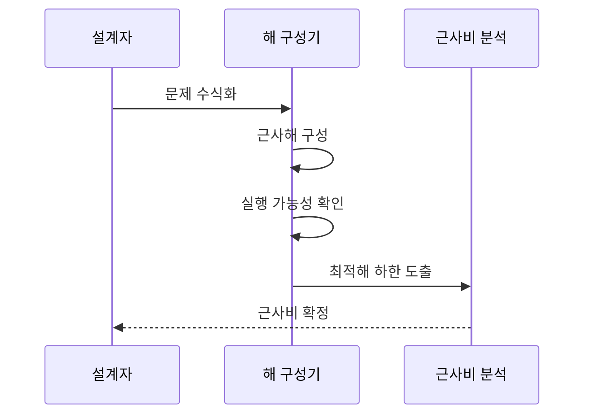

---
sidebar:
  order: 60
  label: "060. 근사 알고리즘 (Approximation Algorithm)"
  badge:
    text: "미출제 · 30%"
    variant: note
title: "근사 알고리즘 (Approximation Algorithm)"
date: "2026-07-26T22:16:20+09:00"
tags:
  - "notes-basic-theory"
weight: 60
extra:
  question_no: "060"
  source_status: "미출제"
  source_history: ""
  priority: 30
  priority_note: "근사비 기반 해 품질 판단"
---

## 미리 알고가기

- **근사 알고리즘(Approximation Algorithm)**: 모든 배송 경로를 다 따져 보려면 끝이 나지 않는 문제에서 몇 초 만에 경로를 뽑되 ‘최적 경로보다 두 배를 넘지는 않는다’처럼 품질 한계를 함께 증명해 주는 다항 시간 알고리즘
- **완전 탐색(Exhaustive Search)**: 가능한 모든 후보 해를 하나도 빠짐없이 만들어 보고 그중 최적을 고르는 방식으로, 후보 수가 입력 크기에 따라 지수적으로 늘어나 큰 입력에서는 끝나지 않음
- **최적해 하한(Lower Bound of OPT)**: 최적값을 실제로 구하지 않고도 ‘적어도 이 값보다는 크다’고 말할 수 있는 기준값으로, 근사비를 증명할 때 최적값 대신 이 값과 비교함
- **다항 시간(Polynomial Time)**: $n$은 ‘엔’으로 읽고 입력 크기를 나타내는 분야 관례에 따라 붙인 표기로, $n$의 고정 차수 다항식으로 실행 시간 상한을 나타낼 수 있는 계산 시간
- **근사비(Approximation Ratio, $\rho$)**: $\rho$는 그리스 문자 ‘로’로 읽고 근사비를 나타내는 분야 관례에 따라 붙인 표기로, 최악의 입력에서도 근사해가 최적해보다 얼마나 나빠질 수 있는지를 나타내는 품질 경계
- **근사값·최적값 기호($\mathrm{ALG}$·$\mathrm{OPT}$)**: $\mathrm{ALG}$는 ‘에이엘지’, $\mathrm{OPT}$는 ‘오피티’로 읽고 Algorithm과 Optimum을 줄인 표기로, 같은 입력에서 근사 알고리즘이 구한 목적값과 최적 목적값을 비교
- **허용 오차($\varepsilon$)**: $\varepsilon$은 그리스 문자 ‘엡실론’으로 읽고 작은 양의 오차를 나타내는 분야 관례에 따라 붙인 표기로, 근사해가 최적해에 얼마나 가까워야 하는지를 정함
- **이하 기호($\le$)**: $\le$는 ‘작거나 같다’로 읽고 상한 관계를 나타내는 표준 부등호로, 근사 목적값과 최적 목적값의 비가 $\rho$를 넘지 않는다는 품질 보장에 사용
- **다항 시간 근사 스킴(Polynomial-Time Approximation Scheme, PTAS)·완전 다항 시간 근사 스킴(Fully Polynomial-Time Approximation Scheme, FPTAS)**: ‘피티에이에스·에프피티에이에스’로 읽고 영문 머리글자를 딴 약어이며, PTAS는 $\varepsilon$을 고정했을 때 $n$에 대해 다항 시간이고 FPTAS는 $n$과 $1/\varepsilon$ 모두에 대해 다항 시간인 근사 스킴
- **휴리스틱(Heuristic)**: 경험 규칙으로 빠르게 해를 찾지만 일반적인 최악 품질 경계는 보장하지 않는 방법
- **목적 함수·제약 조건(Objective Function·Constraint)**: 목적 함수는 최소화·최대화할 값을 정하고 제약 조건은 허용되는 해의 범위를 제한함
- **실행 가능 해(Feasible Solution)**: 원래 문제의 모든 제약 조건을 만족하는 후보 해
- **탐욕법(Greedy Method)**: 매 단계에서 현재 기준으로 가장 이득인 선택을 확정하는 방법
- **완화(Relaxation)**: 제약을 풀어 계산하기 쉬운 문제로 변환
- **라운딩(Rounding)**: 연속 해를 정수 제약을 만족하는 해로 변환
- **비결정적 다항 시간 난해(Nondeterministic Polynomial-Time Hard, NP-Hard)**: ‘엔피 하드’로 읽고 NP는 비결정적 다항 시간의 머리글자이며, 모든 NP 문제 이상의 계산 난도를 가진 조건
- **정점 덮개(Vertex Cover)**: 그래프의 모든 간선이 선택된 정점 하나 이상과 맞닿게 하는 정점 집합
- **2-근사(2-approximation)**: 최소화 문제에서 근사해의 목적값이 최적값의 2배 이하임을 보장하는 성질

## Ⅰ. 개요

- 정의/개념: **NP-난해** 문제에서 **근사비**를 보장하는 다항 시간 해법
- 기존 한계: **완전 탐색**은 후보가 지수적으로 늘어 **다항 시간** 내 미완료

### 쉽게 이해하기 (학습용)
- 전국 배송 경로를 전부 따져 보면 평생이 걸리는 문제라도 ‘최적 경로보다 두 배 이상 길지는 않다’는 약속을 미리 증명해 두면, 몇 초 만에 뽑은 경로를 손해 범위를 알고 마음 놓고 쓸 수 있다

## Ⅱ. 특징

- **다항 시간** 안에 **실행 가능 해** 도출
- 최적해 대비 **근사비**로 최악 입력 **품질 보장**
- **PTAS**·**FPTAS**의 허용 오차와 계산 비용 상충

### 쉽게 이해하기 (학습용)
- 근사비는 ‘운이 가장 나쁜 입력에서도 이 선은 넘지 않는다’는 약속이라 평균이 아니라 최악을 재는 자이고, 그 선을 최적해 쪽으로 바짝 당길수록 계산 시간이 가파르게 늘어난다

## Ⅲ. 아키텍처 및 구성요소

| 설계 요소 | 설명 |
|:---|:---|
| 문제 모델 | **목적 함수**와 **제약 조건**의 형식 보유 |
| 해 구성기 | **탐욕법**·완화·라운딩으로 후보 해 산출 |
| 실행 가능성 검사 | 후보 해의 **제약 충족** 판정 |
| 근사비 분석 | **최적해 하한** 대비 최악 **근사비** 산출 |

$$\text{최소화}: \mathrm{ALG}/\mathrm{OPT}\le\rho,\quad \text{최대화}: \mathrm{OPT}/\mathrm{ALG}\le\rho$$

> 요약: 구성한 해를 최적해 하한과 비교해 **품질 경계** 확정

### 쉽게 이해하기 (학습용)
- 해 구성기가 규칙대로 후보를 하나 뽑아 오면 그 후보가 원래 제약을 정말 지키는지 먼저 확인하고, 최적해를 직접 구하지 않은 채 ‘최적값이 아무리 좋아도 이만큼은 된다’는 하한만 잡아 두 값을 나누면 최악의 경우 품질이 숫자로 나온다

## Ⅳ. 원리 및 절차 흐름도

| 절차 | 설명 |
|:---|:---|
| 문제 수식화 | **목적 함수**·**제약 조건** 정식화 |
| 근사해 구성 | **탐욕법**·완화·라운딩으로 후보 해 생성 |
| 실행 가능성 확인 | 후보 해의 원래 **제약 충족** 판정 |
| 최적해 하한 도출 | 최적값 계산 없이 **하한** 산정 |
| 근사비 확정 | 근사값·하한 비로 **최악 품질 경계** 확정 |

> 요약: **최적해 하한** 대비 비율로 **근사비** 증명

### 쉽게 이해하기 (학습용)
- 최적해를 모르는 채로 품질을 증명해야 하므로, 최적값이 아무리 좋아도 이 아래로는 못 내려간다는 하한을 먼저 잡아 두고 내가 구한 해가 그 하한의 몇 배인지만 재면 최악의 근사비가 나온다

## Ⅴ. 종류 및 비교

| 해법 유형 | 근사 알고리즘 | 정확 알고리즘 | 휴리스틱 |
|:---|:---|:---|:---|
| 적용 기준 | 품질 경계 증명이 필요한 **대규모 입력** | 최적해 필수·**소규모 입력** | 경계 없이 **응답 시간**이 최우선 |
| 핵심 특징 | **근사비** 보장 탐색 | **최적해** 탐색 | **경험 규칙** 탐색 |
| 한계 | 증명 상한이 실제보다 **느슨한 경계** | 입력 증가 시 **지수 시간** 폭증 | **최악 품질** 보장 부재 |

> 요약: 증명 가능한 **성능 보장**이 필요한지에 따라 방법 선택

### 쉽게 이해하기 (학습용)
- 근사는 품질 경계가 있는 해, 정확 알고리즘은 최적해, 휴리스틱은 경계 없는 빠른 해를 구한다

## Ⅵ. 실무 사례

1. 네트워크 링크 감시는 **2-근사 정점 덮개**로 감시 노드 선정

### 쉽게 이해하기 (학습용)
- 아직 아무도 지켜보지 않는 링크를 하나 집어 그 양 끝 장비를 함께 감시 대상에 넣기를 되풀이하면, 최적 배치보다 장비를 두 배 넘게 쓰는 일은 없으면서 모든 링크가 감시망에 들어온다

## Ⅶ. 결론

- **근사비** 상한이 허용 오차를 넘으면 **정확 알고리즘** 전환

### 쉽게 이해하기 (학습용)
- 두 배까지 나빠질 수 있다는 보장이 서비스가 감당할 손해보다 크면, 그때는 시간이 더 걸리더라도 최적해를 직접 구하는 쪽으로 돌아선다
