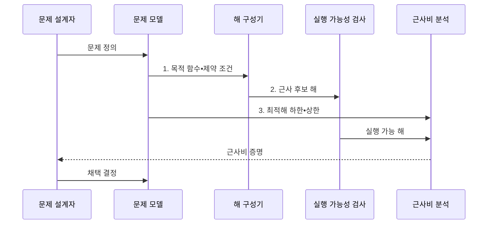

---
sidebar:
  order: 60
  label: "060. 근사 알고리즘 (Approximation Algorithm)"
  badge:
    text: "미출 • 30%"
    variant: note
title: "근사 알고리즘 (Approximation Algorithm)"
date: "2026-07-30T19:12:43+09:00"
tags:
  - "notes-basic-theory"
weight: 60
extra:
  question_no: "060"
  source_status: "미출"
  source_history: ""
  priority: 30
  priority_note: "근사비 기반 해 품질 판단"
---

## 미리 알고 가기

- **근사 알고리즘(Approximation Algorithm)**: 다항 시간에 해의 품질 한계를 보장하는 알고리즘
- **완전 탐색(Exhaustive Search)**: 모든 후보 해를 확인해 최적해를 찾는 방식
- **최적해 경계(Bound of OPT)**: 근사비 증명에 쓰는 최적값의 하한•상한
- **다항 시간(Polynomial Time)**: 입력 크기 $n$의 고정 차수 다항식으로 실행 시간 상한을 나타낼 수 있는 계산 시간이다.
- **근사비(Approximation Ratio, $\rho$)**: 최악의 근사해와 최적해 간 품질 비율
- **근사값•최적값 기호($\mathrm{ALG}$•$\mathrm{OPT}$)**: $\mathrm{ALG}$는 ‘에이엘지’, $\mathrm{OPT}$는 ‘오피티’로 읽고 Algorithm과 Optimum을 줄인 표기로, 같은 입력에서 근사 알고리즘이 구한 목적값과 최적 목적값을 비교
- **허용 오차($\varepsilon$)**: $\varepsilon$은 그리스 문자 ‘엡실론’으로 읽고 작은 양의 오차를 나타내는 분야 관례에 따라 붙인 표기로, 근사해가 최적해에 얼마나 가까워야 하는지를 정함
- **이하 기호($\le$)**: $\le$는 ‘작거나 같다’로 읽고 상한 관계를 나타내는 표준 부등호로, 근사 목적값과 최적 목적값의 비가 $\rho$를 넘지 않는다는 품질 보장에 사용
- **다항 시간 근사 스킴(Polynomial-Time Approximation Scheme, PTAS)•완전 다항 시간 근사 스킴(Fully Polynomial-Time Approximation Scheme, FPTAS)**: PTAS는 오차 한계 $\varepsilon$을 고정했을 때 입력 크기에 대해 다항 시간이고, FPTAS는 입력 크기와 $1/\varepsilon$ 모두에 대해 다항 시간인 근사 스킴
- **휴리스틱(Heuristic)**: 경험 규칙으로 빠르게 해를 찾지만 일반적인 최악 품질 경계는 보장하지 않는 방법
- **목적 함수•제약 조건(Objective Function•Constraint)**: 목적 함수는 최소화•최대화할 값을 정하고 제약 조건은 허용되는 해의 범위를 제한함
- **실행 가능 해(Feasible Solution)**: 원래 문제의 모든 제약 조건을 만족하는 후보 해
- **탐욕법(Greedy Method)**: 매 단계에서 현재 기준으로 가장 이득인 선택을 확정하는 방법
- **완화(Relaxation)**: 제약을 풀어 계산하기 쉬운 문제로 변환
- **라운딩(Rounding)**: 연속 해를 정수 제약을 만족하는 해로 변환
- **비결정적 다항 시간 난해(Nondeterministic Polynomial-Time Hard, NP-Hard)**: ‘엔피 하드’로 읽고 NP는 비결정적 다항 시간의 머리글자이며, 모든 NP 문제 이상의 계산 난도를 가진 조건
- **정점 덮개(Vertex Cover)**: 그래프의 모든 간선이 선택된 정점 하나 이상과 맞닿게 하는 정점 집합
- **2-근사(2-approximation)**: 최소화 문제에서 근사해의 목적값이 최적값의 2배 이하임을 보장하는 성질

## Ⅰ. 개요

- 정의/개념: **NP-난해** 문제의 **근사비**를 보장하는 해법
- 배경/필요성: **완전 탐색 지수 시간**으로 대규모 최적해 산출 불가

### 쉽게 이해하기 (학습용)
- 근사 알고리즘은 빠르게 구한 배송 경로가 최적 경로의 두 배를 넘지 않는다는 식으로 손해 한계를 보장한다.

## Ⅱ. 특징

- **다항 시간** 안에 **실행 가능 해** 도출
- 최적해 대비 **근사비**로 최악 입력 **품질 보장**
- **PTAS**•**FPTAS**의 허용 오차와 계산 비용 상충

### 쉽게 이해하기 (학습용)
- 배송 경로의 손해 상한 눈금을 최적선에 가까이 조일수록 계산 시계가 더 오래 도는 장면이다.

## Ⅲ. 구조 및 구성요소

| 구성요소 | 책임 |
|:---|:---|
| 문제 모델 | 목적 함수•제약 조건으로 **최적화 목표**와 실행 가능 영역 정의 |
| 해 구성기 | 탐욕법•완화•라운딩으로 **근사 후보 해** 산출 |
| 실행 가능성 검사 | 후보 해의 **원래 제약 충족** 여부 판정 |
| 근사비 분석 | 근사값•최적해 경계로 **최악 품질 경계** 산출 |

### 쉽게 이해하기 (학습용)
- 문제 설계도가 후보 공장을 지나 제약 검문소와 품질 저울에서 사용 가능 도장을 받는 장면이다.

## Ⅳ. 흐름도

$$\text{최소화}: \mathrm{ALG}/\mathrm{OPT}\le\rho,\quad \text{최대화}: \mathrm{OPT}/\mathrm{ALG}\le\rho$$

**동작 원리**

- **1. 목적 함수•제약 조건**: 최적화 목표와 허용 해 정의
- **2. 근사 후보 해**: 탐욕법•완화•라운딩 산출물
- **3. 최적해 하한•상한**: 근사비 증명의 비교 기준

### 쉽게 이해하기 (학습용)
- 후보 해가 제약 검문소를 통과한 뒤 최적해 경계 추와 품질 저울에서 비교되는 장면이다.

## Ⅴ. 종류 및 비교

| 해법 유형 | 근사 알고리즘 | 정확 알고리즘 | 휴리스틱 |
|:---|:---|:---|:---|
| 적용 기준 | **대규모 입력**에 품질 보장이 필요한 경우 | **소규모 입력**에 최적해가 필요한 경우 | 품질 보장보다 **응답 시간**이 중요한 경우 |
| 핵심 특징 | **근사비** 보장 탐색 | **최적해** 탐색 | **경험 규칙** 탐색 |
| 한계 | 증명 상한이 실제보다 **느슨한 경계** | 입력 증가 시 **지수 시간** 폭증 | **최악 품질** 보장 부재 |

> 요약: 증명 가능한 **성능 보장**이 필요한지에 따라 방법 선택

### 쉽게 이해하기 (학습용)
- 근사는 보증서 있는 빠른 상품, 정확 해법은 완벽하지만 늦은 주문품, 휴리스틱은 보증 없는 즉석품인 장면이다.

## Ⅵ. 실무 고려사항 및 대책

| 고려사항 | 대책 | 효과 |
|:---|:---|:---|
| 근사해가 **원래 제약을 위반** | 실행 가능성 검사와 **복구 절차** 적용 | **사용 가능한 해** 보장 |
| 증명 근사비가 **업무 허용 오차 초과** | 정확 알고리즘•**PTAS•FPTAS** 대안 비교 | **품질 요구** 충족 |
| 이론 보장보다 **실제 해가 지속적으로 나쁨** | 대표•최악 입력 벤치마크와 **하한 강화** | **품질 경계 실효성** 검증 |
| 작은 입력에도 **근사만 사용** | 입력 규모 기준으로 **정확 해법 전환** | **불필요한 품질 손실** 방지 |

### 쉽게 이해하기 (학습용)
- 모든 간선에 선택 정점 스티커가 닿는지 확인하고 선택 수가 최적 하한의 두 배 이내인지 재는 장면이다.

## Ⅶ. 결론

- **근사비**가 허용 오차를 넘으면 **정확 알고리즘** 전환

### 쉽게 이해하기 (학습용)
- 품질 보증서의 손해 상한이 서비스 허용선을 넘으면 느린 정확 해법 스위치를 켜는 장면이다.
