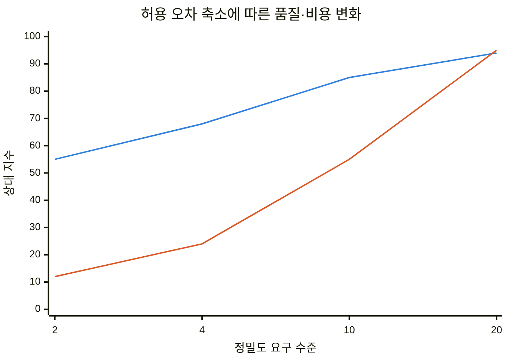
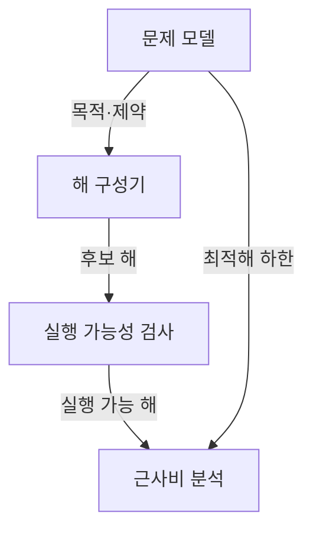
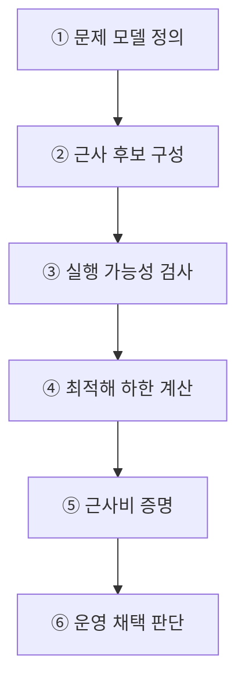
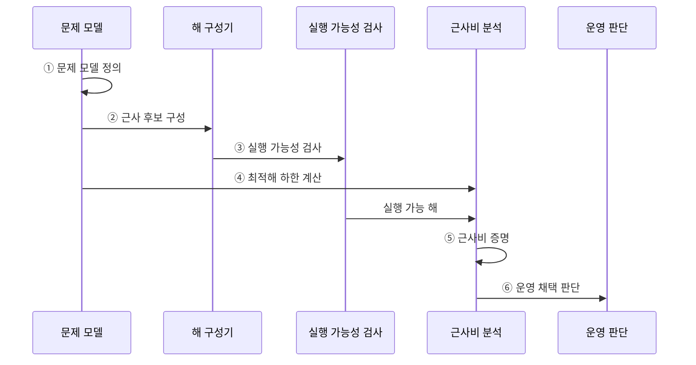

---
sidebar:
  order: 60
  label: "060. 근사 알고리즘 (Approximation Algorithm)"
  badge:
    text: "미출 · 30%"
    variant: note
title: "근사 알고리즘 (Approximation Algorithm)"
date: "2026-07-28T17:55:00+09:00"
tags:
  - "notes-basic-theory"
weight: 60
extra:
  question_no: "060"
  source_status: "미출"
  source_history: ""
  priority: 30
  priority_note: "근사비 기반 해 품질 판단"
---

## 미리 알고가기

- **근사 알고리즘(Approximation Algorithm)**: 최적해를 다항 시간에 구하기 어려운 최적화 문제에서 해의 품질 한계를 보장하며 근사해를 구하는 다항 시간 알고리즘
- **완전 탐색(Exhaustive Search)**: 가능한 모든 후보 해를 하나도 빠짐없이 만들어 보고 그중 최적을 고르는 방식으로, 후보 수가 입력 크기에 따라 지수적으로 늘어나 큰 입력에서는 끝나지 않음
- **최적해 하한(Lower Bound of OPT)**: 최적값을 실제로 구하지 않고도 ‘적어도 이 값보다는 크다’고 말할 수 있는 기준값으로, 근사비를 증명할 때 최적값 대신 이 값과 비교함
- **다항 시간(Polynomial Time)**: 입력 크기 $n$의 고정 차수 다항식으로 실행 시간 상한을 나타낼 수 있는 계산 시간이다.
- **근사비(Approximation Ratio, $\rho$)**: $\rho$는 그리스 문자 ‘로’로 읽고 근사비를 나타내는 분야 관례에 따라 붙인 표기로, 최악의 입력에서도 근사해가 최적해보다 얼마나 나빠질 수 있는지를 나타내는 품질 경계
- **근사값·최적값 기호($\mathrm{ALG}$·$\mathrm{OPT}$)**: $\mathrm{ALG}$는 ‘에이엘지’, $\mathrm{OPT}$는 ‘오피티’로 읽고 Algorithm과 Optimum을 줄인 표기로, 같은 입력에서 근사 알고리즘이 구한 목적값과 최적 목적값을 비교
- **허용 오차($\varepsilon$)**: $\varepsilon$은 그리스 문자 ‘엡실론’으로 읽고 작은 양의 오차를 나타내는 분야 관례에 따라 붙인 표기로, 근사해가 최적해에 얼마나 가까워야 하는지를 정함
- **이하 기호($\le$)**: $\le$는 ‘작거나 같다’로 읽고 상한 관계를 나타내는 표준 부등호로, 근사 목적값과 최적 목적값의 비가 $\rho$를 넘지 않는다는 품질 보장에 사용
- **다항 시간 근사 스킴(Polynomial-Time Approximation Scheme, PTAS)·완전 다항 시간 근사 스킴(Fully Polynomial-Time Approximation Scheme, FPTAS)**: PTAS는 오차 한계 $\varepsilon$을 고정했을 때 입력 크기에 대해 다항 시간이고, FPTAS는 입력 크기와 $1/\varepsilon$ 모두에 대해 다항 시간인 근사 스킴
- **휴리스틱(Heuristic)**: 경험 규칙으로 빠르게 해를 찾지만 일반적인 최악 품질 경계는 보장하지 않는 방법
- **목적 함수·제약 조건(Objective Function·Constraint)**: 목적 함수는 최소화·최대화할 값을 정하고 제약 조건은 허용되는 해의 범위를 제한함
- **실행 가능 해(Feasible Solution)**: 원래 문제의 모든 제약 조건을 만족하는 후보 해
- **탐욕법(Greedy Method)**: 매 단계에서 현재 기준으로 가장 이득인 선택을 확정하는 방법
- **완화(Relaxation)**: 제약을 풀어 계산하기 쉬운 문제로 변환
- **라운딩(Rounding)**: 연속 해를 정수 제약을 만족하는 해로 변환
- **비결정적 다항 시간 난해(Nondeterministic Polynomial-Time Hard, NP-Hard)**: ‘엔피 하드’로 읽고 NP는 비결정적 다항 시간의 머리글자이며, 모든 NP 문제 이상의 계산 난도를 가진 조건
- **정점 덮개(Vertex Cover)**: 그래프의 모든 간선이 선택된 정점 하나 이상과 맞닿게 하는 정점 집합
- **2-근사(2-approximation)**: 최소화 문제에서 근사해의 목적값이 최적값의 2배 이하임을 보장하는 성질

## Ⅰ. 개요

- 정의/개념: **NP-난해** 문제의 **근사비**를 보장하는 해법
- 기존 한계: **완전 탐색**은 후보가 지수적으로 증가

### 쉽게 이해하기 (학습용)
- 전국 배송 경로를 전부 따져 보면 평생이 걸리는 문제라도 ‘최적 경로보다 두 배 이상 길지는 않다’는 약속을 미리 증명해 두면, 몇 초 만에 뽑은 경로를 손해 범위를 알고 마음 놓고 쓸 수 있다

## Ⅱ. 특징

- **다항 시간** 안에 **실행 가능 해** 도출
- 최적해 대비 **근사비**로 최악 입력 **품질 보장**
- **PTAS**·**FPTAS**의 허용 오차와 계산 비용 상충

### 쉽게 이해하기 (학습용)
- 근사비는 ‘운이 가장 나쁜 입력에서도 이 선은 넘지 않는다’는 약속이라 평균이 아니라 최악을 재는 자이고, 그 선을 최적해 쪽으로 바짝 당길수록 계산 시간이 가파르게 늘어난다

## Ⅲ. 아키텍처

허용 오차를 줄이면 해의 품질은 좋아지지만 계산 비용도 함께 증가한다. 다음 값은 이 상충 관계를 설명하기 위한 개념 예시다.

■ **근사해 품질** &nbsp;&nbsp; ■ **계산 비용**

> $1/\varepsilon$ 증가로 최적해에 접근하지만 더 작은 허용 오차일수록 계산 비용이 급증

| 구성요소 | 책임 |
|:---|:---|
| 문제 모델 | 목적 함수·제약 조건으로 **최적화 목표**와 실행 가능 영역 정의 |
| 해 구성기 | 탐욕법·완화·라운딩으로 **근사 후보 해** 산출 |
| 실행 가능성 검사 | 후보 해의 **원래 제약 충족** 여부 판정 |
| 근사비 분석 | 근사값·최적해 하한으로 **최악 품질 경계** 산출 |

$$\text{최소화}: \mathrm{ALG}/\mathrm{OPT}\le\rho,\quad \text{최대화}: \mathrm{OPT}/\mathrm{ALG}\le\rho$$

**동작 원리**

- ① **문제 모델**이 최소화·최대화 목적과 **제약 조건**을 정의한다.
- ② **해 구성기**가 탐욕법·완화·라운딩으로 **근사 후보**를 만든다.
- ③ **실행 가능성 검사**가 후보가 원래 제약을 모두 만족하는지 검증한다.
- ④ 문제 구조나 완화해로 직접 구할 수 있는 **최적해 하한**을 계산한다.
- ⑤ 근사값과 하한을 비교해 최악의 **근사비**와 **품질 경계**를 증명한다.
- ⑥ 허용 오차·실행 시간과 비교해 근사해 채택 또는 **정확 해법 전환**을 판단한다.

### 쉽게 이해하기 (학습용)
- 해 구성기가 규칙대로 후보를 하나 뽑아 오면 그 후보가 원래 제약을 정말 지키는지 먼저 확인하고, 최적해를 직접 구하지 않은 채 ‘최적값이 아무리 좋아도 이만큼은 된다’는 하한만 잡아 두 값을 나누면 최악의 경우 품질이 숫자로 나온다

## Ⅳ. 종류 및 비교

| 해법 유형 | 근사 알고리즘 | 정확 알고리즘 | 휴리스틱 |
|:---|:---|:---|:---|
| 적용 기준 | **대규모 입력**에 품질 보장이 필요한 경우 | **소규모 입력**에 최적해가 필요한 경우 | 품질 보장보다 **응답 시간**이 중요한 경우 |
| 핵심 특징 | **근사비** 보장 탐색 | **최적해** 탐색 | **경험 규칙** 탐색 |
| 한계 | 증명 상한이 실제보다 **느슨한 경계** | 입력 증가 시 **지수 시간** 폭증 | **최악 품질** 보장 부재 |

> 요약: 증명 가능한 **성능 보장**이 필요한지에 따라 방법 선택

### 쉽게 이해하기 (학습용)
- 근사는 품질 경계가 있는 해, 정확 알고리즘은 최적해, 휴리스틱은 경계 없는 빠른 해를 구한다

## Ⅴ. 실무 고려사항 및 대책

| 고려사항 | 대책 | 효과 |
|:---|:---|:---|
| 근사해가 **원래 제약을 위반** | 실행 가능성 검사와 **복구 절차** 적용 | **사용 가능한 해** 보장 |
| 증명 근사비가 **업무 허용 오차 초과** | 정확 알고리즘·**PTAS·FPTAS** 대안 비교 | **품질 요구** 충족 |
| 이론 보장보다 **실제 해가 지속적으로 나쁨** | 대표·최악 입력 벤치마크와 **하한 강화** | **품질 경계 실효성** 검증 |
| 작은 입력에도 **근사만 사용** | 입력 규모 기준으로 **정확 해법 전환** | **불필요한 품질 손실** 방지 |

### 쉽게 이해하기 (학습용)
- 실행 가능성·근사비·실행 시간을 함께 측정한다. 네트워크 링크 감시는 2-근사 정점 덮개로 최적 배치의 두 배 이하 노드를 선택하면서 모든 링크를 포함할 수 있다.

## Ⅵ. 결론

- **근사비** 상한이 허용 오차를 넘으면 **정확 알고리즘** 전환

### 쉽게 이해하기 (학습용)
- 두 배까지 나빠질 수 있다는 보장이 서비스가 감당할 손해보다 크면, 그때는 시간이 더 걸리더라도 최적해를 직접 구하는 쪽으로 돌아선다
