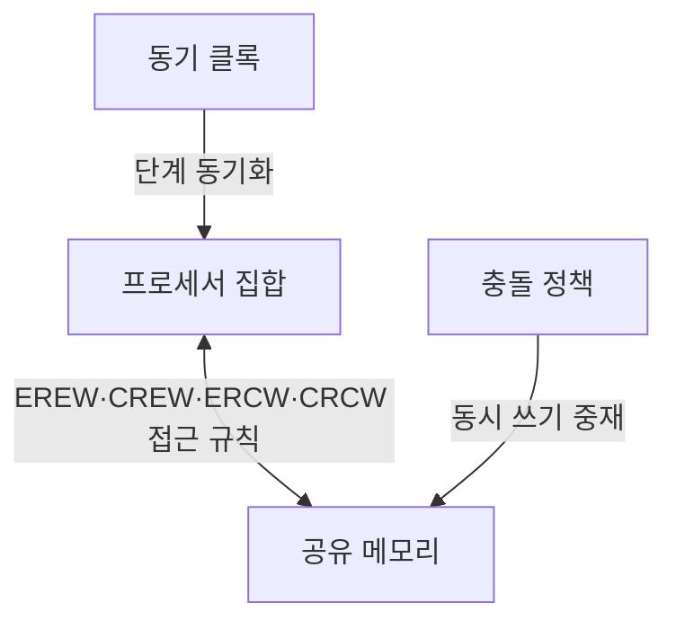
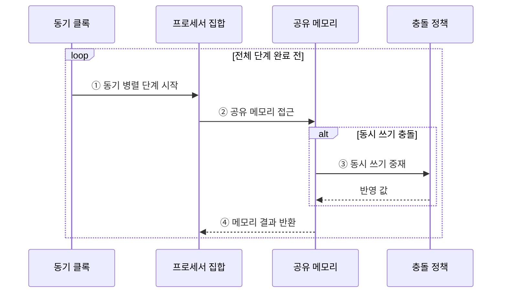

---
sidebar:
  order: 61
  label: "061. 병렬 알고리즘 — PRAM 모델"
  badge:
    text: "미출 · 30%"
    variant: note
title: "병렬 알고리즘 — PRAM 모델"
date: "2026-07-28T21:27:55+09:00"
tags:
  - "notes-basic-theory"
weight: 61
extra:
  question_no: "061"
  source_status: "미출"
  source_history: ""
  priority: 30
  priority_note: "병렬 시간·비용·효율 분석 우선"
---

## 미리 알고가기

- **병렬 임의 접근 기계(Parallel Random Access Machine, PRAM)**: 동기 프로세서와 공유 메모리를 가정한 병렬 분석 모델
- **병렬 알고리즘**: 독립 작업을 여러 처리 장치에서 동시 수행
- **총 연산량(Work)**: 모든 프로세서의 연산 수 합계
- **스팬(Span)**: 병렬화할 수 없는 최장 의존 경로 길이
- **병렬 시간(Parallel Time, $T_p$)**: $p$개 프로세서가 작업을 완료할 때까지의 동기 단계 수다.
- **프로세서·순차 시간 기호($p$·$T_1$)**: $p$는 프로세서 수이고 $T_1$은 프로세서 한 개로 실행한 순차 시간이다.
- **총 연산량·스팬 기호($W$·$S$)**: 모든 연산 수의 합과 병렬화할 수 없는 임계 경로 길이를 나타낸다.
- **병렬 시간 하한($T_p \ge \max(W/p,S)$)**: 연산 분배 시간과 스팬으로 정한 병렬 시간의 하한
- **비용·효율(Cost·Efficiency)**: 전체 프로세서 시간 $pT_p$와 자원 기여율 $T_1/(pT_p)$
- **배타 읽기·배타 쓰기(Exclusive Read Exclusive Write, EREW)**: 동일 메모리 위치의 읽기와 쓰기를 한 번에 하나의 프로세서에만 허용하는 PRAM 모델
- **동시 읽기·배타 쓰기(Concurrent Read Exclusive Write, CREW)**: 여러 프로세서의 동시 읽기는 허용하고 동일 메모리 위치의 쓰기는 하나만 허용하는 PRAM 모델
- **배타 읽기·동시 쓰기(Exclusive Read Concurrent Write, ERCW)**: 동일 메모리 위치의 읽기는 하나만 허용하고 동시 쓰기는 충돌 정책으로 중재하는 PRAM 모델
- **동시 읽기·동시 쓰기(Concurrent Read Concurrent Write, CRCW)**: 동일 메모리 위치의 동시 읽기와 동시 쓰기를 모두 허용하고 쓰기 충돌을 정책으로 중재하는 PRAM 모델
- **충돌 정책(Conflict Policy)**: 여러 프로세서가 같은 주소에 동시에 쓸 때 반영할 값을 정하는 규칙
- **리덕션 트리(Reduction Tree)**: 부분 결과를 트리로 병합하는 병렬 구조
- **워크 스틸링(Work Stealing)**: 유휴 실행 단위가 다른 큐의 대기 작업을 가져와 부하를 분산하는 방식
- **메모리 경합(Memory Contention)**: 여러 프로세서가 같은 메모리 자원에 접근해 대기 시간이 늘어나는 현상
- **동기화(Synchronization)**: 여러 실행 단위가 특정 단계나 공유 상태의 순서를 맞추도록 기다리고 조정하는 동작
- **직렬화(Serialization)**: 충돌하는 병렬 작업을 한 번에 하나씩 처리하도록 순서를 강제하는 동작
- **로컬 집계(Local Aggregation)**: 각 프로세서가 자기 데이터의 부분 결과를 먼저 계산한 뒤 공유 메모리에는 요약값만 쓰는 방식
- **동적 스케줄링(Dynamic Scheduling)**: 실행 중 작업량과 유휴 프로세서를 관찰해 대기 작업을 다시 배정하는 방식
- **장벽 병합(Barrier Coalescing)**: 인접한 여러 동기화 지점을 하나로 합쳐 프로세서의 대기 횟수를 줄이는 최적화

## Ⅰ. 개요

- 정의/개념: **동기 프로세서**·**공유 메모리** 가정의 병렬 분석 모델
- 기존 한계: 실측은 장비마다 달라져 **병렬 시간**·**효율** 비교 불가

### 쉽게 이해하기 (학습용)

- PRAM은 여러 작업자가 같은 창고를 한 박자씩 쓴다고 가정해 알고리즘 자체의 병렬 단계 수를 비교한다.

## Ⅱ. 특징

- **동기 단계**와 **단위 시간** 메모리 접근 가정의 추상화
- **EREW**·**CRCW** 등 유형별 동시 접근 제약 차이
- **병렬 시간**·총 연산량·**효율** 기반 확장성 평가

$$T_p \ge \max(W/p,\ S),\quad \text{효율}=\frac{T_1}{p\,T_p}$$

### 쉽게 이해하기 (학습용)

- 병렬 시간은 일을 프로세서에 나눈 시간과 건너뛸 수 없는 최장 의존 사슬보다 짧을 수 없다.

## Ⅲ. 아키텍처

**도표안 A — 구조도**

**도표안 B — sequenceDiagram**

| 구성요소 | 책임 |
|:---|:---|
| 프로세서 집합 | 분할 작업의 **동기 단계별 연산**과 메모리 접근 수행 |
| 공유 메모리 | 프로세서 간 **공용 데이터·부분 결과** 공유 |
| 동기 클록 | 모든 프로세서의 **단계 시작·종료** 시점 정렬 |
| 충돌 정책 | 동시 쓰기 요청에서 **반영할 값** 선택 |

**동작 원리**

- **① 동기 병렬 단계 시작**: 동기 클록으로 모든 프로세서의 실행 시점을 같은 단계에 정렬
- **② 공유 메모리 접근**: 프로세서별 분할 연산에 필요한 공유 데이터를 읽거나 부분 결과 쓰기
- **③ 동시 쓰기 중재**: CRCW·ERCW에서 우선·공통·임의 등 지정한 정책으로 반영할 값 선택
- **④ 메모리 결과 반환**: 허용된 쓰기 값을 저장하고 읽기 결과를 요청한 프로세서에 전달

### 쉽게 이해하기 (학습용)

- 여러 작업자가 같은 창고를 한 박자씩 쓰고 같은 칸에 쓰려 하면 정해진 규칙으로 하나를 선택한다

## Ⅳ. 종류 및 비교

| PRAM 모델 | EREW | CREW | ERCW | CRCW |
|:---|:---|:---|:---|:---|
| 적용 기준 | 읽기·쓰기 **주소 충돌**이 없는 경우 | **공통 입력**만 동시에 읽는 경우 | 개별 입력을 **단일 주소**에 모으는 경우 | **동시 읽기·쓰기**가 모두 필요한 경우 |
| 핵심 특징 | 읽기·쓰기 모두 **배타** | 읽기 **공유**·쓰기 배타 | 읽기 배타·쓰기 **공유** | 읽기·쓰기 모두 **공유** |
| 한계 | 접근 제한에 따른 **단계 수** 증가 | 쓰기 경합의 별도 **직렬화** 비용 | 실용 사례 드문 **비대칭 제약** | **충돌 해결 정책**별 결과 차이 |

> 요약: 제약이 느슨할수록 **시간 복잡도** 감소, **구현 난도** 상승

### 쉽게 이해하기 (학습용)

- 동시 읽기·쓰기를 더 허용할수록 단계 수는 줄지만 충돌을 처리할 구현 비용은 커진다.

## Ⅴ. 실무 고려사항 및 대책

| 고려사항 | 대책 | 효과 |
|:---|:---|:---|
| 프로세서 증설에도 **시간이 줄지 않음** | **스팬 분석**과 의존 작업 재분할 | **직렬 임계 경로** 단축 |
| 공유 주소 경합으로 **대기 증가** | 데이터 분할·**리덕션 트리**·로컬 집계 | **메모리 충돌** 완화 |
| 작업량 편차로 일부 **프로세서 유휴** | **워크 스틸링**·동적 스케줄링 | **부하 균형** 향상 |
| 동기화 단계가 **지나치게 잦음** | 배치 크기 확대·**장벽 병합** | **동기화 비용** 감소 |

### 쉽게 이해하기 (학습용)

- 병렬 집계에서 병렬 시간·스팬·효율과 메모리 경합을 함께 측정하고 프로세서별 부분 합을 리덕션 트리로 병합해 공유 주소 쓰기 충돌을 줄인다.

## Ⅵ. 결론

- 증설 후 효율이 낮아지면 프로세서 추가보다 **분할·배치 재설계** 선택

### 쉽게 이해하기 (학습용)

- 프로세서를 늘려도 의존 시간·경합이 줄지 않으면 분할 단위와 데이터 배치를 바꾼다
