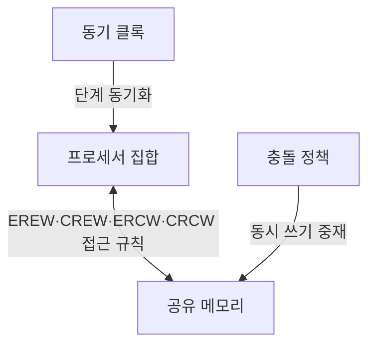
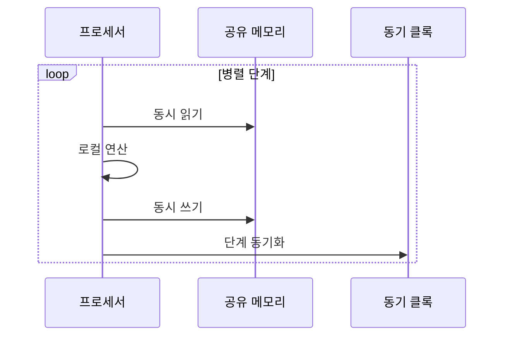

---
sidebar:
  order: 61
  label: "061. 병렬 알고리즘 — PRAM 모델"
  badge:
    text: "미출제 · 30%"
    variant: note
title: "병렬 알고리즘 — PRAM 모델"
date: "2026-07-26T00:44:00+09:00"
tags:
  - "notes-basic-theory"
weight: 61
extra:
  question_no: "061"
  source_status: "미출제"
  source_history: ""
  priority: 30
  priority_note: "병렬 시간·비용·효율 분석 우선"
---

## 미리 알고가기

- **병렬 임의 접근 기계(Parallel Random Access Machine, PRAM)**: ‘피램’으로 읽고 영문 머리글자를 단어처럼 만든 약어이며, 여러 작업자가 창고 하나를 함께 쓰되 모두 같은 박자에 맞춰 한 걸음씩 움직인다고 가정하듯 동기 프로세서의 공유 메모리 접근을 분석하는 추상 모델
- **병렬 알고리즘**: 독립 작업을 여러 처리 장치에서 동시 수행
- **총 연산량(Work)**: 모든 프로세서의 연산 수 합계
- **스팬(Span)**: 아무리 프로세서를 늘려도 줄일 수 없는 의존 사슬의 최장 경로 길이이며, 임계 경로 길이라고도 부른다.
- **병렬 시간(Parallel Time, $T_p$)**: $T_p$는 ‘티 서브 피’로 읽고 Time의 첫 글자 $T$에 Processor 수 $p$를 아래 첨자로 붙인 표기로, $p$개 프로세서가 완료할 때까지의 동기 단계 수
- **프로세서·순차 시간 기호($p$·$T_1$)**: $p$는 ‘피’, $T_1$은 ‘티 서브 원’으로 읽고 Processor와 Time을 줄인 표기로, $p$는 프로세서 수이고 $T_1$은 프로세서 한 개로 실행한 순차 시간
- **총 연산량·스팬 기호($W$·$S$)**: $W$는 ‘더블유’, $S$는 ‘에스’로 읽고 Work와 Span의 첫 글자를 딴 표기로, 모든 연산 수의 합과 병렬화할 수 없는 스팬을 나타냄
- **병렬 시간 하한($T_p \ge \max(W/p,S)$)**: 식은 ‘티 서브 피는 더블유 나누기 피와 에스 중 큰 값 이상’으로 읽고 표준 부등호·최댓값 표기로 병렬 시간의 하한을 나타내며, 연산량 분배 시간과 스팬보다 빠를 수 없음을 판정
- **비용·효율(Cost·Efficiency)**: $pT_p$는 ‘피 곱하기 티 서브 피’, $T_1/(pT_p)$는 ‘티 서브 원 나누기 괄호 피 곱하기 티 서브 피 괄호’로 읽고 곱셈·비율을 나타내는 표준 표기로, 각각 전체 프로세서 시간과 투입 자원이 실제 속도 향상에 기여한 비율을 계산
- **배타 읽기·배타 쓰기(Exclusive Read Exclusive Write, EREW)**: ‘이알이더블유’로 읽고 접근 방식의 영문 머리글자를 딴 약어이며, 읽기·쓰기를 모두 한 프로세서만 수행
- **동시 읽기·배타 쓰기(Concurrent Read Exclusive Write, CREW)**: ‘시알이더블유’로 읽고 영문 머리글자를 딴 약어이며, 여러 프로세서가 함께 읽되 쓰기는 하나만 수행
- **배타 읽기·동시 쓰기(Exclusive Read Concurrent Write, ERCW)**: ‘이알시더블유’로 읽고 영문 머리글자를 딴 약어이며, 읽기는 하나만 수행하고 동시 쓰기는 충돌 정책으로 중재
- **동시 읽기·동시 쓰기(Concurrent Read Concurrent Write, CRCW)**: ‘시알시더블유’로 읽고 영문 머리글자를 딴 약어이며, 동시 읽기와 동시 쓰기를 허용하고 쓰기 충돌을 중재
- **충돌 정책(Conflict Policy)**: 여러 프로세서가 같은 주소에 동시에 쓸 때 반영할 값을 정하는 규칙
- **리덕션 트리(Reduction Tree)**: 부분 결과를 트리로 병합하는 병렬 구조
- **워크 스틸링(Work Stealing)**: 유휴 실행 단위가 다른 큐의 대기 작업을 가져와 부하를 분산하는 방식
- **메모리 경합(Memory Contention)**: 여러 프로세서가 같은 메모리 자원에 접근해 대기 시간이 늘어나는 현상
- **동기화(Synchronization)**: 여러 실행 단위가 특정 단계나 공유 상태의 순서를 맞추도록 기다리고 조정하는 동작
- **직렬화(Serialization)**: 충돌하는 병렬 작업을 한 번에 하나씩 처리하도록 순서를 강제하는 동작

## Ⅰ. 개요

- 정의/개념: **동기 프로세서**·**공유 메모리** 가정의 병렬 분석 모델
- 기존 한계: 실측은 장비마다 달라져 **병렬 시간**·**효율** 비교 불가

### 쉽게 이해하기 (학습용)

- 여러 작업자가 창고 하나를 함께 쓰되 모두 같은 박자에 맞춰 한 걸음씩 움직인다고 못 박아 두면, 장비마다 다른 통신 속도를 계산에서 지우고 알고리즘 자체가 몇 박자에 끝나는지만 견줄 수 있다

## Ⅱ. 특징

- **동기 단계**와 **단위 시간** 메모리 접근 가정의 추상화
- **EREW**·**CRCW** 등 유형별 동시 접근 제약 차이
- **병렬 시간**·총 연산량·**효율** 기반 확장성 평가

$$T_p \ge \max(W/p,\ S),\quad \text{효율}=\frac{T_1}{p\,T_p}$$

### 쉽게 이해하기 (학습용)

- 작업자를 아무리 늘려도 일을 골고루 나눠 가진 시간과 순서를 건너뛸 수 없는 가장 긴 사슬 중 더 긴 쪽보다 빨라질 수는 없어서, 창고 접근이 공짜라고 보는 PRAM 안에서도 넘지 못하는 선이 먼저 그어진다

## Ⅲ. 아키텍처 및 구성요소

| 설계 요소 | 설명 |
|:---|:---|
| 프로세서 집합 | **동기 단계**별 연산과 메모리 접근 수행 |
| 공유 메모리 | 모든 프로세서가 **단위 시간**에 접근하는 데이터 공간 |
| 동기 클록 | 병렬 단계의 시작·종료 시점 **정렬** |
| 충돌 정책 | **동시 쓰기**에서 반영할 값 선택 |

> 요약: **동기 클록**으로 단계를 맞추고 **충돌 정책**으로 쓰기 중재

### 쉽게 이해하기 (학습용)

- 여러 작업자가 같은 창고를 한 박자씩 쓰고 같은 칸에 쓰려 하면 정해진 규칙으로 하나를 선택한다

## Ⅳ. 원리 및 절차 흐름도

| 절차 | 설명 |
|:---|:---|
| 동시 읽기 | 유형에 따라 **배타**·공유 방식으로 읽기 |
| 로컬 연산 | 각 프로세서가 읽은 값으로 **독립 연산** |
| 동시 쓰기 | 유형별 **충돌 정책**에 따른 값 반영 |
| 단계 동기화 | 최장 프로세서 완료까지 대기 후 **다음 단계** |

> 요약: 읽기·연산·쓰기 후 **단계 동기화** 반복

### 쉽게 이해하기 (학습용)

- 모두가 읽고 계산해 쓴 뒤 가장 늦은 작업자까지 기다렸다가 다음 박자를 시작한다

## Ⅴ. 종류 및 비교

| PRAM 모델 | EREW | CREW | ERCW | CRCW |
|:---|:---|:---|:---|:---|
| 적용 기준 | 읽기·쓰기 **주소 충돌** 없는 알고리즘 | **공통 입력**의 동시 읽기만 필요 | 개별 입력의 **단일 주소** 집계 | 동시 읽기와 **동시 쓰기** 모두 필요 |
| 핵심 특징 | 읽기·쓰기 모두 **배타** | 읽기 공유·쓰기 배타 | 읽기 배타·쓰기 공유 | 읽기·쓰기 모두 **공유** |
| 한계 | 접근 제한에 따른 **단계 수** 증가 | 쓰기 경합의 별도 **직렬화** 비용 | 실용 사례 드문 **비대칭 제약** | **충돌 해결 정책**별 결과 차이 |

> 요약: 제약이 느슨할수록 **시간 복잡도** 감소, **구현 난도** 상승

### 쉽게 이해하기 (학습용)

- 같은 칸을 함께 읽어도 되는지와 함께 써도 되는지를 각각 예·아니오로 조합해 네 규칙이 나오는데, 규칙이 느슨할수록 알고리즘은 적은 박자에 끝나지만 그런 창고를 실제 하드웨어로 만드는 값은 비싸진다

## Ⅵ. 실무 사례

1. 스레드 풀 런타임은 **워크 스틸링**으로 유휴 코어 재투입
2. 메트릭 집계는 **리덕션 트리**로 **스팬** 단축

### 쉽게 이해하기 (학습용)

- 일이 끝난 스레드는 바쁜 스레드의 큐에서 대기 작업을 가져온다
- 코어별 부분합은 둘씩 합치는 트리로 병합해 순차 덧셈의 긴 의존 경로를 줄인다

## Ⅶ. 결론

- **스팬**·경합 병목은 증설보다 **분할·배치 재설계**

### 쉽게 이해하기 (학습용)

- 프로세서를 늘려도 의존 시간·경합이 줄지 않으면 분할 단위와 데이터 배치를 바꾼다
