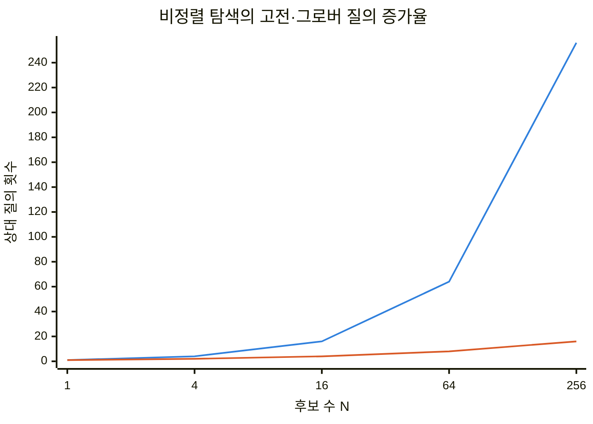
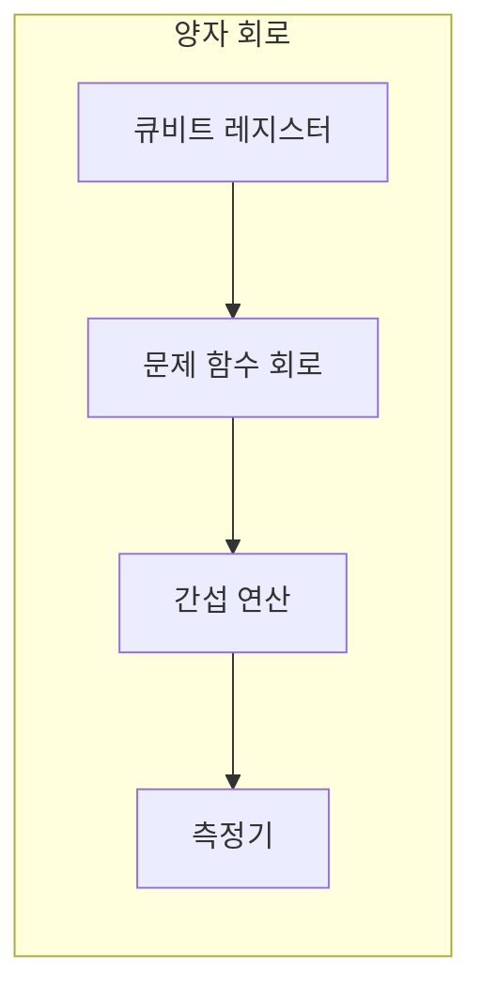
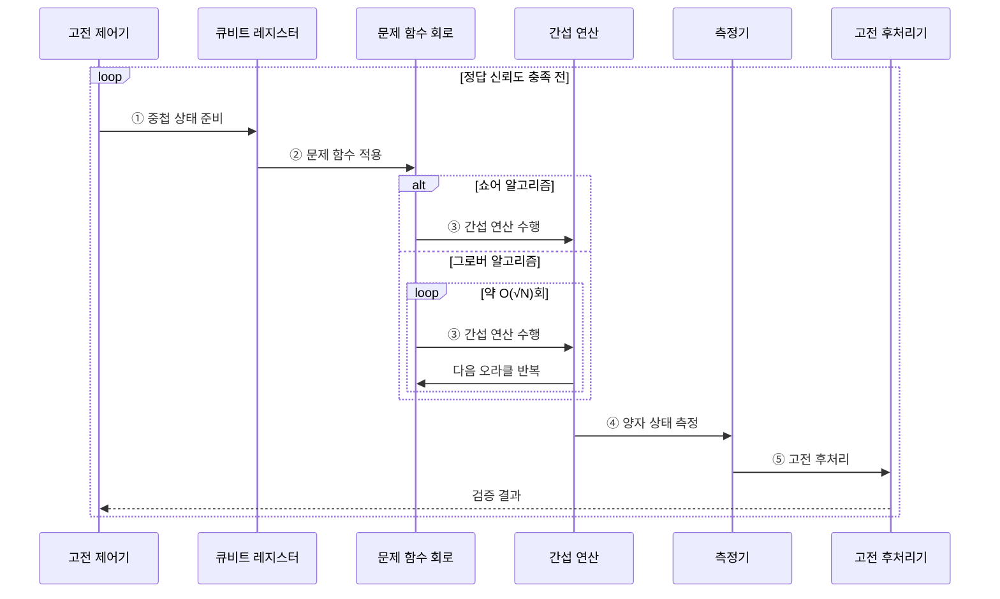

---
sidebar:
  order: 62
  label: "062. 양자 알고리즘 — 쇼어·그로버"
  badge:
    text: "미출 · 70%"
    variant: note
title: "양자 알고리즘 — 쇼어·그로버"
date: "2026-07-28T21:27:55+09:00"
tags:
  - "notes-basic-theory"
weight: 62
extra:
  question_no: "062"
  source_status: "미출"
  source_history: ""
  priority: 70
  priority_note: "양자 흐름과 쇼어·그로버 비교 중심"
---

## 미리 알고가기

- **양자 알고리즘(Quantum Algorithm)**: 물결 여러 개를 겹칠 때 마루끼리 만나면 커지고 마루와 골이 만나면 서로 지워지듯, 정답 쪽 확률만 겹쳐 키우고 오답 쪽은 지운 뒤 마지막에 한 번 측정해 답을 얻는 계산 방식
- **쇼어 알고리즘(Shor's Algorithm)**: 주기 찾기로 소인수분해·이산 로그를 푸는 양자 알고리즘
- **그로버 알고리즘(Grover's Algorithm)**: 비정렬 후보에서 오라클로 표시된 정답을 찾는 양자 알고리즘
- **큐비트(Qubit)**: 0·1 중첩 상태를 표현하는 양자 정보 단위
- **확률 진폭·위상(Probability Amplitude·Phase)**: 확률 진폭은 측정 확률을 정하는 복소수이고 위상은 진폭 간 간섭 양상을 정하는 각도
- **중첩(Superposition)**: 여러 기저 상태가 각각의 확률 진폭을 가진 채 함께 표현되는 양자 상태
- **간섭(Interference)**: 진폭의 위상 관계로 목표 상태의 측정 확률을 키우고 다른 상태의 확률을 줄이는 효과
- **오라클(Oracle)**: 그로버에서 정답 상태의 위상을 반전하는 함수
- **양자 푸리에 변환(Quantum Fourier Transform, QFT)**: 양자 상태의 진폭을 주파수 성분의 위상 표현으로 변환하여 주기 정보를 추출하는 연산
- **역 양자 푸리에 변환(Inverse Quantum Fourier Transform, inverse QFT)**: 주파수 위상에 담긴 주기를 측정 가능한 상태로 변환한다.
- **진폭 증폭(Amplitude Amplification)**: 오라클의 위상 반전과 확산 연산을 반복해 정답 상태의 측정 확률을 높이는 방법
- **확산 연산(Diffusion Operator)**: 각 진폭을 평균 주위로 반전해 오라클이 표시한 정답 진폭을 키우는 그로버 연산
- **양자 게이트·회로 깊이(Quantum Gate·Circuit Depth)**: 양자 게이트는 큐비트 상태를 바꾸는 연산이고 회로 깊이는 동시에 실행할 수 없는 게이트 단계 수
- **양자 오류 정정(Quantum Error Correction)**: 여러 물리 큐비트에 정보를 분산해 잡음으로 생긴 오류를 검출·복구하는 기술
- **물리·논리 큐비트(Physical·Logical Qubit)**: 물리 큐비트는 실제 장치의 잡음 있는 정보 단위이고, 논리 큐비트는 여러 물리 큐비트를 오류 정정으로 묶어 안정화한 계산 단위
- **오류 완화(Error Mitigation)**: 완전한 오류 정정 없이 반복 측정과 잡음 추정으로 계산 결과의 편향을 줄이는 기법
- **측정(Measurement)**: 양자 상태를 확률에 따라 하나의 고전 비트 결과로 확정하는 연산
- **양자 우위(Quantum Advantage)**: 특정 문제에서 양자 계산이 실용적인 고전 계산보다 시간이나 자원을 적게 쓰는 상태
- **양자내성암호(Post-Quantum Cryptography, PQC)**: 양자컴퓨터로도 효율적으로 풀기 어려운 수학 문제를 기반으로 설계한 공개키 암호 체계
- **모듈러 거듭제곱**: 나머지 연산 아래 거듭제곱 계산
- **최대공약수**: 두 수의 가장 큰 공약수
- **소인수분해·이산 로그(Integer Factorization·Discrete Logarithm)**: 소인수분해는 합성수를 소수의 곱으로 나누고 이산 로그는 거듭제곱 결과에서 지수를 찾는 문제
- **대칭키 암호(Symmetric-key Cryptography)**: 같은 비밀키로 암호화·복호화하며 그로버 탐색에 대비해 키 길이를 조정하는 암호 방식
- **보안 강도(Security Strength)**: 알려진 최선의 공격에 필요한 계산량을 비트 수로 나타낸 값

## Ⅰ. 개요

- 정의/개념: **중첩**·**간섭**으로 특정 문제 복잡도를 낮추는 알고리즘
- 기존 한계: 고전 컴퓨터의 소인수분해·탐색은 **계산 비용**이 큼

### 쉽게 이해하기 (학습용)
- 잔잔한 물결 여럿을 겹칠 때 마루끼리 만나면 물결이 높아지고 마루와 골이 만나면 서로 지워지듯, 오답 쪽 확률 진폭은 맞부딪혀 지우고 정답 쪽만 겹쳐 키워 놓은 다음 마지막에 한 번 재면 정답이 나올 확률이 높아진다

## Ⅱ. 특징

- **중첩**·**간섭**으로 정답 상태의 측정 확률 증폭
- 측정 시 상태 붕괴에 따른 **반복 실행**·**고전 후처리**
- 문제 구조·**오라클**·**오류 정정** 비용에 좌우되는 양자 우위

| 계열 | 수식·의미 |
|:---|:---|
| 파랑 · 1계열 | 비정렬 고전 탐색의 최악 질의 수 $N$ |
| 주황 · 2계열 | 하나의 정답을 찾는 이상적 그로버 탐색의 질의 수가 $O(\sqrt N)$ |

### 쉽게 이해하기 (학습용)
- 모든 문제를 빠르게 푸는 것이 아니라 맞는 문제 구조와 오라클이 필요하며, 여러 번 측정한 결과를 고전 계산으로 해석한다

## Ⅲ. 아키텍처

**도표안 A — 구조도**

**도표안 B — sequenceDiagram**

| 구성요소 | 책임 |
|:---|:---|
| 큐비트 레지스터 | 중첩 입력과 **양자 계산 상태** 보관 |
| 문제 함수 회로 | 모듈러 거듭제곱·**정답 오라클** 구현 |
| 간섭 연산 | 위상·확률 진폭에 **역 QFT·진폭 증폭** 수행 |
| 측정기 | 최종 양자 상태를 **고전 비트 결과**로 변환 |
| 고전 후처리기 | 측정값에서 주기·후보 답을 해석하고 **정답 여부** 검증 |

**동작 원리**

- **① 중첩 상태 준비**: 큐비트 레지스터에 문제의 후보 상태를 동시에 표현
- **② 문제 함수 적용**: 쇼어는 모듈러 거듭제곱의 주기 정보를 얽고 그로버는 오라클로 정답 상태의 위상을 반전
- **③ 간섭 연산 수행**: 쇼어는 역 QFT로 주기 성분을 드러내고 그로버는 오라클·확산 반복으로 정답 진폭 증폭
- **④ 양자 상태 측정**: 최종 양자 상태를 확률에 따라 고전 비트열로 확정
- **⑤ 고전 후처리**: 측정값에서 주기 또는 후보 답을 계산·검증하고 신뢰도가 부족하면 회로 재실행

### 쉽게 이해하기 (학습용)
- 레지스터에 모든 후보를 한꺼번에 올려 두면 문제 함수 회로가 그 후보들을 한 번에 통과시켜 답의 흔적을 위상에 새기고, 간섭 연산이 그 흔적을 정답 쪽 진폭으로 몰아준 뒤에야 측정이 쓸모 있는 값을 내놓는다

## Ⅳ. 종류 및 비교

| 양자 알고리즘 | 쇼어 알고리즘 | 그로버 알고리즘 |
|:---|:---|:---|
| 적용 기준 | **소인수분해**·**이산 로그**를 푸는 경우 | 정렬·색인 없는 **비정렬 탐색**이 필요한 경우 |
| 핵심 특징 | **주기 찾기**로 다항 시간 인수 계산 | **진폭 증폭**으로 $O(\sqrt{N})$ 질의 탐색 |
| 한계 | **모듈러 지수 회로**의 큰 깊이·큐비트 수 | **오라클** 비용과 **반복 횟수** 민감성 |

> 요약: 쇼어는 소인수분해·이산 로그를 **다항 시간**으로 전환하고, 그로버는 비정렬 탐색에 **제곱 가속** 제공

### 쉽게 이해하기 (학습용)
- 쇼어는 숨은 주기를 찾아 현재 공개키 난제를 다항 시간에 풀지만, 그로버는 이상적인 비정렬 키 탐색을 제곱근으로 줄이므로 대칭키는 목표 보안 강도와 실제 양자 자원을 반영해 키 길이를 확대한다

## Ⅴ. 실무 고려사항 및 대책

| 고려사항 | 대책 | 효과 |
|:---|:---|:---|
| 논리 알고리즘만 보고 **실현 가능성 과대평가** | 물리·논리 큐비트, 회로 깊이, **오류 정정 비용** 산정 | **실제 양자 자원 요구** 파악 |
| 그로버 오라클 구현 비용이 **가속 이득 상쇄** | 오라클 회로와 **고전 기준 알고리즘 총비용** 비교 | **양자 우위 판단** 정확화 |
| 측정 잡음으로 **결과 분산 증가** | 반복 실행·오류 완화·**고전 후처리** 적용 | **결과 신뢰도** 향상 |
| 장기 암호 자산이 **쇼어 위협에 노출** | 암호 자산 목록화·**PQC 전환**·대칭키 길이 검토 | **양자 위협 대응** |

### 쉽게 이해하기 (학습용)
- 장기 공개키 자산에서 회로·오류 정정·반복 측정과 고전 후처리 비용을 함께 산정하고 쇼어 위협에 대비해 인증서·서명부터 PQC로 전환한다.

## Ⅵ. 결론

- **쇼어** 위협은 표준화된 **PQC** 전환, 그로버 위협은 목표 보안 강도에 맞춘 대칭키 길이 재산정

### 쉽게 이해하기 (학습용)
- RSA·DH·ECC는 쇼어 알고리즘에 대비해 양자내성 방식으로 전환하고, 대칭키는 그로버의 이상적 제곱근 탐색과 구현 비용을 함께 고려해 필요한 보안 강도를 다시 산정한다
