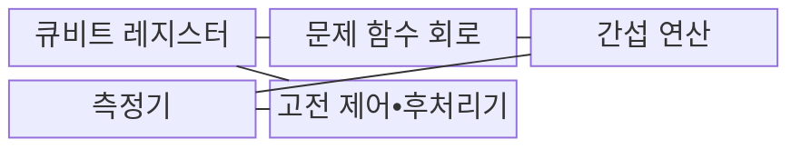
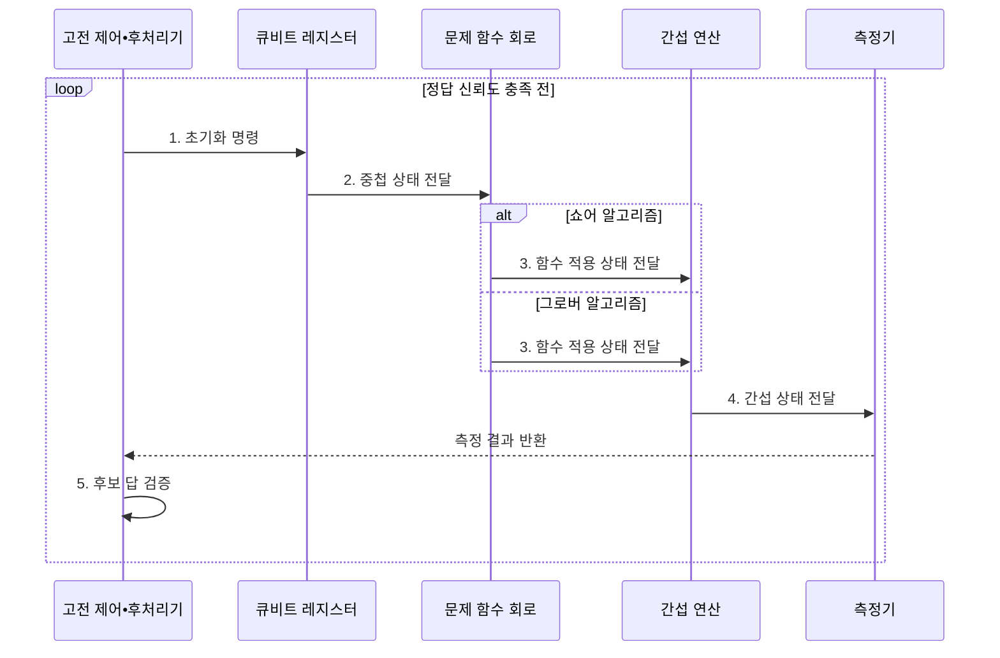

---
sidebar:
  order: 62
  label: "062. 양자 알고리즘: 쇼어•그로버"
  badge:
    text: "미출 • 70%"
    variant: note
title: "양자 알고리즘: 쇼어•그로버"
date: "2026-08-02T18:02:00+09:00"
tags:
  - "notes-basic-theory"
weight: 62
extra:
  question_no: "062"
  source_status: "미출"
  source_history: ""
  priority: 70
  priority_note: "양자 흐름과 쇼어•그로버 비교 중심"
---

## Ⅰ. 개요

핵심 용어

- **양자 알고리즘(Quantum Algorithm)**: 중첩·간섭·측정을 이용해 문제의 답을 구하는 계산 방식이며 쇼어와 그로버 알고리즘을 포함
- **중첩·간섭**: 여러 상태를 함께 표현하고 위상 관계로 정답 상태의 측정 확률을 높이는 양자 현상
- **쇼어·그로버 알고리즘(Shor•Grover Algorithm)**: 각각 주기 찾기로 소인수분해를 가속하고 진폭 증폭으로 비정렬 탐색의 질의 수를 줄이는 양자 알고리즘

- 정의/개념: **중첩•간섭**을 이용해 쇼어는 소인수분해, 그로버는 비정렬 탐색을 가속하는 양자 알고리즘
- 배경/필요성: 큰 정수의 소인수분해와 대규모 비정렬 탐색은 고전 방식에서 **계산•질의 비용** 급증

### 쉽게 이해하기 (학습용)
- 물결의 마루는 겹쳐 커지고 마루와 골은 지워지듯, 양자 간섭은 정답 진폭을 키우고 오답 진폭을 줄인다.

## Ⅱ. 특징

핵심 용어

- **확률 진폭·위상**: 측정 확률을 결정하는 복소수 크기와 상태 간 간섭 방향을 정하는 각도
- **측정·상태 붕괴**: 양자 상태를 하나의 고전 결과로 확정하며 중첩이 사라지는 과정
- **양자 우위**: 특정 문제에서 양자 계산이 실용적인 고전 계산보다 시간이나 자원을 적게 쓰는 상태

> 오라클 구성·상수 비용을 제외한 이론 관계에서 파란 고전 탐색은 $N$, 빨간 그로버 탐색은 $\sqrt N$으로 증가해 후보 수가 커질수록 간격이 확대된다.

- **중첩**•**간섭**으로 정답 상태의 측정 확률 증폭
- **측정•상태 붕괴**에 따른 반복 실행•고전 후처리
- **오라클•오류 정정 비용**까지 반영해야 성립하는 양자 우위

### 쉽게 이해하기 (학습용)
- 양자 우위에는 문제에 맞는 회로•오라클과 측정 결과의 고전 후처리가 필요하다.

## Ⅲ. 구조 및 구성요소

핵심 용어

- **큐비트 레지스터**: 0과 1의 중첩 상태를 보관하는 양자 정보 단위의 집합
- **오라클**: 그로버 알고리즘에서 정답 상태의 위상을 반전해 표시하는 문제 함수
- **역 QFT·진폭 증폭**: 주기 정보를 측정 가능한 상태로 바꾸거나 정답 상태의 확률을 키우는 간섭 연산

| 구성요소 | 책임 |
|:---|:---|
| 큐비트 레지스터 | 중첩 입력과 **양자 계산 상태** 보관 |
| 문제 함수 회로 | 모듈러 거듭제곱•**정답 오라클** 구현 |
| 간섭 연산 | 위상•진폭에 **역 QFT•진폭 증폭** 수행 |
| 측정기 | 양자 상태를 **고전 비트 결과**로 변환 |
| 고전 제어•후처리기 | 회로 제어와 **후보 답 검증** 수행 |

### 쉽게 이해하기 (학습용)
- 양자 회로가 후보 상태를 변환하고 측정기와 고전 후처리기가 결과를 검증한다.

## Ⅳ. 흐름도

핵심 용어

- **함수 적용 상태**: 문제 함수가 주기 정보나 정답 여부를 상태의 위상에 부호화한 결과
- **고전 후처리**: 측정한 비트열에서 후보 답을 계산하고 검증하는 고전 계산 단계

**동작 원리**

- **1. 초기화 명령**: 큐비트에 후보 상태 동시 표현
- **2. 중첩 상태 전달**: 문제 함수 회로에 계산 상태 입력
- **3. 함수 적용 상태 전달**: 주기 정보•정답 위상 부호화
- **4. 간섭 상태 전달**: 주기 추출•정답 진폭 증폭
- **5. 후보 답 검증**: 측정 결과 검증•재실행 판단

### 쉽게 이해하기 (학습용)
- 문제 함수가 후보 상태의 위상에 답의 흔적을 새기면, 간섭 연산이 정답 진폭을 키우고 측정이 고전 비트열을 만든다.

## Ⅴ. 종류 및 비교

핵심 용어

- **쇼어 알고리즘**: 양자 주기 찾기로 소인수분해와 이산 로그를 다항 시간에 푸는 알고리즘
- **그로버 알고리즘**: 비정렬 후보에서 오라클이 표시한 정답을 제곱근 수준의 질의로 찾는 알고리즘
- **회로 깊이**: 서로 동시에 실행할 수 없는 양자 게이트 단계의 수

| 양자 알고리즘 | 쇼어 알고리즘 | 그로버 알고리즘 |
|:---|:---|:---|
| 적용 기준 | **소인수분해**•**이산 로그**를 푸는 경우 | 정렬•색인 없는 **비정렬 탐색**이 필요한 경우 |
| 핵심 특징 | **주기 찾기**로 다항 시간 인수 계산 | **진폭 증폭**으로 $O(\sqrt{N})$ 질의 탐색 |
| 한계 | **모듈러 지수 회로**의 큰 깊이•큐비트 수 | **오라클 비용** 증가•반복 횟수 오설정 시 **가속 이득 감소** |

> 요약: 쇼어는 **다항 시간**, 그로버는 **제곱근 질의 복잡도**

### 쉽게 이해하기 (학습용)
- 쇼어는 공개키 난제를 다항 시간에 풀고, 그로버는 비정렬 탐색 질의를 제곱근 수준으로 줄인다.

## Ⅵ. 실무 고려사항 및 대책

핵심 용어

- **논리 큐비트·오류 정정**: 여러 물리 큐비트를 묶어 잡음 오류를 검출·복구하며 안정화한 계산 단위와 기술
- **오류 완화**: 완전한 오류 정정 없이 반복 측정과 잡음 추정으로 결과 편향을 줄이는 기법
- **PQC**: 양자컴퓨터와 고전 컴퓨터의 알려진 공격에 대응하도록 설계한 공개키 암호 체계
- **보안 강도**: 알려진 최선의 공격에 필요한 계산량을 비트 수로 나타낸 값

| 문제 | 대책 | 효과 |
|:---|:---|:---|
| 논리 알고리즘만 보면 실현 가능성 과대평가 | **논리 큐비트•오류 정정 비용** 산정 | **실제 양자 자원 요구** 파악 |
| 그로버 오라클 비용이 가속 이득 상쇄 | 오라클 회로와 **고전 알고리즘 총비용** 비교 | **양자 우위 판단** 정확화 |
| 측정 잡음으로 결과 분산 증가 | 반복 측정과 **오류 완화** 적용 | **결과 신뢰도** 향상 |
| 장기 암호 자산이 쇼어 위협에 노출 | 공개키 **PQC 전환**•대칭키 길이 조정 | 양자 공격 후 **보안 강도** 유지 |

### 쉽게 이해하기 (학습용)
- 장기 공개키 자산은 쇼어 위협에 대비해 인증서•서명부터 PQC로 전환한다.

## Ⅶ. 결론

핵심 용어

- **공개키 전환**: 쇼어 공격에 취약한 RSA·DH·ECC를 양자내성 방식으로 교체하는 작업
- **대칭키 길이 조정**: 그로버 탐색에 대응할 목표 보안 강도에 맞춰 키 비트 수를 늘리는 조치

- 쇼어에 취약한 공개키는 **PQC**, 그로버 공격 비용으로 **대칭키 길이** 결정

### 쉽게 이해하기 (학습용)
- RSA•DH•ECC는 쇼어 알고리즘에 대비해 양자내성 방식으로 전환하고, 대칭키는 그로버의 이상적 제곱근 탐색과 구현 비용을 함께 고려해 필요한 보안 강도를 다시 산정한다
