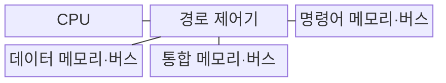
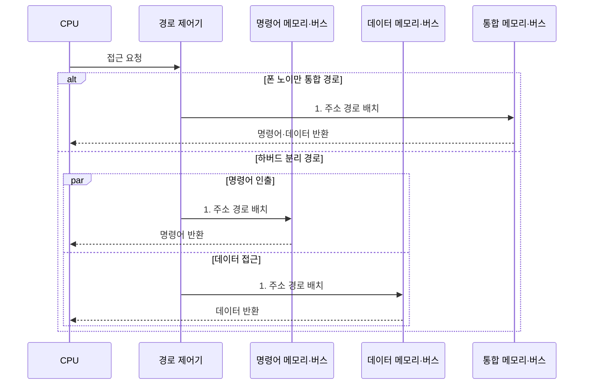

---
sidebar:
  order: 1
  label: "001. 컴퓨터 구조 개요: 폰 노이만 vs 하버드 아키텍처 (Von Neumann vs Harvard Architecture)"
  badge:
    text: "기출 · 50%"
    variant: note
title: "컴퓨터 구조 개요: 폰 노이만 vs 하버드 아키텍처 (Von Neumann vs Harvard Architecture)"
date: "2026-07-31T10:12:00+09:00"
tags:
  - "notes-hardware"
weight: 1
extra:
  question_no: "001"
  source_status: "기출"
  source_history: "138회"
  priority: 50
  priority_note: "메모리·명령 경로와 병목 비교의 기초"
---

## 미리 알고가기

- **컴퓨터 아키텍처(Computer Architecture)**: CPU·메모리·입출력장치의 구성과 동작 구조
- **중앙처리장치(Central Processing Unit, CPU)**: 명령어를 해독하고 데이터를 연산하는 장치
- **폰 노이만 구조(Von Neumann Architecture)**: 명령어·데이터가 메모리와 버스를 공유하는 구조
- **하버드 구조(Harvard Architecture)**: 명령어·데이터 메모리와 버스를 분리한 구조
- **수정 하버드 구조(Modified Harvard Architecture)**: 주기억은 통합하고 L1 명령·데이터 캐시는 분리한 구조
- **폰 노이만 병목(Von Neumann Bottleneck)**: 단일 버스 공유로 메모리 전송이 성능을 제약하는 현상
- **주소 공간(Address Space)**: CPU 또는 메모리 제어기가 개별 데이터나 명령어를 식별하고 접근할 수 있는 고유 메모리 위치의 전체 범위
- **1단계 캐시(Level 1 Cache, L1 Cache)**: CPU 코어에 가장 가깝게 위치하여 명령어와 데이터의 접근 지연을 최소화하는 최고속 소용량 캐시
- **디지털 신호 처리기(Digital Signal Processor, DSP)**: 음성·영상 신호의 반복 연산을 빠르게 수행하도록 명령·데이터 경로를 분리한 전용 프로세서
- **캐시 일관성(Cache Coherence)**: 분리된 명령어 캐시와 데이터 캐시 또는 다중 코어 캐시 간에 같은 메모리 주소의 데이터가 일치하도록 상태를 유지하는 성질
- **버스(Bus)**: CPU, 메모리, 입출력 장치 간에 주소, 데이터, 제어 신호를 주고받는 공용 전기적 전송 통로
- **주기억장치(Main Memory)**: CPU가 현재 실행 중인 프로그램과 데이터를 보관하는 폰 노이만 구조의 통합 메모리
- **명령어 집합 구조(Instruction Set Architecture, ISA)**: 프로세서가 실행할 명령어·레지스터·주소 지정 방식의 소프트웨어 공개 규격
- **프리페치(Prefetch)**: 곧 사용할 것으로 예측한 명령어나 데이터를 실제 요청 전에 캐시로 미리 가져오는 기법
- **직접 메모리 접근(Direct Memory Access, DMA)**: CPU가 매 바이트를 옮기지 않고 입출력 장치가 주기억장치와 직접 데이터를 전송하는 방식
- **명령 캐시 무효화(Instruction-cache Invalidation)**: 메모리의 코드가 바뀌었을 때 오래된 명령어 사본을 캐시에서 제거하는 절차
- **캐시 적중률(Cache Hit Rate)**: 전체 메모리 요청 중 필요한 값이 캐시에서 발견된 비율

> **키워드:** 컴퓨터 구조 개요: 폰 노이만 vs 하버드 아키텍처 (Von Neumann vs Harvard Architecture)

## Ⅰ. 개요

- 정의/개념: **명령어·데이터 메모리 경로**를 통합하거나 나눈 구조
- 배경/필요성: 공유 버스의 **동시 접근 병목** 완화

### 쉽게 이해하기 (학습용)
- 폰 노이만 구조는 명령어와 데이터가 같은 경로를 공유해 접근이 겹치면 대기하고, 하버드 구조는 경로를 분리해 동시 접근한다.

## Ⅱ. 특징

- 경로를 분리하면 **명령어·데이터 동시 접근** 가능
- 주소 공간을 통합하면 **메모리 용량 배분** 유연성 확보
- **주기억 통합·L1 캐시 분리**로 용량 유연성과 동시 접근 확보

### 쉽게 이해하기 (학습용)
- 두 구조의 판단축은 명령어·데이터의 메모리와 버스를 통합할지 분리할지이며, 버스 분리는 동시 접근 성능을 높이고 메모리 통합은 공간 활용과 설계를 단순화한다.

## Ⅲ. 구조 및 구성요소

| 구성요소 | 책임 |
|:---|:---|
| CPU | 명령어 인출·데이터 읽기·쓰기 **요청 생성** |
| 경로 제어기 | 구조별 **버스 접근 순서** 결정 |
| 명령어 메모리·버스 | 하버드의 **명령어 전용 경로** 제공 |
| 데이터 메모리·버스 | 하버드의 **데이터 전용 경로** 제공 |
| 통합 메모리·버스 | 폰 노이만의 **공유 경로** 제공 |

### 쉽게 이해하기 (학습용)
- CPU와 제어기가 요청을 배치하고 통합 또는 분리된 메모리 경로가 명령어와 데이터를 전달한다.

## Ⅳ. 흐름도

**동작 원리**

- **1. 주소 경로 배치**: 구조에 따라 공유·전용 버스에 요청 배치

### 쉽게 이해하기 (학습용)
- 폰 노이만 구조는 한 통로의 사용 순서를 조정하고, 하버드 구조는 명령어와 데이터를 서로 다른 통로로 동시에 전달한다.

## Ⅴ. 종류 및 비교

| 컴퓨터 구조 | 폰 노이만 구조 | 하버드 구조 | 수정 하버드 구조 |
|:---|:---|:---|:---|
| 적용 기준 | 명령어·데이터 **용량 비율**이 변하는 경우 | **실시간 신호 처리**에 동시 접근이 필요한 경우 | 범용 ISA에 **고속 인출**이 필요한 경우 |
| 핵심 특징 | **단일 주소 공간**·단일 버스 공유 | 명령어·데이터 메모리·버스 **물리적 분리** | 주기억 통합·**L1 캐시** 분리 |
| 한계 | 공유 버스 경합에 따른 **대역폭 제한** | 분리 메모리의 **잔여 공간** 전용 고정 | 명령어·데이터 캐시 간 **일관성** 유지 부담 |

> 요약: 하버드의 **공간 고정**을 주기억 통합으로 해소한 수정 하버드

### 쉽게 이해하기 (학습용)
- 폰 노이만은 한 경로를 공유하고 하버드는 두 경로를 분리하며, 수정 하버드는 주기억을 합치고 L1 캐시만 나눠 절충한다.

## Ⅵ. 실무 고려사항 및 대책

| 고려사항 | 대책 | 효과 |
|:---|:---|:---|
| 명령어·데이터의 **공유 버스 경합으로 CPU 대기** | 캐시·프리페치·**버스 대역폭** 확대 | **폰 노이만 병목** 완화 |
| 수정 하버드 캐시의 **코드·데이터 불일치** | 캐시 일관성·**명령 캐시 무효화** 절차 적용 | 자기 수정 코드·**DMA 정확성** 확보 |
| 분리 메모리 한쪽의 **용량 부족·잔여 공간 고정** | 수정 하버드·**재배치 가능한 메모리** 구성 | **메모리 용량 활용성** 향상 |
| 이론적 동시 접근에도 **실제 처리량이 개선되지 않음** | 캐시 적중률·버스 사용률·**대기 주기** 측정 | **실제 병목 위치** 식별 |
| 범용 CPU의 **인출·데이터 접근 동시성 요구** | 주기억 통합·**L1 명령어/데이터 캐시 분리** | 용량 유연성과 **고속 동시 접근** 절충 |

### 쉽게 이해하기 (학습용)
- 분리 구조를 선택한 뒤에도 캐시 적중률과 버스 대기 시간을 측정해야 실제 처리량 이득을 확인할 수 있다.

## Ⅶ. 결론

- 범용은 **수정 하버드**, 결정적 처리량은 **하버드** 선택

### 쉽게 이해하기 (학습용)
- 범용 시스템은 메모리 활용성이 높은 수정 하버드 구조를 적용하고, 결정적 처리량이 중요한 신호 처리 장비는 명령·데이터 경로를 완전히 분리한 하버드 구조를 적용한다.
