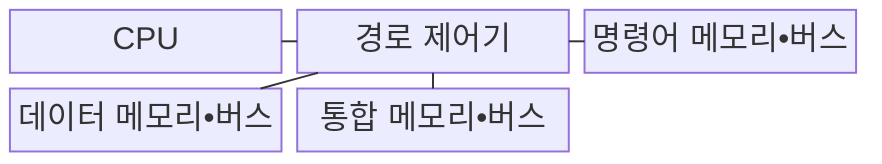
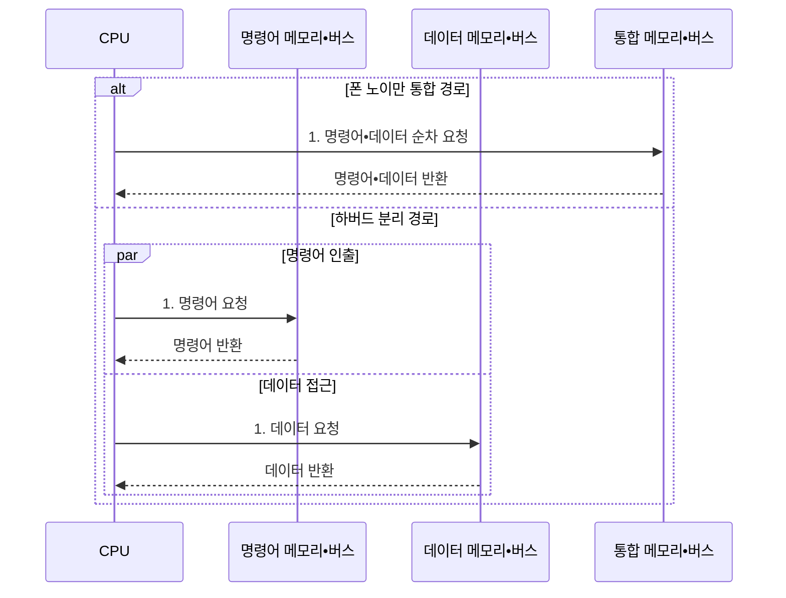

---
sidebar:
  order: 1
  label: "001. 컴퓨터 구조 개요: 폰 노이만 vs 하버드 아키텍처 (Von Neumann vs Harvard Architecture)"
  badge:
    text: "기출 • 50%"
    variant: note
title: "컴퓨터 구조 개요: 폰 노이만 vs 하버드 아키텍처 (Von Neumann vs Harvard Architecture)"
date: "2026-08-04T10:16:12+09:00"
tags:
  - "notes-hardware"
weight: 1
extra:
  question_no: "001"
  source_status: "기출"
  source_history: "138회"
  priority: 50
  priority_note: "메모리•명령 경로와 병목 비교의 기초"
---

## Ⅰ. 개요

핵심 용어

- **폰 노이만 구조**: 명령어와 데이터가 하나의 메모리와 버스를 공유하는 컴퓨터 구조
- **하버드 구조**: 명령어와 데이터의 메모리와 버스를 분리하는 컴퓨터 구조
- **컴퓨터 아키텍처**: 프로세서•메모리•입출력 경로의 구성과 동작 규칙
- **동시 접근 병목**: 명령어 인출과 데이터 접근의 경로 경쟁으로 발생하는 대기

- 정의/개념: **폰 노이만 구조와 하버드 구조** 는 명령어와 데이터의 메모리•버스를 각각 공유하거나 분리하는 **컴퓨터 아키텍처**
- 배경/필요성: 단일 공유 경로에서는 명령어 인출과 데이터 접근이 경쟁해 **동시 접근 병목이 발생**

#### 한줄 요약
- 폰 노이만 구조는 명령어와 데이터가 같은 경로를 공유해 접근이 겹치면 대기하고, 하버드 구조는 경로를 분리해 동시 접근한다.

## Ⅱ. 특징

핵심 용어

- **주소 공간**: 프로세서가 접근할 수 있는 메모리 주소의 전체 범위
- **수정 하버드 구조**: 주기억장치를 통합하고 L1 캐시를 분리한 구조
- **1단계 캐시(Level 1 Cache, L1 캐시)**: CPU 코어에 가장 가까운 소용량 고속 캐시
- **명령어•데이터 동시 접근**: 분리된 경로에서 두 접근을 같은 시점에 수행하는 방식
- **메모리 용량 배분**: 명령어와 데이터의 저장 공간 크기를 필요에 따라 나누는 작업
- **주기억 통합**: 명령어와 데이터가 하나의 주기억장치를 공유하는 구성
- **L1 캐시 분리**: 명령 캐시와 데이터 캐시를 코어 가까이에서 나누는 구성

- 경로를 분리하면 **명령어•데이터 동시 접근** 가능
- 주소 공간을 통합하면 **메모리 용량 배분** 유연성 확보
- **주기억 통합•L1 캐시 분리** 로 용량 유연성과 동시 접근 확보

#### 한줄 요약
- 두 구조의 판단축은 명령어•데이터의 메모리와 버스를 통합할지 분리할지이며, 버스 분리는 동시 접근 성능을 높이고 메모리 통합은 공간 활용과 설계를 단순화한다.

## Ⅲ. 구조 및 구성요소

핵심 용어

- **중앙 처리 장치(Central Processing Unit, CPU)**: 명령어 실행과 메모리 접근 요청을 담당하는 장치
- **버스**: CPU•메모리•입출력장치 사이에서 신호를 전달하는 통로
- **경로 제어기**: 명령어와 데이터 요청을 공유 또는 분리 버스에 배치하는 제어부
- **명령어 전용 경로**: 명령어 접근에 별도 메모리와 버스를 제공하는 통로
- **데이터 전용 경로**: 데이터 접근에 별도 메모리와 버스를 제공하는 통로

| 구성요소 | 책임 |
|:---|:---|
| CPU | 명령어 인출•데이터 읽기•쓰기 **요청 생성** |
| 경로 제어기 | 구조별 **버스 접근 순서** 결정 |
| 명령어 메모리•버스 | 하버드의 **명령어 전용 경로** 제공 |
| 데이터 메모리•버스 | 하버드의 **데이터 전용 경로** 제공 |
| 통합 메모리•버스 | 폰 노이만의 **공유 경로** 제공 |

#### 한줄 요약
- CPU와 제어기가 요청을 배치하고 통합 또는 분리된 메모리 경로가 명령어와 데이터를 전달한다.

## Ⅳ. 흐름도

핵심 용어

- **공유 경로**: 명령어와 데이터가 같은 메모리와 버스를 사용하는 통로
- **분리 경로**: 명령어와 데이터가 서로 다른 메모리와 버스를 사용하는 통로

**동작 원리**

- **1. 경로별 접근 요청**: 폰 노이만은 공유 경로를 순차 사용하고 하버드는 분리 경로를 병렬 사용

#### 한줄 요약
- 폰 노이만 구조는 한 통로의 사용 순서를 조정하고, 하버드 구조는 명령어와 데이터를 서로 다른 통로로 동시에 전달한다.

## Ⅴ. 종류 및 비교

핵심 용어

- **단일 주소 공간**: 명령어와 데이터가 같은 주소 체계를 사용하는 구성
- **실시간 신호 처리**: 정해진 시간 안에 연속 신호 데이터를 처리하는 작업
- **명령어 집합 아키텍처(Instruction Set Architecture, ISA)**: 프로세서의 명령어와 레지스터 동작 규격
- **대역폭 제한**: 공유 버스의 전송량 한계로 성능이 제한되는 상태
- **캐시 일관성**: 여러 캐시가 같은 메모리 주소의 값을 일치시키는 성질

| 컴퓨터 구조 | 폰 노이만 구조 | 하버드 구조 | 수정 하버드 구조 |
|:---|:---|:---|:---|
| 적용 기준 | 명령어•데이터 **용량 비율** 이 변하는 경우 | **실시간 신호 처리** 에 동시 접근이 필요한 경우 | 범용 ISA에 **고속 인출** 이 필요한 경우 |
| 핵심 특징 | **단일 주소 공간**•단일 버스 공유 | 명령어•데이터 메모리•버스 **물리적 분리** | 주기억 통합•**L1 캐시** 분리 |
| 한계 | 공유 버스 경합에 따른 **대역폭 제한** | 분리 메모리의 **잔여 공간** 전용 고정 | 명령어•데이터 캐시 간 **일관성** 유지 부담 |

> 요약: 하버드의 **공간 고정** 을 주기억 통합으로 해소한 수정 하버드

#### 한줄 요약
- 폰 노이만은 한 경로를 공유하고 하버드는 두 경로를 분리하며, 수정 하버드는 주기억을 합치고 L1 캐시만 나눠 절충한다.

## Ⅵ. 실무 고려사항 및 대책

핵심 용어

- **폰 노이만 병목**: 단일 버스의 메모리 전송 대기가 CPU 성능을 제한하는 현상
- **명령 캐시 무효화**: 오래된 명령어 사본을 캐시에서 제거하는 절차
- **프리페치(Prefetch)**: 곧 사용할 명령어나 데이터를 미리 캐시에 가져오는 처리
- **버스 대역폭**: 버스가 단위 시간에 전송할 수 있는 데이터양
- **직접 메모리 접근(Direct Memory Access, DMA)**: CPU 없이 장치와 메모리 사이에서 데이터를 전송하는 방식
- **캐시 적중률**: 요청값을 캐시에서 찾은 비율
- **대기 주기**: 버스나 메모리 응답을 기다린 클록 주기 수

| 문제 | 대책 | 효과 |
|:---|:---|:---|
| 명령어•데이터의 **공유 버스 경합으로 CPU 대기** | 캐시•프리페치•**버스 대역폭** 확대 | **폰 노이만 병목** 완화 |
| 수정 하버드 캐시의 **코드•데이터 불일치** | 캐시 일관성•**명령 캐시 무효화** 절차 적용 | 자기 수정 코드•**DMA 정확성** 확보 |
| 분리 메모리 한쪽의 **용량 부족•잔여 공간 고정** | 수정 하버드•**재배치 가능한 메모리** 구성 | **메모리 용량 활용성** 향상 |
| 이론적 동시 접근에도 **실제 처리량이 개선되지 않음** | 캐시 적중률•버스 사용률•**대기 주기** 측정 | **실제 병목 위치** 식별 |
| 범용 CPU의 **인출•데이터 접근 동시성 요구** | 주기억 통합•**L1 명령어/데이터 캐시 분리** | 용량 유연성과 **고속 동시 접근** 절충 |

#### 한줄 요약
- 분리 구조를 선택한 뒤에도 캐시 적중률과 버스 대기 시간을 측정해야 실제 처리량 이득을 확인할 수 있다.

## Ⅶ. 결론

핵심 용어

- **디지털 신호 처리기(Digital Signal Processor, DSP)**: 반복 신호 연산에 특화된 전용 프로세서
- **결정적 처리량**: 실행 조건이 같을 때 일정한 작업량을 보장하는 성질

- 범용은 **수정 하버드**, 결정적 처리량은 **하버드** 선택

#### 한줄 요약
- 범용 시스템은 메모리 활용성이 높은 수정 하버드 구조를 적용하고, 결정적 처리량이 중요한 신호 처리 장비는 명령•데이터 경로를 완전히 분리한 하버드 구조를 적용한다.
