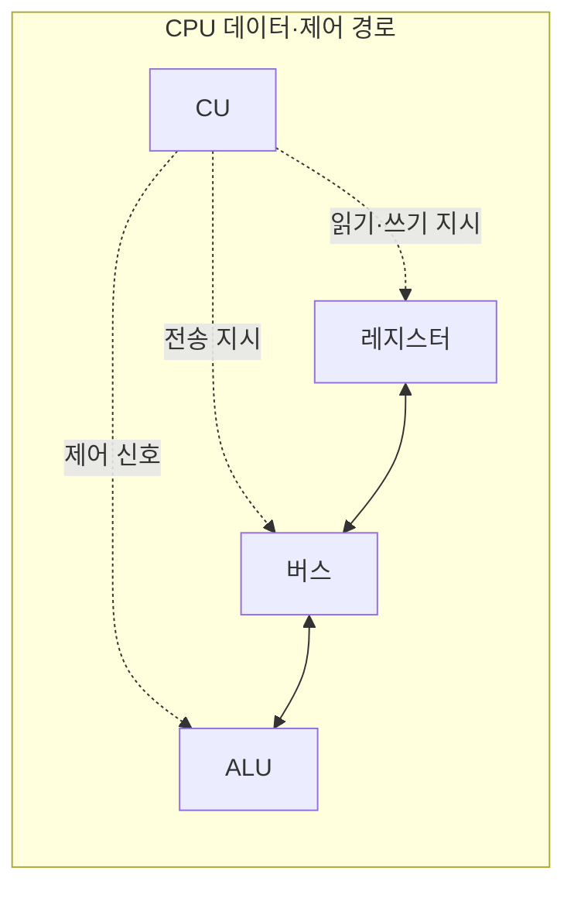
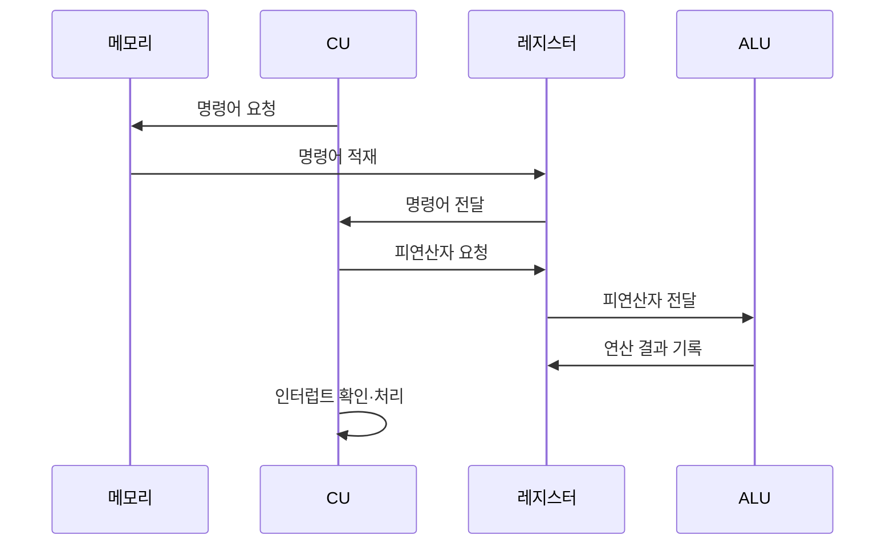

---
sidebar:
  order: 2
  label: "002. CPU 구성 — ALU·CU·레지스터·버스 (CPU Components)"
  badge:
    text: "기출 · 50%"
    variant: note
title: "CPU 구성 — ALU·CU·레지스터·버스 (CPU Components)"
date: "2026-07-27T23:59:30+09:00"
tags:
  - "notes-hardware"
weight: 2
extra:
  question_no: "002"
  source_status: "기출"
  source_history: "138회"
  priority: 50
  priority_note: "CPU 구성과 명령어 주기의 핵심 기초"
---

## 미리 알고가기

- **중앙처리장치(Central Processing Unit, CPU)**: ‘씨피유’로 읽고 영문 머리글자를 딴 약어이며, 작업 지시서를 한 장씩 꺼내 읽고 계산한 뒤 결과를 적어 두는 일을 반복하는 공장장 같은 장치다
- **산술논리연산장치(Arithmetic Logic Unit, ALU)**: ‘에이엘유’로 읽고 영문 머리글자를 딴 약어이며, 덧셈·비교·비트 이동 같은 실제 계산을 맡아 명령의 결과값을 만든다
- **제어장치(Control Unit, CU)**: ‘씨유’로 읽고 영문 머리글자를 딴 약어이며, 인출한 명령을 해독해 어느 회로를 언제 켤지 제어 신호로 지시한다
- **레지스터(Register)**: 명령어 주소·명령어·피연산자·연산 상태를 CPU 안에 몇 개만 두고 가장 빠르게 읽고 쓰는 작업대 같은 저장소
- **버스(Bus)**: CPU 구성요소와 메모리 사이에서 주소·데이터·제어 신호를 실어 나르는 공용 배선 통로
- **명령어 사이클(Instruction Cycle)**: 명령어 하나를 인출·해독·실행하고 결과를 기록하기까지의 한 바퀴이며, CPU는 전원이 켜져 있는 동안 이 바퀴를 계속 돈다
- **프로그램 카운터(Program Counter, PC)**: ‘피시’로 읽고 영문 머리글자를 딴 약어이며, 다음에 인출할 명령어의 주소를 담는 레지스터
- **명령어 레지스터(Instruction Register, IR)**: ‘아이알’로 읽고 영문 머리글자를 딴 약어이며, 방금 인출한 명령어를 담아 제어장치가 해독할 대상을 고정하는 레지스터
- **피연산자(Operand)**: 명령어가 계산 재료로 읽거나 결과로 쓰는 값이며, 레지스터에 있을 수도 메모리에 있을 수도 있다
- **시프트 연산(Shift Operation)**: 비트열을 왼쪽이나 오른쪽으로 밀어 곱셈·나눗셈이나 비트 필드 추출을 빠르게 처리하는 ALU 연산
- **클록(Clock)**: 일정한 간격으로 똑딱이며 CPU 안의 모든 회로가 언제 값을 갱신할지 시점을 맞춰 주는 주기 신호
- **실행 유닛(Execution Unit)**: ALU 안에서 정수 연산·주소 계산처럼 특정 종류의 계산만 맡는 회로 묶음이며, 개수가 곧 동시에 처리할 수 있는 연산 수다
- **레지스터 스필(Register Spill)**: 레지스터 개수가 모자라 당장 쓰지 않는 값을 메모리로 밀어 냈다가 다시 불러오는 동작이며, 그만큼 메모리 왕복이 늘어난다
- **인터럽트(Interrupt)**: 입출력 완료나 오류처럼 급한 사건이 생겼을 때 진행 중인 흐름을 잠시 멈추게 하는 신호
- **문맥(Context)**: 인터럽트 처리를 끝낸 뒤 원래 자리로 돌아가려고 잠시 보관해 두는 PC·레지스터·상태값 묶음
- **인터럽트 서비스 루틴(Interrupt Service Routine, ISR)**: ‘아이에스알’로 읽고 영문 머리글자를 딴 약어이며, 인터럽트 원인을 처리한 뒤 보관한 문맥으로 되돌아가는 전용 코드
- **파이프라인(Pipeline)**: 인출·해독·실행 단계를 서로 다른 명령어에 겹쳐 수행해 한 주기에 끝나는 명령 수를 늘리는 구조
- **분기 예측기(Branch Predictor)**: 조건 분기가 어느 쪽으로 갈지 미리 찍어 파이프라인이 채울 다음 명령어 주소를 정하는 회로이며, 빗나가면 채워 둔 단계를 버린다
- **캐시(Cache)**: 최근에 쓴 명령어와 데이터를 CPU 가까이 복사해 두어 메모리까지 다녀오는 시간을 줄이는 고속 메모리
- **캐시 계층(Cache Hierarchy)**: 용량과 속도가 다른 캐시를 CPU와 주기억장치 사이에 여러 단으로 쌓아 평균 접근 대기를 줄이는 구조

## Ⅰ. 개요

- 정의/개념: **명령어 사이클**을 반복해 프로그램을 실행하는 연산·제어 장치
- 기존 한계: 단일 회로는 해독·연산·저장·전송 동시 처리 한계

### 쉽게 이해하기 (학습용)
- 답안이 배경 자리에 굳이 구성요소 구분을 적어 둔 이유는, CPU를 검은 상자 하나로 보면 느릴 때 할 수 있는 말이 그저 느리다뿐이지만 계산기·지휘자·작업대·복도로 갈라 놓으면 계산기 앞에 줄이 선 건지 작업대가 좁아 짐을 창고로 내보내는 건지 복도가 막힌 건지 손가락으로 짚을 수 있기 때문이다

## Ⅱ. 특징

- **제어 흐름**과 데이터 흐름을 분리한 내부 경로 구성
- 피연산자를 **레지스터**에 상주시켜 메모리 왕복 제거
- **클록 에지**를 기준으로 순차 회로의 상태 동기 갱신

### 쉽게 이해하기 (학습용)
- 공장에서 지휘자의 호루라기 소리와 자재 나르는 손수레가 서로 다른 길로 다니듯 CPU도 명령을 켜고 끄는 제어선과 값이 흐르는 데이터선을 따로 두고, 자주 쓰는 재료는 창고까지 안 가도 되게 작업대 위에 올려 두며, 이 모든 동작이 제각각 움직이지 않도록 똑딱이는 클록 소리에 맞춰 한 박자에 함께 바뀐다

## Ⅲ. 아키텍처 및 구성요소

| 설계 요소 | 설명 |
|:---|:---|
| ALU | 피연산자에 산술·논리·**시프트 연산** 수행 |
| CU | 명령 해독 후 **제어 신호**로 실행 순서 지시 |
| 레지스터 | **PC·IR**·피연산자·상태의 CPU 내부 고속 보관 |
| 버스 | 구성요소 간 **주소·데이터** 전송 통로 |

> 요약: **CU** 지시로 레지스터·버스가 **ALU**에 피연산자 공급

### 쉽게 이해하기 (학습용)
- 그림에서 지휘자만 점선으로 이어진 이유는 CU가 값을 나르는 것이 아니라 언제 무엇을 하라는 신호만 보내기 때문이고, 실선으로 이어진 작업대와 복도와 계산기 사이에서만 실제 숫자가 오가므로 표의 CU 줄에만 신호라는 말이 붙고 나머지 세 줄에는 값의 저장·이동·계산이 적혀 있다

## Ⅳ. 원리 및 절차 흐름도

| 절차 | 설명 |
|:---|:---|
| 명령어 요청 | **PC**가 가리킨 주소의 명령을 메모리에 요청 |
| 명령어 적재 | 반환된 명령어를 **IR**에 저장하고 PC 증가 |
| 명령어 전달 | IR의 명령어를 **CU**에 전달해 해독 |
| 피연산자 요청 | 해독한 주소 방식에 따라 **피연산자** 요청 |
| 피연산자 전달 | 레지스터·메모리 값을 **ALU**에 전달 |
| 연산 결과 기록 | ALU 산출값을 목적 레지스터·메모리에 기록 |
| 인터럽트 확인·처리 | 요청 시 **문맥** 보존 후 **ISR** 진입 |

> 요약: 인출·해독·실행·기록 반복 중 **인터럽트** 문맥 전환

### 쉽게 이해하기 (학습용)
- 다섯 줄 중 마지막 줄만 CU가 자기 자신에게 화살표를 그은 이유는 인터럽트 확인이 남에게 무언가를 시키는 일이 아니라 매 바퀴가 끝날 때 스스로 급한 벨이 울렸는지 돌아보는 동작이기 때문이며, 벨이 울렸으면 하던 자리를 쪽지에 적어 두고 급한 일을 처리한 뒤 그 쪽지를 보고 제자리로 돌아온다

## Ⅴ. 종류 및 비교

| CPU 구성요소 | ALU | CU | 레지스터 | 버스 |
|:---|:---|:---|:---|:---|
| 적용 기준 | 연산 처리량이 모자랄 때 | 분기·해독이 밀릴 때 | **스필**이 잦을 때 | 전송 대기가 길 때 |
| 핵심 특징 | **실행 유닛** 수만큼 연산 병렬화 | 클록마다 **제어 신호** 조합 확정 | 개수가 곧 **피연산자 상주** 한도 | 폭·주파수가 곧 **전송 대역폭** |
| 한계 | 실행 유닛 포화 시 **연산 대기** | 분기 예측 실패 시 **파이프라인 정지** | 부족분의 **메모리 스필** 왕복 | 동시 요청 시 **버스 경합** |

> 요약: 대기가 가장 긴 구성요소가 **증설 대상**

### 쉽게 이해하기 (학습용)
- 네 칸을 나란히 놓고 마지막 줄만 가로로 읽어 보면 계산기는 줄이 서서, 지휘자는 잘못 찍어서, 작업대는 좁아서, 복도는 붐벼서 각각 다른 이유로 멈추는 것이 보이는데, 이 네 멈춤이 서로 겹치지 않아야 지금 어느 자원을 늘려야 하는지가 표 하나로 갈린다

## Ⅵ. 실무 사례

1. 서버 CPU는 **캐시 계층**으로 피연산자 공급 대기 단축

### 쉽게 이해하기 (학습용)
- 서버용 CPU는 창고까지 다녀오는 데 수백 박자가 걸리므로 코어 옆에 작은 선반, 그 뒤에 조금 큰 선반을 여러 단으로 쌓아 두고 자주 쓰는 값을 미리 옮겨 둔다

## Ⅶ. 결론

- CPU 병목 해소를 위해 실행·전송 대기를 검토하여 **CPU 구성요소** 활용

### 쉽게 이해하기 (학습용)
- CPU가 느리다는 말로는 살 것을 정할 수 없고 계산기가 모자란지 작업대가 좁은지 복도가 붐비는지를 대기 시간으로 견줘야 코어 수를 늘릴지 캐시를 키울지 버스 폭을 넓힐지가 갈린다
