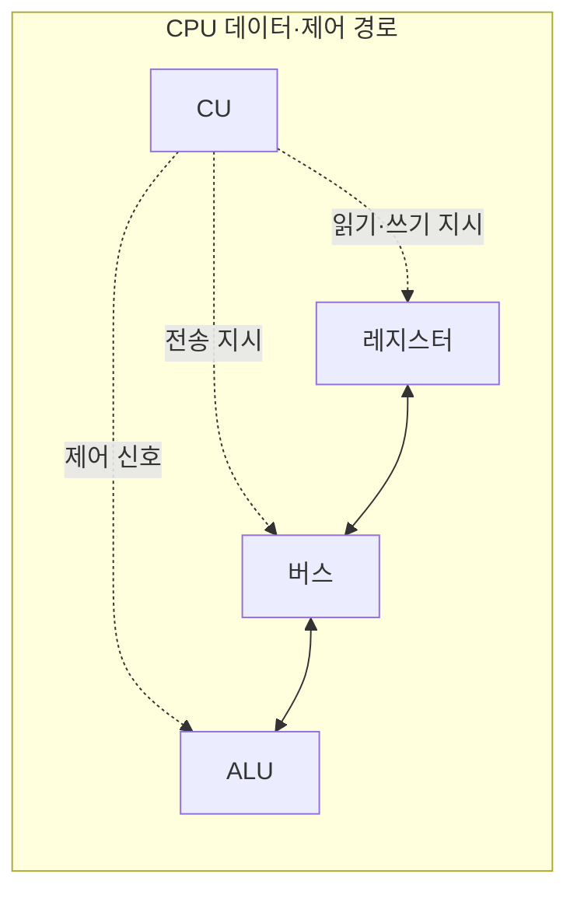

---
sidebar:
  order: 2
  label: "002. CPU 구성 — ALU·CU·레지스터·버스 (CPU Components)"
  badge:
    text: "기출 · 50%"
    variant: note
title: "CPU 구성 — ALU·CU·레지스터·버스 (CPU Components)"
date: "2026-07-28T12:32:33+09:00"
tags:
  - "notes-hardware"
weight: 2
extra:
  question_no: "002"
  source_status: "기출"
  source_history: "138회"
  priority: 50
  priority_note: "CPU 구성과 명령어 주기의 핵심 기초"
---

## 미리 알고가기

- **중앙처리장치(Central Processing Unit, CPU)**: 명령어를 인출·해석·실행하고 연산 결과를 저장하는 컴퓨터의 핵심 처리장치다
- **산술논리연산장치(Arithmetic Logic Unit, ALU)**: 덧셈·비교·비트 이동 등의 산술·논리 연산을 수행하여 명령어의 결과값을 생성한다
- **제어장치(Control Unit, CU)**: 인출한 명령어를 해독하고 데이터 경로가 수행할 동작과 시점을 제어 신호로 지시한다
- **레지스터(Register)**: 명령어 주소·피연산자·연산 결과·상태 정보를 CPU 내부에 임시 저장하는 최고속 저장장치
- **버스(Bus)**: CPU 구성요소와 메모리 사이에서 주소·데이터·제어 신호를 실어 나르는 공용 배선 통로
- **명령어 사이클(Instruction Cycle)**: 명령어 하나를 인출·해독·실행하고 결과를 기록하기까지의 한 바퀴이며, CPU는 전원이 켜져 있는 동안 이 바퀴를 계속 돈다
- **프로그램 카운터(Program Counter, PC)**: 다음에 인출할 명령어의 주소를 저장하는 레지스터
- **명령어 레지스터(Instruction Register, IR)**: 현재 인출한 명령어를 저장하여 제어장치의 해독 대상으로 제공하는 레지스터
- **피연산자(Operand)**: 명령어가 계산 재료로 읽거나 결과로 쓰는 값이며, 레지스터에 있을 수도 메모리에 있을 수도 있다
- **시프트 연산(Shift Operation)**: 비트열을 왼쪽이나 오른쪽으로 밀어 곱셈·나눗셈이나 비트 필드 추출을 빠르게 처리하는 ALU 연산
- **클록(Clock)**: 일정한 간격으로 똑딱이며 CPU 안의 모든 회로가 언제 값을 갱신할지 시점을 맞춰 주는 주기 신호
- **실행 유닛(Execution Unit)**: ALU 안에서 정수 연산·주소 계산처럼 특정 종류의 계산만 맡는 회로 묶음이며, 개수가 곧 동시에 처리할 수 있는 연산 수다
- **레지스터 스필(Register Spill)**: 레지스터 개수가 모자라 당장 쓰지 않는 값을 메모리로 밀어 냈다가 다시 불러오는 동작이며, 그만큼 메모리 왕복이 늘어난다
- **인터럽트(Interrupt)**: 입출력 완료나 오류처럼 급한 사건이 생겼을 때 진행 중인 흐름을 잠시 멈추게 하는 신호
- **문맥(Context)**: 인터럽트 처리를 끝낸 뒤 원래 자리로 돌아가려고 잠시 보관해 두는 PC·레지스터·상태값 묶음
- **인터럽트 서비스 루틴(Interrupt Service Routine, ISR)**: 인터럽트 원인을 처리한 뒤 저장된 실행 문맥으로 복귀하는 전용 처리 코드
- **파이프라인(Pipeline)**: 인출·해독·실행 단계를 서로 다른 명령어에 겹쳐 수행해 한 주기에 끝나는 명령 수를 늘리는 구조
- **분기 예측기(Branch Predictor)**: 조건 분기가 어느 쪽으로 갈지 미리 찍어 파이프라인이 채울 다음 명령어 주소를 정하는 회로이며, 빗나가면 채워 둔 단계를 버린다
- **캐시(Cache)**: 최근에 쓴 명령어와 데이터를 CPU 가까이 복사해 두어 메모리까지 다녀오는 시간을 줄이는 고속 메모리
- **캐시 계층(Cache Hierarchy)**: 용량과 속도가 다른 캐시를 CPU와 주기억장치 사이에 여러 단으로 쌓아 평균 접근 대기를 줄이는 구조

## Ⅰ. 개요

- 정의/개념: **명령어 사이클**로 프로그램을 실행하는 연산·제어 장치
- 기존 한계: 단일 회로의 **해독·연산·전송** 동시 처리 한계

### 쉽게 이해하기 (학습용)
- CPU를 연산장치·제어장치·레지스터·버스로 구분하면 성능 저하 원인을 연산 처리량, 제어 지연, 임시 저장 용량, 데이터 전송 병목으로 나누어 분석할 수 있다

## Ⅱ. 특징

- **제어 흐름**과 데이터 흐름을 분리한 내부 경로 구성
- 피연산자를 **레지스터**에 상주시켜 메모리 왕복 제거
- **클록 에지**를 기준으로 순차 회로의 상태 동기 갱신

### 쉽게 이해하기 (학습용)
- CPU는 제어 신호가 흐르는 제어 경로와 피연산자·결과가 흐르는 데이터 경로를 분리하고, 자주 사용하는 값을 레지스터에 저장하며, 각 구성요소의 상태를 클록에 맞춰 동기적으로 갱신한다

## Ⅲ. 아키텍처 및 구성요소

| 설계 요소 | 입력·상태 | 역할 |
|:---|:---|:---|
| ALU | 피연산자·연산 코드 | 산술·논리·시프트 연산 수행 |
| CU | 명령어·상태 | 제어 신호와 실행 순서 생성 |
| 레지스터 | PC·IR·피연산자·결과 | CPU 내부 고속 상태 보관 |
| 버스 | 주소·데이터·제어 신호 | 구성요소 사이 값 전송 |

> 요약: **CU** 지시로 레지스터·버스가 **ALU**에 피연산자 공급

### 쉽게 이해하기 (학습용)
- CU는 제어 신호를 보내고 레지스터·버스·ALU는 실제 피연산자와 결과를 저장·전송·연산한다.

## Ⅳ. 운영 고려사항

| 실패 징후 | 완화 방안 | 기대 효과 |
|:---|:---|:---|
| ALU 실행 유닛 대기 증가 | 명령 수준 병렬성·실행 유닛 배치 조정 | 연산 처리량 향상 |
| 분기 예측 실패로 파이프라인 비움 | 예측기 개선·분기 구조 단순화 | 제어 지연 감소 |
| 레지스터 스필로 메모리 왕복 증가 | 레지스터 할당 최적화·작업 집합 축소 | 피연산자 공급 지연 완화 |
| 버스·캐시 미스로 CPU 정지 | 캐시 지역성 개선·대역폭과 버스 사용률 점검 | 데이터 전송 병목 완화 |

### 쉽게 이해하기 (학습용)
- 실행 유닛 사용률, 분기 실패, 스필, 캐시 미스와 버스 대기를 함께 측정해야 실제 병목 구성요소를 찾을 수 있다.

## Ⅴ. 종류 및 비교

| CPU 구성요소 | ALU | CU | 레지스터 | 버스 |
|:---|:---|:---|:---|:---|
| 적용 기준 | **연산 처리량**이 부족한 경우 | **분기·해독** 지연이 큰 경우 | **스필**이 잦은 경우 | **전송 대기**가 긴 경우 |
| 핵심 특징 | **실행 유닛** 수만큼 연산 병렬화 | 클록마다 **제어 신호** 조합 확정 | 개수가 곧 **피연산자 상주** 한도 | 폭·주파수가 곧 **전송 대역폭** |
| 한계 | 실행 유닛 포화 시 **연산 대기** | 분기 예측 실패 시 **파이프라인 정지** | 부족분의 **메모리 스필** 왕복 | 동시 요청 시 **버스 경합** |

> 요약: 대기가 가장 긴 구성요소가 **증설 대상**

### 쉽게 이해하기 (학습용)
- ALU·CU·레지스터·버스는 각각 연산 포화, 제어 지연, 스필, 전송 경합이라는 서로 다른 병목을 만든다.

## Ⅵ. 실무 사례

1. 서버 CPU에서 **캐시 계층**으로 피연산자 공급 대기 단축

### 쉽게 이해하기 (학습용)
- 서버용 CPU는 주기억장치의 긴 접근 지연을 줄이기 위해 코어 가까이에 여러 단계의 캐시를 배치하고 지역성이 높은 데이터를 유지한다

## Ⅶ. 결론

- 실행·전송 대기를 측정해 병목 **CPU 구성요소** 개선

### 쉽게 이해하기 (학습용)
- CPU가 느리다는 말로는 살 것을 정할 수 없고 계산기가 모자란지 작업대가 좁은지 복도가 붐비는지를 대기 시간으로 견줘야 코어 수를 늘릴지 캐시를 키울지 버스 폭을 넓힐지가 갈린다
