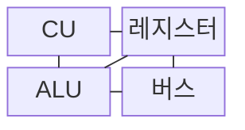
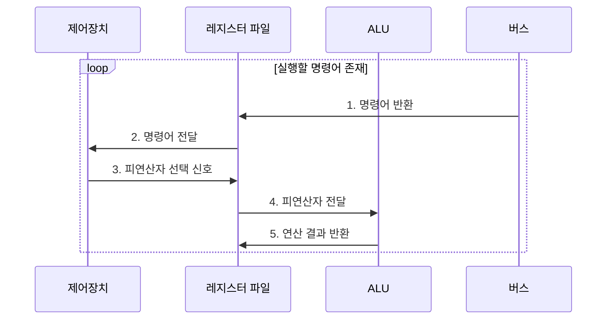

---
sidebar:
  order: 2
  label: "002. CPU 구성: ALU·CU·레지스터·버스 (CPU Components)"
  badge:
    text: "기출 · 50%"
    variant: note
title: "CPU 구성: ALU·CU·레지스터·버스 (CPU Components)"
date: "2026-08-02T09:02:00+09:00"
tags:
  - "notes-hardware"
weight: 2
extra:
  question_no: "002"
  source_status: "기출"
  source_history: "138회"
  priority: 50
  priority_note: "CPU 구성과 명령어 주기의 핵심 기초"
---

## Ⅰ. 개요

핵심 용어

- **CPU**는 명령어를 인출·해독·실행하고 그 결과를 기록하는 핵심 처리장치이다.
- **명령어 사이클**은 하나의 명령어를 인출한 뒤 해독·실행·기록하는 처리 과정이다.
- **명령 처리 병목**은 인출·해독·연산·저장·전송 단계 중 가장 긴 대기가 전체 처리량을 제한하는 상태이다.

- 정의/개념: **CPU**는 명령어를 인출•해독•실행하고 결과를 기록하는 **중앙 처리 장치**
- 배경/필요성: 내부 기능을 연산•제어•저장•전송으로 나눠야 **명령 처리 병목의 위치를 식별 가능**

#### 한줄 요약
- CPU를 구성요소별로 구분하면 성능 저하 원인을 연산·제어·저장·전송 병목으로 나누어 분석할 수 있다.

## Ⅱ. 특징

핵심 용어

- **제어 흐름**은 제어장치가 명령어 해독 결과에 따라 실행 순서와 제어 신호를 결정하는 경로이다.
- **레지스터**는 CPU가 피연산자와 중간 결과를 고속으로 보관하는 내부 저장장치이다.
- **클록**은 CPU 내부 순차 회로가 상태를 갱신할 시점을 일정한 주기로 맞추는 신호이다.
- **데이터 흐름**은 피연산자와 연산 결과가 레지스터·ALU·버스 사이를 이동하는 경로이다.
- **클록 엣지**는 순차 회로가 입력을 받아 내부 상태를 갱신하는 클록 신호의 변화 시점이다.

- **제어 흐름**과 데이터 흐름을 분리한 내부 경로 구성
- 피연산자를 **레지스터**에 상주시켜 메모리 왕복 감소
- **클록 엣지**를 기준으로 순차 회로의 상태 동기 갱신

#### 한줄 요약
- CPU는 제어 경로와 데이터 경로를 분리하고 레지스터 상태를 클록에 맞춰 갱신한다.

## Ⅲ. 구조 및 구성요소

핵심 용어

- **ALU**는 피연산자에 산술·논리·시프트 연산을 수행하는 장치이다.
- **CU**는 명령어를 해독하여 데이터 경로의 동작 순서와 제어 신호를 생성하는 장치이다.
- **레지스터**는 주소·피연산자·연산 결과와 상태를 CPU 내부에 고속으로 보관하는 저장장치이다.
- **버스**는 CPU 구성요소와 메모리 사이에서 주소·데이터·제어 신호를 전달하는 통로이다.
- **상태 레지스터**는 ALU 연산의 0·부호·캐리·오버플로 같은 상태를 저장하는 레지스터이다.

| 구성요소 | 책임 |
|:---|:---|
| ALU | **산술·논리·시프트 연산** 수행 |
| CU | **제어 신호·실행 순서** 생성 |
| 레지스터 | 주소·피연산자·결과 **고속 보관** |
| 버스 | 주소·데이터·제어 신호 **전송** |

#### 한줄 요약
- CU가 실행 순서를 지시하고 레지스터와 버스가 공급한 값을 ALU가 연산한다.

## Ⅳ. 흐름도

핵심 용어

- **프로그램 카운터**는 다음에 인출할 명령어의 주소를 저장하는 레지스터이다.
- **명령어 레지스터**는 현재 인출한 명령어를 보관하여 제어장치가 해독할 수 있게 한다.
- **주소 지정 방식**은 명령어에서 피연산자 값이나 그 위치를 찾는 규칙이다.
- **레지스터 파일**은 여러 범용 레지스터를 묶어 피연산자를 읽고 결과를 기록하는 저장 구조이다.
- **상태 비트**는 연산 결과의 0·부호·캐리·오버플로 여부를 나타내는 값이다.

**동작 원리**

- **1. 명령어 반환**: 프로그램 카운터 주소의 명령어 인출
- **2. 명령어 전달**: 명령어 레지스터에서 제어장치로 제공
- **3. 피연산자 선택 신호**: 연산·주소 지정 방식 해독
- **4. 피연산자 전달**: 지정 레지스터값을 ALU에 제공
- **5. 연산 결과 반환**: 결과·상태를 레지스터에 기록

#### 한줄 요약
- CU는 제어 신호를 보내고 레지스터·버스·ALU는 실제 피연산자와 결과를 저장·전송·연산한다.

## Ⅴ. 종류 및 비교

핵심 용어

- **실행 유닛**은 정수·부동소수점·주소 계산처럼 특정 연산을 담당하는 CPU 내부 회로이다.
- **레지스터 스필**은 사용할 레지스터가 부족하여 값을 메모리에 임시 저장했다가 다시 읽는 동작이다.
- **버스 경합**은 여러 요청이 같은 버스를 동시에 사용하려 하여 전송 대기가 발생하는 현상이다.
- **분기·해독 지연**은 다음 명령어 경로를 결정하거나 명령어 의미를 해석하는 데 발생하는 대기이다.
- **연산 병렬화**는 서로 독립적인 연산을 여러 실행 유닛에서 동시에 처리하는 방식이다.
- **버스 대역폭**은 버스가 폭과 주파수에 따라 단위 시간에 전송할 수 있는 데이터양이다.

| CPU 구성요소 | ALU | CU | 레지스터 | 버스 |
|:---|:---|:---|:---|:---|
| 적용 기준 | **연산 처리량** 부족 | **분기·해독** 지연 | **스필** 빈발 | **전송 대기** 증가 |
| 핵심 특징 | 실행 유닛별 **연산 병렬화** | **제어 신호**·순서 생성 | 피연산자·상태 **고속 보관** | 폭·주파수 기반 **대역폭** |
| 한계 | 의존성·포화 시 **연산 대기** | 예측 실패 시 **제어 지연** | 부족 시 **메모리 왕복** | 동시 요청 시 **버스 경합** |

> 요약: 병목별 대기 시간을 기준으로 개선 대상 선택

#### 한줄 요약
- ALU·CU·레지스터·버스는 각각 연산, 제어, 저장, 전송 병목을 만든다.

## Ⅵ. 실무 고려사항 및 대책

핵심 용어

- **분기 예측기**는 조건 분기의 진행 방향을 미리 예측하여 파이프라인이 처리할 다음 명령어 주소를 정한다.
- **캐시 계층**은 속도와 용량이 다른 캐시를 여러 단계로 구성하여 평균 메모리 접근 지연을 줄인다.
- **명령 수준 병렬성**은 서로 의존하지 않는 여러 명령어를 겹쳐 실행하여 처리량을 높이는 성질이다.
- **파이프라인 비움**은 분기 예측 실패 뒤 잘못 가져온 명령어를 제거하는 처리이다.
- **레지스터 할당**은 프로그램 값을 사용할 CPU 레지스터에 배치하는 컴파일러 작업이다.
- **작업 집합**은 일정 시간 동안 프로그램이 집중적으로 사용하는 코드와 데이터의 집합이다.
- **캐시 지역성•캐시 미스**는 가까운 데이터를 반복 접근하는 성질과 요청값을 캐시에서 찾지 못한 상황이다.

| 문제 | 대책 | 효과 |
|:---|:---|:---|
| **ALU 실행 유닛 대기** 증가 | **명령 수준 병렬성•실행 유닛 배치** 조정 | **연산 처리량** 향상 |
| **분기 예측 실패**로 파이프라인 비움 | **예측기•분기 구조** 개선 | **제어 지연** 감소 |
| **레지스터 스필**로 메모리 왕복 증가 | **레지스터 할당•작업 집합** 최적화 | **피연산자 공급 지연** 완화 |
| **버스 경합•캐시 미스**로 CPU 정지 | **캐시 지역성•버스 사용률** 점검 | **데이터 전송 병목** 완화 |
| **주기억장치 접근 지연** | 다단계 **캐시 계층** 구성 | 평균 **피연산자 공급 대기** 감소 |

#### 한줄 요약
- 실행 유닛 사용률, 분기 실패, 스필, 캐시 미스와 버스 대기를 함께 측정해야 실제 병목 구성요소를 찾을 수 있다.

## Ⅶ. 결론

핵심 용어

- **CPU 병목**은 연산·제어·저장·전송 경로 가운데 대기 시간이 가장 큰 구성요소가 전체 처리량을 제한하는 상태이다.
- **캐시**는 자주 쓰는 명령어와 데이터를 CPU 가까이에 보관해 메모리 접근 지연을 줄이는 고속 저장장치이다.

- 대기가 가장 큰 **실행 유닛•레지스터•버스** 우선 개선

#### 한줄 요약
- 연산·저장·전송 대기를 비교하면 실행 유닛, 캐시, 버스 중 개선 대상을 정할 수 있다.
