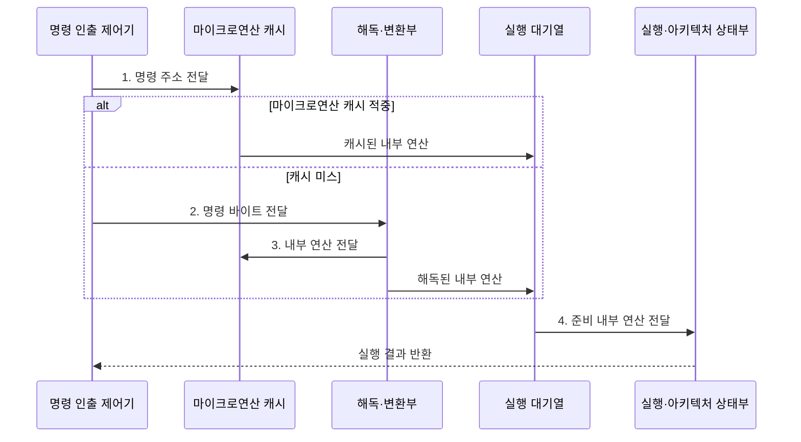

---
sidebar:
  order: 3
  label: "003. 명령어 집합 구조: RISC vs CISC (RISC and CISC Instruction Set Architectures)"
  badge:
    text: "미출 · 50%"
    variant: note
title: "명령어 집합 구조: RISC vs CISC (RISC and CISC Instruction Set Architectures)"
date: "2026-08-02T09:04:00+09:00"
tags:
  - "notes-hardware"
weight: 3
extra:
  question_no: "003"
  source_status: "미출"
  source_history: ""
  priority: 50
  priority_note: "명령 인코딩·해독 비용·호환성 비교"
---

## Ⅰ. 개요

핵심 용어

- **ISA** 는 소프트웨어가 사용할 명령어·레지스터·주소 지정 방식을 정의하는 프로세서의 공개 규격이다.
- **RISC와 CISC** 는 명령어 형식과 복잡도를 각각 단순하고 규칙적으로 구성할지, 복합적으로 구성할지에 따라 구분한 ISA 설계 방식이다.
- **설계 절충** 은 해독 비용·코드 밀도·바이너리 호환성 중 하나를 높일 때 다른 비용이 커지는 관계를 조정하는 판단이다.

- 정의/개념: **RISC와 CISC** 는 명령 형식을 각각 단순•규칙적으로 구성하거나 복합 기능 중심으로 구성하는 **ISA 설계 방식**
- 배경/필요성: 명령 해독 비용•코드 밀도•기존 바이너리 호환성 사이의 **설계 절충이 필요**

#### 한줄 요약

- RISC는 기본 동작을 규칙적으로 조합하고 CISC는 자주 묶이는 동작을 한 명령에도 담는다

## Ⅱ. 특징

핵심 용어

- **로드·스토어 구조** 는 메모리 접근을 로드와 스토어 명령으로 제한하고 나머지 연산을 레지스터 사이에서 수행한다.
- **코드 밀도** 는 일정한 메모리 공간에 담을 수 있는 프로그램 명령의 양을 나타낸다.
- **마이크로아키텍처** 는 ISA를 해독부·실행 유닛·캐시 등의 실제 회로로 구현한 내부 구조이다.
- **RISC•CISC** 는 규칙적인 로드·스토어 명령과 복합적인 가변 길이 명령을 사용하는 ISA 계열이다.

- **RISC** 의 규칙적 형식으로 해독 회로 단순화
- **CISC** 의 복합 명령으로 코드 밀도 향상
- **ISA•마이크로아키텍처** 조합에 따라 성능 변화

#### 한줄 요약

- 같은 메뉴판을 써도 주방 구조가 다르면 속도와 전력 사용이 달라져 메뉴판만으로 성능을 단정할 수 없다

## Ⅲ. 구조 및 구성요소

핵심 용어

- **명령어 인코딩** 은 연산 종류와 피연산자 정보를 명령 비트의 길이와 필드 위치로 표현하는 규칙이다.
- **마이크로연산** 은 ISA 명령어를 프로세서 내부에서 실행할 수 있도록 나눈 단순 연산 단위이다.
- **실행 백엔드** 는 준비된 마이크로연산을 실행 유닛에 발행하고 결과를 기록하는 코어 영역이다.
- **피연산자 모델** 은 명령어가 사용할 수 있는 레지스터·메모리 값과 접근 방식을 정한 규칙이다.
- **해독·변환부** 는 명령 바이트를 프로세서 내부의 마이크로연산으로 변환하는 회로이다.
- **실행 대기열** 은 피연산자 준비 상태를 추적해 마이크로연산의 발행 순서를 정하는 구조이다.

| 구성요소 | 책임 |
|:---|:---|
| 명령어 인코딩 | 명령 길이와 **필드 위치** 정의 |
| 피연산자 모델 | 허용 피연산자와 **접근 방식** 정의 |
| 해독·변환부 | 명령 바이트를 **내부 연산** 으로 변환 |
| 마이크로연산 캐시 | 해독 결과를 저장해 **반복 해독 생략** |
| 실행 백엔드·대기열 | 준비된 연산의 **발행·실행·기록** |

#### 한줄 요약
- ISA가 명령 표현을 정하고 해독부·캐시·실행 백엔드가 이를 내부 연산으로 처리한다.

## Ⅳ. 흐름도

핵심 용어

- **마이크로연산 캐시** 는 이미 해독한 내부 연산을 저장하여 반복되는 명령어의 재해독을 줄인다.
- **실행 대기열** 은 피연산자가 준비된 내부 연산을 추적하고 실행 유닛에 보낼 순서를 정한다.
- **명령 인출 제어기** 는 다음 실행할 명령어 주소를 정해 명령 바이트를 가져오는 제어부이다.
- **캐시 적중•미스** 는 요청한 마이크로연산이 캐시에 있거나 없어 해독부를 다시 사용해야 하는 상태이다.
- **아키텍처 상태** 는 ISA가 소프트웨어에 보이도록 정의한 레지스터와 상태값이다.

**동작 원리**

- **1. 명령 주소 전달**: 캐시된 내부 연산 조회
- **2. 명령 바이트 전달**: 명령 필드의 내부 연산 변환
- **3. 내부 연산 전달**: 해독 결과를 캐시에 보관
- **4. 준비 내부 연산 전달**: 실행 유닛에 연산 발행

#### 한줄 요약

- 메뉴판의 주문 형식과 재료 사용 규칙이 주방의 주문 해석 방식을 바꾼다

## Ⅴ. 종류 및 비교

핵심 용어

- **RISC** 는 규칙적인 명령어 형식과 로드·스토어 구조로 해독을 단순화한 ISA 계열이다.
- **CISC** 는 가변 길이 명령과 메모리 피연산자를 허용하여 한 명령어의 표현력을 높인 ISA 계열이다.
- **바이너리 호환성** 은 기존 실행 파일을 다시 컴파일하지 않고 같은 ISA에서 실행할 수 있는 성질이다.
- **해독부 면적** 은 명령 해독 회로가 반도체 칩에서 차지하는 물리적 공간이다.
- **명령 수•전력** 은 같은 작업을 수행하는 명령어 개수와 프로세서가 소비하는 전기 에너지이다.

| 판단 기준 | RISC | CISC |
|:---|:---|:---|
| 적용 기준 | 재컴파일 가능하고 **해독부 면적** 이 제한된 경우 | 기존 **x86 바이너리** 호환이 필요한 경우 |
| 핵심 특징 | **규칙적 형식**·로드/스토어 | **가변 형식**·메모리 피연산자 |
| 한계 | 코드 밀도·**명령 수 증가** | 해독 복잡도·**전력 증가** |

> 요약: 규칙적 해독은 RISC, x86 호환은 CISC

#### 한줄 요약

- RISC는 주문 해석을 단순하게 만들고 CISC는 한 주문서에 더 많은 일을 담는다

## Ⅵ. 실무 고려사항 및 대책

핵심 용어

- **해독 처리량** 은 해독부가 한 클록 주기에 내부 연산으로 변환할 수 있는 명령어 수이다.
- **압축 명령어** 는 자주 사용하는 연산을 짧게 인코딩하여 코드 크기와 명령 캐시 사용량을 줄인다.
- **에뮬레이션·호환 계층** 은 다른 ISA의 동작을 모사하거나 기존 실행 환경을 새 플랫폼에 연결한다.
- **명령 정렬** 은 가변 길이 명령의 시작 경계를 찾아 해독기에 맞춰 배치하는 처리이다.
- **명령 캐시 미스** 는 필요한 명령어를 캐시에서 찾지 못해 하위 메모리에서 가져오는 상황이다.
- **마이크로아키텍처 벤치마크** 는 실제 구현에서 처리시간·전력·자원 사용량을 측정하는 시험이다.

| 문제 | 대책 | 효과 |
|:---|:---|:---|
| **가변 길이 명령** 으로 해독부 포화 | **마이크로연산 캐시•명령 정렬** 최적화 | **반복 해독 비용** 감소 |
| RISC 코드 크기로 **명령 캐시 미스** 증가 | **압축 명령어•코드 배치** 최적화 | **코드 밀도•인출 효율** 향상 |
| ISA 전환으로 **바이너리 호환성** 상실 | 재컴파일·**에뮬레이션•호환 계층** 계획 | **마이그레이션 위험** 완화 |
| ISA만으로 **성능•전력** 단정 | 실제 **마이크로아키텍처 벤치마크** 적용 | 구현별 **성능 판단 정확도** 향상 |

#### 한줄 요약

- 명령 인출·해독 처리량, 코드 밀도, 내부 연산 수와 실행 백엔드 사용률을 함께 측정해야 ISA 설계의 실제 영향을 판단할 수 있다.

## Ⅶ. 결론

핵심 용어

- **벤치마크** 는 동일한 작업의 처리 시간·전력·자원 사용량을 측정하여 ISA와 마이크로아키텍처 조합을 비교하는 시험이다.
- **RISC•CISC** 는 규칙적인 명령 형식으로 해독을 단순화한 ISA와 복합 명령으로 바이너리 호환성과 코드 밀도를 높인 ISA이다.

- 단순 해독은 **RISC**, x86 호환은 **CISC** 선택

#### 한줄 요약

- 이름만으로 선택하지 말고 기존 프로그램 호환성과 명령 해독 회로 복잡도를 함께 따져야 한다
