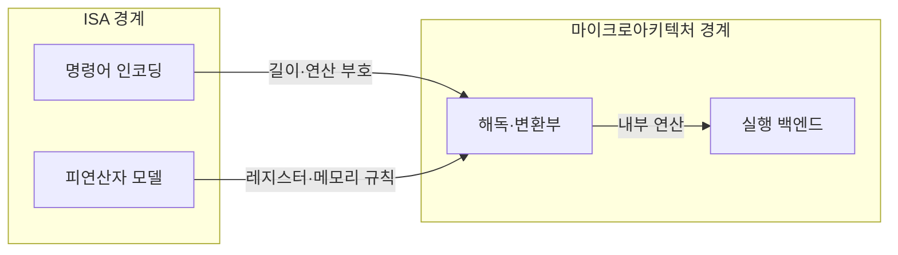
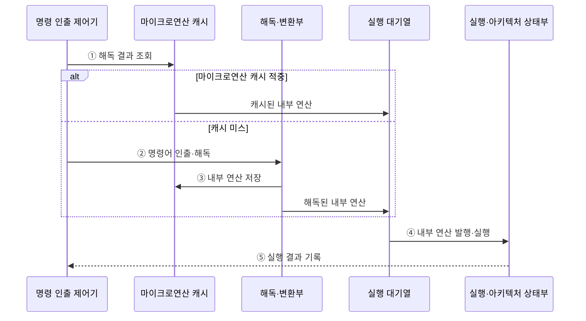

---
sidebar:
  order: 3
  label: "003. 명령어 집합 구조 — RISC vs CISC (RISC and CISC Instruction Set Architectures)"
  badge:
    text: "미출 · 50%"
    variant: note
title: "명령어 집합 구조 — RISC vs CISC (RISC and CISC Instruction Set Architectures)"
date: "2026-07-28T12:33:03+09:00"
tags:
  - "notes-hardware"
weight: 3
extra:
  question_no: "003"
  source_status: "미출"
  source_history: ""
  priority: 50
  priority_note: "명령 인코딩·해독 비용·호환성 비교"
---

## 미리 알고가기

- **축소 명령어 집합 컴퓨터(Reduced Instruction Set Computer, RISC)·복합 명령어 집합 컴퓨터(Complex Instruction Set Computer, CISC)**: 명령어의 복잡도와 형식에 따라 구분한 프로세서 명령어 집합 구조
- **명령어 집합 구조(Instruction Set Architecture, ISA)**: 소프트웨어가 사용하는 명령어·레지스터·주소 지정 규약이다.
- **RISC**: 규칙적 인코딩과 로드/스토어로 해독을 단순화한 ISA 계열
- **CISC**: 복합 연산과 메모리 피연산자로 명령 표현력을 높인 ISA 계열
- **로드·스토어 구조(Load/Store Architecture)**: 메모리 접근을 로드·스토어 명령으로 제한하고 나머지 연산은 레지스터 사이에서 수행하는 구조
- **피연산자(Operand)**: 명령어가 읽거나 쓰는 레지스터·메모리 값
- **마이크로연산(Micro-operation)**: ISA 명령을 내부에서 실행하는 단순 연산 단위
- **마이크로아키텍처(Microarchitecture)**: ISA를 실제 회로로 구현하는 내부 조직
- **코드 밀도(Code Density)**: 같은 메모리에 담기는 프로그램 명령의 양
- **압축 명령어(Compressed Instruction)**: 자주 쓰는 연산의 짧은 인코딩
- **바이너리 호환성(Binary Compatibility)**: 기존 실행 파일을 재컴파일 없이 실행하는 성질
- **엑스86 계열(x86 Family)**: 가변 길이·복합 명령어와 이전 세대 바이너리 호환성을 유지하는 대표적인 CISC ISA
- **명령어 인코딩(Instruction Encoding)**: 연산 종류·피연산자·주소 지정 정보를 명령 비트의 길이와 필드 위치로 표현하는 규칙
- **연산 부호(Operation Code, Opcode)**: 명령어가 수행할 연산 종류를 나타내며 해독부가 실행 동작을 결정하는 비트 필드
- **실행 백엔드(Execution Backend)**: 해독된 내부 연산을 대기열에서 선택해 실행 유닛에 발행하고 결과를 기록하는 코어 영역
- **실행 대기열(Issue Queue)**: 피연산자가 준비된 내부 연산을 추적해 실행 유닛에 보낼 순서를 정하는 저장 구조
- **마이크로연산 캐시(Micro-operation Cache, Micro-op Cache)**: 이미 해독한 내부 연산을 저장해 반복되는 x86 명령의 재해독을 줄이는 캐시
- **임베디드 코어(Embedded Core)**: 제한된 메모리·전력 환경의 전용 기기에 내장되며 압축 명령으로 코드 크기를 줄이는 프로세서 코어
- **명령어 인출·해독(Instruction Fetch·Decode)**: 메모리에서 명령 바이트를 가져오고 경계·연산 부호·피연산자 필드를 내부 연산으로 변환하는 단계
- **해독 처리량(Decode Throughput)**: 해독부가 한 클록 주기에 내부 연산으로 바꿀 수 있는 명령어 수
- **에뮬레이션·호환 계층(Emulation·Compatibility Layer)**: 다른 ISA의 동작을 소프트웨어로 모사하거나 기존 실행 환경의 인터페이스를 새 플랫폼에 연결하는 방식
- **벤치마크(Benchmark)**: 같은 작업을 실행해 처리 시간·전력·자원 사용량을 비교하는 측정 시험

## Ⅰ. 개요

- 정의/개념: 명령 형식·복잡도가 다른 **ISA 설계 방식**
- 기존 한계: 해독 비용·코드 밀도·**호환성**의 상충

### 쉽게 이해하기 (학습용)

- RISC는 기본 동작을 규칙적으로 조합하고 CISC는 자주 묶이는 동작을 한 명령에도 담는다

## Ⅱ. 특징

- **RISC**의 규칙적 형식으로 해독 회로 단순화
- **CISC**의 복합 명령으로 코드 밀도 향상
- **ISA**와 **마이크로아키텍처**가 함께 성능 결정

### 쉽게 이해하기 (학습용)

- 같은 메뉴판을 써도 주방 구조가 다르면 속도와 전력 사용이 달라져 메뉴판만으로 성능을 단정할 수 없다

## Ⅲ. 아키텍처

**도표안 A — 구조도**

**도표안 B — sequenceDiagram**

| 설계 요소 | 입력·상태 | 역할 |
|:---|:---|:---|
| 명령어 인코딩 | 연산·피연산자 비트 | 명령 길이와 필드 위치 정의 |
| 피연산자 모델 | 레지스터·메모리 규칙 | 허용 피연산자와 접근 방식 정의 |
| 해독·변환부 | 명령 바이트 | 경계·연산 부호를 내부 연산으로 변환 |
| 실행 백엔드 | 내부 연산·피연산자 준비 상태 | 스케줄링·실행·결과 기록 |
| 마이크로연산 캐시 | 명령어 주소·해독 결과 | 반복 명령의 내부 연산을 재사용해 해독 우회 |
| 실행 대기열 | 내부 연산·의존 상태 | 피연산자가 준비된 연산을 실행 유닛에 발행 |

> 요약: ISA 규칙이 명령 해독부 구조를 좌우

**동작 원리**

- **① 해독 결과 조회**: 명령어 주소에 대응하는 기존 마이크로연산이 캐시에 있는지 확인
- **② 명령어 인출·해독**: 캐시 미스이면 명령 경계·연산 부호·피연산자 필드를 분석해 내부 연산 생성
- **③ 내부 연산 저장**: 반복 실행 시 해독을 생략할 수 있도록 변환 결과를 마이크로연산 캐시에 보관
- **④ 내부 연산 발행·실행**: 실행 대기열이 준비된 연산을 실행 유닛에 전달
- **⑤ 실행 결과 기록**: 완료한 연산 결과를 레지스터·메모리 등 아키텍처 상태에 반영

### 쉽게 이해하기 (학습용)

- 메뉴판의 주문 형식과 재료 사용 규칙이 주방의 주문 해석 방식을 바꾼다

## Ⅳ. 종류 및 비교

| 판단 기준 | RISC | CISC |
|:---|:---|:---|
| 핵심 특징 | **규칙적 형식**·로드/스토어 | **가변 형식**·메모리 피연산자 |
| 적용 기준 | 재컴파일 가능하고 **해독부 면적**이 제한된 경우 | 기존 **x86 바이너리** 호환이 필요한 경우 |
| 주요 위험 | 코드 밀도·명령 수 증가 | 해독 복잡도·전력 증가 |

> 요약: 규칙적 해독은 RISC, x86 호환은 CISC

### 쉽게 이해하기 (학습용)

- RISC는 주문 해석을 단순하게 만들고 CISC는 한 주문서에 더 많은 일을 담는다

## Ⅴ. 실무 고려사항 및 대책

| 실패 징후 | 완화 방안 | 기대 효과 |
|:---|:---|:---|
| 가변 길이 명령 해독부 포화 | 마이크로연산 캐시·명령 정렬 최적화 | 반복 해독 비용 감소 |
| RISC 코드 크기로 명령 캐시 미스 증가 | 압축 명령어·코드 배치 최적화 | 코드 밀도와 인출 효율 향상 |
| ISA 전환으로 기존 바이너리 실행 불가 | 재컴파일·에뮬레이션·호환 계층 계획 | 마이그레이션 위험 완화 |
| ISA만 보고 성능·전력을 단정 | 실제 마이크로아키텍처 벤치마크 적용 | 구현별 성능 판단 정확화 |

### 쉽게 이해하기 (학습용)

- 명령 인출·해독 처리량, 코드 밀도, 내부 연산 수와 실행 백엔드 사용률을 함께 측정해야 ISA 설계의 실제 영향을 판단할 수 있다.

## Ⅵ. 결론

- **RISC·CISC**는 호환성·해독 비용에 따라 선택

### 쉽게 이해하기 (학습용)

- 이름만으로 선택하지 말고 기존 프로그램 호환성과 명령 해독 회로 복잡도를 함께 따져야 한다
