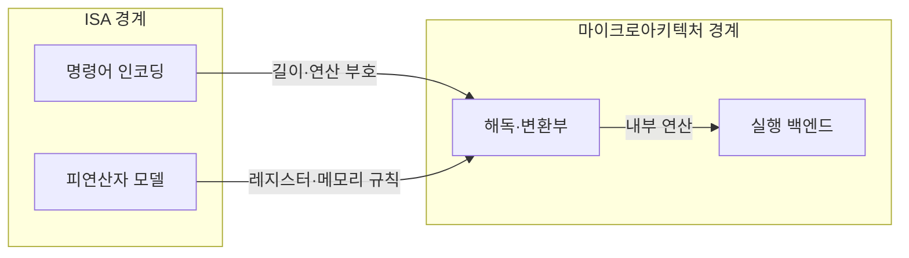
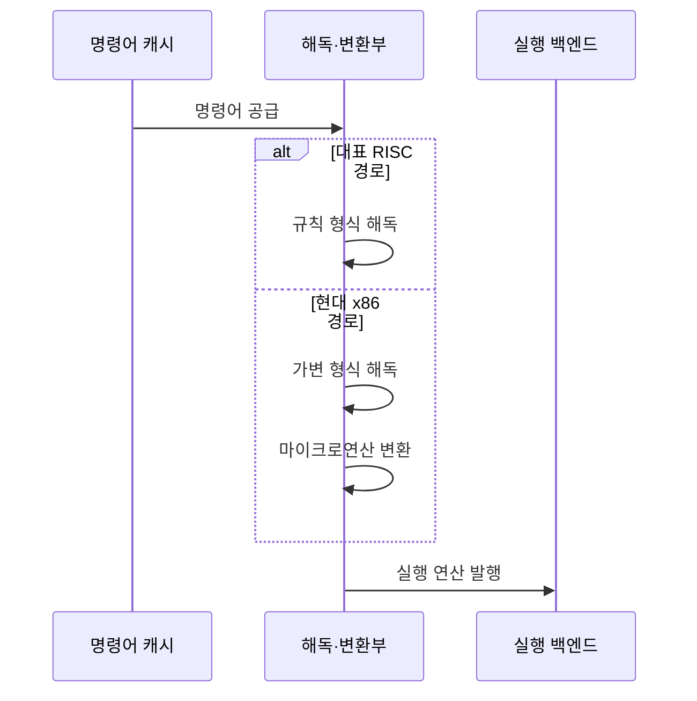

---
sidebar:
  order: 3
  label: "003. 명령어 집합 구조 — RISC vs CISC (RISC and CISC Instruction Set Architectures)"
  badge:
    text: "미출제 · 50%"
    variant: note
title: "명령어 집합 구조 — RISC vs CISC (RISC and CISC Instruction Set Architectures)"
date: "2026-07-25T00:49:00+09:00"
tags:
  - "notes-hardware"
weight: 3
extra:
  question_no: "003"
  source_status: "미출제"
  source_history: ""
  priority: 50
  priority_note: "명령 인코딩·해독 비용·호환성 비교"
---

## 미리 알고가기

- **축소 명령어 집합 컴퓨터(Reduced Instruction Set Computer, RISC, 리스크)·복합 명령어 집합 컴퓨터(Complex Instruction Set Computer, CISC, 시스크)**: 두 영문 명칭의 각 단어 첫 글자를 따 RISC·CISC로 표기하며 명령 복잡도·형식을 달리한 설계 계열
- **명령어 집합 구조(Instruction Set Architecture, ISA, 아이에스에이)**: 영문 각 단어의 첫 글자를 따 ISA로 표기하며 소프트웨어가 사용하는 명령·레지스터 규약
- **RISC**: 규칙적 인코딩과 로드/스토어로 해독을 단순화한 ISA 계열
- **CISC**: 복합 연산과 메모리 피연산자로 명령 표현력을 높인 ISA 계열
- **로드·스토어 구조(Load/Store Architecture)**: ‘로드 스토어’로 읽고 두 메모리 명령을 빗금(/)으로 묶어 부르는 관례 표기를 사용하며 메모리 접근은 로드·스토어로 제한하고 나머지 연산은 레지스터에서 수행하는 구조
- **피연산자(Operand)**: 명령어가 읽거나 쓰는 레지스터·메모리 값
- **마이크로연산(Micro-operation)**: ISA 명령을 내부에서 실행하는 단순 연산 단위
- **마이크로아키텍처(Microarchitecture)**: ISA를 실제 회로로 구현하는 내부 조직
- **코드 밀도(Code Density)**: 같은 메모리에 담기는 프로그램 명령의 양
- **압축 명령어(Compressed Instruction)**: 자주 쓰는 연산의 짧은 인코딩
- **바이너리 호환성(Binary Compatibility)**: 기존 실행 파일을 재컴파일 없이 실행하는 성질
- **엑스86 계열(x86 Family)**: ‘엑스 에이티식스’로 읽고 8086 계열 명칭의 끝 두 자리를 계승한 관례 표기를 사용하며 가변 길이·복합 명령과 기존 바이너리 호환성을 유지하는 대표 CISC ISA
- **명령어 인코딩(Instruction Encoding)**: 연산 종류·피연산자·주소 지정 정보를 명령 비트의 길이와 필드 위치로 표현하는 규칙
- **연산 부호(Operation Code, Opcode)**: 명령어가 수행할 연산 종류를 나타내며 해독부가 실행 동작을 결정하는 비트 필드
- **실행 백엔드(Execution Backend)**: 해독된 내부 연산을 대기열에서 선택해 실행 유닛에 발행하고 결과를 기록하는 코어 영역
- **실행 대기열(Issue Queue)**: 피연산자가 준비된 내부 연산을 추적해 실행 유닛에 보낼 순서를 정하는 저장 구조
- **마이크로연산 캐시(Micro-operation Cache, Micro-op Cache)**: 이미 해독한 내부 연산을 저장해 반복되는 x86 명령의 재해독을 줄이는 캐시
- **임베디드 코어(Embedded Core)**: 제한된 메모리·전력 환경의 전용 기기에 내장되며 압축 명령으로 코드 크기를 줄이는 프로세서 코어

## Ⅰ. 개요

- 정의/개념: 명령 형식·복잡도가 다른 **ISA 설계 방식**
- 기존 한계: 해독 비용·코드 밀도·**호환성**의 상충

### 쉽게 이해하기 (학습용)

- RISC는 기본 동작을 규칙적으로 조합하고 CISC는 자주 묶이는 동작을 한 명령에도 담는다

## Ⅱ. 특징

- **RISC**의 규칙적 형식으로 해독 회로 단순화
- **CISC**의 복합 명령으로 코드 밀도 향상
- **ISA**와 **마이크로구조**가 함께 성능 결정

### 쉽게 이해하기 (학습용)

- 같은 메뉴판을 써도 주방 구조가 다르면 속도와 전력 사용이 달라져 메뉴판만으로 성능을 단정할 수 없다

## Ⅲ. 아키텍처 및 구성요소

| 설계 요소 | 설명 |
|:---|:---|
| 명령어 인코딩 | 명령 길이·필드 위치를 ISA로 정의 |
| 피연산자 모델 | 레지스터·메모리 피연산자 범위 정의 |
| 해독·변환부 | 명령 경계·연산 부호를 실행 형태로 변환 |
| 실행 백엔드 | 내부 연산을 스케줄링해 실행 |

> 요약: ISA 규칙이 명령 해독부 구조를 좌우

### 쉽게 이해하기 (학습용)

- 메뉴판의 주문 형식과 재료 사용 규칙이 주방의 주문 해석 방식을 바꾼다

## Ⅳ. 원리 및 절차 흐름도

| 절차 | 설명 |
|:---|:---|
| 명령어 공급 | 캐시가 다음 명령 바이트를 전달 |
| 규칙 형식 해독 | 필드 배치로 연산·피연산자 판독 |
| 가변 형식 해독 | x86 명령 경계·연산 부호 판독 |
| 마이크로연산 변환 | x86 복합 명령을 내부 연산으로 변환 |
| 실행 연산 발행 | 내부 연산을 실행 대기열에 등록 |

> 요약: RISC는 필드 해독, x86은 경계 판독·내부 변환

### 쉽게 이해하기 (학습용)

- 같은 규격 주문은 정해진 칸을 읽고 복합 주문은 경계를 찾은 뒤 주방 작업으로 나눈다

## Ⅴ. 종류 및 비교

| 판단 기준 | RISC | CISC |
|:---|:---|:---|
| 핵심 특징 | **규칙적 형식**·로드/스토어 | **가변 형식**·메모리 피연산자 |
| 적용 기준 | 재컴파일 가능하고 **해독부 면적**이 제한된 경우 | 기존 **x86 바이너리** 호환이 필요한 경우 |
| 주요 위험 | 코드 밀도·명령 수 증가 | 해독 복잡도·전력 증가 |

> 요약: 규칙적 해독은 RISC, x86 호환은 CISC

### 쉽게 이해하기 (학습용)

- RISC는 주문 해석을 단순하게 만들고 CISC는 한 주문서에 더 많은 일을 담는다

## Ⅵ. 실무 사례

1. x86 코어에서 해독한 **내부 연산**을 캐시해 재해독 감소

### 쉽게 이해하기 (학습용)

- 복합 주문을 한 번 나눈 뒤 보관하면 같은 주문을 다시 해석하지 않아도 된다

## Ⅶ. 결론

- **RISC·CISC**는 호환성·해독 비용에 따라 선택

### 쉽게 이해하기 (학습용)

- 이름만으로 선택하지 말고 기존 프로그램 호환성과 명령 해독 회로 복잡도를 함께 따져야 한다
