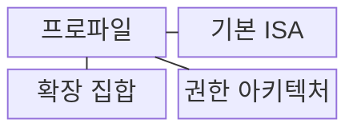
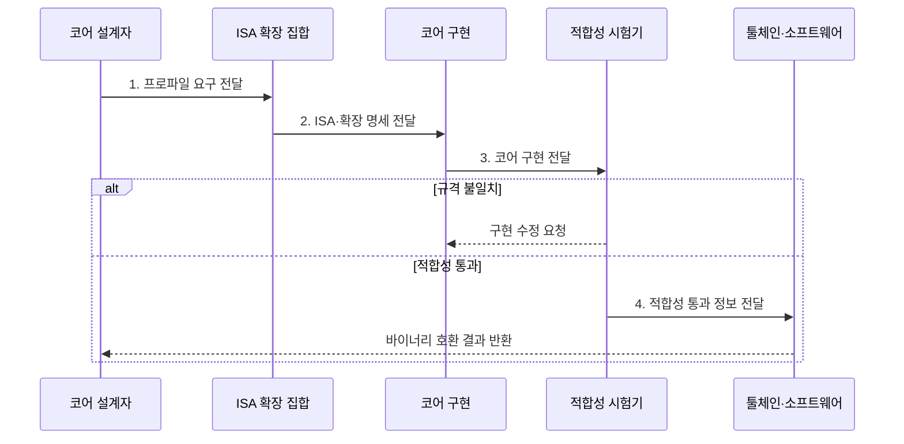

---
sidebar:
  order: 4
  label: "004. RISC-V 개방형 ISA (RISC-V Open Standard ISA)"
  badge:
    text: "기출 · 70%"
    variant: note
title: "RISC-V 개방형 ISA (RISC-V Open Standard ISA)"
date: "2026-08-02T09:06:00+09:00"
tags:
  - "notes-hardware"
weight: 4
extra:
  question_no: "004"
  source_status: "기출"
  source_history: "137회"
  priority: 70
  priority_note: "개방형 ISA·확장·적합성 설계"
---

## Ⅰ. 개요

핵심 용어

- **RISC-V**는 공개된 기본 명령어 집합에 필요한 확장을 조합하여 프로세서를 구현할 수 있는 개방형 ISA이다.
- **ISA**는 소프트웨어가 사용할 명령어·레지스터·데이터 형식과 실행 동작을 정의하는 하드웨어 인터페이스이다.

- 정의/개념: 개방형 **기본 ISA와 선택 확장**을 조합하는 규격
- 배경/필요성: 폐쇄형 ISA 라이선스는 **전용 명령•독자 코어** 구현 제약

### 쉽게 이해하기 (학습용)

- RISC-V는 공개 ISA를 기반으로 목적에 맞는 명령 확장과 독자 코어 구현을 허용한다.

## Ⅱ. 특징

핵심 용어

- **기본 ISA**는 RISC-V 구현이 공통으로 제공해야 하는 최소 정수 명령어 집합이다.
- **표준 확장**은 곱셈·부동소수점·벡터처럼 공식 규격으로 정의된 선택 기능 묶음이다.
- **마이크로아키텍처**는 같은 ISA를 파이프라인과 캐시 등의 실제 회로로 구현한 내부 설계이다.

- 사용료 없는 **개방형 ISA**로 독자 코어 구현 허용
- **기본 ISA**에 표준·사용자 정의 확장을 선택 조합
- ISA 공개와 **마이크로아키텍처** 구현 공개의 분리

### 쉽게 이해하기 (학습용)

- 동일 ISA를 구현해도 파이프라인과 캐시 같은 내부 마이크로아키텍처는 달라질 수 있다.

## Ⅲ. 구조 및 구성요소

핵심 용어

- **ISA 프로파일**은 필수 확장과 선택 확장의 조합을 묶어 소프트웨어의 호환 목표를 고정한 규격이다.
- **권한 아키텍처**는 사용자·감독자·머신 모드와 예외·인터럽트의 처리 동작을 정의한다.
- **XLEN**은 RISC-V의 정수 레지스터와 주소 계산에 사용하는 기본 비트 폭이다.

| 구성요소 | 책임 |
|:---|:---|
| 기본 ISA | 구현의 **공통 실행 계약** 제공 |
| 확장 집합 | 표준·사용자 정의 **추가 기능** 제공 |
| 권한 아키텍처 | 예외·인터럽트·**특권 동작** 규정 |
| 프로파일 | 툴체인·바이너리 **호환 대상** 고정 |

### 쉽게 이해하기 (학습용)
- 기본 ISA와 확장·권한 규격을 프로파일로 묶어 소프트웨어가 의존할 호환 범위를 정한다.

## Ⅳ. 흐름도

핵심 용어

- **RTL**은 레지스터 사이의 데이터 이동과 조합 논리 연산을 클록 단위로 표현하는 하드웨어 설계 모델이다.
- **적합성 시험**은 구현한 코어가 ISA의 명령·예외·권한 규격대로 동작하는지 표준 시험으로 확인한다.

**동작 원리**

- **1. 프로파일 요구 전달**: XLEN·권한·확장 목표 제시
- **2. ISA·확장 명세 전달**: 구현할 인코딩 계약 제공
- **3. 코어 구현 전달**: ISA 동작을 구현한 RTL 시험
- **4. 적합성 통과 정보 전달**: 명령·예외·권한 시험 결과 제공

### 쉽게 이해하기 (학습용)

- 프로파일은 기본 ISA, 확장, 권한 요구사항을 묶어 툴체인과 운영체제가 목표로 삼을 호환 계약을 만든다.

## Ⅴ. 종류 및 비교

핵심 용어

- **사용자 정의 확장**은 RISC-V의 사용자 정의 인코딩 공간에 업체가 추가하는 전용 명령어 집합이다.
- **코어 IP**는 검증된 프로세서 코어를 다른 반도체 설계에 재사용할 수 있도록 제공하는 설계 블록이다.

| 명령어 집합 구조 | RISC-V | Arm |
|:---|:---|:---|
| 적용 기준 | **전용 명령**·자체 검증 역량 | 검증된 **코어 IP**·개발 일정 |
| 핵심 특징 | **개방형 ISA**·사용자 정의 확장 | **라이선스 ISA**·상용 코어 IP |
| 한계 | 구현별 **확장 파편화** | 라이선스 비용·명령 추가 제약 |

> 요약: 확장 자유와 검증 책임을 함께 비교

### 쉽게 이해하기 (학습용)

- RISC-V는 확장 자유가 크고 Arm 코어 IP는 검증된 구현을 활용해 개발 기간을 줄일 수 있다.

## Ⅵ. 실무 고려사항 및 대책

핵심 용어

- **ABI**는 함수 호출에 사용할 레지스터·스택과 바이너리 형식을 정하여 프로그램 간 호환성을 보장하는 규약이다.
- **확장 파편화**는 구현마다 다른 확장 조합을 사용하여 공통 툴체인과 바이너리의 호환성이 깨지는 현상이다.
- **차등 테스트**는 같은 명령을 기준 구현과 시험 코어에서 실행한 뒤 결과 차이로 구현 오류를 찾는다.

| 고려사항 | 대책 | 효과 |
|:---|:---|:---|
| 구현별 확장 조합으로 **바이너리 불일치** | **표준 프로파일•ABI** 고정과 **기능 탐지** | **소프트웨어 호환성** 확보 |
| 사용자 정의 확장과 **표준 인코딩 충돌** | **예약 인코딩•확장 명세** 준수 | 향후 **표준 확장 충돌 방지** |
| 코어의 **ISA 규격 위반** 실행 | **적합성 시험•차등 테스트** 적용 | **구현 정확성** 확보 |
| **툴체인•운영체제 지원** 부족 | 컴파일러·배포판 **성숙도** 사전 검증 | **도입•유지보수 위험** 완화 |
| 맞춤형 가속 코어의 **확장 오류** | **표준 명령•전용 명령** 분리 검증 | **바이너리 호환성** 유지 |

### 쉽게 이해하기 (학습용)

- 개방형 ISA의 자유는 구현·검증 책임을 동반하므로 프로파일, ABI, 툴체인과 적합성 시험을 함께 관리해야 한다.

## Ⅶ. 결론

핵심 용어

- **툴체인**은 소스 코드를 RISC-V 또는 Arm 바이너리로 만드는 컴파일러·어셈블러·링커·디버거의 묶음이다.

- 전용 명령•검증 역량은 **RISC-V**, 일정 우선은 **Arm IP** 선택

### 쉽게 이해하기 (학습용)

- 전용 명령과 검증 역량이 있으면 RISC-V를, 검증된 구현과 일정 단축이 우선이면 상용 코어 IP를 검토한다.
