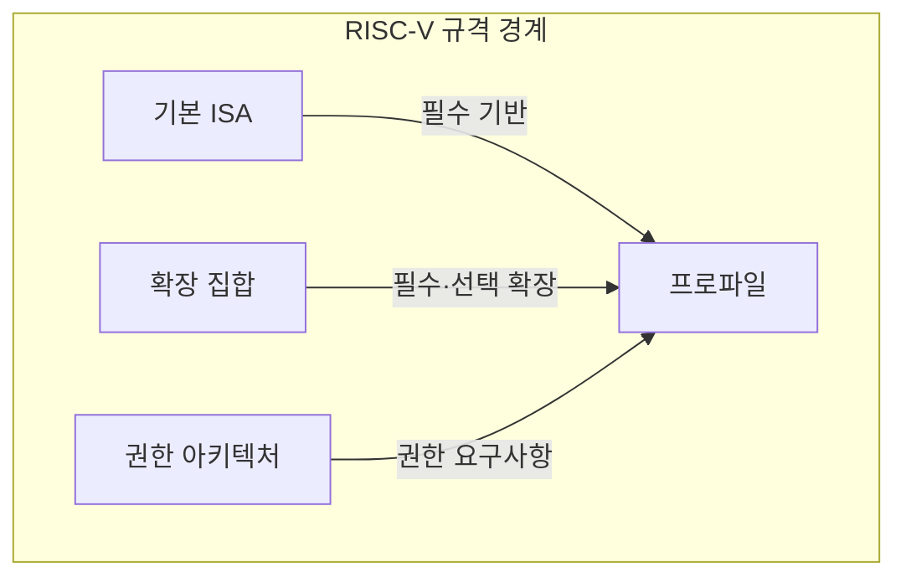

---
sidebar:
  order: 4
  label: "004. RISC-V 개방형 ISA (RISC-V Open Standard ISA)"
  badge:
    text: "기출 · 70%"
    variant: note
title: "RISC-V 개방형 ISA (RISC-V Open Standard ISA)"
date: "2026-07-28T12:33:30+09:00"
tags:
  - "notes-hardware"
weight: 4
extra:
  question_no: "004"
  source_status: "기출"
  source_history: "137회"
  priority: 70
  priority_note: "개방형 ISA·확장·적합성 설계"
---

## 미리 알고가기

- **RISC-V(Reduced Instruction Set Computer Five)**: 공개된 기본 명령어 집합에 필요한 표준 확장을 조합해 프로세서를 설계할 수 있는 개방형 ISA다
- **명령어 집합 구조(Instruction Set Architecture, ISA)**: 소프트웨어가 사용할 명령어·레지스터·데이터 형식과 실행 동작을 정의한 하드웨어 인터페이스
- **마이크로아키텍처(Microarchitecture)**: 같은 ISA 계약을 실제 회로로 어떻게 구현할지에 대한 내부 설계이며, 파이프라인 단수나 캐시 구성처럼 업체마다 다르게 만드는 부분이다
- **기본 ISA(Base ISA)**: 어떤 RISC-V 구현이든 반드시 갖춰야 하는 최소 정수 명령 집합이며, 여기까지는 모든 구현이 똑같다
- **표준 확장(Standard Extension)**: 곱셈·부동소수점·벡터처럼 공식 기구가 규격을 확정해 둔 추가 기능 묶음이며, 붙일지 말지는 구현이 고른다
- **사용자 정의 확장(Custom Extension)**: 규격이 비워 둔 인코딩 자리에 업체가 직접 넣는 전용 명령이며, 자기 코어에서만 통한다
- **권한 아키텍처(Privileged Architecture)**: 사용자·감독자·머신처럼 권한 모드를 나누고 예외와 인터럽트가 일어났을 때의 동작을 정한 규격
- **ISA 프로파일(ISA Profile)**: 필수 확장과 선택 확장의 조합을 미리 묶어 이름 붙인 규격이며, 이 이름 하나로 호환 목표를 고정한다
- **응용 이진 인터페이스(Application Binary Interface, ABI)**: 함수 호출 시 인자·반환값에 사용할 레지스터와 스택·바이너리 형식을 정한 규약
- **툴체인(Toolchain)**: 소스 코드를 실행 파일로 바꾸는 컴파일러·어셈블러·링커·디버거 묶음
- **바이너리(Binary)**: ISA와 ABI 규칙에 맞춰 기계어로 변환돼 프로세서가 바로 실행할 수 있는 프로그램
- **적합성 시험(Conformance Test)**: 만든 코어가 규격대로 동작하는지 표준 시험 코드로 확인해 소프트웨어 호환성을 판정하는 시험
- **반도체 설계자산(Intellectual Property, IP)**: 검증된 프로세서 코어·인터페이스 회로를 다른 칩 설계에 재사용할 수 있도록 제공하는 설계 블록
- **Arm**: 라이선스 계약을 맺은 곳에만 ISA와 검증된 코어 IP를 제공하는 비교 대상 진영이며, 사용료를 내는 대신 설계와 지원을 함께 받는다
- **운영체제 배포판(Operating System Distribution)**: 커널·라이브러리·도구를 묶어 제공하며 공통 ISA·ABI를 대상으로 바이너리를 빌드하는 소프트웨어 묶음
- **확장 파편화(Extension Fragmentation)**: 구현마다 서로 다른 사용자 정의 확장을 붙여 공통 툴체인과 바이너리가 통하지 않게 되는 현상

## Ⅰ. 개요

- 정의/개념: 개방형 **기본 ISA**와 확장을 조합하는 명령 규격
- 기존 한계: 폐쇄형 ISA는 **전용 명령 확장·독자 구현**에 제약

### 쉽게 이해하기 (학습용)

- 남의 레시피를 사서 쓰는 주방에서는 우리 가게에만 필요한 소스 한 가지를 넣고 싶어도 레시피 자체를 고칠 권한이 없어 시도조차 못 하는데, 답안이 배경 자리에 사용료가 아니라 이 막힘을 적은 이유는 돈을 아끼려고 RISC-V를 고르는 것이 아니라 손댈 수 있어서 고르기 때문이다

## Ⅱ. 특징

- 사용료 없는 **개방형 ISA**로 독자 코어 구현 허용
- **기본 ISA**에 표준·사용자 정의 확장을 선택 조합
- ISA 공개와 **마이크로아키텍처** 구현 공개의 분리

### 쉽게 이해하기 (학습용)

- 공개된 것은 손님에게 내놓을 음식의 이름과 맛이 정해진 메뉴판이지 주방을 어떻게 배치하고 불을 몇 도로 올릴지가 아니어서, 같은 메뉴판을 쓰는 가게끼리 손님은 똑같은 음식을 받으면서도 주방 설계는 각자 영업 비밀로 남길 수 있고 필요한 옵션 메뉴만 골라 붙일 수도 있다

## Ⅲ. 아키텍처 및 구성요소

| 설계 요소 | 입력·상태 | 역할 |
|:---|:---|:---|
| 기본 ISA | 최소 정수 명령 | 모든 구현의 공통 실행 계약 제공 |
| 확장 집합 | 표준·사용자 정의 기능 | 선택 기능과 전용 연산 추가 |
| 권한 아키텍처 | 권한 모드·예외 상태 | 예외·인터럽트·특권 동작 규정 |
| 프로파일 | 필수·선택 확장 조합 | 툴체인·바이너리 호환 대상 고정 |

> 요약: **프로파일**이 기본 ISA·확장·권한을 하나의 호환 계약으로 확정

### 쉽게 이해하기 (학습용)

- 프로파일은 기본 ISA, 확장, 권한 요구사항을 묶어 툴체인과 운영체제가 목표로 삼을 호환 계약을 만든다.

## Ⅳ. 운영 고려사항

| 실패 징후 | 완화 방안 | 기대 효과 |
|:---|:---|:---|
| 구현별 확장 조합으로 바이너리 불일치 | 표준 프로파일·ABI 고정과 기능 탐지 | 소프트웨어 호환성 확보 |
| 사용자 정의 확장이 표준 인코딩과 충돌 | 예약 인코딩 준수·확장 명세와 검증 도구 제공 | 향후 표준 확장과 충돌 방지 |
| 코어가 ISA 규격과 다르게 실행 | 적합성 시험·차등 테스트 적용 | 구현 정확성 확보 |
| 툴체인·운영체제 지원 부족 | 지원 확장·컴파일러·배포판 성숙도 사전 검증 | 도입·유지보수 위험 완화 |

### 쉽게 이해하기 (학습용)

- 개방형 ISA의 자유는 구현·검증 책임을 동반하므로 프로파일, ABI, 툴체인과 적합성 시험을 함께 관리해야 한다.

## Ⅴ. 종류 및 비교

| 명령어 집합 구조 | RISC-V | Arm |
|:---|:---|:---|
| 적용 기준 | **전용 명령**과 자체 검증 역량이 있는 경우 | 검증된 **코어 IP**로 일정을 줄이는 경우 |
| 핵심 특징 | **개방형 ISA**·사용자 정의 확장 | **라이선스 ISA**·상용 코어 IP 제공 |
| 한계 | 구현별 확장 난립에 따른 **확장 파편화** | **라이선스 비용**과 명령 추가 제약 |

> 요약: 확장 자유를 얻으면 **파편화 검증** 부담을 함께 감수

### 쉽게 이해하기 (학습용)

- 두 진영의 한계 칸을 나란히 읽으면 맞바꿈이 그대로 보이는데, 옵션을 마음대로 붙일 자유를 얻은 쪽은 서로 안 맞는 옵션 조합이 늘어 통합 시험을 스스로 떠안게 되고, 돈을 내고 검증된 설계를 받는 쪽은 그 시험 부담을 넘기는 대신 우리만의 명령을 넣을 자리를 잃는다

## Ⅵ. 실무 사례

1. 맞춤형 가속 코어에서 **적합성 시험**으로 확장 동작 검증

### 쉽게 이해하기 (학습용)

- 우리 회사 전용 명령을 하나 끼워 넣은 코어라도 나머지 표준 명령이 규격대로 돌지 않으면 기존 프로그램이 죄다 깨지므로, 새 명령보다 표준 명령 쪽을 공통 시험으로 먼저 확인한다

## Ⅶ. 결론

- 맞춤 명령과 검증 역량이 필요하면 **RISC-V** 활용

### 쉽게 이해하기 (학습용)

- 우리만의 연산을 명령 하나로 만들 실력과 그것을 시험할 조직이 있으면 공개 규격을 고르고, 그 둘 중 하나라도 없으면 사용료를 내고 남이 검증해 둔 설계를 받아 일정을 지키는 편이 낫다
