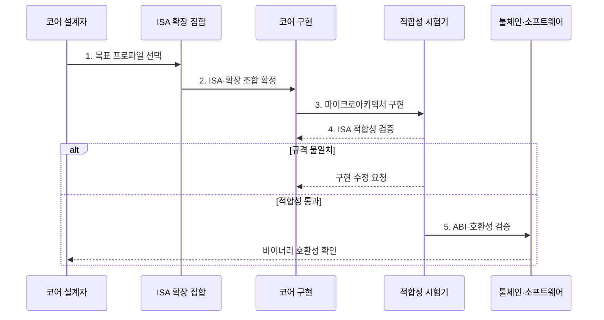

---
sidebar:
  order: 4
  label: "004. RISC-V 개방형 ISA (RISC-V Open Standard ISA)"
  badge:
    text: "기출 · 70%"
    variant: note
title: "RISC-V 개방형 ISA (RISC-V Open Standard ISA)"
date: "2026-07-30T18:36:16+09:00"
tags:
  - "notes-hardware"
weight: 4
extra:
  question_no: "004"
  source_status: "기출"
  source_history: "137회"
  priority: 70
  priority_note: "개방형 ISA·확장·적합성 설계"
---

## 미리 알고가기

- **RISC-V**: 기본 명령어 집합과 확장을 조합하는 개방형 ISA
- **명령어 집합 구조(Instruction Set Architecture, ISA)**: 소프트웨어가 사용할 명령어·레지스터·데이터 형식과 실행 동작을 정의한 하드웨어 인터페이스
- **마이크로아키텍처(Microarchitecture)**: 같은 ISA 계약을 실제 회로로 어떻게 구현할지에 대한 내부 설계이며, 파이프라인 단수나 캐시 구성처럼 업체마다 다르게 만드는 부분이다
- **기본 ISA(Base ISA)**: 프로파일과 XLEN에 따라 구현이 채택하는 최소 정수 명령 집합
- **XLEN**: RISC-V의 정수 레지스터와 주소 계산에 사용하는 기본 비트 폭
- **표준 확장(Standard Extension)**: 곱셈·부동소수점·벡터처럼 공식 기구가 규격을 확정해 둔 추가 기능 묶음이며, 붙일지 말지는 구현이 고른다
- **사용자 정의 확장(Custom Extension)**: 규격이 비워 둔 인코딩 자리에 업체가 직접 넣는 전용 명령이며, 자기 코어에서만 통한다
- **권한 아키텍처(Privileged Architecture)**: 사용자·감독자·머신처럼 권한 모드를 나누고 예외와 인터럽트가 일어났을 때의 동작을 정한 규격
- **ISA 프로파일(ISA Profile)**: 필수 확장과 선택 확장의 조합을 미리 묶어 이름 붙인 규격이며, 이 이름 하나로 호환 목표를 고정한다
- **응용 이진 인터페이스(Application Binary Interface, ABI)**: 함수 호출 시 인자·반환값에 사용할 레지스터와 스택·바이너리 형식을 정한 규약
- **툴체인(Toolchain)**: 소스 코드를 실행 파일로 바꾸는 컴파일러·어셈블러·링커·디버거 묶음
- **바이너리(Binary)**: ISA와 ABI 규칙에 맞춰 기계어로 변환돼 프로세서가 바로 실행할 수 있는 프로그램
- **적합성 시험(Conformance Test)**: 만든 코어가 규격대로 동작하는지 표준 시험 코드로 확인해 소프트웨어 호환성을 판정하는 시험
- **반도체 설계자산(Intellectual Property, IP)**: 검증된 프로세서 코어·인터페이스 회로를 다른 칩 설계에 재사용할 수 있도록 제공하는 설계 블록
- **Arm**: ISA 또는 검증된 코어 IP를 라이선스로 제공하는 비교 대상 아키텍처
- **운영체제 배포판(Operating System Distribution)**: 커널·라이브러리·도구를 묶어 제공하며 공통 ISA·ABI를 대상으로 바이너리를 빌드하는 소프트웨어 묶음
- **확장 파편화(Extension Fragmentation)**: 구현마다 서로 다른 사용자 정의 확장을 붙여 공통 툴체인과 바이너리가 통하지 않게 되는 현상
- **레지스터 전송 수준(Register-Transfer Level, RTL)**: 레지스터 사이의 데이터 이동과 조합 논리 연산을 클록 단위로 표현한 하드웨어 설계 모델
- **차등 테스트(Differential Testing)**: 같은 명령을 기준 구현과 시험 코어에서 실행해 결과 차이로 구현 오류를 찾는 검증법
- **기능 탐지(Feature Detection)**: 실행 전에 프로세서가 지원하는 ISA 확장과 기능을 확인해 호환 코드 경로를 선택하는 절차
- **예약 인코딩(Reserved Encoding)**: 향후 표준 확장을 위해 현재 규격이 사용하지 않도록 남겨 둔 명령어 비트 패턴

## Ⅰ. 개요

- 정의/개념: 개방형 **기본 ISA와 선택 확장**을 조합하는 규격
- 배경/필요성: **전용 명령·독자 코어** 구현 자유 확보

### 쉽게 이해하기 (학습용)

- RISC-V는 공개 ISA를 기반으로 목적에 맞는 명령 확장과 독자 코어 구현을 허용한다.

## Ⅱ. 특징

- 사용료 없는 **개방형 ISA**로 독자 코어 구현 허용
- **기본 ISA**에 표준·사용자 정의 확장을 선택 조합
- ISA 공개와 **마이크로아키텍처** 구현 공개의 분리

### 쉽게 이해하기 (학습용)

- 동일 ISA를 구현해도 파이프라인과 캐시 같은 내부 마이크로아키텍처는 달라질 수 있다.

## Ⅲ. 구조 및 구성요소

| 구성요소 | 책임 |
|:---|:---|
| 기본 ISA | 구현의 **공통 실행 계약** 제공 |
| 확장 집합 | 표준·사용자 정의 **추가 기능** 제공 |
| 권한 아키텍처 | 예외·인터럽트·**특권 동작** 규정 |
| 프로파일 | 툴체인·바이너리 **호환 대상** 고정 |

### 쉽게 이해하기 (학습용)
- 기본 ISA와 확장·권한 규격을 프로파일로 묶어 소프트웨어가 의존할 호환 범위를 정한다.

## Ⅳ. 흐름도

**동작 원리**

- **1. 목표 프로파일 선택**: XLEN·권한·확장 목표 결정
- **2. ISA·확장 조합 확정**: 인코딩 계약 고정
- **3. 마이크로아키텍처 구현**: ISA 동작의 RTL 설계
- **4. ISA 적합성 검증**: 명령·예외·권한 시험
- **5. ABI·호환성 검증**: 호출 규약과 운영체제 실행 확인

### 쉽게 이해하기 (학습용)

- 프로파일은 기본 ISA, 확장, 권한 요구사항을 묶어 툴체인과 운영체제가 목표로 삼을 호환 계약을 만든다.

## Ⅴ. 종류 및 비교

| 명령어 집합 구조 | RISC-V | Arm |
|:---|:---|:---|
| 적용 기준 | **전용 명령**·자체 검증 역량 | 검증된 **코어 IP**·개발 일정 |
| 핵심 특징 | **개방형 ISA**·사용자 정의 확장 | **라이선스 ISA**·상용 코어 IP |
| 한계 | 구현별 **확장 파편화** | 라이선스 비용·명령 추가 제약 |

> 요약: 확장 자유와 검증 책임을 함께 비교

### 쉽게 이해하기 (학습용)

- RISC-V는 확장 자유가 크고 Arm 코어 IP는 검증된 구현을 활용해 개발 기간을 줄일 수 있다.

## Ⅵ. 실무 고려사항 및 대책

| 고려사항 | 대책 | 효과 |
|:---|:---|:---|
| 구현별 확장 조합으로 바이너리 불일치 | 표준 프로파일·ABI 고정과 기능 탐지 | 소프트웨어 호환성 확보 |
| 사용자 정의 확장이 표준 인코딩과 충돌 | 예약 인코딩 준수·확장 명세와 검증 도구 제공 | 향후 표준 확장과 충돌 방지 |
| 코어가 ISA 규격과 다르게 실행 | 적합성 시험·차등 테스트 적용 | 구현 정확성 확보 |
| 툴체인·운영체제 지원 부족 | 지원 확장·컴파일러·배포판 성숙도 사전 검증 | 도입·유지보수 위험 완화 |
| 맞춤형 가속 코어의 확장 오류 | 표준 명령과 전용 명령을 분리 검증 | 기존 바이너리 호환성 유지 |

### 쉽게 이해하기 (학습용)

- 개방형 ISA의 자유는 구현·검증 책임을 동반하므로 프로파일, ABI, 툴체인과 적합성 시험을 함께 관리해야 한다.

## Ⅶ. 결론

- 전용 명령•검증 역량은 **RISC-V**, 일정 우선은 **Arm IP** 선택

### 쉽게 이해하기 (학습용)

- 전용 명령과 검증 역량이 있으면 RISC-V를, 검증된 구현과 일정 단축이 우선이면 상용 코어 IP를 검토한다.
