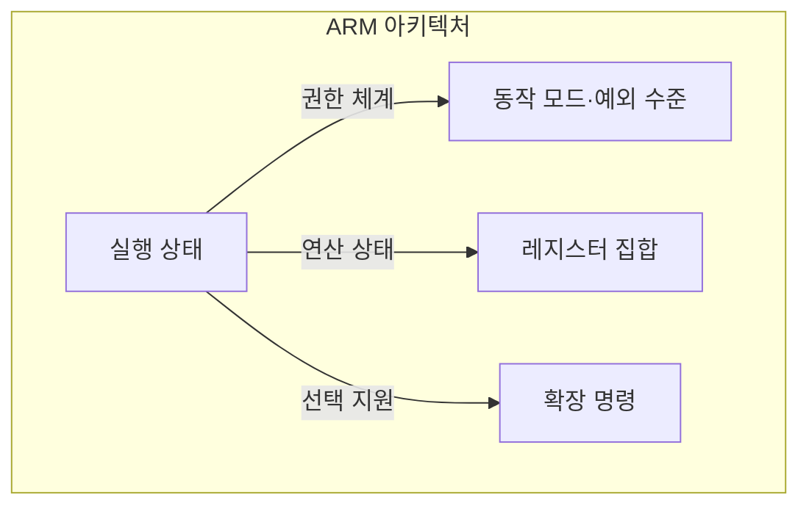
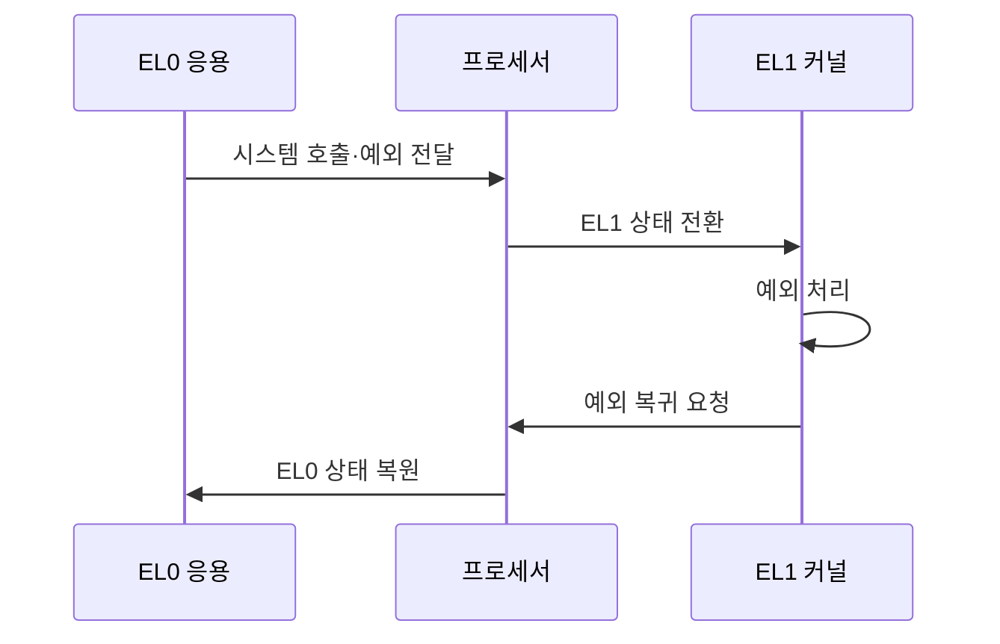

---
sidebar:
  order: 5
  label: "005. ARM 프로세서 아키텍처·동작 모드 (ARM Architecture)"
  badge:
    text: "기출 · 50%"
    variant: note
title: "ARM 프로세서 아키텍처·동작 모드 (ARM Architecture)"
date: "2026-07-27T23:59:50+09:00"
tags:
  - "notes-hardware"
weight: 5
extra:
  question_no: "005"
  source_status: "기출"
  source_history: "126회"
  priority: 50
  priority_note: "임베디드·모바일 설계 기반"
---

## 미리 알고가기

- **ARM 아키텍처(Arm Architecture)**: 레지스터 연산과 메모리 접근을 분리한 로드·스토어 구조에 실행 상태·권한 단계·확장 명령을 결합한 ISA다
- **명령어 집합 구조(Instruction Set Architecture, ISA)**: 프로세서가 제공하는 명령어·레지스터·데이터 형식과 실행 환경을 정의한 규격
- **로드·스토어 구조(Load/Store Architecture)**: 메모리 값을 반드시 레지스터로 실어 온 뒤에만 연산하고 결과도 따로 내려놓게 하여 메모리 접근과 연산을 아예 다른 명령으로 갈라 둔 구조
- **AArch64·AArch32 실행 상태**: 각각 A64 명령어 집합과 A32·T32 명령어 집합을 실행하는 64비트·32비트 Arm 실행 환경
- **동작 모드(Processor Mode)**: AArch32에서 사용자·감독자·인터럽트처럼 권한과 예외 원인별로 나눠 둔 실행 모드
- **예외 수준(Exception Level, EL)**: AArch64의 실행 권한을 응용·커널·하이퍼바이저·보안 모니터 수준으로 구분한 체계
- **레지스터 집합(Register File)**: 연산에 쓸 데이터와 주소를 담아 두는 CPU 내부 고속 저장소 묶음이며 실행 상태에 따라 개수와 폭이 달라진다
- **단일 명령 다중 데이터(Single Instruction Multiple Data, SIMD)**: 하나의 명령어로 여러 데이터 원소를 동시에 연산하는 병렬 처리 방식
- **NEON**: 고정 폭 벡터 레지스터로 영상·음성 등의 데이터를 병렬 처리하는 Arm SIMD 확장
- **확장 가능 벡터 확장(Scalable Vector Extension, SVE)**: 구현별 벡터 길이와 무관하게 같은 바이너리를 실행할 수 있도록 설계한 Arm 벡터 확장
- **응용 이진 인터페이스(Application Binary Interface, ABI)**: 함수 호출의 인자·반환값 레지스터와 스택 사용 규칙을 정의한 바이너리 규약
- **네이티브 라이브러리(Native Library)**: 특정 ISA·ABI의 기계어로 미리 컴파일돼 있어 다른 구조로 옮길 때는 대상 규격으로 다시 빌드해야 하는 라이브러리
- **커널(Kernel)**: 메모리·프로세스·장치를 관리하는 운영체제의 핵심이며 Arm에서는 EL1 권한으로 예외를 처리한다
- **하이퍼바이저(Hypervisor)**: 여러 가상 머신의 CPU·메모리 접근을 중재하는 소프트웨어이며 Arm에서는 커널보다 한 단계 높은 EL2 권한을 쓴다
- **시스템온칩(System on Chip, SoC)**: 프로세서·메모리 제어기·주변장치를 하나의 칩에 통합한 반도체
- **반도체 설계자산(Intellectual Property, IP)**: 검증된 프로세서·인터페이스·주변장치 설계를 칩에 재사용하는 설계 블록
- **x86-64**: 기존 x86 32비트 프로그램과의 호환성을 유지하면서 64비트 주소·레지스터로 확장한 가변 길이 명령어 ISA
- **레거시(Legacy)**: 옛 세대 명령과 소프트웨어를 계속 실행해 주려고 남겨 둔 자산이며, 호환은 지켜 주지만 해독 회로와 설계 복잡도를 함께 떠안는다

## Ⅰ. 개요

- 정의/개념: 실행 상태·권한·확장을 조합하는 **ISA**
- 기존 한계: 고정 구성은 기기별 **전력·권한** 요구 충족 곤란

### 쉽게 이해하기 (학습용)
- 손목시계와 서버 랙에 같은 회로를 그대로 넣으면 한쪽은 배터리가 반나절도 못 버티고 다른 쪽은 가상 머신을 격리할 권한 칸이 모자라는데, 답안이 배경 자리에 이 두 가지 못 맞춤을 적은 이유는 ARM이 여러 코어 계열을 두는 진짜 이유가 성능 자랑이 아니라 이 간극을 메우는 데 있기 때문이다

## Ⅱ. 특징

- **로드·스토어 구조**로 메모리 접근과 레지스터 연산 분리
- **실행 상태·예외 수준** 조합으로 용도별 코어 분화
- ISA 규격과 **코어 IP** 구현의 분리 공급

### 쉽게 이해하기 (학습용)
- ARM은 메모리 접근과 레지스터 연산을 분리한 로드·스토어 구조로 회로 효율을 높이고, 권한 수준과 벡터 확장을 조합해 임베디드부터 서버까지 확장하며, 동일 ISA도 코어 마이크로아키텍처에 따라 성능이 달라진다

## Ⅲ. 아키텍처 및 구성요소

| 설계 요소 | 설명 |
|:---|:---|
| 실행 상태 | 64비트 **AArch64**·32비트 AArch32 실행 환경 규정 |
| 동작 모드·예외 수준 | AArch32 **동작 모드**·AArch64 EL0~EL3 권한 구분 |
| 레지스터 집합 | 실행 상태별 **연산 데이터·주소** 보관 |
| 확장 명령 | **NEON·SVE** 기반 벡터 원소 병렬 연산 |

> 요약: **실행 상태**가 권한 체계·레지스터·확장의 적용 범위 확정

### 쉽게 이해하기 (학습용)
- 그림에서 화살표가 모두 실행 상태 한 칸에서 뻗어 나가는 이유는 64비트로 도는지 32비트로 도는지가 먼저 정해져야 권한 칸을 EL 번호로 부를지 모드 이름으로 부를지, 레지스터를 몇 개 몇 비트로 볼지, 어떤 벡터 명령을 쓸 수 있는지가 줄줄이 따라오기 때문이다

## Ⅳ. 원리 및 절차 흐름도

| 절차 | 설명 |
|:---|:---|
| 시스템 호출·예외 전달 | 응용 실행 중 발생한 **예외 원인** 전달 |
| EL1 상태 전환 | 복귀 주소 보존 후 **커널 권한** 진입 |
| 예외 처리 | 해당 권한의 **커널·하이퍼바이저** 처리 |
| 예외 복귀 요청 | 커널이 처리 완료 후 **예외 복귀** 명령 실행 |
| EL0 상태 복원 | 보존한 주소·상태로 **응용 실행 재개** |

> 요약: 예외 원인별 **권한 전환**과 복귀 상태 보존으로 격리 유지

### 쉽게 이해하기 (학습용)
- 응용이 스스로 커널 자리로 뛰어드는 것이 아니라 예외가 나야만 프로세서가 문을 열어 한 단계 위 권한으로 데려가고, 들어가기 직전에 돌아올 자리를 쪽지에 적어 두기 때문에 일을 마치면 정확히 그 자리로 내려온다는 점이 권한 격리가 깨지지 않는 이유다

## Ⅴ. 종류 및 비교

| 명령어 집합 구조 | ARM | x86-64 |
|:---|:---|:---|
| 적용 기준 | 전력 제약이 큰 **SoC 통합**이 필요한 경우 | 기존 **x86 바이너리** 호환이 필요한 경우 |
| 핵심 특징 | **로드·스토어**·정형화된 명령 인코딩 | **가변 길이 명령**·64비트 호환 모드 |
| 한계 | **ISA·ABI** 조합별 네이티브 재빌드 | 가변 길이 해독 회로와 **레거시** 부담 |

> 요약: 전력을 얻으면 **재빌드**, 호환을 얻으면 **해독 복잡도** 감수

### 쉽게 이해하기 (학습용)
- 한계 칸을 나란히 읽으면 공짜가 없다는 것이 보이는데, 명령 길이를 고정해 회로를 줄인 쪽은 기존에 쌓아 둔 실행 파일을 전부 다시 만들어야 하고, 옛 실행 파일을 그대로 받아 주는 쪽은 길이가 제각각인 명령을 풀어 읽는 회로를 세대마다 계속 짊어진다

## Ⅵ. 실무 사례

1. 서버 이식에서 대상 **ISA·ABI**에 맞춰 라이브러리 재빌드

### 쉽게 이해하기 (학습용)
- 자바나 파이썬 코드는 옮겨도 그대로 돌지만 그 밑에 깔린 압축·암호 라이브러리는 기계어로 굳어 있어, ARM 서버로 옮길 때는 이 굳은 부분만 대상 규격으로 다시 컴파일해 갈아 끼워야 한다

## Ⅶ. 결론

- 전력 효율과 **ISA·ABI** 제약을 검토해 **ARM** 선택

### 쉽게 이해하기 (학습용)
- 전력과 칩 면적이 먼저 걸리는 곳이면 ARM으로 가되, 옮기는 순간 기계어로 굳은 라이브러리를 다시 만드는 일정이 반드시 따라붙는다는 것을 비용으로 미리 잡아 두어야 한다
