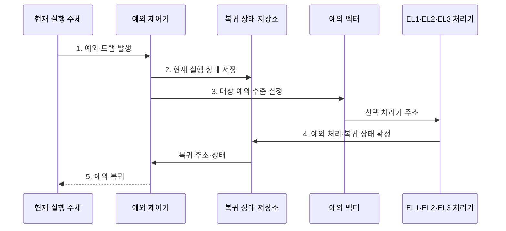

---
sidebar:
  order: 5
  label: "005. ARM 프로세서 아키텍처·동작 모드 (ARM Architecture)"
  badge:
    text: "기출 · 50%"
    variant: note
title: "ARM 프로세서 아키텍처·동작 모드 (ARM Architecture)"
date: "2026-07-28T21:52:43+09:00"
tags:
  - "notes-hardware"
weight: 5
extra:
  question_no: "005"
  source_status: "기출"
  source_history: "126회"
  priority: 50
  priority_note: "임베디드·모바일 설계 기반"
---

## 미리 알고가기

- **Arm 아키텍처(Arm Architecture)**: 로드·스토어 구조에 실행 상태·권한·확장을 결합한 ISA
- **명령어 집합 구조(Instruction Set Architecture, ISA)**: 명령어·레지스터·데이터 형식·실행 환경 규격
- **로드·스토어 구조(Load/Store Architecture)**: 메모리 접근과 레지스터 연산을 분리한 구조
- **AArch64·AArch32 실행 상태**: 각각 A64 명령어 집합과 A32·T32 명령어 집합을 실행하는 64비트·32비트 Arm 실행 환경
- **동작 모드(Processor Mode)**: AArch32에서 사용자·감독자·인터럽트처럼 권한과 예외 원인별로 나눠 둔 실행 모드
- **예외 수준(Exception Level, EL)**: AArch64의 실행 권한을 응용·커널·하이퍼바이저·보안 모니터 수준으로 구분한 체계
- **레지스터 집합(Register File)**: 데이터·주소를 보관하는 CPU 내부 고속 저장소
- **단일 명령 다중 데이터(Single Instruction Multiple Data, SIMD)**: 하나의 명령어로 여러 데이터 원소를 동시에 연산하는 병렬 처리 방식
- **NEON**: 고정 폭 벡터 레지스터로 영상·음성 등의 데이터를 병렬 처리하는 Arm SIMD 확장
- **확장 가능 벡터 확장(Scalable Vector Extension, SVE)**: 구현별 벡터 길이와 무관하게 같은 바이너리를 실행할 수 있도록 설계한 Arm 벡터 확장
- **응용 이진 인터페이스(Application Binary Interface, ABI)**: 함수 호출의 인자·반환값 레지스터와 스택 사용 규칙을 정의한 바이너리 규약
- **네이티브 라이브러리(Native Library)**: 특정 ISA·ABI의 기계어로 미리 컴파일돼 있어 다른 구조로 옮길 때는 대상 규격으로 다시 빌드해야 하는 라이브러리
- **커널(Kernel)**: 메모리·프로세스·장치를 관리하는 운영체제의 핵심이며 Arm에서는 EL1 권한으로 예외를 처리한다
- **하이퍼바이저(Hypervisor)**: 여러 가상 머신의 CPU·메모리 접근을 중재하는 소프트웨어이며 Arm에서는 커널보다 한 단계 높은 EL2 권한을 쓴다
- **시스템온칩(System on Chip, SoC)**: 프로세서·메모리 제어기·주변장치를 하나의 칩에 통합한 반도체
- **반도체 설계자산(Intellectual Property, IP)**: 검증된 프로세서·인터페이스·주변장치 설계를 칩에 재사용하는 설계 블록
- **x86-64**: 기존 x86 32비트 프로그램과의 호환성을 유지하면서 64비트 주소·레지스터로 확장한 가변 길이 명령어 ISA
- **레거시(Legacy)**: 옛 세대 명령과 소프트웨어를 계속 실행해 주려고 남겨 둔 자산이며, 호환은 지켜 주지만 해독 회로와 설계 복잡도를 함께 떠안는다
- **예외 벡터(Exception Vector)**: 예외 종류와 현재 실행 수준에 따라 이동할 처리 루틴의 시작 주소를 모아 둔 표
- **트랩(Trap)**: 낮은 권한의 명령·시스템 호출·오류를 높은 예외 수준의 처리기로 넘기는 제어 전환
- **복귀 상태(Return State)**: 예외 처리 뒤 원래 실행으로 돌아가기 위해 보관하는 프로그램 카운터·상태 레지스터 값
- **런타임 기능 탐지(Runtime Feature Detection)**: 프로그램 실행 중 프로세서가 지원하는 NEON·SVE 등 확장을 확인해 적합한 코드 경로를 선택하는 절차

## Ⅰ. 개요

- 정의/개념: **실행 상태·권한·확장** 조합형 ISA
- 배경/필요성: 기기별 **전력·권한·연산** 요구 대응

### 쉽게 이해하기 (학습용)
- Arm은 실행 상태·권한·확장을 조합해 임베디드부터 서버까지 서로 다른 요구를 지원한다.

## Ⅱ. 특징

- **로드·스토어 구조**로 메모리 접근과 레지스터 연산 분리
- **실행 상태·예외 수준** 조합으로 용도별 코어 분화
- ISA 규격과 **코어 IP** 구현의 분리 공급

### 쉽게 이해하기 (학습용)
- 동일 Arm ISA도 코어 마이크로아키텍처와 지원 확장에 따라 성능·전력 특성이 달라진다.

## Ⅲ. 구조 및 구성요소

| 구성요소 | 책임 |
|:---|:---|
| 실행 상태 | 명령 집합·레지스터 폭·**실행 환경** 규정 |
| 동작 모드·예외 수준 | AArch32 모드·AArch64 **EL 격리** |
| 레지스터 집합 | 연산 데이터·주소·상태 **고속 보관** |
| 확장 명령 | NEON·SVE **벡터 연산** 제공 |

### 쉽게 이해하기 (학습용)
- 실행 상태가 명령과 레지스터 폭을 정하고 예외 수준과 확장 명령이 권한과 병렬 연산을 제공한다.

## Ⅳ. 흐름도

**동작 원리**

- **1. 예외·트랩 발생**: 실행 흐름의 제어기 전달
- **2. 현재 실행 상태 저장**: 복귀 주소·상태 보관
- **3. 대상 예외 수준 결정**: 원인·라우팅 기반 EL 선택
- **4. 예외 처리·복귀 상태 확정**: 원인 처리·상태 검증
- **5. 예외 복귀**: 원래 권한·명령 흐름 복원

### 쉽게 이해하기 (학습용)
- 실행 상태가 정해지면 권한 체계, 레지스터 폭과 사용 가능한 확장 명령의 범위가 함께 결정된다.

## Ⅴ. 종류 및 비교

| 명령어 집합 구조 | Arm | x86-64 |
|:---|:---|:---|
| 적용 기준 | 전력 제약·**SoC 통합** | 기존 **x86 바이너리** 호환 |
| 핵심 특징 | **로드·스토어**·정형 인코딩 | **가변 길이 명령**·호환 모드 |
| 한계 | 대상 **ISA·ABI**별 재빌드 | 해독 회로·**레거시** 부담 |

> 요약: 전력·통합성과 기존 바이너리 호환성 비교

### 쉽게 이해하기 (학습용)
- Arm은 SoC 통합과 전력 효율에, x86-64는 기존 바이너리 호환에 강점이 있다.

## Ⅵ. 실무 고려사항 및 대책

| 고려사항 | 대책 | 효과 |
|:---|:---|:---|
| 이식 후 네이티브 라이브러리 실행 실패 | 대상 ISA·ABI별 재빌드와 의존성 목록화 | 바이너리 호환 문제 예방 |
| 예외 수준 설정 오류로 권한 침범 | EL별 최소 권한·트랩 경로·복귀 상태 검증 | 커널·가상화 격리 유지 |
| 배포 장비에서 NEON·SVE 기능 누락 | 런타임 기능 탐지·대체 코드 경로 제공 | 다양한 코어에서 실행 보장 |
| 기대한 전력 효율이 나오지 않음 | 실제 SoC·부하별 성능/전력 벤치마크 | 코어·가속기 구성 최적화 |

### 쉽게 이해하기 (학습용)
- ISA·ABI 호환성, 예외 수준 격리, 확장 지원과 실제 전력 효율을 함께 검증해야 ARM 이식 위험을 줄일 수 있다.

## Ⅶ. 결론

- **실측 전력·ISA·ABI·확장 지원** 기반 Arm 선택

### 쉽게 이해하기 (학습용)
- 전력·SoC 통합이 중요하면 Arm을 검토하고 네이티브 라이브러리 재빌드 비용을 함께 산정한다.
